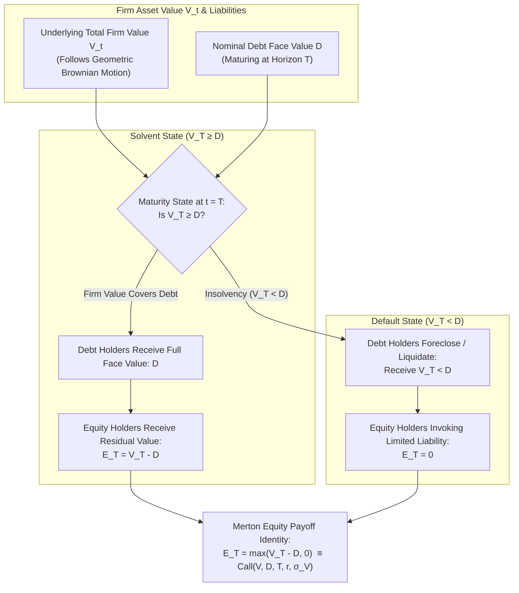
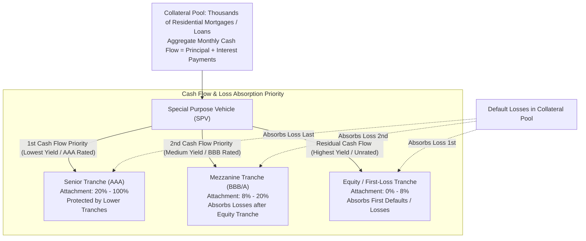
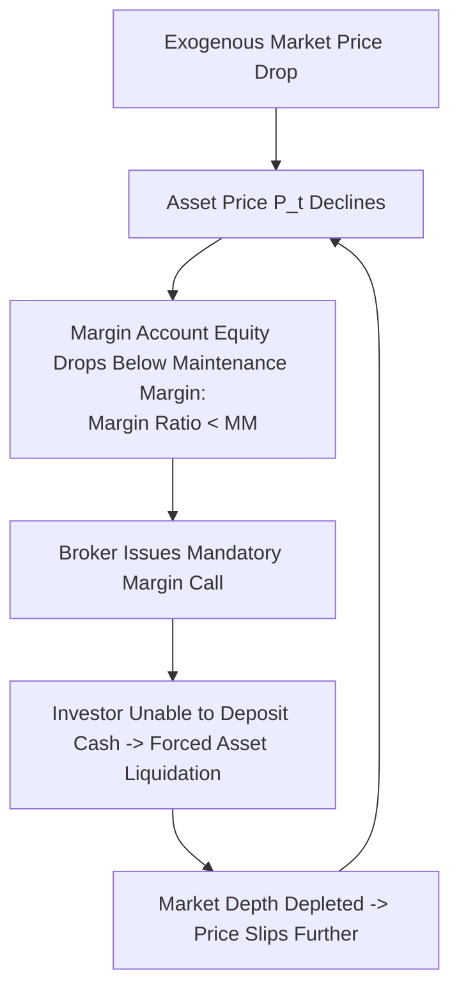
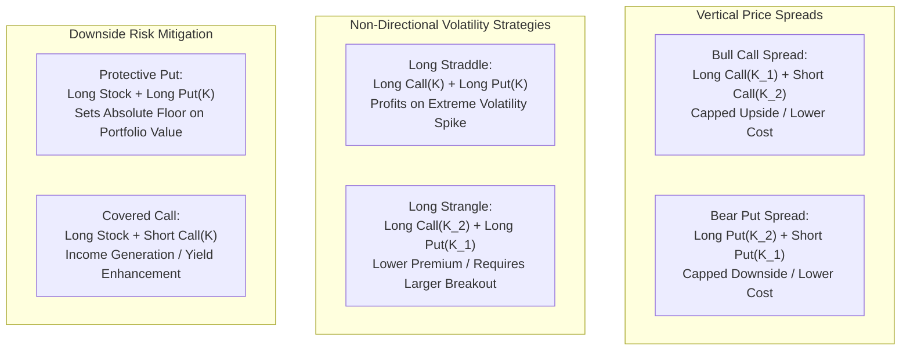

# Financial Markets & Instruments (MScFE 610)

This directory contains foundational lecture notes, mathematical derivations, quantitative models, and institutional frameworks for **Financial Markets & Instruments**. This module establishes the structural, institutional, and economic foundation of modern financial systems: market architecture, multi-asset risk/return dynamics, credit risk under the Merton structural framework, securitization waterfalls (MBS/CDO), options payoffs and non-linear leverage, market frictions, corporate capital structure, and systemic crises.

---

## 📚 Module Overview

- **Course Code**: MScFE 610
- **Primary Focus**: Financial system mechanisms, asset class classification (Equities, Fixed Income, Derivatives, Structured Products, Crypto), credit risk modeling (Merton Option Pricing Framework), securitization cash flow waterfalls, option strategies, liquidity spirals, corporate finance (WACC, Modigliani-Miller), and financial market stress.
- **Key Methodologies & Tools**: Continuous-time compounding, Black-Scholes equity-as-an-option formula, portfolio covariance math, subordination attachment/detachment calculations, non-linear payoff mapping, margin maintenance equations.

---

> [!IMPORTANT]
> **🎓 Master Pedagogical Architecture & Key Takeaways**:
> Access the structured 4-tier quantitative breakdown with worked numerical calculations and calculus derivations in **[`key-takeaway.md`](./key-takeaway.md)**:
> - 📐 **[Merton Credit Model & Asset Substitution Trap](./key-takeaway.md#toy-example-1-merton-structural-credit--equity-as-a-call-option)**
> - 🌊 **[Securitization Subordination & Correlation Failure](./key-takeaway.md#toy-example-2-securitization-subordination--correlation-breakdown)**
> - 📈 **[Margin Mechanics & Deleveraging Spirals](./key-takeaway.md#toy-example-3-margin-mechanics--deleveraging-spirals)**
> - 🧮 **[Calculus Derivations & Greeks](./key-takeaway.md#2-core-mathematical-formulations--calculus-derivations)**

---

## 📊 Visual Frameworks & Architecture

### 1. Merton Structural Credit Risk Model (Equity as a Call Option) — [*Detailed Math & Calculations in key-takeaway.md*](./key-takeaway.md#toy-example-1-merton-structural-credit--equity-as-a-call-option)

### 2. Structured Securitization Waterfall & Credit Subordination — [*Detailed Math & Calculations in key-takeaway.md*](./key-takeaway.md#toy-example-2-securitization-subordination--correlation-breakdown)

### 3. Margin Mechanics & The Fire-Sale Deleveraging Spiral — [*Detailed Math & Calculations in key-takeaway.md*](./key-takeaway.md#toy-example-3-margin-mechanics--deleveraging-spirals)

### 4. Non-Linear Option Strategies & Payoff Profiles

---

## 📖 Sub-Module & Detailed File Breakdown

### [Module 1: Foundations of Financial Systems & Intermediation](./M1)
- **Lessons & Core Topics**:
  - [`M1/Lesson 1: Saving & Borrowing.pdf`](./M1/Lesson%201:%20Saving%20&%20Borrowing.pdf): **Intertemporal Consumption & Compounding**.
    - Pure time value of money, Fisher separation theorem.
    - Continuous compounding formula: $FV = PV \cdot e^{rT}$, effective annual rate $\text{EAR} = (1 + r/m)^m - 1 \xrightarrow{m \to \infty} e^r - 1$.
  - [`M1/Lesson 2: Counterparties and credit risk.pdf`](./M1/Lesson%202:%20Counterparties%20and%20credit%20risk.pdf): **Counterparty Credit Risk & Clearing**.
    - Over-The-Counter (OTC) bilateral contracts vs. Central Counterparty Clearinghouses (CCPs).
    - Bilateral netting agreements, Credit Support Annex (CSA), initial and variation margin.
  - [`M1/Lesson 3: Buying and Selling Short.pdf`](./M1/Lesson%203:%20Buying%20and%20Selling%20Short.pdf): **Margin Mechanics & Short Sales**.
    - Short sale mechanics: Borrowing securities via prime brokers, locate requirements, borrow fees / rebate rates.
    - Margin Account Equity:
      $$\text{Margin Ratio} = \frac{\text{Total Account Equity}}{\text{Market Value of Securities Sold Short}} = \frac{(\text{Cash Proceeds} + \text{Initial Collateral}) - P_t \cdot N}{P_t \cdot N}$$
    - Margin Call Trigger Price: $P^{\star} = \frac{\text{Total Initial Assets}}{(1 + \text{Maintenance Margin}) \cdot N}$.
  - [`M1/Lesson 4: Surveying the Financial Industry.pdf`](./M1/Lesson%204:%20Surveying%20the%20Financial%20Industry.pdf): **Institutional Ecosystem**.
    - Structure of investment banks, commercial banks, hedge funds, sovereign wealth funds, and central banks (monetary transmission mechanisms).

---

### [Module 2: Stocks & Cryptocurrencies](./M2)
- **Lessons & Core Topics**:
  - [`M2/Lesson 1: Introducing Stocks and Cryptocurrencies.pdf`](./M2/Lesson%201:%20Introducing%20Stocks%20and%20Cryptocurrencies.pdf): **Market Microstructure & Ledgers**.
    - Continuous limit order books (LOB), bid-ask spread, market orders vs. limit orders.
    - Centralized ledger architecture vs. decentralized blockchain consensus (Proof of Work vs. Proof of Stake).
  - [`M2/Lesson 2: Types of Stocks and Cryptocurrencies.pdf`](./M2/Lesson%202:%20Types%20of%20Stocks%20and%20Cryptocurrencies.pdf): **Asset Taxonomies**.
    - Common vs. Preferred stock (cumulative, participating, convertible features).
    - Digital asset taxonomy: Native Layer-1 currencies, Layer-2 scaling tokens, utility tokens, governance tokens, and algorithmic vs. collateralized stablecoins.
  - [`M2/Lesson 3: Measuring the Performance of Stocks and Cryptocurrencies.pdf`](./M2/Lesson%203:%20Measuring%20the%20Performance%20of%20Stocks%20and%20Cryptocurrencies.pdf): **Risk-Adjusted Performance Analytics**.
    - Compound Annual Growth Rate (CAGR): $\text{CAGR} = \left(\frac{V_T}{V_0}\right)^{1/T} - 1$.
    - Annualized volatility scaling: $\sigma_{\text{ann}} = \sigma_{\text{daily}} \sqrt{252}$ (Equities) vs. $\sigma_{\text{crypto}} = \sigma_{\text{daily}} \sqrt{365}$.
    - Sharpe Ratio ($\text{SR} = \frac{R_p - r_f}{\sigma_p}$), Sortino Ratio (downside deviation denominator), Maximum Drawdown ($\text{MDD} = \max_{t} \frac{\text{Peak}_t - P_t}{\text{Peak}_t}$).
  - [`M2/Lesson 4: Modeling the Performance of Stocks and Cryptocurrencies.pdf`](./M2/Lesson%204:%20Modeling%20the%20Performance%20of%20Stocks%20and%20Cryptocurrencies.pdf): **Stochastic Price Processes**.
    - Geometric Brownian Motion (GBM): $\ln(S_t / S_0) \sim \mathcal{N}\left((\mu - \frac{1}{2}\sigma^2)t, \sigma^2 t\right)$.
    - Lognormal stock price properties: $\mathbb{E}[S_t] = S_0 e^{\mu t}$, $\text{Var}(S_t) = S_0^2 e^{2\mu t}(e^{\sigma^2 t} - 1)$.

---

### [Module 3: Portfolio Fundamentals & ETFs](./M3)
- **Lessons & Core Topics**:
  - [`M3/Lesson 1: Portfolio Returns and Standard Deviations.pdf`](./M3/Lesson%201:%20Portfolio%20Returns%20and%20Standard%20Deviations.pdf): **Multi-Asset Portfolio Mathematics**.
    - Expected portfolio return: $\mathbb{E}[R_p] = \mathbf{w}^T \boldsymbol{\mu} = \sum_{i=1}^N w_i \mu_i$.
    - Portfolio variance: $\sigma_p^2 = \mathbf{w}^T \mathbf{\Sigma} \mathbf{w} = \sum_{i=1}^N \sum_{j=1}^N w_i w_j \sigma_{ij}$.
  - [`M3/Lesson 2: Correlation.pdf`](./M3/Lesson%202:%20Correlation.pdf): **Covariance & Diversification Effect**.
    - Pearson correlation coefficient $\rho_{ij} = \frac{\sigma_{ij}}{\sigma_i \sigma_j} \in [-1, 1]$.
    - Asymptotic diversification limit: As $N \to \infty$ in an equally weighted portfolio ($w_i = 1/N$), portfolio variance approaches average covariance: $\lim_{N \to \infty} \sigma_p^2 = \bar{\sigma}_{ij}$.
  - [`M3/Lesson 3: Exchange-Traded Funds.pdf`](./M3/Lesson%203:%20Exchange-Traded%20Funds.pdf): **ETF Mechanics & Arbitrage**.
    - In-kind creation and redemption mechanism executed by Authorized Participants (APs).
    - Premium/Discount to Net Asset Value (NAV) arbitrage band: $\text{Spread}_{\text{NAV}} = \frac{P_{\text{ETF}} - \text{NAV}}{\text{NAV}}$.
    - Tracking Error: $\text{TE} = \sqrt{\frac{1}{T-1}\sum_{t=1}^T (R_{\text{ETF}, t} - R_{\text{Benchmark}, t})^2}$.
  - [`M3/Lesson 4: Volatility and Correlations.pdf`](./M3/Lesson%204:%20Volatility%20and%20Correlations.pdf): **Correlation Breakdowns in Stressed Regimes**.
    - Empirical correlation spikes toward $+1$ during market panics, degrading traditional diversification benefits when protection is needed most.

---

### [Module 4: Derivatives & Option Strategies](./M4)
- **Lessons & Core Topics**:
  - [`M4/Lesson 1: Derivatives, with an Emphasis on Options.pdf`](./M4/Lesson%201:%20Derivatives,%20with%20an%20Emphasis%20on%20Options.pdf): **Option Contracts & Payoffs**.
    - Call payoff: $C_T = \max(S_T - K, 0)$; Put payoff: $P_T = \max(K - S_T, 0)$.
    - Put-Call Parity: $C_t - P_t = S_t - K e^{-r(T-t)}$.
    - Intrinsic Value vs. Time Value ($TV_t = \text{Option Price}_t - \text{Intrinsic Value}_t$).
  - [`M4/Lesson 2: Leverage and Non-Linearity.pdf`](./M4/Lesson%202:%20Leverage%20and%20Non-Linearity.pdf): **Convexity & Non-Linear Exposure**.
    - Effective option leverage (Elasticity / Omega): $\Omega = \frac{\% \Delta C}{\% \Delta S} = \Delta \cdot \frac{S}{C}$.
    - Convexity benefit: Gamma ($\Gamma = \frac{\partial^2 C}{\partial S^2} > 0$) ensures positive drift under volatile price oscillations.
  - [`M4/Lesson 3: Home Equity as an Option.pdf`](./M4/Lesson%203:%20Home%20Equity%20as%20an%20Option.pdf): **The Merton Structural Credit Framework**.
    - Modeling equity as a European Call option on firm assets $V_t$ with strike equal to debt face value $D$:
      $$E_0 = V_0 \Phi(d_1) - D e^{-rT} \Phi(d_2)$$
      $$d_1 = \frac{\ln(V_0 / D) + (r + \frac{1}{2}\sigma_V^2)T}{\sigma_V \sqrt{T}}, \quad d_2 = d_1 - \sigma_V \sqrt{T}$$
    - Corporate Debt Valuation: $D_0 = V_0 - E_0 = D e^{-rT} \Phi(d_2) + V_0 (1 - \Phi(d_1))$.
    - Risk-neutral default probability: $\mathbb{Q}(\text{Default}) = \Phi(-d_2)$.
    - Implied credit spread: $\mathcal{S} = -\frac{1}{T}\ln\left(\frac{D_0}{D e^{-rT}}\right)$.
  - [`M4/Lesson 4: Option Strategies and Scenarios.pdf`](./M4/Lesson%204:%20Option%20Strategies%20and%20Scenarios.pdf): **Synthetic Combination Strategies**.
    - Bull Call Spread, Bear Put Spread, Straddle, Strangle, Butterfly Spread, Iron Condor, Collar ($+ \text{Stock} + \text{Put}(K_1) - \text{Call}(K_2)$).

---

### [Module 5: Securitization, Liquidity & Crises](./M5)
- **Lessons & Core Topics**:
  - [`M5/Lesson 1: Securitization.pdf`](./M5/Lesson%201:%20Securitization.pdf): **Structured Finance Architecture**.
    - Special Purpose Vehicles (SPVs), bankruptcy remoteness, Asset-Backed Securities (ABS), and Collateralized Debt Obligations (CDOs).
    - Tranching mechanics: Credit subordination, attachment points, and detachment points.
  - [`M5/Lesson 2: Valuation Challenges: Market Frictions and Model Risk.pdf`](./M5/Lesson%202:%20Valuation%20Challenges:%20Market%20Frictions%20and%20Model%20Risk.pdf): **Model Risk & Correlation Breakdown**.
    - Li's Gaussian Copula model for default correlation $\rho_{\text{default}}$.
    - Failure mode: Underestimating joint tail dependency in housing prices led to catastrophic rating inaccuracies on mezzanine CDOs ($CDO^2$).
  - [`M5/Lesson 3: Liquidity and the Credit Market.pdf`](./M5/Lesson%203:%20Liquidity%20and%20the%20Credit%20Market.pdf): **Market Liquidity vs. Funding Liquidity**.
    - Market liquidity (bid-ask spread, market depth) vs. Funding liquidity (availability of collateralized repo financing).
    - Repo haircut mechanics: $\text{Borrowing Capacity} = \text{Collateral Value} \cdot (1 - \text{Haircut})$.
  - [`M5/Lesson 4: Leverage and Crisis.pdf`](./M5/Lesson%204:%20Leverage%20and%20Crisis.pdf): **The 2008 Global Financial Crisis Anatomy**.
    - Subprime mortgage inception $\to$ CDO transformation $\to$ Repo market run $\to$ Interbank credit freeze $\to$ Global economic contagion.

---

### [Module 6: Corporate Finance & Stock Selection](./M6)
- **Lessons & Core Topics**:
  - [`M6/Lesson 1: The Balance Sheet: Leverage and Default.pdf`](./M6/Lesson%201:%20The%20Balance%20Sheet:%20Leverage%20and%20Default.pdf): **Balance Sheet Metrics & Insolvency**.
    - Debt-to-Equity ($D/E$), Interest Coverage Ratio ($\text{EBIT} / \text{Interest Expense}$), Altman Z-score default forecasting.
  - [`M6/Lesson 2: Debt and Equity Financing: Housing Development Example.pdf`](./M6/Lesson%202:%20Debt%20and%20Equity%20Financing:%20Housing%20Development%20Example.pdf): **Capital Structure Theory**.
    - Modigliani-Miller Proposition I (value invariance under no taxes: $V_L = V_U$) and Proposition II (cost of equity rises with debt).
    - Weighted Average Cost of Capital (WACC) with corporate tax shield $T_C$:
      $$\text{WACC} = \frac{E}{E+D} r_E + \frac{D}{E+D} r_D (1 - T_C)$$
  - [`M6/Lesson 3: The Housing Finance Problem and Its Solutions.pdf`](./M6/Lesson%203:%20The%20Housing%20Finance%20Problem%20and%20Its%20Solutions.pdf): **Mortgage Engineering & Prepayment Risk**.
    - Fixed-Rate Mortgages (FRM) vs. Adjustable-Rate Mortgages (ARM).
    - Negative convexity of mortgage-backed securities due to borrower prepayment options when interest rates decline.
  - [`M6/Lesson 4: More Than One Way to Pick a Stock.pdf`](./M6/Lesson%204:%20More%20Than%20One%20Way%20to%20Pick%20a%20Stock.pdf): **Fundamental Equity Valuation Frameworks**.
    - Discounted Cash Flow (DCF): $V_0 = \sum_{t=1}^T \frac{\text{FCFF}_t}{(1 + \text{WACC})^t} + \frac{\text{Terminal Value}_T}{(1 + \text{WACC})^T}$.
    - Multiples valuation: P/E, EV/EBITDA, P/B; Quantitative factor screening (Value, Quality, Momentum).

---

### [Module 7: Market Stress & Financial Ethics](./M7)
- **Lessons & Core Topics**:
  - [`M7/Lesson 1: Valuation in Normal and Stressed Markets.pdf`](./M7/Lesson%201:%20Valuation%20in%20Normal%20and%20Stressed%20Markets.pdf): **Pricing Hierarchies (FASB Level 1, 2, 3)**.
    - Level 1: Quoted prices in active markets.
    - Level 2: Observable inputs other than quoted prices (comparable yields, swap curves).
    - Level 3: Unobservable inputs relying on internal DCF / pricing models (mark-to-model risk).
  - [`M7/Lesson 2: Key Concepts in Financial Markets.pdf`](./M7/Lesson%202:%20Key%20Concepts%20in%20Financial%20Markets.pdf): **Market Efficiency & Anomalies**.
    - Fama's Efficient Market Hypothesis: Weak Form (historical prices), Semi-Strong Form (public info), Strong Form (all info).
    - Limits to Arbitrage (*Shleifer & Vishny*): Capital constraints and noise trader risk prevent instantaneous pricing corrections.
  - [`M7/Lesson 3: Magnifying and Frictional Factors.pdf`](./M7/Lesson%203:%20Magnifying%20and%20Frictional%20Factors.pdf): **Systemic Magnifiers & Contagion**.
    - Procyclical leverage, mark-to-market accounting fire-sale loops, dynamic hedging negative feedback spirals (portfolio insurance in 1987).
  - [`M7/Lesson 4: Financial Ethics.pdf`](./M7/Lesson%204:%20Financial%20Ethics.pdf): **Ethics & Regulatory Integrity**.
    - Fiduciary duty vs. suitability standards, insider trading ($10\text{b}-5$), market spoofing, front-running, and conflict-of-interest mitigation.

---

## 🔑 Key Takeaways & Quantitative Insights

1. **Equity as a Structural Call Option**: Corporate equity is economically identical to a European Call option on the firm's total enterprise asset value with strike equal to debt nominal value ($D$). Shareholders benefit from increased asset volatility ($\text{Vega} > 0$), creating asset substitution risk.
2. **Asymptotic Limits of Diversification**: In a portfolio of $N$ stocks, individual asset variances $\sigma_i^2$ decay at rate $\frac{1}{N}$. The irreducible floor of portfolio risk is governed purely by the average pairwise covariance $\bar{\sigma}_{ij}$.
3. **Correlation Risk in Securitization**: Credit tranching creates AAA-rated senior bonds from BBB collateral only if default correlations remain low. When macroeconomic shocks cause default correlations to converge to $1.0$, senior tranches suffer unexpected losses.
4. **Funding Liquidity Drives Solvency**: A firm can be balance-sheet solvent but face immediate bankruptcy if short-term repo counterparties increase margin haircuts or refuse rollover financing.

---

## 🔗 Cross-Module Knowledge Linkages

- **$\to$ [06_derivative_pricing](../06_derivative_pricing/README.md)**: Option payoff mechanics and Put-Call parity form the basis for Black-Scholes PDE derivation and binomial lattice trees.
- **$\to$ [05_portfolio_management](../05_portfolio_management/README.md)**: Portfolio variance equations ($\mathbf{w}^T \mathbf{\Sigma} \mathbf{w}$) and correlation matrices power Markowitz Efficient Frontier optimization and CAPM.
- **$\to$ [03_stochastic_modelling](../03_stochastic_modelling/README.md)**: Geometric Brownian Motion asset price dynamics and the Merton structural model connect to continuous SDEs and jump-diffusion processes.
- **$\to$ [07_machine_learning](../07_machine_learning/README.md)**: Credit default modeling and financial statement ratios serve as primary feature engineering inputs for credit risk scorecards.
