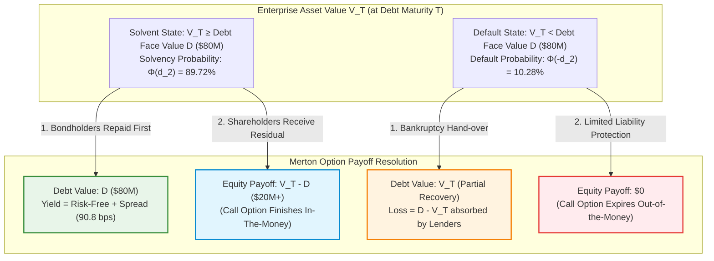
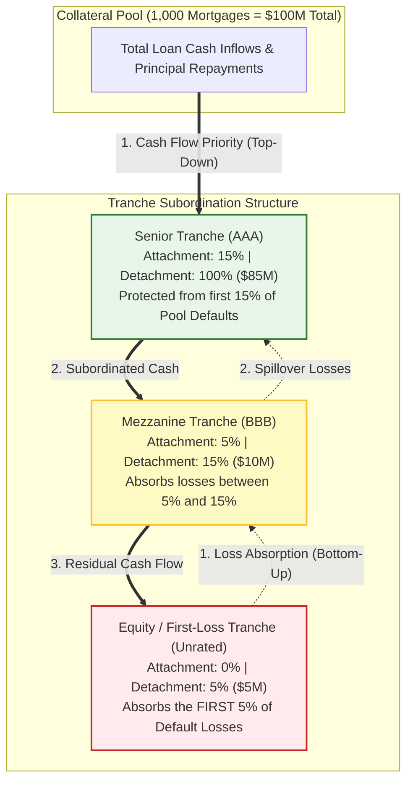
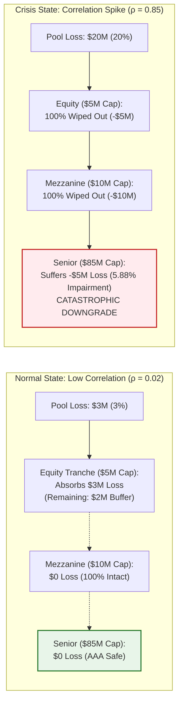
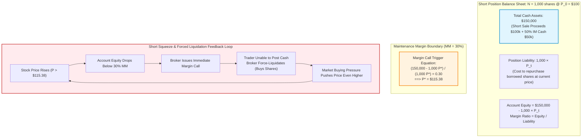
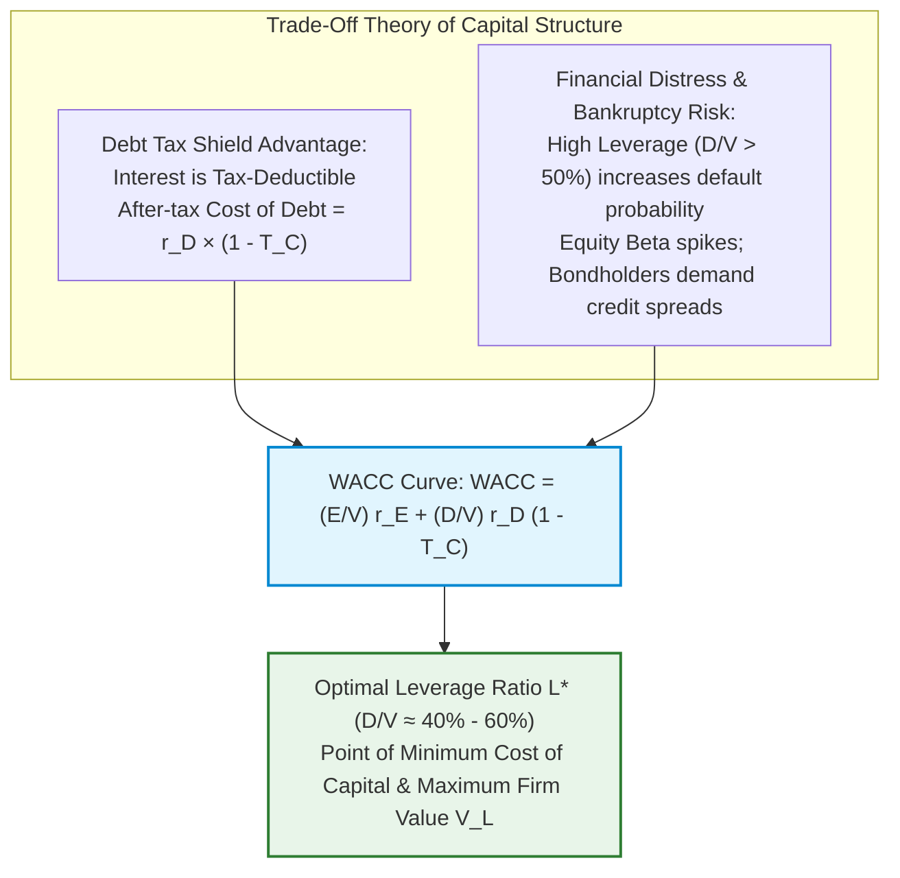
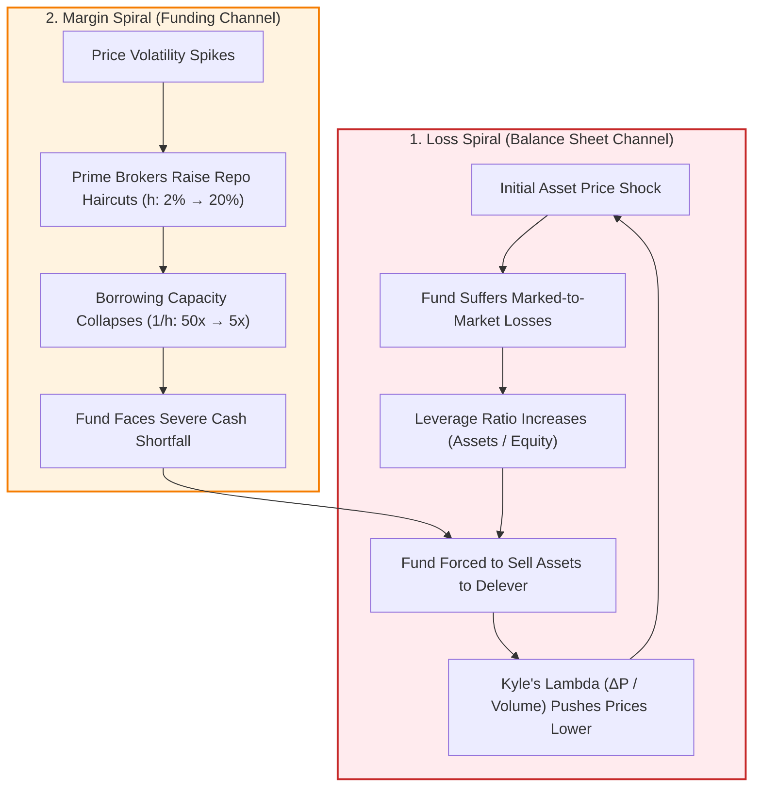

# Financial Markets & Instruments — Key Pedagogical Takeaways
## MScFE 610 Master Quantitative Synthesis

[← Back to Main README.md](./README.md)

---

## 📖 Table of Contents & Quick Module Links
1. [Core Intuition & Mechanical Failure Modes](#1-core-intuition--mechanical-failure-modes)
   - [Toy Example 1: Merton Structural Credit & Equity as a Call Option](#toy-example-1-merton-structural-credit--equity-as-a-call-option)
   - [Toy Example 2: Securitization Subordination & Correlation Breakdown](#toy-example-2-securitization-subordination--correlation-breakdown)
   - [Toy Example 3: Margin Mechanics & Deleveraging Spirals](#toy-example-3-margin-mechanics--deleveraging-spirals)
2. [Core Mathematical Formulations & Calculus Derivations](#2-core-mathematical-formulations--calculus-derivations)
   - [1. Merton Model Option Partial Derivatives & Greeks](#1-merton-model-option-partial-derivatives--greeks)
   - [2. Continuous Compounding & Limits](#2-continuous-compounding--limits)
   - [3. Modigliani-Miller & WACC Calculus](#3-modigliani-miller--wacc-calculus)
3. [Practical Engineering & Systemic Risk Extensions](#3-practical-engineering--systemic-risk-extensions)
4. [Comparative Synthesis Cheat Sheet](#4-comparative-synthesis-cheat-sheet)
5. [Comprehensive Mathematical Notation & Variable Glossary](#5-comprehensive-mathematical-notation--variable-glossary)

---

<a id="1-core-intuition--mechanical-failure-modes"></a>
## 1. Core Intuition & Mechanical Failure Modes

<a id="toy-example-1-merton-structural-credit--equity-as-a-call-option"></a>
### Toy Example 1: Merton Structural Credit & Equity as a Call Option

#### 💡 The Intuitive Metaphor (Easiest to Understand)
Imagine you buy a house for $\$100,000$ using an $\$80,000$ mortgage debt ($D$) and $\$20,000$ of your own cash equity ($E$). If the house price rises to $\$120,000$, you pay back the bank $\$80,000$ and keep $\$40,000$. But if the house price crashes to $\$50,000$, you can simply walk away, hand the keys to the bank, and lose only your initial cash (equity becomes $\$0$). 
In corporate finance, **company equity is economically identical to a Call Option** written on total company assets $V$ with a strike price equal to nominal debt $D$.

#### 🏷️ Notation Breakdown:
- $V_0$: **Current Enterprise Firm Value** (Total market value of all company assets today at $t=0$).
- $V_T$: **Enterprise Firm Value at Horizon $T$** (Follows Geometric Brownian Motion stochastic process).
- $D$: **Nominal Debt Face Value** (Total principal due at debt maturity $T$; functions as the option strike price $K$).
- $T$: **Debt Maturity Horizon** (Time remaining until bond repayment, in years).
- $r$: **Annualized Risk-Free Rate** (Continuously compounded interest rate).
- $\sigma_V$: **Asset Volatility** (Annualized standard deviation of the firm's total asset return, $\text{Var}(\text{Return}) = \sigma_V^2$).
- $d_1, d_2$: **Standardized Distance Metrics** (Number of standard deviations asset value exceeds default barrier under risk-neutral drift).
- $\Phi(x)$: **Standard Normal Cumulative Distribution Function (CDF)**, $\Phi(x) = \frac{1}{\sqrt{2\pi}} \int_{-\infty}^x e^{-u^2/2} du$.
- $\phi(x)$: **Standard Normal Probability Density Function (PDF)**, $\phi(x) = \frac{1}{\sqrt{2\pi}} e^{-x^2/2}$.
- $\Phi(d_1)$: **Equity Delta ($\Delta_E$)** (Sensitivity of equity value to changes in asset value: $\frac{\partial E_0}{\partial V_0}$).
- $\Phi(d_2)$: **Risk-Neutral Solvency Probability** ($\mathbb{Q}(V_T \ge D)$, probability the call option finishes in-the-money).
- $\Phi(-d_2)$: **Risk-Neutral Default Probability** ($\mathbb{Q}(\text{Default}) = \mathbb{Q}(V_T < D) = 1 - \Phi(d_2)$).
- $E_0$: **Current Market Value of Equity** (Value of the shareholder call option today).
- $D_0$: **Current Market Value of Risky Corporate Debt** ($D_0 = V_0 - E_0$).
- $\mathcal{S}$: **Implied Credit Spread** (Extra yield required over the risk-free rate to compensate bondholders for default risk).
- $\text{Vega}_E$: **Volatility Sensitivity** ($\frac{\partial E_0}{\partial \sigma_V}$, rate of change of equity value per unit increase in asset volatility).

#### 🔢 Step-by-Step Numerical Calculation
- Total Enterprise Firm Value: $V_0 = \$100\text{ Million}$
- Nominal Zero-Coupon Debt Face Value: $D = \$80\text{ Million}$ due in $T = 1\text{ year}$
- Risk-free Rate: $r = 5\%$ ($0.05$)
- Asset Volatility: $\sigma_V = 20\%$ ($0.20$)

**Step 1: Compute $d_1$ and $d_2$**:

$$d_1 = \frac{\ln(V_0 / D) + (r + \frac{1}{2}\sigma_V^2)T}{\sigma_V \sqrt{T}} = \frac{\ln(100 / 80) + (0.05 + 0.5 \times 0.20^2) \times 1}{0.20 \times 1} = \frac{0.22314 + 0.07}{0.20} = \frac{0.29314}{0.20} = 1.4657$$

$$d_2 = d_1 - \sigma_V \sqrt{T} = 1.4657 - 0.20 = 1.2657$$

**Step 2: Lookup Standard Normal Cumulative Distribution Values $\Phi(d)$**:
- $\Phi(d_1) = \Phi(1.4657) \approx 0.9286$ (Equity Delta)
- $\Phi(d_2) = \Phi(1.2657) \approx 0.8972$ (Solvency probability)
- $\Phi(-d_2) = 1 - 0.8972 = 0.1028$ (10.28% risk-neutral default probability)

**Step 3: Compute Equity Value $E_0$ and Corporate Debt Value $D_0$**:

$$E_0 = V_0 \Phi(d_1) - D e^{-rT} \Phi(d_2) = 100 \times 0.9286 - 80 \times e^{-0.05} \times 0.8972 = 92.86 - 80 \times 0.95123 \times 0.8972 = 92.86 - 68.27 = 24.59\text{M}$$

$$D_0 = V_0 - E_0 = 100 - 24.59 = 75.41\text{M}$$

**Step 4: Compute Implied Credit Spread $\mathcal{S}$**:

$$\mathcal{S} = -\frac{1}{T} \ln\left( \frac{D_0}{D e^{-rT}} \right) = -\frac{1}{1} \ln\left( \frac{75.41}{76.098} \right) = -\ln(0.99096) \approx 0.908\% \quad (90.8 \text{ bps})$$

#### 📊 Visual Architecture & Terminal Payoff Diagram:



```
                     Merton Structural Payoff Functions
     Payoff ($M)
        ^
    120 |                                                /  Equity: max(V_T - 80, 0)
        |                                               /
    100 |                                              /
        |                                             /
     80 |-----------------------====================/====   Debt: min(V_T, 80)
        |                     /
     60 |                   /
        |                 /
     40 |               /
        |             /
     20 |           /
        |         /
      0 +-------+-------------------------------------------> Firm Asset Value V_T ($M)
        0       40            80 (Debt Barrier D)    120
           [ DEFAULT REGIME ] | [ SOLVENT REGIME ]
```

#### 📐 Calculus Derivation & Mechanical Failure Mode (Asset Substitution)
Taking the partial derivative of Equity Value $E_0$ with respect to asset volatility $\sigma_V$ (Vega):

$$\text{Vega}_E = \frac{\partial E_0}{\partial \sigma_V} = V_0 \sqrt{T} \phi(d_1) > 0$$

Because $\text{Vega}_E > 0$ everywhere, equity value increases monotonically with asset volatility $\sigma_V$.
- **Mechanical Failure Mode**: When a firm approaches distress ($V \to D$), shareholders have an incentive to switch firm investments to ultra-volatile, negative-NPV projects. Equity holders capture unlimited upside if the gamble succeeds, while bondholders absorb all downside if it defaults.

---

<a id="toy-example-2-securitization-subordination--correlation-breakdown"></a>
### Toy Example 2: Securitization Subordination & Correlation Breakdown

#### 💡 The Intuitive Metaphor (Easiest to Understand)
Think of credit subordination like a multi-tiered bucket system collecting rainwater (cash flows from a pool of 1,000 mortgages). 
- The **Senior Bucket (AAA)** sits at the top and fills first.
- The **Mezzanine Bucket (BBB)** sits in the middle.
- The **Equity Bucket (First Loss)** sits at the bottom and absorbs leaks/defaults first.

#### 🏷️ Notation Breakdown:
- $N$: **Number of Collateral Loans** (Total distinct debt contracts pooled into the SPV).
- $p$: **Marginal Default Probability** (Individual unconditional default rate per loan per year).
- $\rho$: **Pairwise Default Correlation** (Degree of joint default co-movement between loans, $\rho \in [0, 1]$).
- $\sigma_{\text{pool}}^2 = \text{Var}(\text{Defaults})$: **Collateral Pool Default Variance** ($\sigma_{\text{pool}}^2 = N p (1-p) [1 + (N-1)\rho]$).
- **Attachment Point**: **Lower Loss Barrier** (The cumulative loss percentage required before a tranche begins losing principal).
- **Detachment Point**: **Upper Loss Barrier** (The cumulative loss percentage at which a tranche's principal is completely erased).
- **SPV**: **Special Purpose Vehicle** (Bankruptcy-remote legal trust that holds the loans and issues the bonds).

#### 🔢 Step-by-Step Numerical Calculation
- Total Collateral Pool: 1,000 loans of $\$100,000$ each ($100\text{M}$ total).
- Expected Default Rate: $p = 3\%$ per year.
- Tranche Structure:
  - Equity Tranche ($0\% - 5\%$): Absorbs first $\$5\text{M}$ of default losses.
  - Mezzanine Tranche ($5\% - 15\%$): Absorbs losses between $\$5\text{M}$ and $\$15\text{M}$.
  - Senior Tranche ($15\% - 100\%$): Protected against first $\$15\text{M}$ of losses.

**Low Correlation State ($\rho = 0.02$)**:
Default variance across loans is low: $\sigma_{\text{pool}}^2 = N p (1-p) [1 + (N-1)\rho] \approx 1,000 \times 0.03 \times 0.97 \times [1 + 999 \times 0.02] \approx 29.1 \times 20.98 \approx 610.5$. Expected defaults $= N \cdot p = 30$ loans ($\$3\text{M}$).
- Losses ($\$3\text{M}$) are absorbed entirely by the Equity Tranche ($\$5\text{M}$ capacity).
- Senior Tranche suffers $\$0$ loss $\implies$ AAA rating intact.

**Systemic Crash State ($\rho \to 0.85$)**:
During a housing crisis, default correlation spikes. Variance expands: $\sigma_{\text{pool}}^2 = 29.1 \times [1 + 999 \times 0.85] = 24,739$.
Defaults cluster violently: 200 loans default ($\$20\text{M}$ loss).
- Equity Tranche ($0-5\%$ / $\$5\text{M}$) wiped out ($100\%$ loss).
- Mezzanine Tranche ($5-15\%$ / $\$10\text{M}$) wiped out ($100\%$ loss).
- Senior Tranche ($15-100\%$) loses $\$5\text{M}$ ($5.88\%$ principal loss) $\implies$ Catastrophic downgrade.

#### 📊 Visual Subordination & Waterfall Breakdown:





---

<a id="toy-example-3-margin-mechanics--deleveraging-spirals"></a>
### Toy Example 3: Margin Mechanics & Deleveraging Spirals

#### 💡 The Intuitive Metaphor (Easiest to Understand)
Borrowing on margin is like renting a house with a mandatory security deposit. If the property value drops below your collateral limit, the landlord demands immediate cash. If you can't pay, they kick you out and sell your furniture at a liquidation discount.

#### 🏷️ Notation Breakdown:
- $N$: **Number of Borrowed Shares** (Total quantity of shares sold short).
- $P_0$: **Initial Execution Price** (Share price when the short position is opened).
- $P_t$ or $P$: **Current Market Price** (Prevailing mark-to-market price of the shorted asset).
- $\text{IM}$: **Initial Margin Requirement** (Fraction of total position value required as extra collateral cash, e.g., $50\%$).
- $\text{MM}$: **Maintenance Margin Requirement** (Minimum equity-to-debt ratio before broker intervention, e.g., $30\%$).
- $\text{Account Equity}$: **Net Investor Equity** ($\text{Total Account Cash Assets} - N \cdot P_t$).
- $P^{\star}$: **Margin Call Trigger Price** (The critical market price at which $\text{Margin Ratio} = \text{MM}$).

#### 🔢 Step-by-Step Calculation & Calculus of Margin Call Trigger
- Investor shorts $N = 1,000$ shares at price $P_0 = \$100$.
- Initial Short Value $= N \cdot P_0 = \$100,000$. Initial Margin Requirement $= 50\% \implies \$50,000$ collateral cash.
- Total Initial Account Cash Assets $= N \cdot P_0 \times (1 + \text{IM}) = \$100,000 + \$50,000 = \$150,000$.
- Maintenance Margin ($\text{MM}$) $= 30\%$.

**Deriving the Critical Trigger Price $P^{\star}$**:

$$\text{Margin Ratio}(P) = \frac{\text{Total Account Cash Assets} - N \cdot P}{N \cdot P} = \text{MM}$$

$$150{,}000 - 1{,}000 P^{\star} = 0.30 \times (1{,}000 P^{\star}) \implies 150{,}000 = 1{,}300 P^{\star} \implies P^{\star} = \frac{150{,}000}{1{,}300} = \$115.38$$

If stock price rises above $\$115.38$, Account Equity drops below $\$34,615.40$ ($30\%$), triggering an immediate margin call.

#### 📊 Visual Margin Anatomy & Liquidation Spiral:



---

<a id="2-core-mathematical-formulations--calculus-derivations"></a>
## 2. Core Mathematical Formulations & Calculus Derivations

### 1. Merton Model Option Partial Derivatives & Greeks

$$\text{Equity Delta:} \quad \Delta_E = \frac{\partial E_0}{\partial V_0} = \Phi(d_1) \in (0, 1)$$

$$\text{Equity Gamma (Convexity):} \quad \Gamma_E = \frac{\partial^2 E_0}{\partial V_0^2} = \frac{\phi(d_1)}{V_0 \sigma_V \sqrt{T}} > 0$$

$$\text{Equity Vega:} \quad \text{Vega}_E = \frac{\partial E_0}{\partial \sigma_V} = V_0 \sqrt{T} \phi(d_1) > 0$$

---

### 2. Continuous Compounding & Limits
Taking the discrete compounding limit as frequency $m \to \infty$:

$$\text{EAR} = \lim_{m \to \infty} \left(1 + \frac{r}{m}\right)^m - 1 = e^r - 1$$

Continuous discount factor:

$$DF(T) = e^{-rT} = \exp\left( -\int_0^T r(t) dt \right)$$

---

### 3. Modigliani-Miller & WACC Calculus
Weighted Average Cost of Capital with corporate tax shield $T_C$:

$$\text{WACC} = \frac{E}{V} r_E + \frac{D}{V} r_D (1 - T_C)$$

Taking derivative with respect to debt leverage ratio $L = D/V$:

$$\frac{d\text{WACC}}{dL} = \frac{d r_E}{dL} (1-L) - r_E + r_D (1 - T_C)$$

Under Modigliani-Miller Proposition II, $r_E = r_0 + (r_0 - r_D) \frac{D}{E} (1 - T_C)$, ensuring WACC decreases with debt tax shields until financial distress costs dominate.

#### 📊 Visual Capital Structure & WACC Optimization Curve:



```
                 WACC vs Leverage Ratio (D/V)
  Cost of Capital (%)
     ^
     |      / Cost of Equity r_E (Increases with financial risk)
     |     /
     |    /          \               /
     |   /            \             /   Overall WACC Curve
     |  /              \___________/ 
     | /                     |
     |/                      v Optimal Leverage L* (Min WACC)
     |------------------------------------- After-Tax Cost of Debt r_D*(1-T_C)
     +----------------------------------------------------> Leverage Ratio D/V (%)
     0%                     50%                           100%
      [ TAX SHIELD DOMINATES ] | [ DISTRESS COSTS DOMINATE ]
```

---

<a id="3-practical-engineering--systemic-risk-extensions"></a>
## 3. Practical Engineering & Systemic Risk Extensions

### Repo Haircuts & Funding Liquidity Shorts
- **Market Liquidity Metric (Kyle's Lambda)**: $\lambda = \frac{\Delta P}{\text{Volume}}$ (Measures price slippage per unit of trade size).
- **Funding Liquidity Metric (Repo Haircut $h$)**: Available leverage $= \frac{1}{h}$. A shift in $h$ from $2\%$ to $20\%$ cuts borrowing capacity from $50\times$ to $5\times$, causing systemic margin calls across prime brokers.

#### 📊 Visual Feedback Loop: The Brunnermeier-Pedersen Liquidity Spirals



---

<a id="4-comparative-synthesis-cheat-sheet"></a>
## 4. Comparative Synthesis Cheat Sheet

| Asset Class / Model | Governing Equation | Primary Risk Driver | Mechanical Failure Mode | Calculus / Derivative Metric |
| :--- | :--- | :--- | :--- | :--- |
| **Merton Structural Credit** | $E_0 = V_0 \Phi(d_1) - D e^{-rT} \Phi(d_2)$ | Firm Volatility $\sigma_V$ | Asset substitution gamble | $\text{Vega}_E = V_0 \sqrt{T} \phi(d_1)$ |
| **Short Position Margin** | $P^{\star} = \frac{\text{Assets}}{(1 + \text{MM}) N}$ | Upside price spikes | Fire-sale deleveraging loop | $\frac{d\text{Margin}}{dP} = -\frac{\text{Assets}}{N P^2}$ |
| **Subordinated Tranche** | $\max(\min(\text{Cash} - L, \text{Attach}), 0)$ | Default correlation $\rho$ | Systemic correlation convergence ($\rho \to 1$) | $\frac{\partial \text{Loss}}{\partial \rho} \gg 0$ in tails |
| **WACC Capital Structure** | $\frac{E}{V} r_E + \frac{D}{V} r_D (1 - T_C)$ | Debt ratio $D/V$ | Insolvency distress costs | $\frac{d\text{WACC}}{d(D/V)}$ |

---

<a id="5-comprehensive-mathematical-notation--variable-glossary"></a>
## 5. Comprehensive Mathematical Notation & Variable Glossary

### 📐 Master Variable Reference Table

| Symbol | Mathematical / Economic Meaning | Typical Units / Range | Context & Core Formula |
| :--- | :--- | :--- | :--- |
| **$V_0, V_t, V_T$** | Total Enterprise / Firm Asset Value (at $t=0$, $t$, and maturity $T$) | Currency ($\$$ Millions) | Merton Credit Model ($V_0 = E_0 + D_0$) |
| **$D$** | Nominal Zero-Coupon Debt Face Value (Option Strike Price $K$) | Currency ($\$$ Millions) | $E_T = \max(V_T - D, 0)$ |
| **$E_0, E_T$** | Equity Value (Call option price today and terminal payoff) | Currency ($\$$ Millions) | $E_0 = V_0\Phi(d_1) - De^{-rT}\Phi(d_2)$ |
| **$D_0$** | Market Value of Risky Corporate Debt today | Currency ($\$$ Millions) | $D_0 = V_0 - E_0 = De^{-rT}\Phi(d_2) + V_0(1-\Phi(d_1))$ |
| **$r, r_f$** | Risk-free interest rate (continuous compounding) | Annualized percentage ($0.05 = 5\%$) | Discount factor $e^{-rT}$ |
| **$T$** | Time to horizon / Debt maturity | Years (e.g., $1.0$, $5.0$) | Merton model & option pricing |
| **$\sigma_V$** | Total Firm Asset Volatility ($\sqrt{\text{Var}(\text{Asset Return})}$) | Annualized percentage ($0.20 = 20\%$) | Merton $d_1, d_2$ and Vega |
| **$\text{Var}(\cdot)$** | **Variance**: Statistical dispersion of a random variable | $\sigma^2$ (Squared units) | $\text{Var}(S_t) = S_0^2 e^{2\mu t}(e^{\sigma^2 t} - 1)$ |
| **$\mathbb{E}[\cdot]$** | **Expected Value**: Probability-weighted mean outcome | Unit of underlying | $\mathbb{E}[S_t] = S_0 e^{\mu t}$, $\mathbb{E}[R_p] = \mathbf{w}^T\boldsymbol{\mu}$ |
| **$d_1, d_2$** | Standardized Black-Scholes distance-to-default metrics | Dimensionless Real ($\mathbb{R}$) | $d_1 = \frac{\ln(V_0/D) + (r + \frac{1}{2}\sigma_V^2)T}{\sigma_V\sqrt{T}}, \ d_2 = d_1 - \sigma_V\sqrt{T}$ |
| **$\Phi(\cdot)$** | Standard Normal Cumulative Distribution Function (CDF) | Probability $[0, 1]$ | $\Phi(d_2) = \mathbb{Q}(\text{Solvency})$, $\Phi(-d_2) = \mathbb{Q}(\text{Default})$ |
| **$\phi(\cdot)$** | Standard Normal Probability Density Function (PDF) | Positive Real ($\mathbb{R}^+$) | $\phi(x) = \frac{1}{\sqrt{2\pi}}e^{-x^2/2}$ |
| **$\mathcal{S}$** | Implied Credit Spread (Annual yield premium over risk-free rate) | Basis Points / $\%$ ($100\text{ bps} = 1\%$) | $\mathcal{S} = -\frac{1}{T}\ln\left(\frac{D_0}{De^{-rT}}\right)$ |
| **$\text{Vega}_E$** | Sensitivity of Equity value to Asset Volatility ($\frac{\partial E_0}{\partial \sigma_V}$) | $\$$ / unit volatility | $\text{Vega}_E = V_0\sqrt{T}\phi(d_1) > 0$ |
| **$\Delta, \Gamma, \Theta$** | Option Greeks: Delta ($\frac{\partial C}{\partial S}$), Gamma ($\frac{\partial^2 C}{\partial S^2}$), Theta ($\frac{\partial C}{\partial t}$) | First & Second Derivatives | Option pricing & risk management |
| **$N$** | Number of shares / Number of collateral loans in pool | Count (Integer) | Short margin ($N \cdot P$) & Pool size |
| **$p$** | Individual default probability per loan in securitization pool | Probability $[0, 1]$ | Expected defaults $= N \cdot p$ |
| **$\rho, \rho_{ij}$** | Pearson correlation coefficient between assets/defaults | Range $[-1, +1]$ | $\sigma_p^2 = \mathbf{w}^T\mathbf{\Sigma}\mathbf{w}$, Copula modeling |
| **$\mathbf{w}$** | Vector of portfolio allocation weights ($[w_1, w_2, \dots, w_N]^T$) | $\sum w_i = 1.0$ | Portfolio return $R_p = \mathbf{w}^T\boldsymbol{\mu}$ |
| **$\mathbf{\Sigma}$** | Covariance Matrix ($N \times N$ symmetric positive semi-definite) | Covariance units | Portfolio variance $\sigma_p^2 = \mathbf{w}^T\mathbf{\Sigma}\mathbf{w}$ |
| **$\bar{\sigma}_i^2, \bar{\sigma}_{ij}$** | Average individual asset variance vs. Average pairwise covariance | Statistical variance | Asymptotic limit $\lim_{N\to\infty}\sigma_p^2 = \bar{\sigma}_{ij}$ |
| **$P_0, P_t, P^\star$** | Initial price, current price, and Margin Call trigger price | Currency per share ($\$$) | $P^\star = \frac{\text{Total Assets}}{(1 + \text{MM})N}$ |
| **$\text{IM}, \text{MM}$** | Initial Margin requirement & Maintenance Margin requirement | Percentage ($0.50, 0.30$) | Margin account solvency constraint |
| **$h$** | Repo Haircut (Collateral valuation markdown) | Percentage ($0.02 = 2\%$) | Max Leverage $= \frac{1}{h}$ |
| **$\lambda$** | Kyle's Lambda (Market illiquidity / price impact parameter) | $\Delta P / \text{Volume}$ | $\Delta P_t = \lambda \cdot \text{Order Flow}_t$ |
| **$\text{WACC}$** | Weighted Average Cost of Capital | Annual percentage | $\text{WACC} = \frac{E}{V}r_E + \frac{D}{V}r_D(1 - T_C)$ |
| **$V_L, V_U$** | Value of Levered firm vs. Value of Unlevered (all-equity) firm | Currency ($\$$ Millions) | MM Proposition I with taxes: $V_L = V_U + T_C D$ |
| **$T_C$** | Corporate income tax rate (Tax Shield = $T_C \cdot D$) | Percentage ($0.21 = 21\%$) | After-tax cost of debt $r_D(1 - T_C)$ |
| **$r_E, r_D, r_0$** | Cost of Equity, Cost of Debt, and Unlevered Cost of Capital | Annual percentage | MM Proposition II: $r_E = r_0 + (r_0 - r_D)\frac{D}{E}(1 - T_C)$ |
| **$m$** | Compounding periods per year ($m \to \infty$ for continuous) | Integer / $\infty$ | $\text{EAR} = (1 + r/m)^m - 1 \to e^r - 1$ |
| **$DF(T)$** | Discount Factor at maturity $T$ | Discount multiplier $[0, 1]$ | $DF(T) = e^{-rT}$ |
| **$\text{CAGR}$** | Compound Annual Growth Rate | Annual percentage | $\text{CAGR} = (V_T / V_0)^{1/T} - 1$ |
| **$\text{MDD}$** | Maximum Drawdown (Worst peak-to-trough drop) | Percentage $[0, 1]$ | $\text{MDD} = \max_t (\text{Peak}_t - P_t)/\text{Peak}_t$ |
| **$\text{SR}, \text{Sortino}$** | Sharpe Ratio & Sortino Ratio (Risk-adjusted return metrics) | Dimensionless ratio | $\text{SR} = \frac{R_p - r_f}{\sigma_p}$ |
