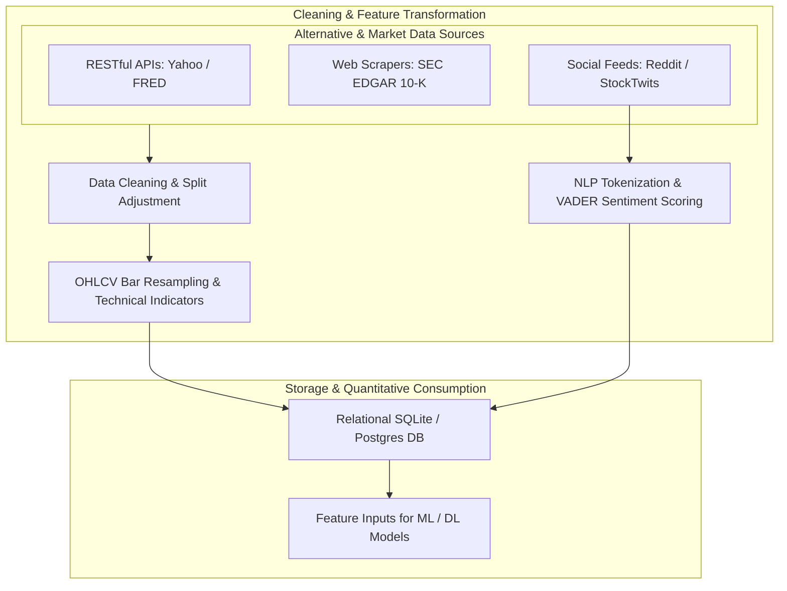
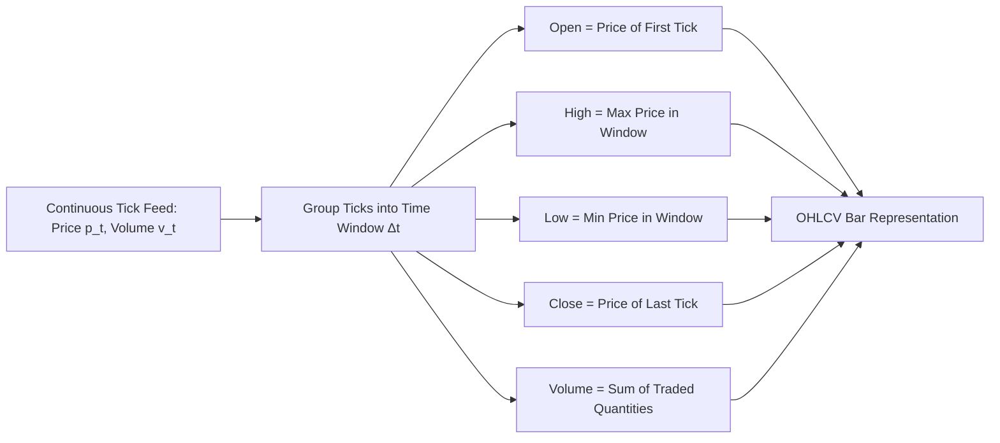

# Financial Data & Technology (MScFE 650 / 610)

This directory contains notebook implementations, lecture materials, and data pipelines for **Financial Data & Technology**. The module covers the lifecycle of financial data: ingestion, cleaning, time-series resampling, alternative data extraction (web scraping & social sentiment NLP), and building robust ETL pipelines for quantitative research.

---

## 📚 Module Overview

- **Course Code**: MScFE 650 / 610
- **Primary Focus**: Financial data engineering, APIs, time-series data structures, alternative unstructured data (Reddit, StockTwits, Twitter/X), Natural Language Processing (NLP) sentiment scoring, and database design.
- **Key Stack**: Python (`pandas`, `numpy`, `BeautifulSoup`, `requests`, `nltk`, `vaderSentiment`, `sqlite3`), JSON, RESTful APIs.

---

## 📊 Visual Frameworks & Architecture

### 1. Financial Data Engineering ETL Lifecycle

### 2. Tick Data to Custom OHLCV Bar Resampling Logic

---

## 📖 Sub-Module & Detailed File Breakdown

### [Module 1: Financial Data Engineering & Quality](./M1)
- **Notebooks & Materials**:
  - [`M1/Lesson 1: Financial Data Best Practices.pdf`](./M1/Lesson%201:%20Financial%20Data%20Best%20Practices.pdf): Survivorship bias, look-ahead bias, point-in-time database design.
  - [`M1/financial_data_module_1_lesson_2.ipynb`](./M1/financial_data_module_1_lesson_2.ipynb): Data cleaning, missing value imputation (`forward-fill`), corporate actions (stock splits, cash dividends).
  - [`M1/financial_data_module_1_lesson_3.ipynb`](./M1/financial_data_module_1_lesson_3.ipynb): RESTful APIs, parsing JSON payloads, handling rate limits.
  - [`M1/financial_data_module_1_lesson_4.ipynb`](./M1/financial_data_module_1_lesson_4.ipynb): Automated data validation and schema sanity checks.

---

### [Module 2: Time Series Data Structures & Resampling](./M2)
- **Notebooks**:
  - [`M2/financial_data_module_2_lesson_1.ipynb`](./M2/financial_data_module_2_lesson_1.ipynb): Time zone conversions and trading calendar alignment.
  - [`M2/financial_data_module_2_lesson_2.ipynb`](./M2/financial_data_module_2_lesson_2.ipynb): Intraday tick resampling to custom 5m, 1h, 1D OHLCV bars.
  - [`M2/financial_data_module_2_lesson_3.ipynb`](./M2/financial_data_module_2_lesson_3.ipynb): Technical indicators (SMA, EMA, RSI, MACD, Parkinson volatility).

---

### [Module 3: Web Scraping Financial Data](./M3)
- **Notebooks**:
  - [`M3/financial_data_module_3_lesson_1.ipynb`](./M3/financial_data_module_3_lesson_1.ipynb): Parsing tabular HTML data with `BeautifulSoup`.
  - [`M3/financial_data_module_3_lesson_2.ipynb`](./M3/financial_data_module_3_lesson_2.ipynb): Automated dynamic page rendering with Selenium/Playwright.
  - [`M3/financial_data_module_3_lesson_3.ipynb`](./M3/financial_data_module_3_lesson_3.ipynb): SEC EDGAR 10-K filing financial statement extraction.

---

### [Module 4: Unstructured Data & Sentiment Analysis (NLP)](./M4)
- **Notebooks & Datasets**:
  - [`M4/Financial_Data_Mod_4_lesson_1.ipynb`](./M4/Financial_Data_Mod_4_lesson_1.ipynb) & [`M4/L1-reading.pdf`](./M4/L1-reading.pdf): Text preprocessing, tokenization, lemmatization (`nltk`).
  - [`M4/financial_data_Mod_4_lesson_2.ipynb`](./M4/financial_data_Mod_4_lesson_2.ipynb) & [`M4/L2-reading.pdf`](./M4/L2-reading.pdf): Mining Reddit comments ([`M4/reddit_comments.csv`](./M4/reddit_comments.csv)), YouTube commentary ([`M4/youtube_comments.json`](./M4/youtube_comments.json)), and Google Trends ([`M4/NVDA-relatedQueries.csv`](./M4/NVDA-relatedQueries.csv)).
  - [`M4/financial_data_Mod_4_lesson_3.ipynb`](./M4/financial_data_Mod_4_lesson_3.ipynb): VADER sentiment scoring and polarity index calculation.
  - [`M4/financial_data_Mod_4_lesson_4.ipynb`](./M4/financial_data_Mod_4_lesson_4.ipynb): Alternative social sentiment signal construction.

---

### [Module 5: Database Engineering & ETL Pipelines](./M5)
- **Notebooks & Materials**:
  - [`M5/financial_data_module_5_lesson_1.ipynb`](./M5/financial_data_module_5_lesson_1.ipynb) & [`M5/L1-reading.pdf`](./M5/L1-reading.pdf): Relational database schema design (normalized vs denormalized).
  - [`M5/financial_data_module_5_lesson_2.ipynb`](./M5/financial_data_module_5_lesson_2.ipynb) & [`M5/L2-reading.pdf`](./M5/L2-reading.pdf): SQL operations (`sqlite3`, PostgreSQL), window functions (`OVER (PARTITION BY ...)`).
  - [`M5/financial_data_module_5_lesson_3.ipynb`](./M5/financial_data_module_5_lesson_3.ipynb) & [`M5/L3-reading.pdf`](./M5/L3-reading.pdf): Automated ETL pipeline construction and data warehousing.

---

### [Module 6: High-Frequency Alternative Signals](./M6)
- **Notebooks & Datasets**:
  - [`M6/financial_data_module_6_lesson_1.ipynb`](./M6/financial_data_module_6_lesson_1.ipynb): StockTwits message parsing ([`M6/SPY_stocktwits_messages.csv`](./M6/SPY_stocktwits_messages.csv)) and Twitter feeds ([`M6/tweets.zip`](./M6/tweets.zip)).
  - [`M6/financial_data_module_6_lesson_2.ipynb`](./M6/financial_data_module_6_lesson_2.ipynb): Converting noisy text into stationary sentiment features.
  - [`M6/financial_data_module_6_lesson_3.ipynb`](./M6/financial_data_module_6_lesson_3.ipynb): Signal evaluation via Information Coefficient (IC) and Granger causality.

---

## 🔑 Key Takeaways & Data Engineering Guidelines

1. **Avoid Look-Ahead & Survivorship Bias**: Backtesting signals on current index constituents creates massive upward performance bias. Always use point-in-time constituent data and split-adjusted prices.
2. **Resampling Integrity**: When resampling intraday ticks to OHLCV bars, ensure $Open$ is the first trade, $High$ is the max price, $Low$ is the min price, $Close$ is the last trade, and $Volume$ is the sum of traded quantities.
3. **Sentiment Signal Noise**: Social media data (Reddit, Twitter, StockTwits) suffers from extreme noise. Rolling window aggregation and credibility weighting are required.
4. **ETL Robustness**: Ingestion routines must be idempotent (re-running does not duplicate rows) and resilient to API schema changes.

---

## 🔗 Cross-Module Knowledge Linkages

- **$\to$ [07_machine_learning](../07_machine_learning/README.md)**: Cleaned OHLCV features and NLP sentiment scores serve as primary feature inputs ($X$) for ML models.
- **$\to$ [08_deep_learning](../08_deep_learning/README.md)**: Textual comments and intraday resampled time-series feed directly into LSTMs, CNNs, and Transformers.
- **$\to$ [04_financial_econometrics](../04_financial_econometrics/README.md)**: Return series processed in Module 2 form input datasets for ARMA-GARCH modeling.
