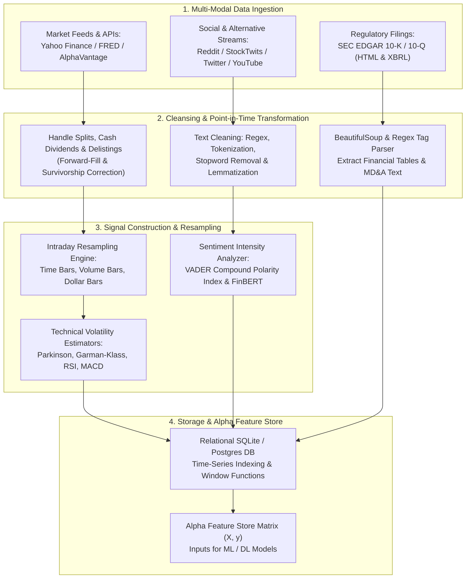
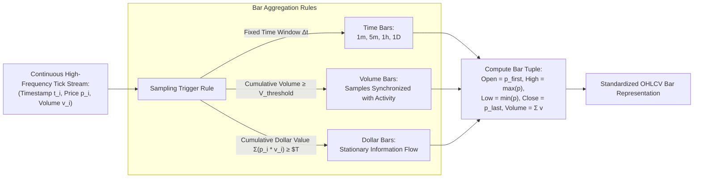
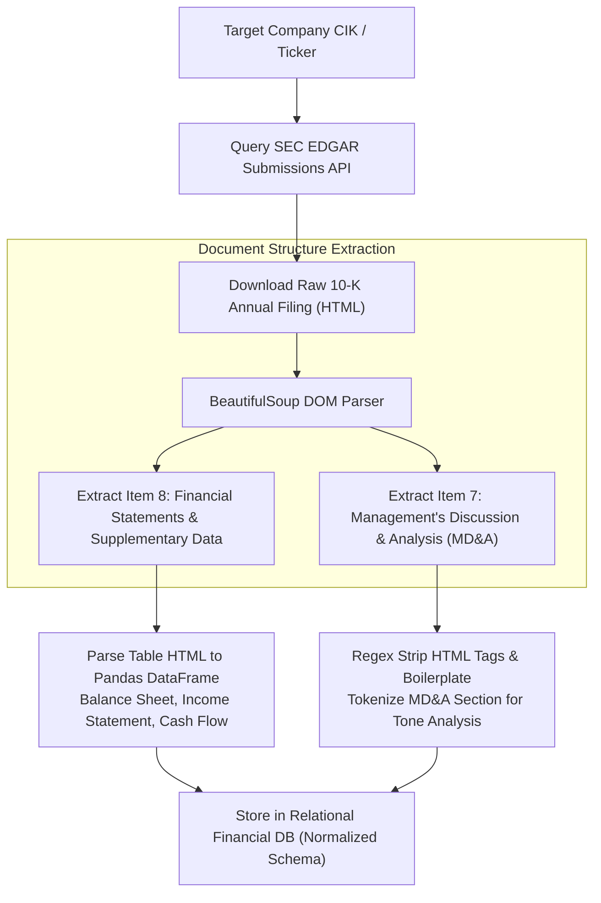
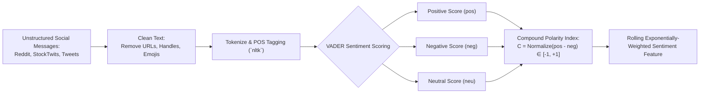

# Financial Data & Technology (MScFE 650 / 610)

This directory contains Jupyter notebooks, Python scripts, datasets, and lecture notes for **Financial Data & Technology**. The module covers the entire quantitative data engineering lifecycle: market data ingestion via RESTful APIs, point-in-time database design, tick-to-bar resampling algorithms (time, volume, dollar bars), alternative unstructured web scraping (SEC EDGAR 10-K, Reddit, StockTwits, Twitter/X), Natural Language Processing (NLP) sentiment scoring (VADER, TF-IDF), relational database engineering (SQLite, PostgreSQL), and predictive alpha feature construction.

---

## 📚 Module Overview

- **Course Code**: MScFE 650 / 610
- **Primary Focus**: Financial data architecture, data quality hygiene (survivorship and look-ahead bias mitigation), high-frequency bar aggregation, alternative data scraping, social media sentiment analysis, relational database design with SQL window functions, and quantitative alpha signal validation.
- **Key Stack & Tools**: Python (`pandas`, `numpy`, `BeautifulSoup`, `requests`, `nltk`, `vaderSentiment`, `sqlite3`), Regular Expressions (`re`), JSON/RESTful APIs, SQL.

---

## 📊 Visual Frameworks & Architecture

### 1. End-to-End Quantitative ETL & Multi-Modal Feature Pipeline



### 2. Continuous Tick to Custom Bar Resampling Architecture



### 3. SEC EDGAR 10-K Automated Scraping & Normalization



### 4. Alternative Text Sentiment & Polarity Index Construction



---

## 📖 Sub-Module & Detailed File Breakdown

### [Module 1: Financial Data Engineering & Quality](./M1)
- **Lessons & Core Topics**:
  - [`M1/Lesson 1: Financial Data Best Practices.pdf`](./M1/Lesson%201:%20Financial%20Data%20Best%20Practices.pdf): **Biases & Data Quality Hygiene**.
    - **Survivorship Bias**: Testing quantitative strategies only on currently active index constituents overestimates Sharpe ratios by ignoring bankrupt/delisted firms.
    - **Look-Ahead Bias**: Inadvertently accessing future information (e.g., using end-of-day closing prices or restated earnings before public release).
    - Point-In-Time (PIT) architecture requirements.
  - [`M1/financial_data_module_1_lesson_2.ipynb`](./M1/financial_data_module_1_lesson_2.ipynb): **Data Cleaning & Corporate Actions**.
    - Missing value imputation strategies (Forward-fill `ffill` vs. linear interpolation).
    - Adjusting historical price series for stock splits ($P_{\text{adj}} = P / \text{split ratio}$) and cash dividends ($P_{\text{adj}} = P \cdot (1 - D/P)$).
  - [`M1/financial_data_module_1_lesson_3.ipynb`](./M1/financial_data_module_1_lesson_3.ipynb): **RESTful APIs & JSON Serialization**.
    - Ingesting market feeds via `requests`, parsing multi-level nested JSON responses, managing HTTP status codes, session persistence, and exponential backoff rate limiting.
  - [`M1/financial_data_module_1_lesson_4.ipynb`](./M1/financial_data_module_1_lesson_4.ipynb): **Automated Data Validation Pipelines**.
    - Unit testing financial dataframes: Schema assertion, non-negative price checks, trading volume sanity checks, and outlier detection using $Z$-score thresholds.

---

### [Module 2: Time Series Data Structures & Resampling](./M2)
- **Lessons & Core Topics**:
  - [`M2/financial_data_module_2_lesson_1.ipynb`](./M2/financial_data_module_2_lesson_1.ipynb): **Time Zones & Trading Calendars**.
    - UTC normalization, handling daylight saving time (DST) shifts, aligning multi-exchange trading hours (NYSE vs. LSE vs. Tokyo) using `pandas` and `exchange_calendars`.
  - [`M2/financial_data_module_2_lesson_2.ipynb`](./M2/financial_data_module_2_lesson_2.ipynb): **High-Frequency Tick-to-Bar Resampling**.
    - Aggregation logic: $Open = p(t_{\text{start}})$, $High = \max_{t} p(t)$, $Low = \min_{t} p(t)$, $Close = p(t_{\text{end}})$, $Volume = \sum v(t)$.
    - Constructing custom 5-minute, 15-minute, 1-hour, and daily OHLCV bars from irregular tick data.
  - [`M2/financial_data_module_2_lesson_3.ipynb`](./M2/financial_data_module_2_lesson_3.ipynb): **Technical Indicators & Advanced Volatility Estimators**.
    - Simple Moving Average (SMA), Exponential Moving Average (EMA): $\text{EMA}_t = \alpha P_t + (1-\alpha)\text{EMA}_{t-1}$.
    - Relative Strength Index (RSI), Moving Average Convergence Divergence (MACD).
    - **Parkinson High-Low Volatility Estimator**:
      $$\sigma_P = \sqrt{\frac{1}{4 \ln 2 \cdot N} \sum_{i=1}^N \left(\ln \frac{H_i}{L_i}\right)^2}$$
    - **Garman-Klass Volatility Estimator** (incorporating Open, High, Low, Close):
      $$\sigma_{GK} = \sqrt{\frac{1}{N} \sum_{i=1}^N \left[ 0.5 \left(\ln \frac{H_i}{L_i}\right)^2 - (2\ln 2 - 1) \left(\ln \frac{C_i}{O_i}\right)^2 \right]}$$

---

### [Module 3: Web Scraping Financial Data](./M3)
- **Lessons & Core Topics**:
  - [`M3/financial_data_module_3_lesson_1.ipynb`](./M3/financial_data_module_3_lesson_1.ipynb): **HTML Parsing with BeautifulSoup**.
    - DOM traversal, extracting tabular corporate earnings, handling CSS selectors, user-agent headers, and session headers.
  - [`M3/financial_data_module_3_lesson_2.ipynb`](./M3/financial_data_module_3_lesson_2.ipynb): **Dynamic Web Scraping & JavaScript Rendering**.
    - Handling dynamically loaded Single Page Applications (SPAs) and asynchronous AJAX requests.
  - [`M3/financial_data_module_3_lesson_3.ipynb`](./M3/financial_data_module_3_lesson_3.ipynb): **SEC EDGAR 10-K / 10-Q Financial Extraction**.
    - Automated query of the SEC EDGAR company index via Central Index Key (CIK).
    - Regex pattern extraction of Balance Sheets, Income Statements, and Cash Flow Statements from Item 8, and MD&A text from Item 7.

---

### [Module 4: Unstructured Data & Sentiment Analysis (NLP)](./M4)
- **Lessons, Notebooks & Datasets**:
  - [`M4/Financial_Data_Mod_4_lesson_1.ipynb`](./M4/Financial_Data_Mod_4_lesson_1.ipynb) & [`M4/L1-reading.pdf`](./M4/L1-reading.pdf): **Text Preprocessing & NLP Foundations**.
    - Text tokenization, stop-word removal, regex pattern filtering, stemming (Porter) and WordNet lemmatization (`nltk`).
  - [`M4/financial_data_Mod_4_lesson_2.ipynb`](./M4/financial_data_Mod_4_lesson_2.ipynb) & [`M4/L2-reading.pdf`](./M4/L2-reading.pdf): **Multi-Source Alternative Data Mining**.
    - Ingesting Reddit forum discussions ([`M4/reddit_comments.csv`](./M4/reddit_comments.csv)), YouTube quantitative video commentary ([`M4/youtube_comments.json`](./M4/youtube_comments.json)), and Google Trends search query volumes ([`M4/NVDA-relatedQueries.csv`](./M4/NVDA-relatedQueries.csv)).
  - [`M4/financial_data_Mod_4_lesson_3.ipynb`](./M4/financial_data_Mod_4_lesson_3.ipynb): **VADER Lexicon Sentiment Scoring**.
    - Rule-based sentiment analysis tuned for social text; computing positive ($pos$), negative ($neg$), neutral ($neu$), and normalized compound polarity score $C \in [-1, +1]$:
      $$C = \frac{x}{\sqrt{x^2 + \alpha}}, \quad \text{where } x = \sum \text{valence scores}, \; \alpha \approx 15$$
  - [`M4/financial_data_Mod_4_lesson_4.ipynb`](./M4/financial_data_Mod_4_lesson_4.ipynb): **Alternative Sentiment Alpha Signal Construction**.
    - Constructing rolling sentiment moving averages, sentiment momentum oscillators, and sentiment divergence signals against price momentum.

---

### [Module 5: Database Engineering & ETL Pipelines](./M5)
- **Lessons & Core Topics**:
  - [`M5/financial_data_module_5_lesson_1.ipynb`](./M5/financial_data_module_5_lesson_1.ipynb) & [`M5/L1-reading.pdf`](./M5/L1-reading.pdf): **Relational Database Design for Financial Data**.
    - Database normalization (1NF, 2NF, 3NF), primary keys, composite keys on `(ticker, timestamp)`, foreign key integrity.
  - [`M5/financial_data_module_5_lesson_2.ipynb`](./M5/financial_data_module_5_lesson_2.ipynb) & [`M5/L2-reading.pdf`](./M5/L2-reading.pdf): **Advanced SQL & Time-Series Analytics**.
    - SQL operations (`sqlite3`, PostgreSQL), indexing strategies (B-Tree on timestamp), complex joins, and SQL window functions:
      ```sql
      SELECT ticker, date, close,
             AVG(close) OVER (PARTITION BY ticker ORDER BY date ROWS BETWEEN 19 PRECEDING AND CURRENT ROW) AS sma_20,
             close / LAG(close, 1) OVER (PARTITION BY ticker ORDER BY date) - 1.0 AS daily_return
      FROM stock_prices;
      ```
  - [`M5/financial_data_module_5_lesson_3.ipynb`](./M5/financial_data_module_5_lesson_3.ipynb) & [`M5/L3-reading.pdf`](./M5/L3-reading.pdf): **Production ETL Pipeline Orchestration**.
    - Building automated, idempotent Extract-Transform-Load (ETL) data pipelines with error handling, transactional commits, and logging.

---

### [Module 6: High-Frequency Alternative Signals](./M6)
- **Lessons, Notebooks & Datasets**:
  - [`M6/financial_data_module_6_lesson_1.ipynb`](./M6/financial_data_module_6_lesson_1.ipynb): **Micro-Blogging Social Feeds**.
    - Ingestion and cleaning of StockTwits sentiment tags ([`M6/SPY_stocktwits_messages.csv`](./M6/SPY_stocktwits_messages.csv)) and Twitter feeds ([`M6/tweets.zip`](./M6/tweets.zip)).
  - [`M6/financial_data_module_6_lesson_2.ipynb`](./M6/financial_data_module_6_lesson_2.ipynb): **Signal Stationarity & Noise Filtering**.
    - Transforming non-stationary sentiment counts into stationary standardized sentiment $Z$-scores.
  - [`M6/financial_data_module_6_lesson_3.ipynb`](./M6/financial_data_module_6_lesson_3.ipynb): **Quantitative Signal Evaluation**.
    - Information Coefficient (IC) calculation between sentiment signal $S_t$ and forward returns $R_{t+1}$:
      $$\text{IC}_t = \text{Corr}(S_t, R_{t+1}), \quad \text{Rank IC}_t = \text{SpearmanCorr}(S_t, R_{t+1})$$
    - Information Ratio of the alpha: $\text{IR} = \frac{\text{Mean}(\text{IC})}{\text{Std}(\text{IC})} \cdot \sqrt{252}$.

---

## 🔑 Key Takeaways & Data Engineering Guidelines

1. **Point-in-Time Data Integrity**: Never build quantitative models using non-point-in-time data. Survivorship and look-ahead bias will severely flatter backtest performance while guaranteeing live trading underperformance.
2. **Superiority of OHLC Volatility Estimators**: Parkinson ($\sigma_P$) and Garman-Klass ($\sigma_{GK}$) estimators utilize intraday high, low, and open prices, providing significantly more statistically efficient variance estimates than close-to-close sample standard deviations.
3. **Sentiment Requires Signal Aggregation**: Individual social posts are predominantly noise. Meaningful alpha is extracted only when aggregated into volume-weighted, time-decayed rolling polarity scores with high Information Coefficients ($\text{IC} > 0.03$).
4. **Idempotency in ETL Engineering**: Database ingestion routines must always be idempotent (re-running the pipeline over historical dates updates existing records cleanly without creating duplicate rows).

---

## 🔗 Cross-Module Knowledge Linkages

- **$\to$ [07_machine_learning](../07_machine_learning/README.md)**: Cleaned OHLCV technical indicators and NLP sentiment scores serve as the primary feature matrix $\mathbf{X}$ for supervised learning and tree ensembles.
- **$\to$ [08_deep_learning](../08_deep_learning/README.md)**: High-frequency resampled time-series and tokenized text embeddings feed directly into LSTM, CNN-GAF, and Transformer architectures.
- **$\to$ [04_financial_econometrics](../04_financial_econometrics/README.md)**: Stationarity transformations and log-return series prepared in Module 2 provide the required inputs for ARMA and GARCH modeling.
- **$\to$ [05_portfolio_management](../05_portfolio_management/README.md)**: Multi-asset price histories and corporate actions supply the returns and covariance matrices for portfolio optimization.
