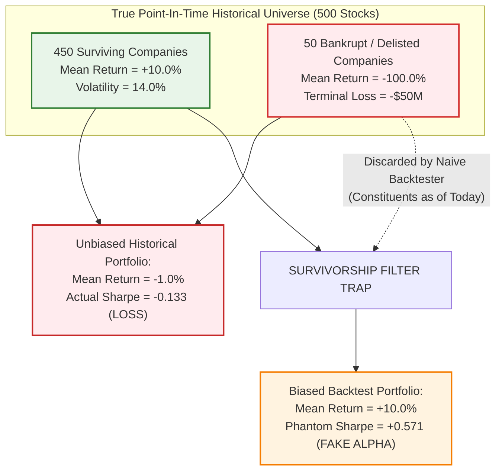
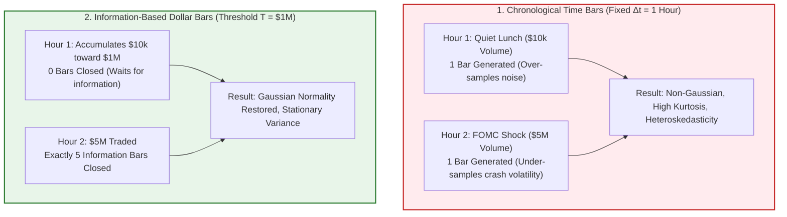

# Financial Data & Technology — Key Pedagogical Takeaways
## MScFE 650 / 610 Master Quantitative Synthesis

[← Back to Main README.md](./README.md)

---

## 📖 Table of Contents & Quick Module Links
1. [Core Intuition & Mechanical Failure Modes](#1-core-intuition--mechanical-failure-modes)
   - [Toy Example 1: Survivorship Bias & Phantom Sharpe Ratios](#toy-example-1-survivorship-bias--phantom-sharpe-ratios)
   - [Toy Example 2: Time-Bar Sampling vs Information-Based Dollar Bars](#toy-example-2-time-bar-sampling-vs-information-based-dollar-bars)
   - [Toy Example 3: Unstructured Social Sentiment Noise & Signal Decay](#toy-example-3-unstructured-social-sentiment-noise--signal-decay)
2. [Core Mathematical Formulations & Calculus Derivations](#2-core-mathematical-formulations--calculus-derivations)
   - [1. Garman-Klass Intraday Volatility Efficiency Derivation](#1-garman-klass-intraday-volatility-efficiency-derivation)
   - [2. VADER Sentiment Polarity Normalization Function](#2-vader-sentiment-polarity-normalization-function)
   - [3. Information Coefficient & Information Ratio Analytics](#3-information-coefficient--information-ratio-analytics)
3. [Practical Engineering & Point-in-Time Database Architecture](#3-practical-engineering--point-in-time-database-architecture)
4. [Comparative Synthesis Cheat Sheet](#4-comparative-synthesis-cheat-sheet)
5. [Comprehensive Mathematical Notation & Variable Glossary](#5-comprehensive-mathematical-notation--variable-glossary)

---

<a id="1-core-intuition--mechanical-failure-modes"></a>
## 1. Core Intuition & Mechanical Failure Modes

<a id="toy-example-1-survivorship-bias--phantom-sharpe-ratios"></a>
### Toy Example 1: Survivorship Bias & Phantom Sharpe Ratios

#### 💡 The Intuitive Metaphor (Easiest to Understand)
Imagine evaluating the average income of tech startup founders by surveying only the CEOs of companies currently listed on NASDAQ. You completely ignore the $95\%$ of founders whose startups went bankrupt along the way. Your survey concludes that starting a tech company has a $100\%$ success rate and average earnings of $\$10\text{M}$! 
In finance, **Survivorship Bias** occurs when you backtest a quantitative strategy using today's index constituents, ignoring past bankrupt/delisted assets.

#### 🏷️ Notation Breakdown:
- $S \in \{0, 1\}$: **Survival Indicator Variable** ($S=1$ if firm survived to present day, $S=0$ if firm delisted or went bankrupt).
- $\mathbb{E}[R]$: **True Unconditional Expected Return** (Expected return across the entire historical investable universe).
- $\mathbb{E}[R \mid S=1]$: **Biased Conditional Expected Return** (Expected return observed only on surviving assets).
- $\mu_{\text{actual}}, \mu_{\text{biased}}$: **Unbiased vs. Biased Portfolio Mean Returns**.
- $\sigma_{\text{actual}}, \sigma_{\text{biased}}$: **Unbiased vs. Biased Portfolio Volatilities** ($\sqrt{\text{Var}(R)}$).
- $\text{SR}_{\text{actual}}, \text{SR}_{\text{biased}}$: **True vs. Phantom Sharpe Ratios** ($\frac{\mu - r_f}{\sigma}$).
- $\text{Bias}$: **Survivorship Bias Estimation Error** ($\mathbb{E}[R \mid S=1] - \mathbb{E}[R] > 0$).

#### 🔢 Step-by-Step Numerical Calculation
- Universe A (Uncurated Historic Universe in 2008): 500 stocks. 50 go bankrupt (return $-100\%$), 450 average $+10\%$ return.
  - Actual Mean Return: $\mu_{\text{actual}} = 0.10 \times (-1.00) + 0.90 \times (+0.10) = -0.10 + 0.09 = -1.0\%$
  - Actual Portfolio Volatility: $\sigma_{\text{actual}} = 22.5\%$
  - **Actual Sharpe Ratio**: $\text{SR}_{\text{actual}} = \frac{-0.01 - 0.02}{0.225} = -0.133$ (Loss-making strategy!)

- Universe B (Biased Survived Universe as of 2025): Excludes the 50 bankrupt stocks.
  - Biased Mean Return: $\mu_{\text{biased}} = +10.0\%$
  - Biased Portfolio Volatility: $\sigma_{\text{biased}} = 14.0\%$
  - **Phantom Sharpe Ratio**: $\text{SR}_{\text{biased}} = \frac{0.10 - 0.02}{0.14} = +0.571$ (Artificially profitable strategy!)

#### 📊 Visual Survivorship Filtering & Sharpe Ratio Distortion:



#### 📐 Calculus & Failure Mode Analysis
Let asset survival indicator be $S \in \{0, 1\}$. Backtesting on $S=1$ estimates conditional expectation $\mathbb{E}[R \mid S=1]$ rather than true unconditional expectation $\mathbb{E}[R]$.
- **Bias Term**: $\text{Bias} = \mathbb{E}[R \mid S=1] - \mathbb{E}[R] = \frac{P(S=0)}{P(S=1)} \left( \mathbb{E}[R \mid S=1] - \mathbb{E}[R \mid S=0] \right) > 0$.
- Because $\mathbb{E}[R \mid S=0] \approx -1.0$, discarding dead assets introduces a massive positive bias term $\text{Bias} > 0$ that destroys out-of-sample live performance.

---

<a id="toy-example-2-time-bar-sampling-vs-information-based-dollar-bars"></a>
### Toy Example 2: Time-Bar Sampling vs Information-Based Dollar Bars

#### 💡 The Intuitive Metaphor (Easiest to Understand)
Taking time bars (e.g. 5-minute bars) is like taking a photo of a highway every 5 minutes regardless of traffic. At midnight, 10 photos capture empty roads (pure noise). During a rush-hour multi-car pileup, 1 photo misses thousands of fast-moving vehicles. 
**Dollar Bars** take a photo every time $\$1\text{M}$ worth of vehicles passes by, perfectly matching sampling speed to market activity.

#### 🏷️ Notation Breakdown:
- $\Delta t$: **Fixed Chronological Time Interval** (e.g., 5 minutes, 1 hour).
- $p_i, v_i$: **Tick Trade Price and Volume** at transaction $i$.
- $T$ or $v_{\text{threshold}}$: **Information Sampling Threshold** (Target dollar value $\sum p_i v_i \ge T$ or volume value $\sum v_i \ge V_{\text{threshold}}$ required to close a bar).
- $I(t)$: **Subordinated Stochastic Information Arrival Process** (Cumulative market information flow).
- $dx(t)$: **Continuous Price Change Increment** ($dx(t) = \mu dI(t) + \sigma\sqrt{dI(t)} Z(t)$).
- $Z(t) \sim \mathcal{N}(0, 1)$: **Standard Normal Gaussian White Noise**.
- $r(\tau)$: **Return Sampled in Information Time $\tau$** (Restores Gaussian normality: $\mathcal{N}(\mu v_{\text{threshold}}, \sigma^2 v_{\text{threshold}})$).

#### 🔢 Step-by-Step Numerical Calculation
- Stock X Trades across 2 hours:
  - Hour 1 (Quiet Lunch): 100 trades, average price $P = \$100$, volume $V = 100 \implies \text{Value} = \$10,000$.
  - Hour 2 (FOMC Rate Shock): 100,000 trades, average price $P = \$100$, volume $V = 50,000 \implies \text{Value} = \$5,000,000$.
- **Time Bar Aggregation ($\Delta t = 1\text{ hour}$)**:
  - Bar 1: Represents $\$10,000$ traded (over-samples noise).
  - Bar 2: Represents $\$5,000,000$ traded (under-samples structural trend). Total return variance is heavily heteroskedastic.
- **Dollar Bar Aggregation ($T = \$1,000,000$)**:
  - Hour 1: 0.01 bars generated (waits for activity).
  - Hour 2: Exactly 5 uniform dollar bars generated, capturing micro-regime price changes at constant information intervals.

#### 📊 Visual Sampling Framework: Chronological vs Information Time



#### 📐 Calculus & Normality Proof
Under the Clark (1973) Information Asset Model, price changes $r(t)$ are subordinated to a stochastic information arrival process $I(t)$:

$$dx(t) = \mu dI(t) + \sigma \sqrt{dI(t)} Z(t), \quad Z(t) \sim \mathcal{N}(0, 1)$$

When sampling by fixed time $t$, $dI(t)$ is stochastic, creating fat-tailed Student-t return distributions. When sampling by constant dollar threshold $dI(\tau) = v_{\text{threshold}}$, return distributions collapse to a stationary Gaussian distribution:

$$r(\tau) \sim \mathcal{N}(\mu v_{\text{threshold}}, \, \sigma^2 v_{\text{threshold}})$$

---

<a id="toy-example-3-unstructured-social-sentiment-noise--signal-decay"></a>
### Toy Example 3: Unstructured Social Sentiment Noise & Signal Decay

#### 💡 The Intuitive Metaphor (Easiest to Understand)
Listening to raw social media post volume is like standing in a crowded stadium. Shouting doesn't mean people are making smart choices—most noise is cheerleading. To find real signal, you must measure the net ratio of positive to negative statements normalized against normal background noise.

#### 🏷️ Notation Breakdown:
- $x_{\text{pos}}, x_{\text{neg}}$: **Sum of Positive and Negative Lexicon Valence Scores** for words in a message.
- $x$: **Net Valence Sum** ($x = x_{\text{pos}} + x_{\text{neg}}$).
- $\alpha$: **VADER Non-Linear Normalization Scaling Parameter** (Typically calibrated to $\alpha \approx 15.0$).
- $C$: **Compound Polarity Score** ($C = \frac{x}{\sqrt{x^2 + \alpha}} \in [-1, +1]$).
- $\text{IC}_t$: **Information Coefficient** ($\text{Corr}(S_t, R_{t+1})$).
- $\text{Rank IC}_t$: **Spearman Rank Information Coefficient** ($1 - \frac{6\sum d_i^2}{N(N^2-1)}$).
- $\text{IR}$: **Information Ratio of the Signal** ($\frac{\bar{\text{IC}}}{\sigma_{\text{IC}}}\sqrt{252}$).

#### 🔢 Step-by-Step Calculation (VADER Compound Polarity)
Raw valence scores from text tokens: positive sum $x_{\text{pos}} = +4.5$, negative sum $x_{\text{neg}} = -0.5$.
Net valence $x = x_{\text{pos}} + x_{\text{neg}} = +4.0$. Normalization parameter $\alpha = 15.0$.

$$C = \frac{x}{\sqrt{x^2 + \alpha}} = \frac{4.0}{\sqrt{4.0^2 + 15.0}} = \frac{4.0}{\sqrt{16 + 15}} = \frac{4.0}{\sqrt{31}} = \frac{4.0}{5.5677} = +0.7184 \quad (C \in [-1, +1])$$

#### 📊 Visual Sentiment Processing & Signal Pipeline:


---

<a id="2-core-mathematical-formulations--calculus-derivations"></a>
## 2. Core Mathematical Formulations & Calculus Derivations

<a id="1-garman-klass-intraday-volatility-efficiency-derivation"></a>
### 1. Garman-Klass Intraday Volatility Efficiency Derivation
Let $H, L, O, C$ be High, Low, Open, Close prices. Let $h = \ln(H/O), l = \ln(L/O), c = \ln(C/O)$.

$$\text{Parkinson Estimator (High-Low):} \quad \sigma_P^2 = \frac{(\ln(H/L))^2}{4 \ln 2} \approx 0.361 (h - l)^2$$

$$\text{Garman-Klass Estimator (OHLC):} \quad \sigma_{GK}^2 = 0.5 (h - l)^2 - (2\ln 2 - 1) c^2 \approx 0.5 (h - l)^2 - 0.386 c^2$$

Taking ratio of estimator variances relative to standard close-to-close variance $\sigma_{CC}^2$:

$$\text{Efficiency Ratio} = \frac{\text{Var}(\sigma_{CC}^2)}{\text{Var}(\sigma_{GK}^2)} \approx 7.4 \text{ to } 8.0$$

The Garman-Klass estimator delivers **$8\times$ higher statistical precision** using the exact same number of historical daily bars.

---

<a id="2-vader-sentiment-polarity-normalization-function"></a>
### 2. VADER Sentiment Polarity Normalization Function
Taking the derivative of compound score $C(x)$ with respect to net valence score $x$:

$$\frac{dC}{dx} = \frac{d}{dx} \left[ x (x^2 + \alpha)^{-1/2} \right] = (x^2 + \alpha)^{-1/2} - x^2 (x^2 + \alpha)^{-3/2} = \frac{\alpha}{(x^2 + \alpha)^{3/2}} > 0$$

As $x \to \infty$, $C(x) \to +1$; as $x \to -\infty$, $C(x) \to -1$. The derivative is maximized at $x=0$, providing maximum sensitivity to subtle polarity shifts around neutral sentiment.

---

<a id="3-information-coefficient--information-ratio-analytics"></a>
### 3. Information Coefficient & Information Ratio Analytics

$$\text{Rank IC}_t = 1 - \frac{6 \sum d_i^2}{N(N^2 - 1)} \in [-1, +1]$$

$$\text{Information Ratio (IR):} \quad \text{IR} = \frac{\bar{\text{IC}}}{\sigma_{\text{IC}}} \cdot \sqrt{252}$$

---

<a id="3-practical-engineering--point-in-time-database-architecture"></a>
## 3. Practical Engineering & Point-in-Time Database Architecture

### Point-in-Time (PIT) vs Restated Data Leakage Architecture


### PIT Relational Schema & Idempotent SQL
```sql
-- Query point-in-time earnings without look-ahead leakage:
SELECT p.ticker, p.date, f.eps_reported
FROM daily_prices p
JOIN pit_fundamentals f 
  ON p.ticker = f.ticker 
 AND f.filing_date = (
     SELECT MAX(filing_date) 
     FROM pit_fundamentals 
     WHERE ticker = p.ticker AND filing_date <= p.date
 );
```

---

<a id="4-comparative-synthesis-cheat-sheet"></a>
## 4. Comparative Synthesis Cheat Sheet

| Data Structure / Estimator | Mathematical Formulation | Statistical Precision | Primary Use Case | Critical Failure Mode |
| :--- | :--- | :--- | :--- | :--- |
| **Time Bars** | Fixed interval $\Delta t$ | Low (Fat-tailed Student-t) | Visual chart displays | Undersamples volatility panics |
| **Dollar Bars** | $\sum p_i v_i \ge T$ | High (Approximates Gaussian) | ML/DL feature stores | Threshold requires dynamic indexing |
| **Garman-Klass Volatility** | $0.5(h-l)^2 - (2\ln 2-1)c^2$ | $8\times$ vs close-to-close | High-precision volatility trading | Underestimates overnight gap risk |
| **Rank IC** | Spearman $\text{Corr}(S_t, R_{t+1})$ | Non-parametric rank signal | Signal evaluation | Sensitive to non-stationary regimes |

---

<a id="5-comprehensive-mathematical-notation--variable-glossary"></a>
## 5. Comprehensive Mathematical Notation & Variable Glossary

### 📐 Master Variable Reference Table

| Symbol | Mathematical / Economic Meaning | Typical Range / Units | Context & Core Formula |
| :--- | :--- | :--- | :--- |
| **$S \in \{0, 1\}$** | Survivorship Indicator ($1 = \text{survived}, 0 = \text{bankrupt/delisted}$) | Binary $\{0, 1\}$ | Survivorship Bias: $\mathbb{E}[R \mid S=1] > \mathbb{E}[R]$ |
| **$\mathbb{E}[R], \mathbb{E}[R \mid S=1]$** | Unconditional vs. Conditional Expected Return | Annualized percentage | $\text{Bias} = \mathbb{E}[R \mid S=1] - \mathbb{E}[R]$ |
| **$\text{SR}_{\text{actual}}, \text{SR}_{\text{biased}}$** | True Strategy Sharpe Ratio vs. Biased Phantom Sharpe Ratio | Dimensionless ratio | $\text{SR} = \frac{\mu - r_f}{\sigma}$ |
| **$\text{Var}(\cdot)$** | **Variance**: Statistical dispersion of returns/estimators | $\sigma^2$ (Squared units) | Efficiency Ratio $= \frac{\text{Var}(\sigma_{CC}^2)}{\text{Var}(\sigma_{GK}^2)}$ |
| **$O, H, L, C$** | Open, High, Low, and Close Prices for a trading bar | Currency ($\$$) | OHLCV bar tuple |
| **$h, l, c$** | Normalized Log Prices relative to Open ($h=\ln(H/O), l=\ln(L/O), c=\ln(C/O)$) | Dimensionless log ratios | Garman-Klass: $\sigma_{GK}^2 = 0.5(h-l)^2 - 0.386 c^2$ |
| **$\sigma_P^2, \sigma_P$** | Parkinson High-Low Volatility Estimator | Annualized volatility | $\sigma_P^2 = \frac{(\ln(H/L))^2}{4\ln 2} \approx 0.361(h-l)^2$ |
| **$\sigma_{GK}^2, \sigma_{GK}$** | Garman-Klass OHLC Volatility Estimator | Annualized volatility | Delivers $\approx 8\times$ variance reduction vs. close-to-close |
| **$\sigma_{CC}^2$** | Classical Close-to-Close Sample Return Variance | Variance units | $\sigma_{CC}^2 = \frac{1}{N-1}\sum (r_t - \bar{r})^2$ |
| **$\Delta t$** | Fixed Chronological Sampling Window (Time Bars) | Minutes / Hours / Days | Standard time-series discretization |
| **$T, V_{\text{threshold}}$** | Dollar / Volume Sampling Threshold for Information Bars | $\$$ Traded / Share Volume | $\sum p_i v_i \ge T$ (Restores Gaussian normality) |
| **$I(t)$** | Subordinated Information Arrival Stochastic Process | Cumulative activity | $dx(t) = \mu dI(t) + \sigma\sqrt{dI(t)}Z(t)$ |
| **$x_{\text{pos}}, x_{\text{neg}}, x$** | Positive sum, negative sum, and net valence of text tokens | Real numbers ($\mathbb{R}$) | VADER lexicon scoring: $x = x_{\text{pos}} + x_{\text{neg}}$ |
| **$\alpha$** | VADER Compound Polarity Normalization Parameter | Calibration scalar ($\approx 15$) | $C = \frac{x}{\sqrt{x^2 + \alpha}}$ |
| **$C$** | Normalized VADER Compound Polarity Sentiment Index | Bounded $[-1, +1]$ | $C > +0.05$ (Bullish), $C < -0.05$ (Bearish) |
| **$\text{IC}_t$** | Pearson Information Coefficient | Bounded $[-1, +1]$ | $\text{IC}_t = \text{Corr}(S_t, R_{t+1})$ |
| **$\text{Rank IC}_t$** | Spearman Rank Information Coefficient | Bounded $[-1, +1]$ | $\text{Rank IC} = 1 - \frac{6\sum d_i^2}{N(N^2-1)}$ |
| **$d_i$** | Rank Difference between Signal Rank and Forward Return Rank | Integer | $d_i = \text{Rank}(S_{i,t}) - \text{Rank}(R_{i,t+1})$ |
| **$\text{IR}$** | Information Ratio of Predictive Alpha Signal | Annualized ratio | $\text{IR} = \frac{\bar{\text{IC}}}{\sigma_{\text{IC}}}\sqrt{252}$ |
| **$P_{\text{adj}}$** | Split- and Dividend-Adjusted Historical Stock Price | Currency ($\$$) | $P_{\text{adj}} = P \cdot (1 - \text{Div}/P) / \text{Split Ratio}$ |
| **$\text{EMA}_t$** | Exponential Moving Average at time $t$ | Price units ($\$$) | $\text{EMA}_t = \alpha P_t + (1-\alpha)\text{EMA}_{t-1}$ |
| **$\text{RSI}, \text{MACD}$** | Relative Strength Index & Moving Average Convergence Divergence | Technical momentum | Derived momentum & trend features |
