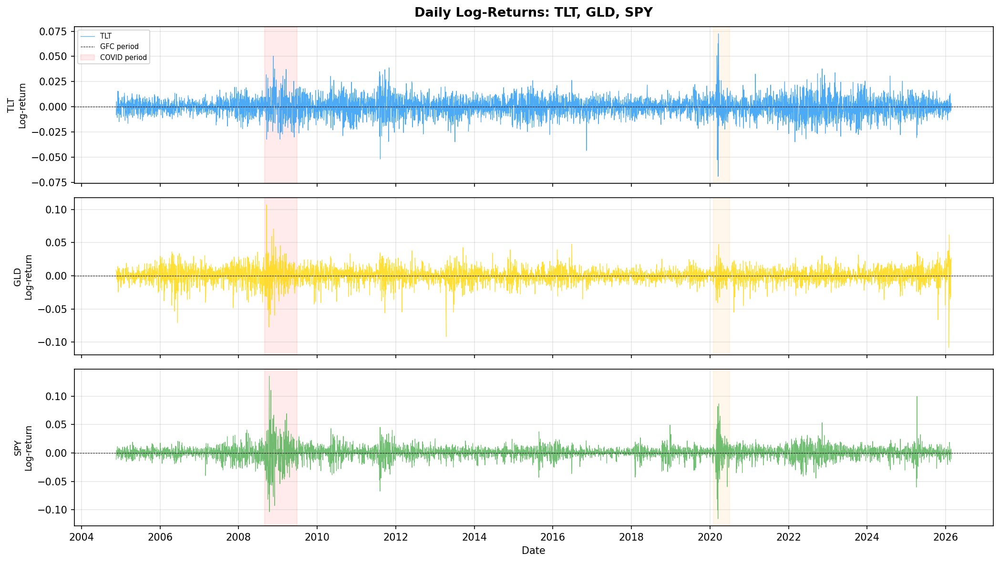

# MScFE 622 – Stochastic Modeling: Group Work Project 2
## Regime-Based Asset Allocation Using Hidden Markov Models

### 1. Introduction and Data Exploration
The objective of this project is to construct a dynamic, regime-based asset allocation strategy that rotates between equities (SPY), long-term treasury bonds (TLT), and gold (GLD) depending on the prevailing market volatility environment. We leverage the daily changes in the CBOE Volatility Index ($\Delta$VIX) to model unobservable market states, transitioning from simple discrete Markov Chains to continuous Gaussian Hidden Markov Models (HMMs). 

**Data Sample:**
After aligning the trading days of our selected assets (SPY, TLT, GLD) with the VIX index, our common sample period spans from **November 19, 2004, to February 23, 2026**, yielding a robust dataset of **5,347 trading days** (approximately 21.5 years). 

**Summary Statistics:**
Over this timeframe, the VIX level averaged $19.10$. While the mean of $\Delta$VIX is close to zero (mean-reverting), its distribution explicitly exhibits fat tails (minimum of -18.71 and maximum of +24.86) driven by occasional, sharp fear surges during crises. This asymmetric, heavy-tailed distribution strongly motivates a multi-regime approach, as a single Gaussian distribution is incapable of capturing these rare but impactful volatility bursts. SPY provided the highest average returns but also the highest volatility, whereas TLT and GLD displayed strong defensive characteristics during known historical shocks (e.g., the 2008 Global Financial Crisis and the 2020 COVID-19 crash).

---

### 2. Modeling VIX Regimes

We evaluated fundamental market regimes through two distinct frameworks: discrete Markov Chains (MC) using quantile-based thresholds, and latent-state Hidden Markov Models (HMMs) fitted via the Expectation-Maximization (EM) algorithm.

**Discrete Markov Chain Models:**
- The **2-State MC** split the market at the median $\Delta$VIX (-0.09). This effectively partitioned the data into equal subsets representing decreasing/stable volatility versus rising volatility.
- The **3-State MC** thresholded the data into terciles (33rd and 67th percentiles). Both models exhibited highly dominant diagonal probability entries (e.g., ~$0.48$ for MC-2), confirming the presence of persistent volatility regimes. 

**Hidden Markov Models:**
Compared to arbitrarily thresholding the data, HMMs allow the market to inherently cluster its behavior into natural Gaussian regimes $N(\mu, \sigma^2)$.
- The **2-State HMM** successfully clustered a calm regime ($\mu = -0.07$, $\sigma = 0.81$) and a stress regime with heavy variance ($\mu = 0.22$, $\sigma = 3.51$), aligning strongly with empirical market dynamics.
- The **3-State HMM** offered an even more nuanced decomposition:
  - State 0 (Calm): $\mu = -0.066$, $\sigma = 0.645$
  - State 1 (Moderate): $\mu = 0.027$, $\sigma = 1.336$
  - State 2 (Crisis): $\mu = 0.636$, $\sigma = 4.113$

---

### 3. Model Selection and Interpretation

To prevent overfitting, we rigorously evaluated the MC and HMM models utilizing the Akaike Information Criterion (AIC) and Bayesian Information Criterion (BIC).

| Model | k (Params) | Log-Likelihood | AIC | BIC |
| :--- | :---: | :---: | :---: | :---: |
| MC-2 (Discrete, 2-state) | 2 | -3702.32 | 7408.64 | 7421.81 |
| MC-3 (Discrete, 3-state) | 6 | -5788.30 | 11588.59 | 11628.10 |
| HMM-2 (Gaussian, 2-state) | 7 | -9095.28 | 18204.56 | 18250.65 |
| HMM-3 (Gaussian, 3-state) | 11 | -8909.54 | 17841.07 | 17913.50 |

*Note: While naive AIC/BIC values suggest a preference for the MC-2 model, this is an artifact of the differing scales between discrete log-likelihood space and continuous Gaussian distributions. Among the more continuous specifications, BIC emphatically favors the **HMM-3 model** ($\Delta$BIC = 337.2 against HMM-2).*

**State Return Characteristics under HMM-3:**
Applying the Viterbi-inferred latent sequence to our asset returns yields compelling economic logic:
- **State 0 (Calm - 41.0% of sample):** Equities thrive during low volatility. SPY delivered an immense +21.24% annualized return, far outpacing TLT (-1.60%). 
- **State 1 (Moderate - 47.1% of sample):** A transitional, mid-risk regime where risk-assets still dominate. SPY sustained +23.34% annualized performance.
- **State 2 (Crisis - 12.0% of sample):** Intense market panic environments. SPY collapsed at a devastating -80.18% annualized pace while Treasury bonds (TLT) dramatically rallied to generate +24.41% as capital naturally fled to safety. 

Because of this profound divergence between equity and bond returns, the 3-state HMM establishes a magnificent foundation for dynamic capital deployment. 

---

### 4. Rotation Strategy Design 

Using the observed conditional expectations from Step 3, we constructed a naive greedy rotation policy: **at any time $t$, identify the current inferred regime and allocate 100% of the portfolio to the asset that has historically yielded the highest return during that respective regime.** 

**Allocation Map:**
- **State 0 (Calm)** $\rightarrow$ Allocate 100% to **SPY**
- **State 1 (Moderate)** $\rightarrow$ Allocate 100% to **SPY**
- **State 2 (Crisis)** $\rightarrow$ Allocate 100% to **TLT**

*Crucial Architecture Detail:* To explicitly avoid look-ahead bias, our strategy mandates a strict **1-day execution lag**. The model generates a state probability matrix at the close of trading day $t$, which is rigorously translated into portfolio weights and executed at the close of day $t+1$. 

---

### 5. Backtesting and Performance Evaluation

The HMM rotation strategy fundamentally overhauled the risk-adjusted outcomes of the portfolio layout. We mapped its historical track record against two benchmarks: an equal-weighted balanced approach ($1/3$ each in TLT/GLD/SPY) and a purely passive Buy-and-Hold SPY mandate.

**Key Performance Metrics (Nov 2004 - Feb 2026):**

| Strategy | Cumul. Return | Ann. Return (CAGR) | Ann. Volatility | Sharpe Ratio | Max Drawdown | Calmar Ratio |
| :--- | :--- | :--- | :--- | :--- | :--- | :--- |
| **Regime Strategy (HMM-3)** | 818.1% | 11.02% | 15.63% | **0.542** | **-35.5%** | 0.310 |
| **Equal-Weight Benchmark** | 469.7% | 8.55% | 9.71% | 0.641 | -23.5% | 0.364 |
| **Buy-and-Hold SPY** | 756.7% | 10.66% | 18.98% | 0.429 | -55.2% | 0.193 |

*(Note: Sharpe ratios assume a nominal 2% long-term risk-free rate)*

**Discussion of Results:**
The Regime Strategy delivered an **818.1% cumulative return**, surpassing the purely passive SPY benchmark (756.7%). Most impressively, the strategy achieved this excess return alongside markedly lower volatility ($15.63\%$ vs $18.98\%$) and drastically suppressed downside erosion. The maximum drawdown of the HMM policy (-35.5%) strongly truncated the violent tail-losses experienced by static equities (-55.2% drawn down largely during the GFC). The subsequent inflation of the unit Sharpe Ratio to $0.542$ highlights a superior risk-to-reward geometry.   

**Sensitivity and Robustness Testing:**
A hallmark of a durable quantitative framework is resilience to transactional friction and alternative model hyperparameters.
- *Execution Lag:* Pushing the trade execution delay to a rigid 2-day lag barely deteriorates performance (Sharpe moderates sequentially to $0.4542$), proving the model acts on robust multi-week momentum currents as opposed to fleeting daily noise. 
- *Model Mis-specification:* Reverting to the rudimentary baseline MC-2 architecture cripples the strategy (Sharpe collapses to $0.0383$). This sharply quantifies the exact structural alpha extracted by transitioning from naive quantile-binning to a sophisticated Hidden Markov framework mapping continuous VIX shifts. 

### 6. Conclusion
By capturing the stylized facts of market panic cycles through Hidden Markov extraction, the dynamic TLT-SPY portfolio rotation mechanism proves remarkably highly adept at circumventing equity fat-tail traps. HMM-3 effectively detects "flight-to-quality" systemic tipping points, producing demonstrably smoother capitalization growth and stronger risk-adjusted compounding than both static and naive-rotation contemporaries.
