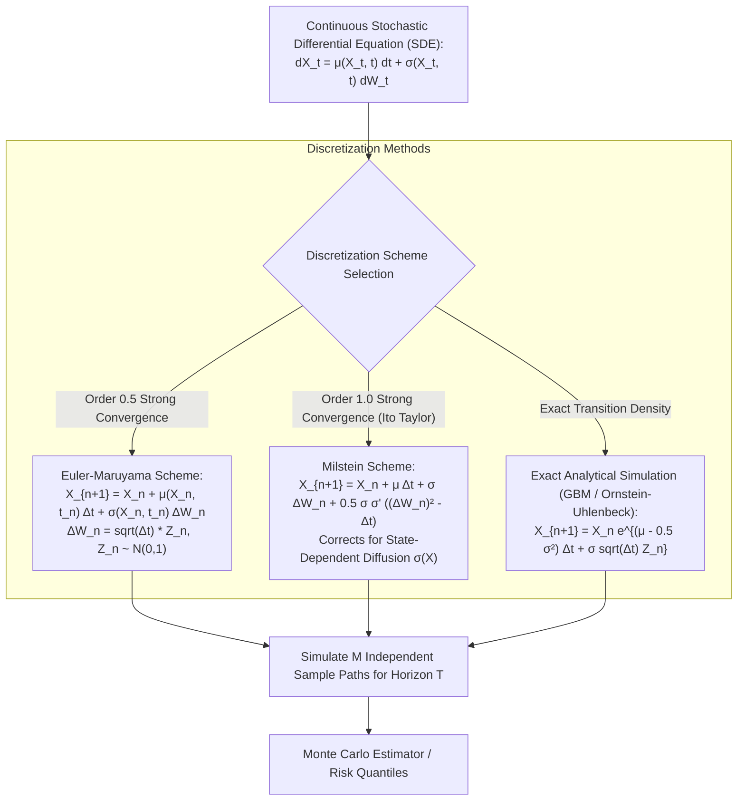
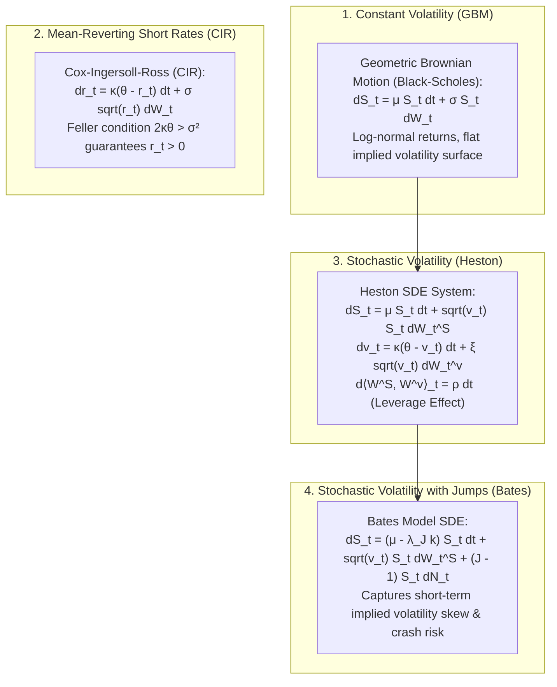
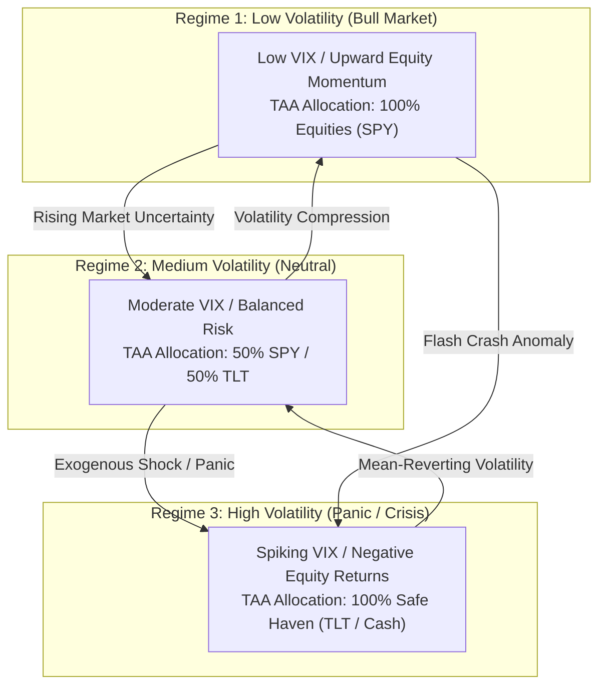
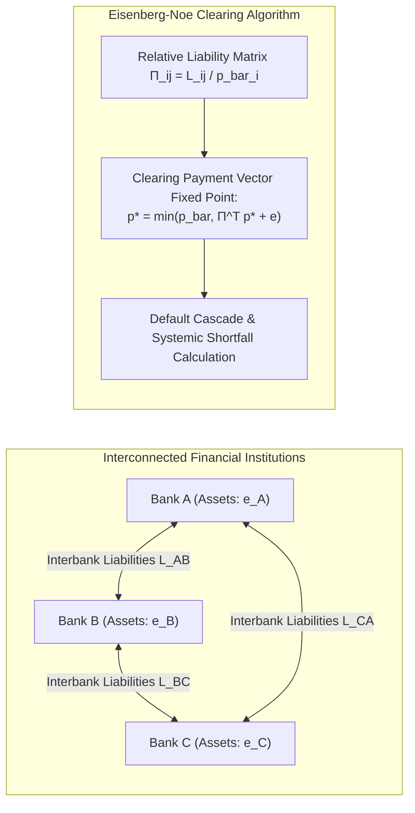
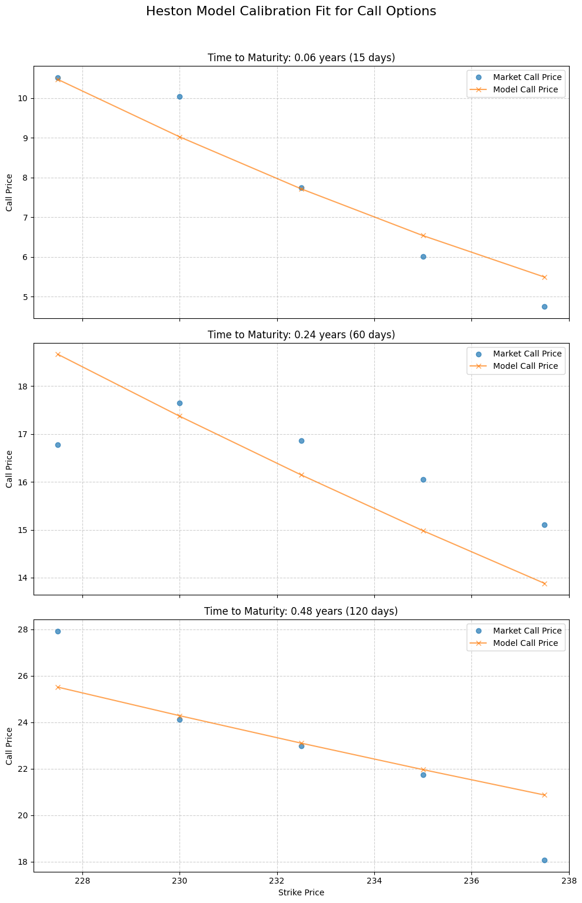
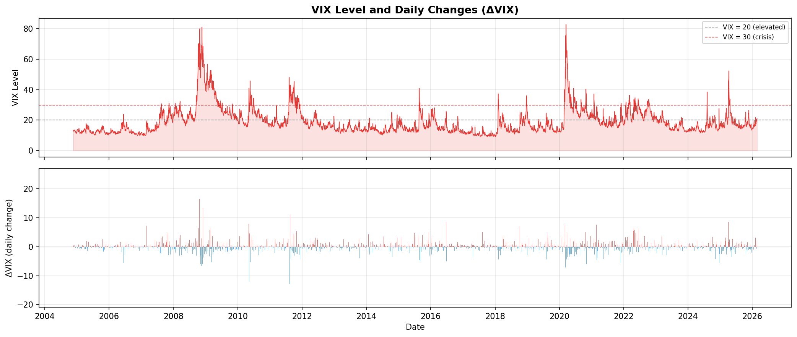
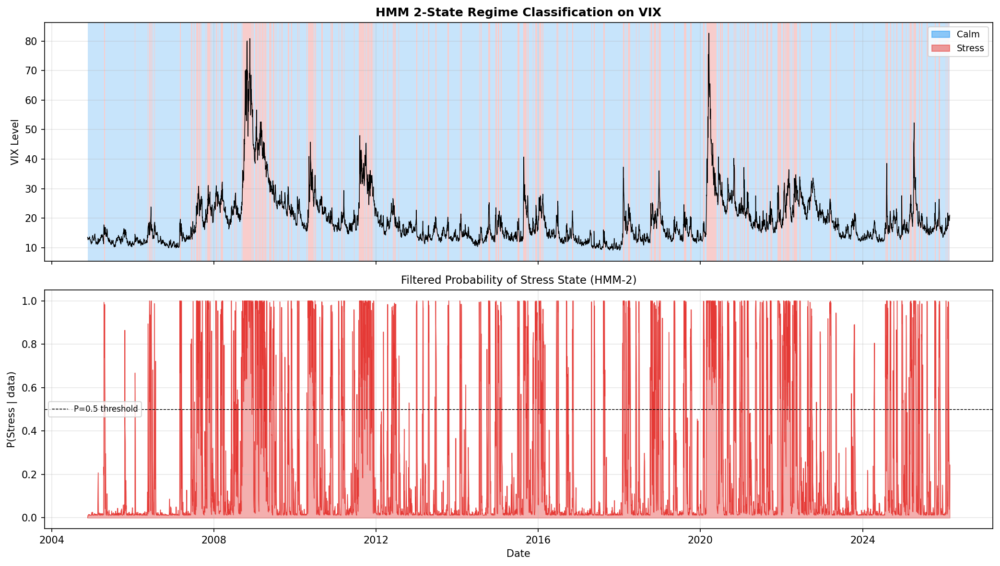
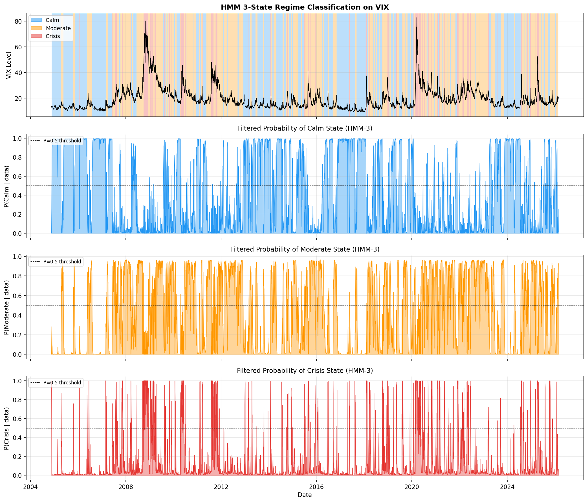
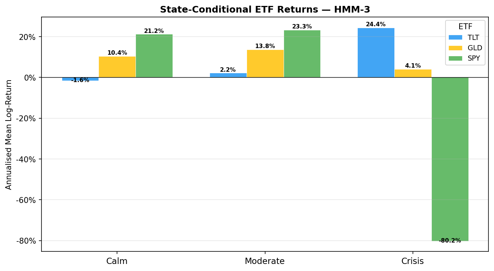
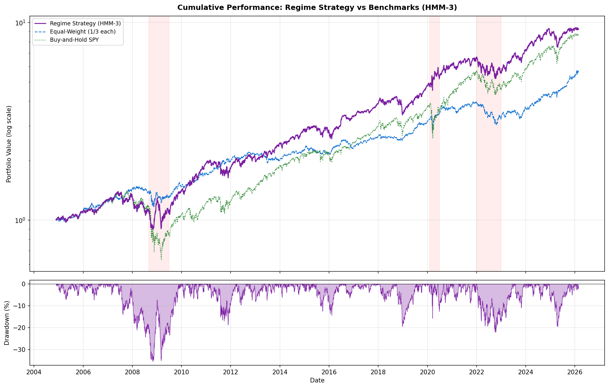

# Stochastic Modelling in Finance (MScFE 622)

This directory contains analytical Jupyter notebooks, Python source code, lecture notes, datasets, visual diagnostics, and complete Group Work Projects (GWP1 & GWP2) for **Stochastic Modelling in Finance**. This module provides the rigorous mathematical foundations of continuous-time probability theory: stochastic calculus (Ito's Lemma, Ito Isometry), Stochastic Differential Equations (SDEs), numerical discretization schemes (Euler-Maruyama, Milstein), interest rate models (Vasicek, CIR), stochastic volatility (Heston, Bates jump-diffusion), Monte Carlo variance reduction techniques, Hidden Markov Models (HMM) for market regime detection, and Network Graph financial contagion models (Eisenberg-Noe).

---

## 📚 Module Overview

- **Course Code**: MScFE 622
- **Primary Focus**: Continuous-time probability spaces $(\Omega, \mathcal{F}, (\mathcal{F}_t)_{t\ge 0}, \mathbb{P})$, Brownian motion, stochastic integration, SDE numerical discretization and convergence, option surface calibration, Monte Carlo simulations, Gaussian HMM regime-switching tactical asset allocation, and financial network graph topology.
- **Key Stack & Tools**: Python (`scipy`, `numpy`, `hmmlearn`, `networkx`, `matplotlib`, `pandas`), Monte Carlo simulation engines, Euler-Maruyama & Milstein integrators, Quasi-Monte Carlo.

---

> [!IMPORTANT]
> **🎓 Master Pedagogical Architecture & Key Takeaways**:
> Access the structured 4-tier quantitative breakdown with worked numerical calculations and calculus derivations in **[`key-takeaway.md`](./key-takeaway.md)**:
> - 📐 **[Ito Calculus vs Ordinary Calculus Derivations](./key-takeaway.md#toy-example-1-ordinary-calculus-vs-ito-calculus--quadratic-variation)**
> - 🛑 **[Vasicek vs CIR Feller Boundary Violation Proof](./key-takeaway.md#toy-example-2-negative-rates-in-vasicek-vs-cir-feller-boundary-violation)**
> - ⚙️ **[Milstein $\mathcal{O}(\Delta t)$ vs Euler-Maruyama Derivation](./key-takeaway.md#toy-example-3-euler-maruyama-vs-milstein-discretization-convergence)**
> - 🧮 **[Heston Volatility & Control Variates Math](./key-takeaway.md#2-core-mathematical-formulations--calculus-derivations)**

---

## 📊 Visual Frameworks & Architecture

### 1. SDE Numerical Discretization & Convergence Architecture — [*Detailed Math & Calculations in key-takeaway.md*](./key-takeaway.md#toy-example-3-euler-maruyama-vs-milstein-discretization-convergence)

### 2. Stochastic Asset Dynamics: From Constant Volatility to Jump Diffusion

### 3. Gaussian HMM 3-State Volatility Regime Transitions & TAA Engine (GWP2)

### 4. Financial Network Contagion & Eisenberg-Noe Clearing System

---

## 📖 Sub-Module & Detailed File Breakdown

### [Module 1: Probability Foundations & Discrete Stochastic Processes](./M1)
- **Lessons & Assessment**:
  - [`M1/L1.ipynb`](./M1/L1.ipynb): **Probability Spaces & Filtrations**.
    - Probability space triple $(\Omega, \mathcal{F}, \mathbb{P})$, filtration $(\mathcal{F}_t)_{t \ge 0}$ representing information accumulation.
    - Conditional expectation properties: Tower property $\mathbb{E}[\mathbb{E}[X \mid \mathcal{G}] \mid \mathcal{H}] = \mathbb{E}[X \mid \mathcal{H}]$ for $\mathcal{H} \subseteq \mathcal{G}$, taking out what is known.
  - [`M1/L2.ipynb`](./M1/L2.ipynb): **Discrete-Time Markov Chains**.
    - Transition probability matrix $\mathbf{P} = [P_{ij}]$, Chapman-Kolmogorov equations $\mathbf{P}^{(n+m)} = \mathbf{P}^{(n)} \mathbf{P}^{(m)}$.
    - Stationary distribution $\boldsymbol{\pi} = \boldsymbol{\pi} \mathbf{P}$ where $\sum \pi_i = 1$.
  - [`M1/L3.ipynb`](./M1/L3.ipynb): **Poisson Processes & Jump Dynamics**.
    - Counting process $N_t \sim \text{Poisson}(\lambda t)$, independent increments, inter-arrival times $\tau_k \sim \text{Exponential}(\lambda)$.
  - [`M1/L4.ipynb`](./M1/L4.ipynb): **Continuous-Time Markov Chains**.
    - Infinitesimal generator matrix $\mathbf{Q} = [q_{ij}]$, Kolmogorov backward/forward equations $\frac{d\mathbf{P}(t)}{dt} = \mathbf{Q}\mathbf{P}(t) = \mathbf{P}(t)\mathbf{Q}$.
  - [`M1/graded_quiz.ipynb`](./M1/graded_quiz.ipynb): Assessment exercises.
  - [`M1/ssrn-282110.pdf`](./M1/ssrn-282110.pdf): Foundational literature on stochastic models in finance.

---

### [Module 2: Brownian Motion & Ito Calculus](./M2)
- **Lessons & Core Topics**:
  - [`M2/L1-code.ipynb`](./M2/L1-code.ipynb) & [`M2/L1-reading.pdf`](./M2/L1-reading.pdf): **Standard Brownian Motion (Wiener Process)**.
    - Definition: $W_0 = 0$, continuous paths, independent increments, $W_t - W_s \sim \mathcal{N}(0, t-s)$.
    - Quadratic variation: $[W, W]_t = \lim_{\|\Pi\| \to 0} \sum_{i=1}^n (W_{t_i} - W_{t_{i-1}})^2 = t$ almost surely (formalizing $(dW_t)^2 = dt$).
  - [`M2/L2--code.ipynb`](./M2/L2--code.ipynb) & [`M2/L2-reading.pdf`](./M2/L2-reading.pdf): **The Ito Integral & Ito Isometry**.
    - Ito stochastic integral: $I_T = \int_0^T X_t dW_t = \lim_{n \to \infty} \sum_{i=0}^{n-1} X_{t_i} (W_{t_{i+1}} - W_{t_i})$ evaluated at the left endpoint.
    - Zero expectation: $\mathbb{E}\left[\int_0^T X_t dW_t\right] = 0$.
    - **Ito Isometry**:
      $$\mathbb{E}\left[\left(\int_0^T X_t dW_t\right)^2\right] = \mathbb{E}\left[\int_0^T X_t^2 dt\right]$$
  - [`M2/L3-code.ipynb`](./M2/L3-code.ipynb) & [`M2/L3-reading.pdf`](./M2/L3-reading.pdf): **Multi-Dimensional Ito's Lemma**.
    - Univariate form:
      $$df(t, X_t) = \left(\frac{\partial f}{\partial t} + \mu \frac{\partial f}{\partial X} + \frac{1}{2} \sigma^2 \frac{\partial^2 f}{\partial X^2}\right) dt + \sigma \frac{\partial f}{\partial X} dW_t$$
    - Multi-asset vector form with correlation matrix $\mathbf{\Sigma}_W$.
  - [`M2/L4-code.ipynb`](./M2/L4-code.ipynb): **Geometric Brownian Motion (GBM)**.
    - Analytical solution via Ito's Lemma on $f(S) = \ln S$:
      $$S_t = S_0 \exp\left(\left(\mu - \frac{1}{2}\sigma^2\right)t + \sigma W_t\right)$$

---

### [Module 3: Interest Rate SDE Models & Discretization](./M3)
- **Lessons & Core Topics**:
  - [`M3/L1-code.ipynb`](./M3/L1-code.ipynb): **Vasicek Short Rate Model**.
    - Ornstein-Uhlenbeck mean-reverting process: $dr_t = \kappa(\theta - r_t)dt + \sigma dW_t$.
    - Gaussian distribution allows negative interest rates: $r_t \sim \mathcal{N}\left(\theta + (r_0 - \theta)e^{-\kappa t}, \frac{\sigma^2}{2\kappa}(1 - e^{-2\kappa t})\right)$.
  - [`M3/L2-code.ipynb`](./M3/L2-code.ipynb): **Cox-Ingersoll-Ross (CIR) Model**.
    - Square-root diffusion: $dr_t = \kappa(\theta - r_t)dt + \sigma \sqrt{r_t} dW_t$.
    - Non-central chi-squared transition density.
    - **Feller Condition**: $2\kappa\theta > \sigma^2$ guarantees $r_t > 0$ strictly for all $t$.
  - [`M3/L3-code.ipynb`](./M3/L3-code.ipynb): **Euler-Maruyama Discretization**.
    - Explicit scheme: $X_{n+1} = X_n + \mu(X_n, t_n)\Delta t + \sigma(X_n, t_n)\sqrt{\Delta t} Z_n$.
    - Strong error $\mathbb{E}[|X_T - \hat{X}_T|] = \mathcal{O}(\sqrt{\Delta t})$, Weak error $|\mathbb{E}[g(X_T)] - \mathbb{E}[g(\hat{X}_T)]| = \mathcal{O}(\Delta t)$.
  - [`M3/L4-code.ipynb`](./M3/L4-code.ipynb): **Milstein Higher-Order Discretization**.
    - Adding second-order Ito-Taylor expansion term:
      $$X_{n+1} = X_n + \mu \Delta t + \sigma \Delta W_n + \frac{1}{2} \sigma(X_n) \sigma'(X_n) \left((\Delta W_n)^2 - \Delta t\right)$$
    - Upgrades strong convergence order to $\mathcal{O}(\Delta t)$.

---

### [Module 4 & GWP1: Stochastic Volatility & Jump Diffusion](./M4)
- **Lessons & Research Workflows**:
  - [`M4/L1.ipynb`](./M4/L1.ipynb) & [`M4/L1-reading.pdf`](./M4/L1-reading.pdf): **Limitations of Black-Scholes & Volatility Smiles**.
  - [`M4/L2.ipynb`](./M4/L2.ipynb): **The Heston Stochastic Volatility Model**.
    - Coupled SDE system:
      $$dS_t = \mu S_t dt + \sqrt{v_t} S_t dW_t^S, \quad dv_t = \kappa(\theta - v_t) dt + \xi \sqrt{v_t} dW_t^v, \quad d\langle W^S, W^v \rangle_t = \rho dt$$
    - Characteristic function formulation enabling semi-analytical pricing via inverse Fourier transform.
  - [`M4/L3-code.ipynb`](./M4/L3-code.ipynb): **Merton & Bates Jump Diffusion Models**.
    - Adding compound Poisson jumps: $dS_t = (\mu - \lambda \bar{k})S_t dt + \sqrt{v_t} S_t dW_t^S + (J-1)S_t dN_t$ where $\ln J \sim \mathcal{N}(\mu_J, \sigma_J^2)$.
  - [`M4/L4.ipynb`](./M4/L4.ipynb): **Model Calibration to Empirical Option Chains**.
    - Loss minimization: $\min_{\Theta} \sum_{i=1}^N w_i \left(C_{\text{model}}(K_i, T_i; \Theta) - C_{\text{market}}(K_i, T_i)\right)^2$.
- **Option Density Visualizations**:
  
  | Call Option Distribution | Put Option Distribution |
  | :---: | :---: |
  |  |  |

- **GWP1 Project Deliverables**:
  - Code: [`M4/GWP-final/Section1_Heston_Model.ipynb`](./M4/GWP-final/Section1_Heston_Model.ipynb), [`M4/GWP-final/Section2_Bates_Model.ipynb`](./M4/GWP-final/Section2_Bates_Model.ipynb), [`M4/GWP-final/Section3_CIR_Model.ipynb`](./M4/GWP-final/Section3_CIR_Model.ipynb), [`M4/GWP-final/GWP_WQU_Assignment_1_Final.ipynb`](./M4/GWP-final/GWP_WQU_Assignment_1_Final.ipynb).
  - Reports: [`M4/GWP-final/GWP_Report.md`](./M4/GWP-final/GWP_Report.md), [`M4/GWP-final-v2/Report_Stochastic_Modeling_Group_Work_Project_Group_13278.pdf`](./M4/GWP-final-v2/Report_Stochastic_Modeling_Group_Work_Project_Group_13278.pdf).
  - Option Chain Dataset: [`M4/GWP/MScFE 622_Stochastic Modeling_GWP1_Option data.xlsx - 1.csv`](./M4/GWP/MScFE%20622_Stochastic%20Modeling_GWP1_Option%20data.xlsx%20-%201.csv).

---

### [Module 5: Monte Carlo Simulation & Variance Reduction](./M5)
- **Lessons & Core Topics**:
  - [`M5/L1-code.ipynb`](./M5/L1-code.ipynb) & [`M5/L1-reading.pdf`](./M5/L1-reading.pdf): **Multi-Asset Correlated Paths**.
    - Generating correlated standard normals via Cholesky decomposition: $\mathbf{Z}_{\text{corr}} = \mathbf{L} \mathbf{Z}_{\text{uncorr}}$ where $\mathbf{\Sigma} = \mathbf{L}\mathbf{L}^T$.
  - [`M5/L2-code.ipynb`](./M5/L2-code.ipynb): **Antithetic Variates Method**.
    - For every path generated with random shocks $\mathbf{Z}$, generate mirror path with $-\mathbf{Z}$:
      $$\hat{\theta}_{AV} = \frac{f(\mathbf{Z}) + f(-\mathbf{Z})}{2}, \quad \text{Var}(\hat{\theta}_{AV}) = \frac{\text{Var}(f)}{2}(1 + \text{Corr}(f(\mathbf{Z}), f(-\mathbf{Z})))$$
  - [`M5/L3-code.ipynb`](./M5/L3-code.ipynb) & [`M5/L3-reading.pdf`](./M5/L3-reading.pdf): **Control Variates Method**.
    - Exploiting an analytical benchmark $Y$ (e.g., European option) to reduce variance of target $X$ (e.g., Asian option):
      $$\hat{X}_{CV} = X - c^* (Y - \mathbb{E}[Y]), \quad c^* = \frac{\text{Cov}(X, Y)}{\text{Var}(Y)}$$
  - [`M5/L4-code.ipynb`](./M5/L4-code.ipynb) & [`M5/L4-reading.pdf`](./M5/L4-reading.pdf): **Importance Sampling**.
    - Shifting the sampling probability measure to heavily sample deep out-of-the-money tail regions via Radon-Nikodym derivative $\frac{d\mathbb{P}}{d\mathbb{Q}}$.

---

### [Module 6 & GWP2: Regime Switching (HMM) & Tactical Asset Allocation](./M6)

GWP2 develops an automated quantitative strategy that fits Gaussian Hidden Markov Models (HMM) on VIX volatility dynamics to classify market states and execute Dynamic Tactical Asset Allocation (TAA).

#### Executable Pipeline Notebooks:
1. [`M6/GWP/Step1_Data_Preparation.ipynb`](./M6/GWP/Step1_Data_Preparation.ipynb): Data cleaning, VIX delta calculations, ETF log-returns.
2. [`M6/GWP/Step2_VIX_Regime_Modeling.ipynb`](./M6/GWP/Step2_VIX_Regime_Modeling.ipynb): Fitting Gaussian HMMs via Baum-Welch (EM) algorithm (`hmmlearn`).
3. [`M6/GWP/Step3_Model_Selection.ipynb`](./M6/GWP/Step3_Model_Selection.ipynb): Comparing 2-state vs. 3-state models using AIC/BIC and state transition matrices.
4. [`M6/GWP/Step4_Strategy_Design.ipynb`](./M6/GWP/Step4_Strategy_Design.ipynb): Establishing regime-conditional allocation rules:
   - **State 1 (Low Vol)**: 100% Equities (SPY)
   - **State 2 (Medium Vol)**: 50% SPY / 50% TLT
   - **State 3 (High Vol)**: 100% Safe Haven (TLT / Cash)
5. [`M6/GWP/Step5_Backtesting.ipynb`](./M6/GWP/Step5_Backtesting.ipynb): Walk-forward backtesting, Sharpe ratio, Max Drawdown, and Calmar ratio.
6. **Master Notebook**: [`M6/GWP-final/WQU_Group_Project_13278_code/WQU_Group_Project_2.ipynb`](./M6/GWP-final/WQU_Group_Project_13278_code/WQU_Group_Project_2.ipynb).
7. **Final PDF Report**: [`M6/GWP-final/Stochastic_Modeling_Group_Work_Project_Group_13278.pdf`](./M6/GWP-final/Stochastic_Modeling_Group_Work_Project_Group_13278.pdf).

#### Diagnostic Visuals:

| VIX & Delta VIX Series | HMM 2-State Regimes |
| :---: | :---: |
|  |  |

| HMM 3-State Volatility Regimes | ETF State Return Distributions |
| :---: | :---: |
|  |  |

#### Strategy Cumulative Performance:

*Figure 3: Cumulative return backtest of HMM Tactical Asset Allocation vs. SPY/TLT benchmarks.*

---

### [Module 7: Network Graph Theory & Contagion](./M7)
- **Lessons, Graphs & Data**:
  - [`M7/L1.ipynb`](./M7/L1.ipynb): **Graph Theory Foundations & NetworkX**.
    - Graph topologies $\mathcal{G} = (\mathcal{V}, \mathcal{E})$, adjacency matrix $\mathbf{A}$, degree distributions.
    - Graph files: [`M7/lesson1_graph.edgelist`](./M7/lesson1_graph.edgelist), [`M7/lesson1_graph.graphml`](./M7/lesson1_graph.graphml).
  - [`M7/L2.ipynb`](./M7/L2.ipynb): **Centrality Metrics & Systemic Importance**.
    - Degree Centrality, Closeness Centrality, Betweenness Centrality $C_B(v) = \sum_{s \neq v \neq t} \frac{\sigma_{st}(v)}{\sigma_{st}}$, and PageRank / Eigenvector Centrality ($\mathbf{A}\mathbf{x} = \lambda \mathbf{x}$).
  - [`M7/L3.ipynb`](./M7/L3.ipynb): **The Eisenberg-Noe Financial Contagion Model**.
    - Clearing payment vector fixed point:
      $$\mathbf{p}^* = \min\left(\bar{\mathbf{p}}, \mathbf{\Pi}^T \mathbf{p}^* + \mathbf{e}\right)$$
    - Modeling cascading institutional defaults under liquidity and solvency shocks.
  - [`M7/L4.ipynb`](./M7/L4.ipynb): **Minimum Spanning Trees (MST) in Financial Markets**.
    - Distance metric between assets $i$ and $j$: $d_{ij} = \sqrt{2(1 - \rho_{ij})}$.
    - Kruskal's / Prim's algorithm applied to stock returns ([`M7/returns_2005_2015.csv`](./M7/returns_2005_2015.csv)) to identify economic cluster backbones.

---

## 🔑 Key Takeaways & Stochastic Insights

1. **Ito's Second-Order Correction**: In continuous-time calculus, standard differentiation rules fail because $(dW_t)^2 = dt$. The extra term $\frac{1}{2} \sigma^2 \frac{\partial^2 f}{\partial X^2} dt$ in Ito's Lemma represents the convexity drift bonus.
2. **The Feller Boundary Condition**: In CIR and Heston variance models, if $2\kappa\theta \le \sigma^2$, the origin is an attainable boundary (variance can reach zero). Enforcing $2\kappa\theta > \sigma^2$ is mandatory for strict positivity.
3. **Milstein Convergence Edge**: For non-linear diffusion terms $\sigma(X_t)$ (such as square-root processes), Euler-Maruyama exhibits weak convergence of order 1.0 but poor strong convergence of order 0.5. Milstein's second-order term restores strong order 1.0 convergence.
4. **Regime Switching Reduces Left-Tail Drawdowns**: Modeling market volatility with Gaussian HMMs enables systematic de-risking ahead of prolonged bear markets, drastically improving the portfolio's Sortino and Calmar ratios.

---

## 🔗 Cross-Module Knowledge Linkages

- **$\to$ [06_derivative_pricing](../06_derivative_pricing/README.md)**: Ito's Lemma and continuous Geometric Brownian Motion provide the foundation for Black-Scholes PDE and trinomial tree lattice engines.
- **$\to$ [04_financial_econometrics](../04_financial_econometrics/README.md)**: SDE continuous diffusions represent the continuous-time limits of discrete GARCH volatility processes.
- **$\to$ [05_portfolio_management](../05_portfolio_management/README.md)**: HMM posterior state probabilities supply dynamic regime forecasts for tactical asset allocation and CVaR budgeting.
- **$\to$ [08_deep_learning](../08_deep_learning/README.md)**: Graph topologies engineered in Module 7 provide the structural adjacency matrices ($\mathbf{A}$) for Graph Neural Networks (GNNs).
