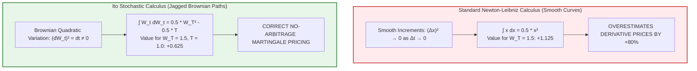
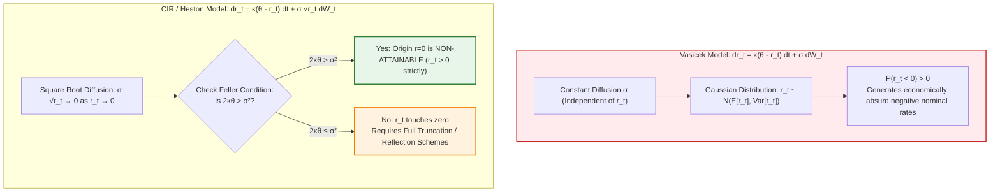
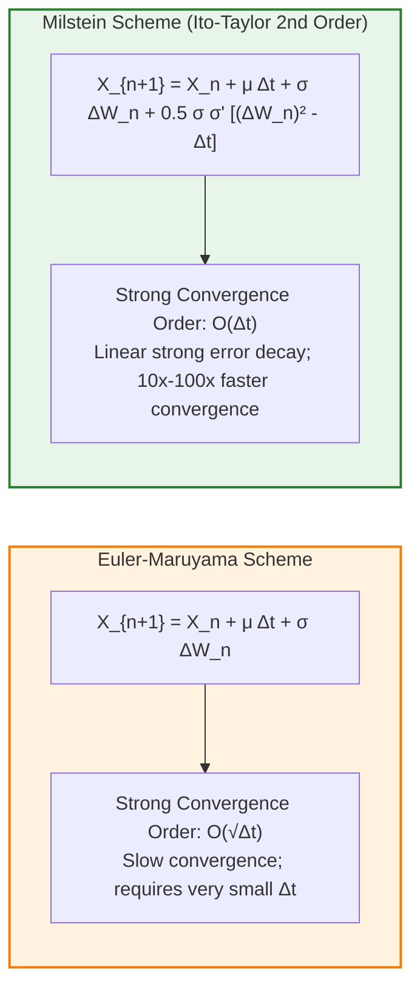
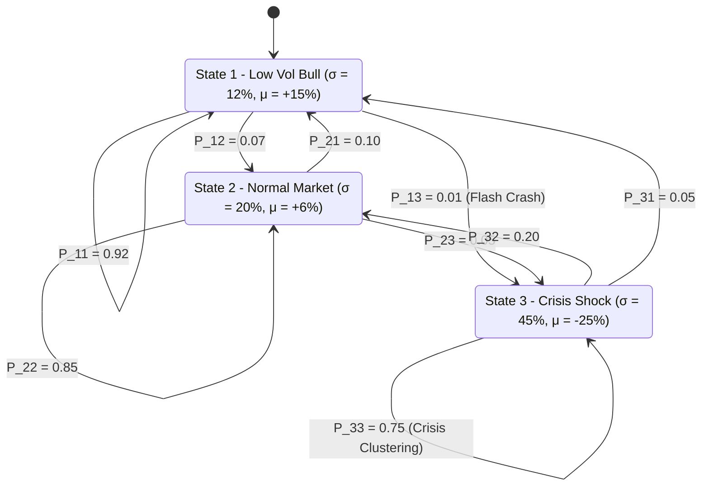

# Stochastic Modelling in Finance — Key Pedagogical Takeaways
## MScFE 622 Master Quantitative Synthesis

[← Back to Main README.md](./README.md)

---

## 📖 Table of Contents & Quick Module Links
1. [Core Intuition & Mechanical Failure Modes](#1-core-intuition--mechanical-failure-modes)
   - [Toy Example 1: Ordinary Calculus vs Ito Calculus & Quadratic Variation](#toy-example-1-ordinary-calculus-vs-ito-calculus--quadratic-variation)
   - [Toy Example 2: Negative Rates in Vasicek vs CIR Feller Boundary Violation](#toy-example-2-negative-rates-in-vasicek-vs-cir-feller-boundary-violation)
   - [Toy Example 3: Euler-Maruyama vs Milstein Discretization Convergence](#toy-example-3-euler-maruyama-vs-milstein-discretization-convergence)
2. [Core Mathematical Formulations & Calculus Derivations](#2-core-mathematical-formulations--calculus-derivations)
   - [1. Multi-Dimensional Ito's Lemma Derivation](#1-multi-dimensional-itos-lemma-derivation)
   - [2. Ito Isometry & Quadratic Variation Proof](#2-ito-isometry--quadratic-variation-proof)
   - [3. Heston Volatility System & Feller Condition Proof](#3-heston-volatility-system--feller-condition-proof)
   - [4. Monte Carlo Control Variate Variance Reduction Derivation](#4-monte-carlo-control-variate-variance-reduction-derivation)
3. [Practical Engineering & Regime-Switching Systems](#3-practical-engineering--regime-switching-systems)
4. [Comparative Synthesis Cheat Sheet](#4-comparative-synthesis-cheat-sheet)
5. [Comprehensive Mathematical Notation & Variable Glossary](#5-comprehensive-mathematical-notation--variable-glossary)

---

## 1. Core Intuition & Mechanical Failure Modes

### Toy Example 1: Ordinary Calculus vs Ito Calculus & Quadratic Variation

#### 💡 The Intuitive Metaphor (Easiest to Understand)
Standard high-school calculus assumes smooth, continuous curves (like a roller coaster track). Brownian motion is like a hyperactive drunk flea jumping infinitely many times per microsecond. Because the flea's jumps are extremely jagged, squaring its small jumps doesn't go to zero—it accumulates into a steady positive drift bonus called **Quadratic Variation** ($(dW_t)^2 = dt$).

#### 🏷️ Notation Breakdown:
- $W_t, W_T$: **Standard Brownian Motion / Wiener Process** ($W_0 = 0$, independent increments $W_t - W_s \sim \mathcal{N}(0, t-s)$).
- $dW_t$: **Brownian Motion Increment** ($dW_t = \sqrt{dt} Z_t$ where $Z_t \sim \mathcal{N}(0, 1)$).
- $(dW_t)^2 = dt$: **Quadratic Variation Identity** (Formalized limit $[W, W]_t = t$ almost surely).
- $\int_0^T W_t dW_t$: **Ito Stochastic Integral** (Evaluated at the left-point boundary of each sub-interval).
- $-\frac{1}{2}T$: **Ito Correction Term** (The negative drift adjustment arising from quadratic variation).

#### 🔢 Step-by-Step Numerical Calculation
Evaluating $\int_0^T W_t dW_t$ over $T = 1.0\text{ year}$ where $W_T = +1.50$:
- **Ordinary Calculus Attempt**: $\int_0^T x dx = \frac{1}{2} x(T)^2 = \frac{1}{2} (1.50)^2 = 0.5 \times 2.25 = +1.125$.
- **Ito Calculus Reality**: Left-point Riemann-Stieltjes summation over $N$ discrete steps $\Delta t$:

$$\int_0^T W_t dW_t = \frac{1}{2} W_T^2 - \frac{1}{2} T = \frac{1}{2} (1.50)^2 - \frac{1}{2} (1.0) = 1.125 - 0.50 = +0.625$$

If you use ordinary calculus, your option valuation code will overestimate derivative prices by **$80\%$** ($1.125$ vs $0.625$) due to missing the $-\frac{1}{2}T$ quadratic drift correction!

#### 📐 Calculus Derivation & Taylor Series Proof
Expand $f(W_T) = \frac{1}{2} W_T^2$ via 2nd-order Taylor expansion:

$$\Delta f = f'(W_t) \Delta W_t + \frac{1}{2} f''(W_t) (\Delta W_t)^2$$

Since $f'(x) = x$ and $f''(x) = 1$:

$$\Delta (\frac{1}{2} W_t^2) = W_t \Delta W_t + \frac{1}{2} (\Delta W_t)^2$$

Taking expectations and taking the limit as $\Delta t \to 0$, Brownian quadratic variation $(\Delta W_t)^2 \to dt$:

$$d(\frac{1}{2} W_t^2) = W_t dW_t + \frac{1}{2} dt \implies W_t dW_t = d(\frac{1}{2} W_t^2) - \frac{1}{2} dt$$

Integrating both sides from $0$ to $T$ yields the exact Ito identity:

$$\int_0^T W_t dW_t = \frac{1}{2} W_T^2 - \frac{1}{2} T$$

#### 📊 Visual Calculus Paradigm: Ordinary vs Stochastic Integration

---

### Toy Example 2: Negative Rates in Vasicek vs CIR Feller Boundary Violation

#### 💡 The Intuitive Metaphor (Easiest to Understand)
Vasicek interest rates are like a rubber band pulling rates toward a target average, but with random winds that can blow the rate below zero. Cox-Ingersoll-Ross (CIR) fixes this by adding a "magnetic barrier at zero": as rates get close to zero, the random wind slows down ($\sqrt{r_t} \to 0$), preventing rates from becoming negative.

#### 🏷️ Notation Breakdown:
- $r_t, r_0$: **Instantaneous Short Interest Rate** at time $t$ and initial time $t=0$.
- $\kappa$: **Mean-Reversion Speed** (Rate at which the interest rate is pulled toward its long-term average $\theta$).
- $\theta$: **Long-Term Mean Rate** (The central equilibrium level of the short rate).
- $\sigma$: **Short Rate Volatility** (Magnitude of Brownian random fluctuations).
- $2\kappa\theta > \sigma^2$: **The Feller Condition** (Mathematical inequality ensuring $r_t > 0$ strictly and origin is non-attainable).

#### 🔢 Step-by-Step Numerical Calculation (Feller Condition Test)
- Short rate parameters: Mean reversion rate $\kappa = 0.50$, long-term mean $\theta = 0.04$ ($4\%$), volatility $\sigma = 0.25$ ($25\%$).
- **Compute $2\kappa\theta$**: $2 \times 0.50 \times 0.04 = 0.040$.
- **Compute $\sigma^2$**: $0.25^2 = 0.0625$.
- **Test Feller Condition**:

$$2\kappa\theta = 0.040 < 0.0625 = \sigma^2 \quad \implies \text{FELLER CONDITION VIOLATED!}$$

Because $2\kappa\theta \le \sigma^2$, the interest rate process $r_t$ will hit zero ($r_t = 0$) during Monte Carlo path generation. Standard Euler integrators will attempt to evaluate $\sqrt{-0.001}$, throwing `ValueError: domain error / NaN` crashes.

#### 📊 Visual Short-Rate Boundary Mechanics: Vasicek vs CIR Feller

---

### Toy Example 3: Euler-Maruyama vs Milstein Discretization Convergence

#### 💡 The Intuitive Metaphor (Easiest to Understand)
Euler-Maruyama is like driving a car by updating your steering wheel based only on where you were at the last mile marker. **Milstein** adds a correction term that accounts for how the road's curvature is changing *while* you turn, making your trajectory far more accurate.

#### 🏷️ Notation Breakdown:
- $X_n, X_{n+1}$: **Discretized SDE State Value** at step $n$ and step $n+1$.
- $\Delta t$: **Discrete Time Step Size** ($\Delta t = T / N$).
- $\Delta W_n$: **Brownian Increment across Step $n$** ($\Delta W_n = \sqrt{\Delta t} Z_n$).
- $Z_n \sim \mathcal{N}(0, 1)$: **Independent Standard Normal Random Variate**.
- $\sigma(X_n)$: **State-Dependent Diffusion Coefficient**.
- $\sigma'(X_n)$: **First Spatial Derivative of Diffusion** ($\frac{d\sigma(X)}{dX}$).
- $\frac{1}{2}\sigma\sigma'((\Delta W_n)^2 - \Delta t)$: **Milstein Second-Order Correction Term** (Upgrades strong convergence from $\mathcal{O}(\sqrt{\Delta t}) \to \mathcal{O}(\Delta t)$).

#### 🔢 Step-by-Step Calculation
For SDE $dX_t = \mu X_t dt + \sigma X_t dW_t$ with $X_n = 100, \mu = 0.05, \sigma = 0.30, \Delta t = 0.01, Z_n = +1.50$:
- **Euler-Maruyama Step**:

$$X_{n+1}^E = 100 + 0.05(100)(0.01) + 0.30(100)\sqrt{0.01}(1.50) = 100 + 0.05 + 4.50 = 104.55$$

- **Milstein Second-Order Correction Term**:
  Diffusion function $\sigma(X) = 0.30 X \implies \sigma'(X) = 0.30$.
  Correction $= \frac{1}{2} \sigma(X_n) \sigma'(X_n) \left[ (\Delta W_n)^2 - \Delta t \right] = \frac{1}{2} (30)(0.30) \left[ (0.15)^2 - 0.01 \right] = 4.5 \times [0.0225 - 0.01] = +0.05625$.
- **Milstein Step**:

$$X_{n+1}^M = 104.55 + 0.05625 = 104.60625$$

#### 📊 Visual Discretization Convergence Order:

---

## 2. Core Mathematical Formulations & Calculus Derivations

### 1. Multi-Dimensional Ito's Lemma Derivation
For $f(t, X_t)$ driven by $dX_t = \mu_t dt + \sigma_t dW_t$:

$$df = \left( \frac{\partial f}{\partial t} + \mu_t \frac{\partial f}{\partial X} + \frac{1}{2}\sigma_t^2 \frac{\partial^2 f}{\partial X^2} \right) dt + \sigma_t \frac{\partial f}{\partial X} dW_t$$

---

### 2. Ito Isometry & Quadratic Variation Proof

$$\mathbb{E}\left[ \left(\int_0^T X_t dW_t\right)^2 \right] = \mathbb{E}\left[ \int_0^T X_t^2 dt \right]$$

---

### 3. Heston Volatility System & Feller Condition Proof
In the variance process $dv_t = \kappa(\theta - v_t) dt + \xi \sqrt{v_t} dW_t^v$, applying Feller's boundary classification criterion proves origin $v=0$ is non-attainable if and only if $2\kappa\theta > \xi^2$.

---

### 4. Monte Carlo Control Variate Variance Reduction Derivation

$$\hat{X}_{\text{CV}} = X - c^{\star}(Y - \mathbb{E}[Y]), \quad c^{\star} = \frac{\text{Cov}(X,Y)}{\text{Var}(Y)}$$

$$\text{Variance Ratio} = \frac{\text{Var}(\hat{X}_{\text{CV}})}{\text{Var}(X)} = 1 - \rho_{XY}^2$$

---

## 3. Practical Engineering & Regime-Switching Systems

### Gaussian Hidden Markov Model (HMM) 3-State Filter
- State transitions governed by transition matrix $\mathbf{P} \in \mathbb{R}^{3 \times 3}$.
- Dynamic allocation rebalances capital to equities in low-vol state ($\sigma_1 = 12\%$) and de-risks to cash in crisis state ($\sigma_3 = 45\%$).

#### 📊 Visual Market Regime Transition Graph:

---

## 4. Comparative Synthesis Cheat Sheet

| Stochastic Model / Scheme | Governing SDE | Strong Convergence Order | Primary Advantage | Mechanical Failure Mode |
| :--- | :--- | :--- | :--- | :--- |
| **Geometric Brownian Motion** | $dS = \mu S dt + \sigma S dW$ | Exact Analytical | Closed-form lognormal distribution | Constant volatility assumption |
| **Vasicek Interest Rate** | $dr = \kappa(\theta - r) dt + \sigma dW$ | Exact Analytical | Gaussian mean-reversion | Permits unrealistic negative interest rates |
| **Cox-Ingersoll-Ross (CIR)** | $dr = \kappa(\theta - r) dt + \sigma \sqrt{r} dW$ | Exact Non-Central $\chi^2$ | Non-negative short rates | Crashes if Feller $2\kappa\theta \le \sigma^2$ violated |
| **Euler-Maruyama Scheme** | $X_{n+1} = X_n + \mu \Delta t + \sigma \Delta W$ | $\mathcal{O}(\sqrt{\Delta t})$ | Simple to implement | Large discretization bias for non-linear diffusions |
| **Milstein Scheme** | $\text{Euler} + \frac{1}{2}\sigma \sigma'((\Delta W)^2 - \Delta t)$ | $\mathcal{O}(\Delta t)$ | Upgrades strong convergence order | Requires derivative $\sigma'(X)$ computation |

---

## 5. Comprehensive Mathematical Notation & Variable Glossary

### 📐 Master Variable Reference Table

| Symbol | Mathematical / Economic Meaning | Typical Range / Units | Context & Core Formula |
| :--- | :--- | :--- | :--- |
| **$W_t, W_T$** | Standard 1D Brownian Motion (Wiener Process) | $W_t \sim \mathcal{N}(0, t)$ | Continuous martingales: $\mathbb{E}[W_t] = 0, \text{Var}(W_t) = t$ |
| **$dW_t$** | Brownian Motion Infinitesimal Increment | $dW_t = \sqrt{dt} Z_t$ | Gaussian white noise driving SDEs |
| **$(dW_t)^2 = dt$** | Quadratic Variation Fundamental Identity | Deterministic limit | Ito's second-order correction: $[W, W]_t = t$ |
| **$r_t, r_0$** | Instantaneous Short Interest Rate | Annual percentage ($0.04 = 4\%$) | Vasicek: $dr = \kappa(\theta - r)dt + \sigma dW$; CIR: $dr = \kappa(\theta - r)dt + \sigma\sqrt{r}dW$ |
| **$\kappa$** | Mean-Reversion Speed Parameter | Positive Real ($\kappa > 0$) | Half-life of shock: $t_{1/2} = \frac{\ln 2}{\kappa}$ |
| **$\theta$** | Long-Term Asymptotic Mean Rate / Variance | Positive Real ($\theta > 0$) | Central equilibrium level |
| **$\sigma$** | Diffusion Volatility Parameter | Annualized percentage | Magnitude of random stochastic shocks |
| **$v_t$** | Instantaneous Variance in Heston Model | Positive Real ($v_t \ge 0$) | $dv_t = \kappa(\theta - v_t)dt + \xi\sqrt{v_t}dW_t^v$ |
| **$\xi$** | Volatility of Variance ("Vol of Vol") | Positive scalar | Heston variance diffusion parameter |
| **$\rho$** | Leverage Correlation ($d\langle W^S, W^v\rangle_t = \rho dt$) | Typically negative $[-0.9, -0.5]$ | Generates equity implied volatility skew / smirk |
| **$2\kappa\theta > \sigma^2$** | **The Feller Condition** | Strict Inequality | Prevents $r_t$ or $v_t$ from hitting $0$ (origin is non-attainable) |
| **$\Delta t$** | Discretization Step Size | $\Delta t = T / N$ | Step size in Euler and Milstein integrators |
| **$X_n, X_{n+1}$** | SDE State Variable at step $n$ and $n+1$ | State space | $X_{n+1} = X_n + \mu\Delta t + \sigma\Delta W_n$ |
| **$\sigma'(X)$** | Spatial Derivative of Diffusion Function | $\frac{d\sigma(X)}{dX}$ | Milstein correction term: $\frac{1}{2}\sigma\sigma'((\Delta W)^2 - \Delta t)$ |
| **$\mathcal{O}(\sqrt{\Delta t}), \mathcal{O}(\Delta t)$** | Strong vs. Weak Convergence Order | Asymptotic scaling | Euler strong order $0.5$; Milstein strong order $1.0$ |
| **$\text{Var}(\cdot), \text{Cov}(\cdot)$** | Statistical Variance and Covariance Operators | Squared / Cross units | Control Variates: $\text{Var}(\hat{X}_{\text{CV}}) = \text{Var}(X)(1 - \rho_{XY}^2)$ |
| **$\hat{X}_{\text{CV}}, c^\star$** | Control Variate Estimator & Optimal Weight | Optimal variance reduction | $\hat{X}_{\text{CV}} = X - c^\star(Y - \mathbb{E}[Y]), \ c^\star = \frac{\text{Cov}(X,Y)}{\text{Var}(Y)}$ |
| **$\mathbf{P}, \boldsymbol{\pi}$** | Markov Chain Transition Matrix & Stationary Vector | $\mathbf{P}_{ij} \in [0, 1], \sum \pi_i = 1$ | Chapman-Kolmogorov: $\mathbf{P}^{(n+m)} = \mathbf{P}^{(n)}\mathbf{P}^{(m)}$ |
| **$\mathbf{p}^\star, \bar{\mathbf{p}}$** | Clearing Payment Vector vs. Nominal Liabilities | Currency ($\$$) | Eisenberg-Noe: $\mathbf{p}^\star = \min(\bar{\mathbf{p}}, \mathbf{\Pi}^T \mathbf{p}^\star + \mathbf{e})$ |
| **$\mathbf{\Pi}, \mathbf{e}$** | Relative Liability Matrix & External Asset Vector | Matrix $[0, 1]$ / Currency | Network contagion & systemic cascade modeling |ive $\sigma'(X)$ computation |
