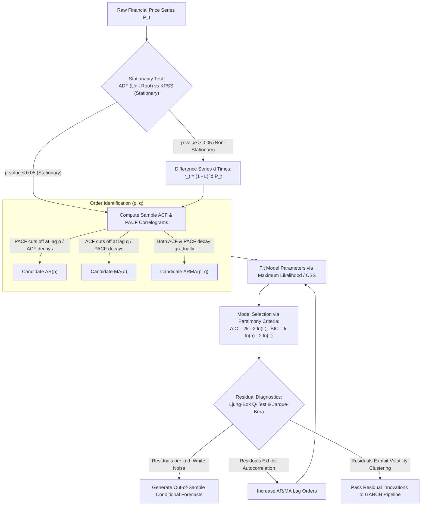
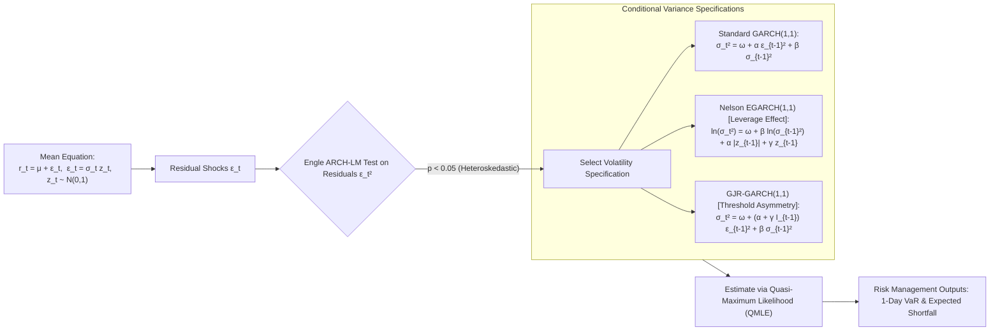
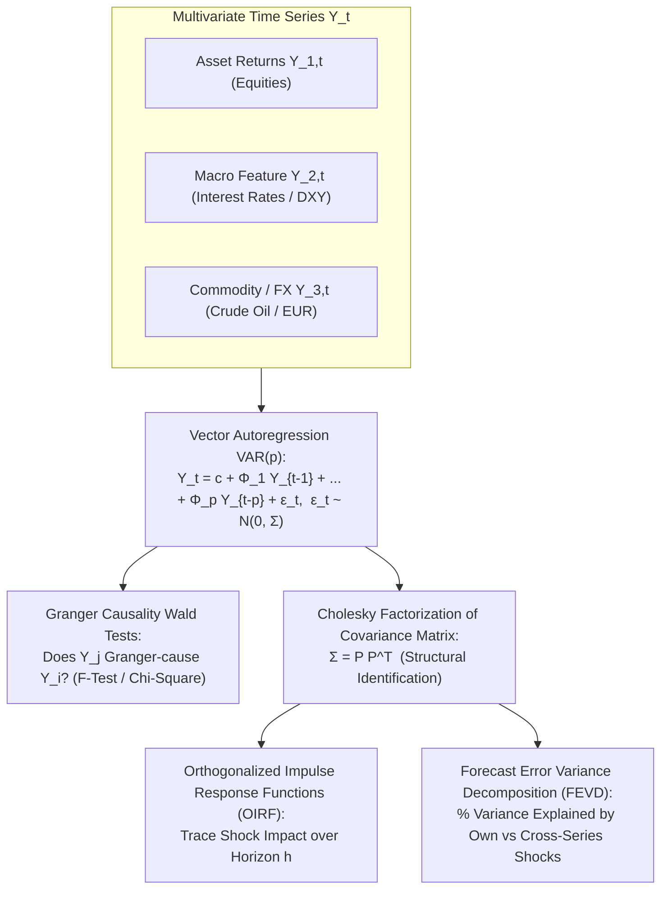
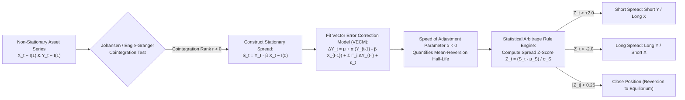

# Financial Econometrics & Time Series Analysis (MScFE 630)

This directory contains analytical Jupyter notebooks, datasets, R scripts, lecture notes, and quantitative research frameworks for **Financial Econometrics & Time Series Analysis**. This module provides the mathematical, statistical, and empirical foundations for modeling financial asset dynamics: stationarity, autoregressive moving-average processes (ARMA/ARIMA), conditional heteroskedasticity (ARCH/GARCH/EGARCH), multivariate systems (VAR/SVAR), cointegration (Engle-Granger/Johansen), Vector Error Correction Models (VECM), long-memory processes (ARFIMA), and high-frequency realized volatility.

---

## 📚 Module Overview

- **Course Code**: MScFE 630
- **Primary Focus**: Statistical properties of financial returns, weak vs strict stationarity, Box-Jenkins time series methodology, volatility clustering and asymmetric leverage, multivariate macroeconomic/asset interactions, cointegration-based statistical arbitrage pairs trading, structural break detection, and intraday realized volatility.
- **Key Stack & Tools**: Python (`statsmodels`, `arch`, `scipy`, `pandas`, `numpy`, `matplotlib`), R (tseries, rugarch, vars), Augmented Dickey-Fuller (ADF) & KPSS tests, Johansen eigenvalue rank tests, Maximum Likelihood Estimation (MLE), Quasi-MLE (QMLE).

---

## 📊 Visual Frameworks & Architecture

### 1. Box-Jenkins ARIMA Model Identification & Diagnostic Lifecycle

### 2. GARCH & Asymmetric Volatility Modeling Pipeline

### 3. Multivariate VAR & Structural Transmission System

### 4. Cointegration & VECM Statistical Arbitrage Pairs Trading Engine

---

## 📖 Sub-Module & Detailed File Breakdown

### [Module 1: Foundations of Financial Time Series](./M1)
- **Lessons & Core Topics**:
  - [`M1/financial_econometrics_module_1_lesson_1.ipynb`](./M1/financial_econometrics_module_1_lesson_1.ipynb) & [`M1/L1-reading.pdf`](./M1/L1-reading.pdf): **Statistical Properties of Returns**.
    - Continuously compounded log returns $r_t = \ln(P_t / P_{t-1}) = \ln P_t - \ln P_{t-1}$.
    - Empirical distributions: Excess Kurtosis $\kappa = \frac{\mathbb{E}[(r - \mu)^4]}{\sigma^4} - 3 > 0$ (leptokurtosis / fat tails) and negative skewness $S = \frac{\mathbb{E}[(r - \mu)^3]}{\sigma^3} < 0$.
    - Jarque-Bera normality test statistic: $\text{JB} = \frac{N}{6}\left(S^2 + \frac{(\kappa)^2}{4}\right) \sim \chi^2(2)$.
  - [`M1/financial_econometrics_module_1_lesson_2.ipynb`](./M1/financial_econometrics_module_1_lesson_2.ipynb) & [`M1/L2.pdf`](./M1/L2.pdf): **Stationarity & Ergodicity**.
    - Strict stationarity (joint distribution invariant under time shift) vs. Weak (Covariance) stationarity:
      $$\mathbb{E}[y_t] = \mu, \quad \text{Var}(y_t) = \gamma_0 < \infty, \quad \text{Cov}(y_t, y_{t-k}) = \gamma_k \quad \forall t, k$$
  - [`M1/financial_econometrics_module_1_lesson_3.ipynb`](./M1/financial_econometrics_module_1_lesson_3.ipynb) & [`M1/L3-reading.pdf`](./M1/L3-reading.pdf): **Autocorrelation & White Noise Diagnostics**.
    - Sample Autocorrelation Function (ACF) $\hat{\rho}_k = \frac{\sum_{t=k+1}^T (y_t - \bar{y})(y_{t-k} - \bar{y})}{\sum_{t=1}^T (y_t - \bar{y})^2}$.
    - Partial Autocorrelation Function (PACF) via Yule-Walker equations.
    - Ljung-Box Portmanteau test for joint serial correlation up to lag $m$:
      $$Q(m) = T(T+2) \sum_{k=1}^m \frac{\hat{\rho}_k^2}{T-k} \sim \chi^2(m)$$
  - [`M1/financial_econometrics_module_1_lesson_4.ipynb`](./M1/financial_econometrics_module_1_lesson_4.ipynb) & [`M1/L4-reading.pdf`](./M1/L4-reading.pdf): **Unit Root Testing**.
    - Augmented Dickey-Fuller (ADF) regression testing $H_0: \gamma = 0$ (unit root $I(1)$):
      $$\Delta y_t = \alpha + \beta t + \gamma y_{t-1} + \sum_{i=1}^p \delta_i \Delta y_{t-i} + \epsilon_t$$
    - KPSS test with stationary null $H_0: y_t \sim I(0)$ to resolve borderline persistence cases.

---

### [Module 2: Univariate Time Series Models (ARMA / ARIMA)](./M2)
- **Lessons & Core Topics**:
  - [`M2/financial_econometrics_module_2_lesson_1.ipynb`](./M2/financial_econometrics_module_2_lesson_1.ipynb) & [`M2/L1-reading.pdf`](./M2/L1-reading.pdf): **Autoregressive Models (AR)**.
    - $\text{AR}(p)$: $y_t = c + \phi_1 y_{t-1} + \dots + \phi_p y_{t-p} + \epsilon_t$.
    - Stationarity condition: All roots of characteristic polynomial $\Phi(z) = 1 - \sum_{i=1}^p \phi_i z^i = 0$ lie outside the complex unit circle ($|z| > 1$).
  - [`M2/financial_econometrics_module_2_lesson_2.ipynb`](./M2/financial_econometrics_module_2_lesson_2.ipynb) & [`M2/L2-reading.pdf`](./M2/L2-reading.pdf): **Moving Average Models (MA)**.
    - $\text{MA}(q)$: $y_t = \mu + \epsilon_t + \theta_1 \epsilon_{t-1} + \dots + \theta_q \epsilon_{t-q}$.
    - Invertibility condition: All roots of $\Theta(z) = 1 + \sum_{j=1}^q \theta_j z^j = 0$ lie outside the unit circle ($|z| > 1$).
  - [`M2/financial_econometrics_module_2_lesson_3.ipynb`](./M2/financial_econometrics_module_2_lesson_3.ipynb) & [`M2/L3-reading.pdf`](./M2/L3-reading.pdf): **ARMA & ARIMA Model Identification**.
    - General $\text{ARIMA}(p,d,q)$ form: $\Phi(L) (1-L)^d y_t = c + \Theta(L) \epsilon_t$.
    - Box-Jenkins pattern matching: ACF cuts off at lag $q$ for MA, PACF cuts off at lag $p$ for AR.
  - [`M2/financial_econometrics_module_2_lesson_4.ipynb`](./M2/financial_econometrics_module_2_lesson_4.ipynb): **Estimation, Model Selection & Forecasting**.
    - Maximum Likelihood Estimation (MLE) and Conditional Sum of Squares (CSS).
    - Information Criteria penalizing model complexity:
      $$\text{AIC} = 2k - 2\ln(\hat{L}), \quad \text{BIC} = k\ln(T) - 2\ln(\hat{L})$$
    - Optimal minimum mean-squared error multi-step forecasts $\hat{y}_{t+h|t} = \mathbb{E}[y_{t+h} \mid \mathcal{F}_t]$.
- **Dataset**: [`M2/M2. module_2_data.csv`](./M2/M2.%20module_2_data.csv).

---

### [Module 3: Conditional Heteroskedasticity & Volatility (ARCH / GARCH)](./M3)
- **Lessons & Core Topics**:
  - [`M3/financial_econometrics_module_3_lesson_1.ipynb`](./M3/financial_econometrics_module_3_lesson_1.ipynb) & [`M3/L1-reading.pdf`](./M3/L1-reading.pdf): **Stylized Facts of Volatility**.
    - Volatility clustering (Mandelbrot: "large changes tend to be followed by large changes"), thick-tailed innovation distributions, mean-reversion.
  - [`M3/financial_econometrics_module_3_lesson_2.ipynb`](./M3/financial_econometrics_module_3_lesson_2.ipynb) & [`M3/Module 3 Lesson 2 R code.R`](./M3/Module%203%20Lesson%202%20R%20code.R): **Autoregressive Conditional Heteroskedasticity (ARCH)**.
    - $\text{ARCH}(q)$ model (*Engle, 1982*):
      $$r_t = \mu + \epsilon_t, \quad \epsilon_t = \sigma_t z_t, \quad z_t \sim \text{i.i.d. } \mathcal{N}(0,1), \quad \sigma_t^2 = \omega + \sum_{i=1}^q \alpha_i \epsilon_{t-i}^2$$
    - Engle ARCH-LM test for autoregressive conditional variance.
  - [`M3/financial_econometrics_module_3_lesson_3.ipynb`](./M3/financial_econometrics_module_3_lesson_3.ipynb) & [`M3/L3-reading.pdf`](./M3/L3-reading.pdf): **Generalized ARCH (GARCH)**.
    - $\text{GARCH}(p,q)$ model (*Bollerslev, 1986*):
      $$\sigma_t^2 = \omega + \sum_{i=1}^q \alpha_i \epsilon_{t-i}^2 + \sum_{j=1}^p \beta_j \sigma_{t-j}^2$$
    - Covariance stationarity constraint: $\sum_{i=1}^q \alpha_i + \sum_{j=1}^p \beta_j < 1$.
    - Unconditional long-run variance: $\bar{\sigma}^2 = \frac{\omega}{1 - \sum \alpha_i - \sum \beta_j}$.
    - Half-life of volatility shock: $\tau_{1/2} = \frac{\ln(0.5)}{\ln(\alpha + \beta)}$.
  - [`M3/financial_econometrics_module_3_lesson_4.ipynb`](./M3/financial_econometrics_module_3_lesson_4.ipynb) & [`M3/L4-reading.pdf`](./M3/L4-reading.pdf): **Asymmetric Volatility Models**.
    - **Exponential GARCH (EGARCH)** (*Nelson, 1991*): No non-negativity parameter constraints; captures leverage effect:
      $$\ln(\sigma_t^2) = \omega + \beta \ln(\sigma_{t-1}^2) + \alpha \left|\frac{\epsilon_{t-1}}{\sigma_{t-1}}\right| + \gamma \frac{\epsilon_{t-1}}{\sigma_{t-1}}$$
    - **GJR-GARCH / TGARCH** (*Glosten, Jagannathan, & Runkle, 1993*):
      $$\sigma_t^2 = \omega + \left(\alpha + \gamma \mathbb{I}_{\{\epsilon_{t-1} < 0\}}\right) \epsilon_{t-1}^2 + \beta \sigma_{t-1}^2$$
- **Dataset**: [`M3/M3. bond_and_stock_data.csv`](./M3/M3.%20bond_and_stock_data.csv).

---

### [Module 4: Multivariate Time Series Analysis (VAR / SVAR)](./M4)
- **Lessons & Core Topics**:
  - [`M4/financial_econometrics_module_4_lesson_1.ipynb`](./M4/financial_econometrics_module_4_lesson_1.ipynb) & [`M4/L1-reading.pdf`](./M4/L1-reading.pdf): **Vector Autoregression (VAR)**.
    - System of $k$ endogenous variables:
      $$\mathbf{Y}_t = \mathbf{c} + \mathbf{\Phi}_1 \mathbf{Y}_{t-1} + \dots + \mathbf{\Phi}_p \mathbf{Y}_{t-p} + \boldsymbol{\epsilon}_t, \quad \boldsymbol{\epsilon}_t \sim \text{i.i.d. } \mathcal{N}(\mathbf{0}, \mathbf{\Sigma}_\epsilon)$$
    - Stability condition: $\det(\mathbf{I}_k - \sum_{i=1}^p \mathbf{\Phi}_i z^i) \neq 0$ for all $|z| \le 1$.
  - [`M4/financial_econometrics_module_4_lesson_2.ipynb`](./M4/financial_econometrics_module_4_lesson_2.ipynb): **Granger Causality**.
    - Testing if past values of variable $j$ contain information that helps predict variable $i$ beyond past values of $i$ alone: $H_0: \Phi_{ij, 1} = \Phi_{ij, 2} = \dots = \Phi_{ij, p} = 0$ via Wald / Likelihood-Ratio test.
  - [`M4/financial_econometrics_module_4_lesson_3.ipynb`](./M4/financial_econometrics_module_4_lesson_3.ipynb) & [`M4/L3-reading.pdf`](./M4/L3-reading.pdf): **Impulse Response Functions (IRF)**.
    - Wold moving average representation: $\mathbf{Y}_t = \boldsymbol{\mu} + \sum_{s=0}^\infty \mathbf{\Psi}_s \boldsymbol{\epsilon}_{t-s}$.
    - Orthogonalized Impulse Response Functions (OIRF) using lower-triangular Cholesky factor $\mathbf{P}$ where $\mathbf{\Sigma}_\epsilon = \mathbf{P}\mathbf{P}^T$.
  - [`M4/financial_econometrics_module_4_lesson_4.ipynb`](./M4/financial_econometrics_module_4_lesson_4.ipynb) & [`M4/L4-reading.pdf`](./M4/L4-reading.pdf): **Forecast Error Variance Decomposition (FEVD)**.
    - Quantifying the percentage of the $h$-step-ahead forecast error variance of variable $i$ attributable to exogenous shocks from variable $j$.
- **Datasets**: [`M4/M4. dxy_r_data.csv`](./M4/M4.%20dxy_r_data.csv), [`M4/M4. goog_eur_10.csv`](./M4/M4.%20goog_eur_10.csv).

---

### [Module 5: Cointegration & Pairs Trading (VECM)](./M5)
- **Lessons & Core Topics**:
  - [`M5/financial_econometrics_module_5_lesson_1.ipynb`](./M5/financial_econometrics_module_5_lesson_1.ipynb) & [`M5/L1-reading.pdf`](./M5/L1-reading.pdf): **Spurious Regression**.
    - Regressing independent random walks $Y_t \sim I(1)$ on $X_t \sim I(1)$ produces inflated $R^2 \to 1$, significant $t$-statistics ($t \to \infty$), and Durbin-Watson statistic $DW \to 0$.
  - [`M5/financial_econometrics_module_5_lesson_2.ipynb`](./M5/financial_econometrics_module_5_lesson_2.ipynb): **Engle-Granger Two-Step Cointegration**.
    - Step 1: Estimate static OLS $Y_t = \alpha + \beta X_t + e_t$.
    - Step 2: Test residuals $\hat{e}_t$ for stationarity using ADF test with MacKinnon non-standard critical values.
    - If $\hat{e}_t \sim I(0)$, series $X_t$ and $Y_t$ are cointegrated with cointegrating vector $[1, -\beta]^T$.
  - [`M5/financial_econometrics_module_5_lesson_3.ipynb`](./M5/financial_econometrics_module_5_lesson_3.ipynb) & [`M5/L3-reading.pdf`](./M5/L3-reading.pdf) & [`M5/L4-reading.pdf`](./M5/L4-reading.pdf): **Johansen Test & Vector Error Correction Models (VECM)**.
    - Johansen Maximum Likelihood procedure for $k$-dimensional systems:
      $$\Delta \mathbf{Y}_t = \boldsymbol{\mu} + \mathbf{\Pi} \mathbf{Y}_{t-1} + \sum_{i=1}^{p-1} \mathbf{\Gamma}_i \Delta \mathbf{Y}_{t-i} + \boldsymbol{\epsilon}_t$$
    - Matrix rank factorization: $\mathbf{\Pi} = \boldsymbol{\alpha} \boldsymbol{\beta}^T$, where $\boldsymbol{\beta} \in \mathbb{R}^{k \times r}$ are cointegrating vectors and $\boldsymbol{\alpha} \in \mathbb{R}^{k \times r}$ are error-correction adjustment speeds.
    - Rank tests: Trace Statistic $\lambda_{\text{trace}}(r) = -T \sum_{i=r+1}^k \ln(1 - \hat{\lambda}_i)$ and Maximum Eigenvalue Statistic $\lambda_{\max}(r, r+1) = -T \ln(1 - \hat{\lambda}_{r+1})$.

---

### [Module 6: Advanced Econometric Topics](./M6)
- **Lessons & Core Topics**:
  - [`M6/financial_econometrics_module_6_lesson_1.ipynb`](./M6/financial_econometrics_module_6_lesson_1.ipynb): **Long Memory & Fractional Differencing (ARFIMA)**.
    - $\text{ARFIMA}(p,d,q)$ with fractional integration parameter $d \in (-0.5, 0.5)$:
      $$(1 - L)^d = \sum_{k=0}^\infty \frac{\Gamma(k - d)}{\Gamma(-d)\Gamma(k + 1)} L^k = 1 - dL - \frac{d(1-d)}{2!}L^2 - \dots$$
    - For $0 < d < 0.5$, autocorrelation exhibits hyperbolic power-law decay $\rho_k \propto k^{2d-1}$, preserving memory while maintaining stationarity.
  - [`M6/financial_econometrics_module_6_lesson_2.ipynb`](./M6/financial_econometrics_module_6_lesson_2.ipynb) & [`M6/L2-reading.pdf`](./M6/L2-reading.pdf): **Structural Breaks & Regime Instability**.
    - Chow test for known structural breakpoint date $\tau$: $F = \frac{(SSR_P - (SSR_1 + SSR_2)) / k}{(SSR_1 + SSR_2) / (T - 2k)}$.
    - Quandt Likelihood Ratio (QLR) sup-Wald test across unknown candidate break dates $\tau \in [0.15T, 0.85T]$.
  - [`M6/financial_econometrics_module_6_lesson_3.ipynb`](./M6/financial_econometrics_module_6_lesson_3.ipynb) & [`M6/L3-reading.pdf`](./M6/L3-reading.pdf) & [`M6/L4-reading.pdf`](./M6/L4-reading.pdf): **High-Frequency Realized Volatility**.
    - Non-parametric intraday realized volatility estimator:
      $$RV_t = \sum_{i=1}^M r_{t, i}^2 \xrightarrow{M \to \infty} \int_0^1 \sigma_t^2(s) ds + \text{Jump Component}$$
    - Microstructure noise filtering (bid-ask bounce) via optimal 5-minute sampling grids.
- **Datasets**: [`M6/M6. forex_1.csv`](./M6/M6.%20forex_1.csv), [`M6/M6. goog_eur_10.csv`](./M6/M6.%20goog_eur_10.csv).

---

## 🔑 Key Takeaways & Econometric Insights

1. **Non-Stationarity of Asset Prices**: Asset prices exhibit unit roots ($I(1)$); computing regressions on raw prices leads to spurious statistical significance. Log returns $r_t \sim I(0)$ are required for unbiased inference.
2. **Volatility Clustering & Persistence**: Financial return volatility is strongly autocorrelated. GARCH persistence ($\alpha + \beta$) is frequently near $0.98$ in daily equities, implying that market shocks take weeks to mean-revert.
3. **Asymmetric Leverage Feedback**: Negative return shocks increase corporate leverage and perceived risk, driving a larger volatility spike than positive shocks of identical magnitude ($\gamma > 0$ in EGARCH/GJR-GARCH).
4. **Cointegration Means Economic Equilibrium**: Cointegrated price series share common stochastic trends. Even when individual assets wander non-stationarily, their linear spread $S_t = Y_t - \beta X_t$ is mean-reverting, forming the foundation of statistical arbitrage pairs trading.
5. **Fractional Differencing Preserves Memory**: Traditional integer differencing ($d=1$) removes non-stationarity but erases long-range predictive memory. Fractional differencing ($0 < d < 0.5$) achieves stationarity while maximizing memory retention.

---

## 🔗 Cross-Module Knowledge Linkages

- **$\to$ [03_stochastic_modelling](../03_stochastic_modelling/README.md)**: Discrete-time GARCH volatility models represent the discrete limits of continuous-time Heston stochastic volatility SDEs.
- **$\to$ [05_portfolio_management](../05_portfolio_management/README.md)**: Dynamic conditional covariance matrices $\mathbf{\Sigma}_t$ estimated via Multivariate GARCH (DCC-GARCH) feed directly into Black-Litterman and Markowitz optimizers.
- **$\to$ [07_machine_learning](../07_machine_learning/README.md)**: Fractional differencing ($d$) and stationary econometric features serve as purified, leakage-free tabular inputs ($X$) for tree ensembles and cross-validation pipelines.
- **$\to$ [08_deep_learning](../08_deep_learning/README.md)**: Econometric ARIMA/VAR models provide baseline benchmark metrics against which LSTM, CNN-GAF, and Transformer architectures are evaluated.
