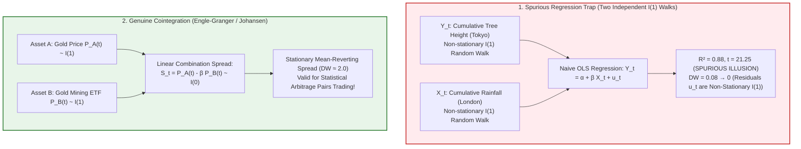
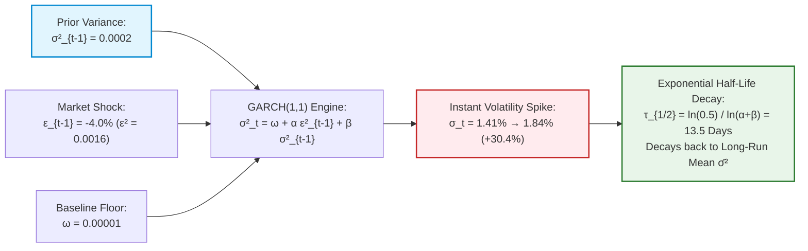
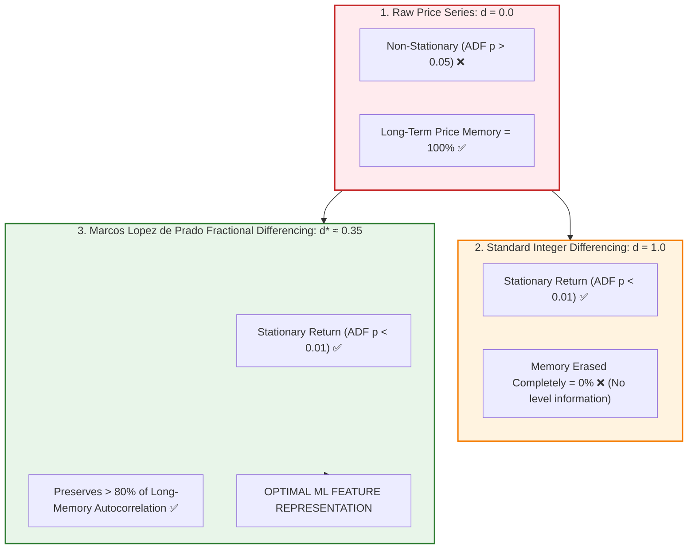
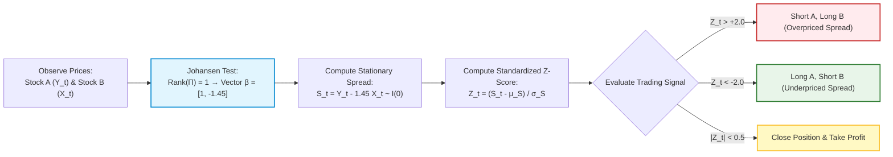

# Financial Econometrics & Time Series Analysis — Key Pedagogical Takeaways
## MScFE 630 Master Quantitative Synthesis

[← Back to Main README.md](./README.md)

---

## 📖 Table of Contents & Quick Module Links
1. [Core Intuition & Mechanical Failure Modes](#1-core-intuition--mechanical-failure-modes)
   - [Toy Example 1: Spurious Regression & Non-Stationary Unit Roots](#toy-example-1-spurious-regression--non-stationary-unit-roots)
   - [Toy Example 2: Homoskedasticity Assumptions vs Volatility Clustering](#toy-example-2-homoskedasticity-assumptions-vs-volatility-clustering)
   - [Toy Example 3: Integer Differencing vs Fractional Differencing](#toy-example-3-integer-differencing-vs-fractional-differencing)
2. [Core Mathematical Formulations & Calculus Derivations](#2-core-mathematical-formulations--calculus-derivations)
   - [1. ARIMA(p,d,q) Characteristic Polynomial Roots](#1-arimapdq-characteristic-polynomial-roots)
   - [2. GARCH(1,1) Variance Half-Life Calculus](#2-garch11-variance-half-life-calculus)
   - [3. EGARCH Asymmetric Leverage Derivation](#3-egarch-asymmetric-leverage-derivation)
   - [4. Johansen VECM Cointegration Vector Decomposition](#4-johansen-vecm-cointegration-vector-decomposition)
3. [Practical Engineering & Cointegrated Statistical Arbitrage](#3-practical-engineering--cointegrated-statistical-arbitrage)
4. [Comparative Synthesis Cheat Sheet](#4-comparative-synthesis-cheat-sheet)
5. [Comprehensive Mathematical Notation & Variable Glossary](#5-comprehensive-mathematical-notation--variable-glossary)

---

## 1. Core Intuition & Mechanical Failure Modes

### Toy Example 1: Spurious Regression & Non-Stationary Unit Roots

#### 💡 The Intuitive Metaphor (Easiest to Understand)
Suppose you record the cumulative height of a growing tree in Tokyo ($Y_t$) and the cumulative rainfall in London ($X_t$) over 10 years. Both numbers strictly increase over time. If you run a naive regression between them, your model will report a $99\%$ $R^2$ and claim London rain causes Tokyo tree growth! 
In econometrics, regressing two independent $I(1)$ random walks creates **Spurious Regression**—a false statistical illusion caused by shared non-stationary drift.

#### 🏷️ Notation Breakdown:
- $Y_t, X_t$: **Independent Integrated Series of Order 1 ($I(1)$)** ($Y_t = Y_{t-1} + \epsilon_t, X_t = X_{t-1} + \eta_t$).
- $\epsilon_t, \eta_t \sim \text{i.i.d. } \mathcal{N}(0, 1)$: **Uncorrelated White Noise Innovations**.
- $\hat{\beta}$: **Estimated OLS Regression Slope** in $Y_t = \alpha + \beta X_t + u_t$.
- $\text{SE}(\hat{\beta})$: **Standard Error of the Slope Estimate** (Artificially shrinks towards 0 as $N \to \infty$).
- $t$: **t-Statistic** ($t = \hat{\beta} / \text{SE}(\hat{\beta})$ diverges to $\pm \infty$ at rate $\mathcal{O}(\sqrt{N})$).
- $R^2$: **Coefficient of Determination** (Spuriously approaches $1.0$).
- $DW$: **Durbin-Watson Statistic** ($DW = \frac{\sum (\hat{u}_t - \hat{u}_{t-1})^2}{\sum \hat{u}_t^2} \to 0$, signaling severe unit-root residuals).
- $L$: **Lag Operator** ($L^k Y_t = Y_{t-k}$, $(1-L) Y_t = \Delta Y_t$).

#### 🔢 Step-by-Step Numerical Calculation
- Series $Y_t = Y_{t-1} + \epsilon_t, \quad X_t = X_{t-1} + \eta_t, \quad \epsilon_t, \eta_t \sim \text{i.i.d. } \mathcal{N}(0, 1)$.
- Regressing $Y_t = \alpha + \beta X_t + u_t$ over $N = 1,000$ steps:
  - Estimated Slope: $\hat{\beta} = +0.85$
  - Standard Error: $\text{SE}(\hat{\beta}) = 0.04$
  - **t-statistic**: $t = \frac{0.85}{0.04} = 21.25 \implies p\text{-value} = 0.0000000000$
  - **$R^2$**: $0.88$ (Illusion of perfection!)
  - **Durbin-Watson Statistic**: $DW = 0.08 \ll 2.0$ (Severe residual autocorrelation!)

Because $DW \to 0$ as $N \to \infty$, standard OLS distribution theory breaks down entirely. The true slope is $\beta = 0$, but naive OLS rejects the true null hypothesis.

#### 📊 Visual Spurious Regression vs Cointegrated Stationary Spread:

#### 📐 Calculus & Unit Root Proof
Let $L$ be the lag operator ($L Y_t = Y_{t-1}$). A process has a unit root if $(1 - L) Y_t = \epsilon_t$.
- Variance grows unbounded over time: $\text{Var}(Y_t) = t \sigma_\epsilon^2 \xrightarrow{t \to \infty} \infty$.
- The asymptotic distribution of $\hat{\beta}$ does not follow Student-t, but rather a ratio of Wiener integrals:

$$\hat{\beta} \xrightarrow{d} \frac{\int_0^1 W_Y(r) W_X(r) dr}{\int_0^1 W_X(r)^2 dr}$$

Because the denominator does not collapse to a constant, $t$-statistics diverge to $\pm \infty$ at rate $\mathcal{O}(\sqrt{N})$.

---

### Toy Example 2: Homoskedasticity Assumptions vs Volatility Clustering

#### 💡 The Intuitive Metaphor (Easiest to Understand)
Assuming constant volatility in financial markets is like building a dam designed only for average sunny-day water levels. When a sudden storm hits, the dam breaks. **GARCH models** update their wall height dynamically based on yesterday's rain and storm intensity.

#### 🏷️ Notation Breakdown:
- $\sigma_t^2$: **Conditional Variance at time $t$** (Given all historical return information $\mathcal{F}_{t-1}$).
- $\omega$: **Baseline Variance Constant** ($\omega > 0$).
- $\alpha$: **ARCH Parameter / Shock Sensitivity** (Weight given to yesterday's squared innovation $\epsilon_{t-1}^2$).
- $\beta$: **GARCH Parameter / Volatility Persistence** (Weight given to yesterday's conditional variance $\sigma_{t-1}^2$).
- $\epsilon_t$: **Residual Return Innovation** ($\epsilon_t = r_t - \mu = \sigma_t z_t$ where $z_t \sim \text{i.i.d. } \mathcal{N}(0, 1)$).
- $\alpha + \beta < 1$: **Covariance Stationarity Condition** (Ensures finite unconditional variance).
- $\tau_{1/2}$: **Volatility Half-Life** ($\tau_{1/2} = \frac{\ln(0.5)}{\ln(\alpha + \beta)}$).

#### 🔢 Step-by-Step Calculation (GARCH(1,1) Volatility Update)
- Parameters: $\omega = 0.00001$, $\alpha = 0.10$ (shock sensitivity), $\beta = 0.85$ (persistence).
- Yesterday's variance: $\sigma_{t-1}^2 = 0.0002$ (daily volatility $= 1.41\%$).
- Yesterday's market crash shock: $\epsilon_{t-1} = -0.04$ (a $-4\%$ market drop).

**Updating Today's Variance $\sigma_t^2$**:

$$\sigma_t^2 = \omega + \alpha \epsilon_{t-1}^2 + \beta \sigma_{t-1}^2 = 0.00001 + 0.10 \times (-0.04)^2 + 0.85 \times (0.0002)$$

$$\sigma_t^2 = 0.00001 + 0.10 \times 0.0016 + 0.00017 = 0.00001 + 0.00016 + 0.00017 = 0.00034$$

$$\text{Today's Updated Daily Volatility:} \quad \sigma_t = \sqrt{0.00034} = 1.8439\% \quad (\text{a } +30.4\% \text{ volatility spike!})$$

#### 📊 Visual GARCH Updating & Half-Life Decay Dynamics:

---

### Toy Example 3: Integer Differencing vs Fractional Differencing

#### 💡 The Intuitive Metaphor (Easiest to Understand)
Integer differencing ($d=1$) is like using a sledgehammer to remove noise—you smash away all long-term memory of past price levels. **Fractional Differencing ($d=0.35$)** is like using a fine scalpel: it removes just enough non-stationary trend to satisfy stationarity while preserving memory.

#### 🏷️ Notation Breakdown:
- $d$: **Fractional Integration / Differencing Order** ($d \in (-0.5, 0.5)$).
- $(1 - L)^d$: **Fractional Differencing Operator** (Infinite binomial polynomial expansion).
- $w_k$: **Memory Weight on Lag $k$** ($w_k = -w_{k-1} \frac{d - k + 1}{k}$, exhibiting hyperbolic power-law decay).

#### 🔢 Step-by-Step Expansion Calculation
Binomial expansion of $(1-L)^{0.35}$ for weights $w_k$:

$$w_0 = 1.0, \quad w_1 = -d = -0.35, \quad w_2 = \frac{d(1-d)}{2!} = \frac{0.35(0.65)}{2} = +0.11375$$

$$w_3 = -\frac{d(1-d)(2-d)}{3!} = -\frac{0.35 \times 0.65 \times 1.65}{6} = -0.06256$$

#### 📊 Visual Stationarity vs Memory Preservation Trade-Off:

---

## 2. Core Mathematical Formulations & Calculus Derivations

### 1. ARIMA(p,d,q) Characteristic Polynomial Roots
$\Phi(L) = 1 - \phi_1 L - \dots - \phi_p L^p = 0$. Stationary requires all roots to lie strictly outside the complex unit circle $|z| > 1$.

---

### 2. GARCH(1,1) Variance Half-Life Calculus

$$\text{Long-Run Variance:} \quad \bar{\sigma}^2 = \frac{\omega}{1 - \alpha - \beta}$$

Taking expected value $k$ steps ahead: $\mathbb{E}[\sigma_{t+k}^2] - \bar{\sigma}^2 = (\alpha + \beta)^k (\sigma_t^2 - \bar{\sigma}^2)$.
Setting deviation to half ($0.50$):

$$\tau_{1/2} = \frac{\ln(0.5)}{\ln(\alpha + \beta)}$$

For $\alpha + \beta = 0.95$: $\tau_{1/2} = \frac{-0.69315}{\ln(0.95)} = \frac{-0.69315}{-0.05129} \approx 13.5 \text{ trading days}$.

---

### 3. EGARCH Asymmetric Leverage Derivation

$$\ln(\sigma_t^2) = \omega + \beta \ln(\sigma_{t-1}^2) + \alpha |z_{t-1}| + \gamma z_{t-1}$$

Taking derivative with respect to standardized innovation $z_{t-1}$:

$$\frac{\partial \ln \sigma_t^2}{\partial z_{t-1}} = \begin{cases} \alpha + \gamma & \text{if } z_{t-1} > 0 \text{ (Good News)} \\ -\alpha + \gamma & \text{if } z_{t-1} < 0 \text{ (Bad News)} \end{cases}$$

If $\gamma < 0$, negative return shocks increase log-volatility far more than positive shocks of identical size.

---

### 4. Johansen VECM Cointegration Vector Decomposition

$$\Delta \mathbf{Y}_t = \boldsymbol{\mu} + \mathbf{\Pi} \mathbf{Y}_{t-1} + \sum_{i=1}^{p-1} \mathbf{\Gamma}_i \Delta \mathbf{Y}_{t-i} + \boldsymbol{\epsilon}_t, \quad \mathbf{\Pi} = \boldsymbol{\alpha} \boldsymbol{\beta}^T$$

---

## 3. Practical Engineering & Cointegrated Statistical Arbitrage

### Pairs Trading Execution Loop
1. Johansen Rank test $\to \text{Rank}(\mathbf{\Pi}) = 1$. Cointegrating vector $\boldsymbol{\beta} = [1, -1.45]^T$.
2. Residual spread $S_t = Y_t - 1.45 X_t$.
3. Compute $Z_t = \frac{S_t - \mu_S}{\sigma_S}$. Enter when $|Z_t| > 2.0$.

#### 📊 Visual Pairs Trading Cointegration Lifecycle:

---

## 4. Comparative Synthesis Cheat Sheet

| Model / Framework | Primary Mathematical Identity | Target Volatility / Mean Dynamics | Key Stationarity Constraint | Primary Failure Mode |
| :--- | :--- | :--- | :--- | :--- |
| **ARIMA(p,d,q)** | $\Phi(L)(1-L)^d y_t = \Theta(L)\epsilon_t$ | Stationary mean forecasting | Roots outside unit circle | Assumes constant variance |
| **GARCH(1,1)** | $\sigma_t^2 = \omega + \alpha \epsilon_{t-1}^2 + \beta \sigma_{t-1}^2$ | Symmetric volatility clustering | $\alpha + \beta < 1$ | Blind to negative leverage effect |
| **EGARCH(1,1)** | $\ln \sigma_t^2 = \omega + \beta \ln \sigma_{t-1}^2 + \alpha|z| + \gamma z$ | Asymmetric leverage volatility | Unconstrained ($\ln \sigma^2 > 0$) | Optimization convergence sensitivity |
| **VECM Cointegration** | $\Delta \mathbf{Y}_t = \boldsymbol{\mu} + \boldsymbol{\alpha}\boldsymbol{\beta}^T \mathbf{Y}_{t-1} + \dots$ | Multivariable equilibrium spread | Spread $\boldsymbol{\beta}^T \mathbf{Y}_t \sim I(0)$ | Structural break in spread vector $\boldsymbol{\beta}$ |

---

## 5. Comprehensive Mathematical Notation & Variable Glossary

### 📐 Master Variable Reference Table

| Symbol | Mathematical / Economic Meaning | Typical Range / Units | Context & Core Formula |
| :--- | :--- | :--- | :--- |
| **$Y_t, X_t$** | Observed Time Series / Endogenous Variables at time $t$ | Price / Index / Level | Spurious regression & cointegration |
| **$r_t$** | Continuously Compounded Log Return | Percentage ($0.01 = 1\%$) | $r_t = \ln(P_t / P_{t-1}) \sim I(0)$ |
| **$L$** | Lag Operator | Algebraic operator | $L^k y_t = y_{t-k}, \ (1-L)y_t = \Delta y_t$ |
| **$\epsilon_t, \eta_t, u_t$** | White Noise Innovations / Residual Error Shocks | $\mathcal{N}(0, \sigma^2)$ | Unpredictable stochastic shocks |
| **$\sigma_t^2, \sigma_t$** | Conditional Variance & Daily Conditional Volatility | Variance / $\%$ Volatility | GARCH: $\sigma_t^2 = \omega + \alpha\epsilon_{t-1}^2 + \beta\sigma_{t-1}^2$ |
| **$\omega$** | Baseline Constant Variance in GARCH Models | Positive Real ($\omega > 0$) | Long-run floor for variance |
| **$\alpha, \alpha_i$** | ARCH Coefficient / Volatility Shock Sensitivity | Positive scalar ($[0.05, 0.15]$) | Weight assigned to incoming news shock $\epsilon_{t-1}^2$ |
| **$\beta, \beta_j$** | GARCH Coefficient / Volatility Persistence Parameter | Positive scalar ($[0.80, 0.95]$) | Memory weight on previous conditional variance $\sigma_{t-1}^2$ |
| **$\alpha + \beta$** | Volatility Persistence Sum | Must satisfy $\alpha + \beta < 1$ | Covariance stationarity constraint |
| **$\bar{\sigma}^2$** | Long-Run Unconditional Variance | Variance units | $\bar{\sigma}^2 = \frac{\omega}{1 - \alpha - \beta}$ |
| **$\tau_{1/2}$** | Volatility Shock Half-Life | Trading days (e.g., $13.5\text{ days}$) | $\tau_{1/2} = \frac{\ln(0.5)}{\ln(\alpha + \beta)}$ |
| **$z_t$** | Standardized Return Innovation ($z_t = \epsilon_t / \sigma_t$) | $\text{i.i.d. } \mathcal{N}(0, 1)$ | EGARCH input: $|z_t|$ (magnitude), $z_t$ (sign) |
| **$\gamma$** | Asymmetric Leverage Parameter in EGARCH/GJR-GARCH | Negative in EGARCH ($\gamma < 0$) | Captures higher volatility after market drops |
| **$\Phi(L), \Theta(L)$** | AR and MA Lag Characteristic Polynomials | Polynomials in $L$ | $\Phi(L)y_t = \Theta(L)\epsilon_t$ |
| **$\mathbf{Y}_t, \boldsymbol{\epsilon}_t$** | Vector of $k$ Endogenous Variables & Vector of Residuals | $\mathbb{R}^k$ vectors | Vector Autoregression: $\mathbf{Y}_t = \mathbf{c} + \sum \mathbf{\Phi}_i \mathbf{Y}_{t-i} + \boldsymbol{\epsilon}_t$ |
| **$\mathbf{\Pi} = \boldsymbol{\alpha}\boldsymbol{\beta}^T$** | Johansen Cointegration Matrix Factorization | Matrix $\mathbb{R}^{k \times k}$ | $\boldsymbol{\beta}$ (cointegrating vectors), $\boldsymbol{\alpha}$ (adjustment speed) |
| **$S_t, Z_t$** | Cointegrated Equilibrium Spread & Standardized $Z$-Score | Stationary series $\sim I(0)$ | $S_t = Y_t - \beta X_t, \ Z_t = \frac{S_t - \mu_S}{\sigma_S}$ |
| **$d$** | Fractional Integration Differencing Parameter | Real scalar $(-0.5, 0.5)$ | ARFIMA long memory: $(1-L)^d y_t = \epsilon_t$ |
| **$w_k$** | Fractional Differencing Binomial Lag Weight | Hyperbolic power-law decay | $w_k = -w_{k-1}\frac{d - k + 1}{k}$ |
| **$DW$** | Durbin-Watson Autocorrelation Test Statistic | Range $[0, 4]$ ($DW \approx 2$ for white noise) | $DW \to 0$ in spurious regressions |
| **$\text{JB}$** | Jarque-Bera Normality Test Statistic | Chi-square $\chi^2(2)$ | $\text{JB} = \frac{N}{6}(S^2 + \frac{\kappa^2}{4})$ |
| **$Q(m)$** | Ljung-Box Portmanteau Autocorrelation Statistic | Chi-square $\chi^2(m)$ | Tests joint serial independence up to lag $m$ |
| **$RV_t$** | High-Frequency Realized Volatility | Sum of squared intraday returns | $RV_t = \sum_{i=1}^M r_{t, i}^2$ |ad vector $\boldsymbol{\beta}$ |
