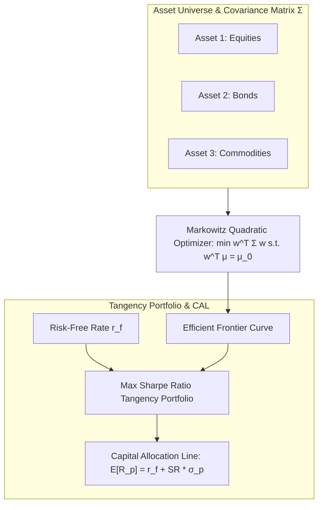
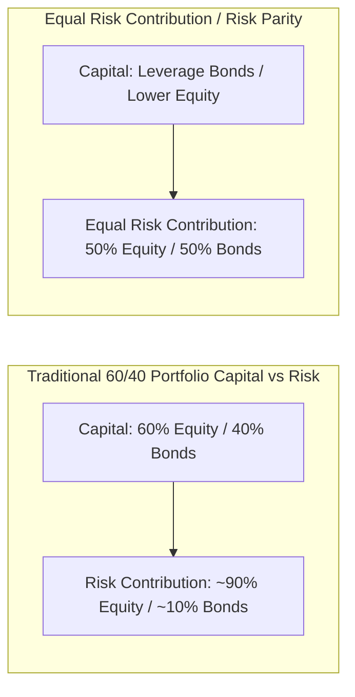

# Portfolio Management & Risk (MScFE 640)

This directory contains lecture notes, readings, and quantitative notes for **Portfolio Management & Risk**. The module covers portfolio construction theory, Markowitz Mean-Variance Optimization, factor pricing models (CAPM, Fama-French), Risk Parity, Value at Risk (VaR), and downside risk metrics.

---

## 📚 Module Overview

- **Course Code**: MScFE 640
- **Primary Focus**: Asset allocation, Mean-Variance Optimization, capital market theory, factor risk modeling, risk budgeting (Risk Parity), and downside risk measurement (VaR / CVaR).
- **Key Tools**: Convex optimization, matrix linear algebra ($\Sigma$), factor regressions, risk decomposition algorithms.

---

## 📊 Visual Frameworks & Architecture

### 1. Markowitz Efficient Frontier & Capital Allocation Line (CAL)

### 2. Risk Parity (Equal Risk Contribution) vs Traditional 60/40 Portfolio

---

## 📖 Sub-Module & Detailed File Breakdown

### [Module 1: Modern Portfolio Theory (MPT) & Markowitz Optimization](./M1)
- **Lessons & Lecture Slides**:
  - [`M1/L1.pdf`](./M1/L1.pdf): Expected returns vector $\boldsymbol{\mu}$, covariance matrix $\mathbf{\Sigma}$, portfolio variance $\sigma_p^2 = \mathbf{w}^T \mathbf{\Sigma} \mathbf{w}$.
  - [`M1/L2.pdf`](./M1/L2.pdf): Markowitz quadratic optimization problem:
    $$\min_{\mathbf{w}} \frac{1}{2} \mathbf{w}^T \mathbf{\Sigma} \mathbf{w} \quad \text{s.t.} \quad \mathbf{w}^T \boldsymbol{\mu} = \mu_0, \quad \mathbf{w}^T \mathbf{1} = 1$$
  - [`M1/L3.pdf`](./M1/L3.pdf): Risk-free asset $r_f$, Capital Allocation Line (CAL), maximizing Sharpe ratio $SR = \frac{\mathbf{w}^T \boldsymbol{\mu} - r_f}{\sqrt{\mathbf{w}^T \mathbf{\Sigma} \mathbf{w}}}$.
  - [`M1/L4.pdf`](./M1/L4.pdf): Sensitivity of Markowitz weights to estimation error ("error maximization"), introducing short-sale constraints ($\mathbf{w} \ge 0$).

---

### [Module 2: Asset Pricing Models & Factor Investing](./M2)
- **Lessons & Research Papers**:
  - [`M2/L1.pdf`](./M2/L1.pdf): Capital Asset Pricing Model (CAPM) equilibrium, market beta $\beta_i = \frac{\text{Cov}(R_i, R_m)}{\text{Var}(R_m)}$, Security Market Line (SML).
  - [`M2/L2.pdf`](./M2/L2.pdf): Total variance decomposition into systematic risk $\beta_i^2 \sigma_m^2$ and idiosyncratic risk $\sigma_{\epsilon, i}^2$.
  - [`M2/L3.pdf`](./M2/L3.pdf): Arbitrage Pricing Theory (APT), Fama-French 3-Factor model (Market, SMB - Size, HML - Value) and 5-Factor expansion.
  - [`M2/L4.pdf`](./M2/L4.pdf) & [`M2/mathematics-09-01668-v2.pdf`](./M2/mathematics-09-01668-v2.pdf): Mathematical paper on matrix formulations of factor covariance structures.

---

### [Module 3: Risk Budgeting, Risk Parity & Downside Risk](./M3)
- **Lessons & Notes**:
  - [`M3/L1.pdf`](./M3/L1.pdf) & [`M3/L1-note.pdf`](./M3/L1-note.pdf): Marginal Contribution to Risk $\text{MCR}_i = \frac{(\mathbf{\Sigma}\mathbf{w})_i}{\sigma_p}$, Risk Contribution $\text{RC}_i = w_i \times \text{MCR}_i$, Equal Risk Contribution (ERC / Risk Parity).
  - [`M3/L2-reading.pdf`](./M3/L2-reading.pdf) & [`M3/L2-note.pdf`](./M3/L2-note.pdf): Value at Risk (VaR) vs Expected Shortfall (CVaR / Tail Loss). Proof of CVaR coherence (subadditivity $\text{CVaR}(X+Y) \le \text{CVaR}(X) + \text{CVaR}(Y)$).
  - **Performance Evaluation**: Sortino Ratio, Information Ratio, Treynor Ratio, Maximum Drawdown (MDD).

---

## 🔑 Key Takeaways & Portfolio Insights

1. **Markowitz Optimization "Error Maximization"**: Unconstrained mean-variance optimization assigns extreme weights to assets with over-estimated expected returns or under-estimated risks. Regularization, Black-Litterman, or minimum variance optimization are required.
2. **Risk Parity vs Capital Allocation**: Mean-variance optimization concentrates risk in equities. Risk Parity equalizes risk contributions across asset classes (equities, bonds, commodities), leveraging low-volatility assets to achieve target return profiles.
3. **Coherent Risk Measures**: Value at Risk (VaR) violates subadditivity under heavy tails. Expected Shortfall (CVaR) is coherent and properly captures tail risk.
4. **Factor Exposure Matters**: Portfolio alpha ($\alpha$) is often misattributed market beta ($\beta$) or exposure to known smart beta factors (Size, Value, Momentum, Quality).

---

## 🔗 Cross-Module Knowledge Linkages

- **$\to$ [07_machine_learning](../07_machine_learning/README.md)**: Hierarchical Risk Parity (HRP) uses unsupervised clustering to solve Markowitz covariance instability.
- **$\to$ [08_deep_learning](../08_deep_learning/README.md)**: Deep Reinforcement Learning (DDPG, PPO) optimizes dynamic asset allocation subject to drawdown constraints.
- **$\to$ [04_financial_econometrics](../04_financial_econometrics/README.md)**: Multivariate GARCH and VAR models supply dynamic, time-varying covariance matrices $\mathbf{\Sigma}_t$.
- **$\to$ [01_financial_market](../01_financial_market/README.md)**: Asset class characteristics dictate return and variance inputs for portfolio construction.
