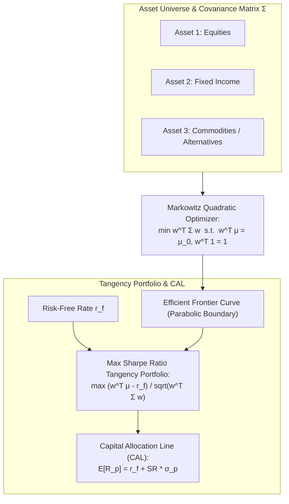
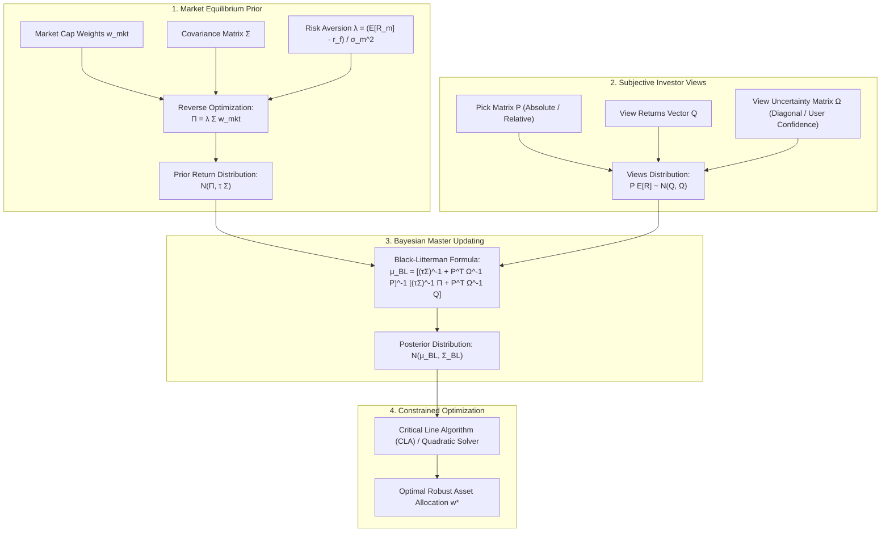
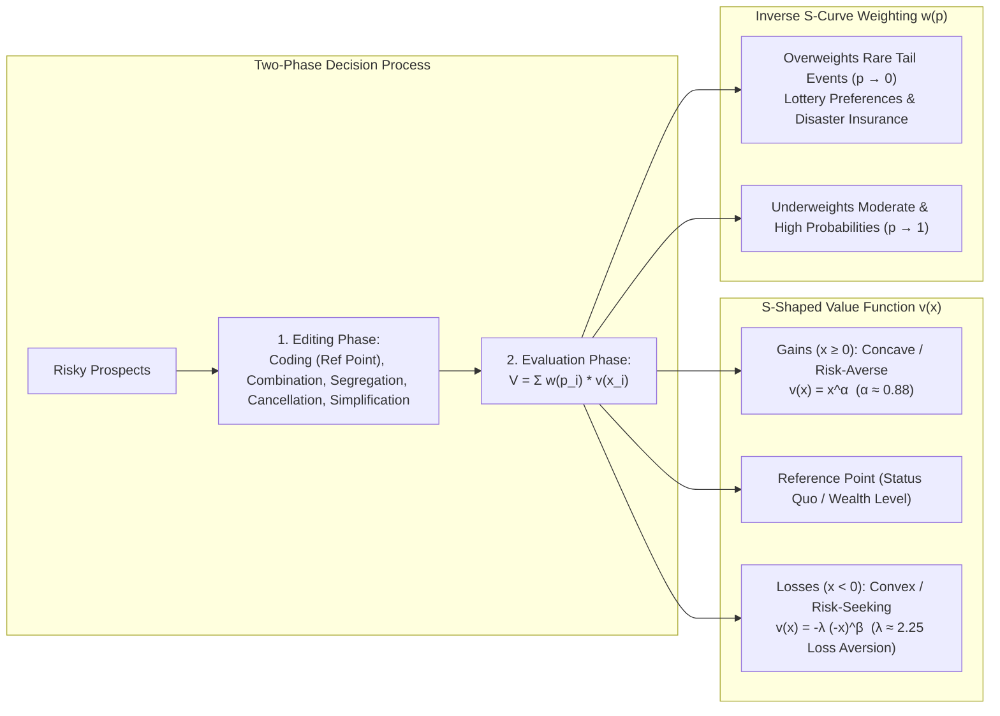
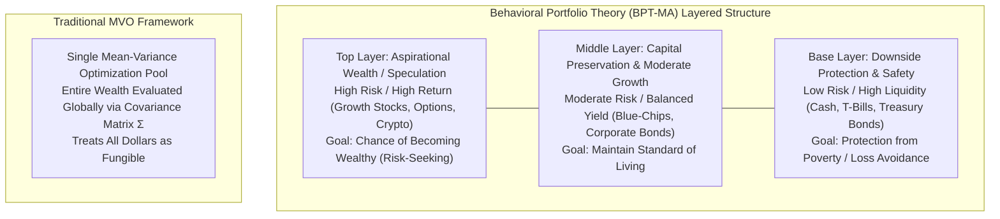
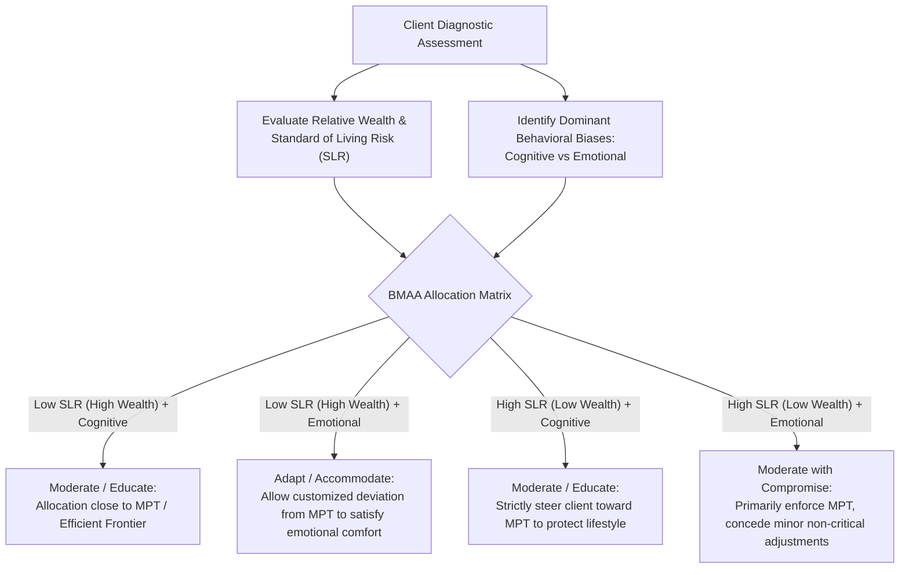

# Portfolio Management & Quantitative Risk (MScFE 640)

This directory contains lecture notes, readings, quantitative frameworks, and research papers for **Portfolio Management & Quantitative Risk**. The module bridges classical normative portfolio theory (Markowitz Mean-Variance Optimization, CAPM, Factor Models, Black-Litterman Bayesian allocation, Critical Line Algorithm) with modern descriptive behavioral finance (Kahneman-Tversky Prospect Theory, Behavioral Portfolio Theory, Behaviorally Modified Asset Allocation, investor profiling, and empirical market anomalies).

---

## 📚 Module Overview

- **Course Code**: MScFE 640
- **Primary Focus**: Modern Portfolio Theory (MPT), Capital Market Theory (CAPM, APT, Fama-French), Black-Litterman Bayesian asset allocation, exact constrained optimization (Critical Line Algorithm), Probabilistic Scenario Optimization (PSO), and Behavioral Finance (Bounded Rationality, Prospect Theory, Skewness Preference, Layered Mental Accounting, BMAA, Investor Typologies, and Market Bubbles/Crashes).
- **Key Tools & Methodologies**: Quadratic programming, convex optimization solvers, Bayesian conjugate updating, Quasi-Monte Carlo (Sobol low-discrepancy sequences), non-linear value/probability weighting transformations, behavioral profiling matrices.

---

> [!IMPORTANT]
> **🎓 Master Pedagogical Architecture & Key Takeaways**:
> Access the structured 4-tier quantitative breakdown with worked numerical calculations and calculus derivations in **[`key-takeaway.md`](./key-takeaway.md)**:
> - 📐 **[Markowitz Matrix Inversion & Leverage Trap Math](./key-takeaway.md#toy-example-1-the-2-asset-correlation--leverage-trap)**
> - 📉 **[Compounding Volatility Drag & Asymmetric Recovery](./key-takeaway.md#toy-example-2-compounding-drag--asymmetric-loss-recovery)**
> - 🧠 **[Prospect Theory Value Function Calculus](./key-takeaway.md#3-kahneman-tversky-prospect-theory-value-function-calculus)**
> - 🧮 **[Lagrangian Optimization & Huber Robust Regression](./key-takeaway.md#2-core-mathematical-formulations--calculus-derivations)**

---

## 📊 Visual Frameworks & Architecture

### 1. Markowitz Efficient Frontier & Capital Allocation Line (CAL) — [*Detailed Math & Calculations in key-takeaway.md*](./key-takeaway.md#1-markowitz-lagrangian-matrix-optimization-derivation)

### 2. Black-Litterman Bayesian Master Allocation Workflow

### 3. Kahneman-Tversky Prospect Theory: Value & Weighting Architecture

### 4. Behavioral Portfolio Theory (BPT) Layered Pyramid vs MVO

### 5. Behaviorally Modified Asset Allocation (BMAA) Decision Matrix

---

## 📖 Sub-Module & Detailed File Breakdown

### [Module 1: Modern Portfolio Theory (MPT) & Markowitz Optimization](./M1)
- **Lessons & Lecture Slides**:
  - [`M1/L1.pdf`](./M1/L1.pdf): Expected returns vector $\boldsymbol{\mu}$, covariance matrix $\mathbf{\Sigma}$, portfolio variance $\sigma_p^2 = \mathbf{w}^T \mathbf{\Sigma} \mathbf{w}$, and the diversification effect across uncorrelated/negatively correlated assets.
  - [`M1/L2.pdf`](./M1/L2.pdf): Markowitz quadratic optimization formulation, Lagrangian multipliers, derivation of the analytical minimum-variance frontier, and the two-fund separation theorem:
    $$\min_{\mathbf{w}} \frac{1}{2} \mathbf{w}^T \mathbf{\Sigma} \mathbf{w} \quad \text{s.t.} \quad \mathbf{w}^T \boldsymbol{\mu} = \mu_0, \quad \mathbf{w}^T \mathbf{1} = 1$$
  - [`M1/L3.pdf`](./M1/L3.pdf): Risk-free borrowing/lending ($r_f$), Capital Allocation Line (CAL), and analytical derivation of the Tangency (Maximum Sharpe Ratio) portfolio:
    $$\max_{\mathbf{w}} \frac{\mathbf{w}^T \boldsymbol{\mu} - r_f}{\sqrt{\mathbf{w}^T \mathbf{\Sigma} \mathbf{w}}} \implies \mathbf{w}^{*} \propto \mathbf{\Sigma}^{-1} (\boldsymbol{\mu} - r_f \mathbf{1})$$
  - [`M1/L4.pdf`](./M1/L4.pdf): Sensitivity of Markowitz weights to sample estimation error ("error maximization" of mean returns), introducing short-sale constraints ($\mathbf{w} \ge 0$), and shrinkage covariance estimation.

---

### [Module 2: Asset Pricing Models & Factor Investing](./M2)
- **Lessons & Research Papers**:
  - [`M2/L1.pdf`](./M2/L1.pdf): Capital Asset Pricing Model (CAPM) market equilibrium, Capital Market Line (CML), Security Market Line (SML), and market beta:
    $$\beta_i = \frac{\text{Cov}(R_i, R_m)}{\text{Var}(R_m)}, \quad E[R_i] = r_f + \beta_i \left(E[R_m] - r_f\right)$$
  - [`M2/L2.pdf`](./M2/L2.pdf): Total risk decomposition into systematic market risk and idiosyncratic (diversifiable) residual variance:
    $$\sigma_i^2 = \beta_i^2 \sigma_m^2 + \sigma_{\epsilon, i}^2, \quad \text{Jensen's Alpha: } \alpha_i = R_i - \left[r_f + \beta_i(R_m - r_f)\right]$$
  - [`M2/L3.pdf`](./M2/L3.pdf): Arbitrage Pricing Theory (APT), multi-factor linear pricing models, Fama-French 3-Factor (Market, SMB - Size, HML - Value), and 5-Factor extensions (+ RMW Profitability, + CMA Investment).
  - [`M2/L4.pdf`](./M2/L4.pdf) & [`M2/mathematics-09-01668-v2.pdf`](./M2/mathematics-09-01668-v2.pdf): Mathematical foundation of factor covariance matrix decomposition $\mathbf{\Sigma} = \mathbf{B} \mathbf{\Sigma}_F \mathbf{B}^T + \mathbf{D}$, matrix condition numbers, and noise filtering.

---

### [Module 3: The Black-Litterman Model & Probabilistic Scenarios Optimization](./M3)
- **Lessons, Notes & Required Readings**:
  - [`M3/L1.pdf`](./M3/L1.pdf) & [`M3/L1-note.pdf`](./M3/L1-note.pdf): **The Black-Litterman Model**. Reverse optimization from market capitalization weights $\mathbf{w}_{\text{mkt}}$, equilibrium risk aversion parameter $\lambda = \frac{E[R_m] - r_f}{\sigma_m^2}$, implied excess returns $\boldsymbol{\Pi} = \lambda \mathbf{\Sigma} \mathbf{w}_{\text{mkt}}$, investor view matrix $\mathbf{P} \mathbf{E}[R] = \mathbf{Q} + \boldsymbol{\epsilon}$ with uncertainty $\mathbf{\Omega}$, and the Master Bayesian equations:
    $$\bar{\boldsymbol{\mu}}_{BL} = \left[(\tau \mathbf{\Sigma})^{-1} + \mathbf{P}^T \mathbf{\Omega}^{-1} \mathbf{P}\right]^{-1} \left[(\tau \mathbf{\Sigma})^{-1} \boldsymbol{\Pi} + \mathbf{P}^T \mathbf{\Omega}^{-1} \mathbf{Q}\right]$$
    $$\bar{\mathbf{\Sigma}}_{BL} = \mathbf{\Sigma} + \left[(\tau \mathbf{\Sigma})^{-1} + \mathbf{P}^T \mathbf{\Omega}^{-1} \mathbf{P}\right]^{-1}$$
  - [`M3/L2-reading.pdf`](./M3/L2-reading.pdf) & [`M3/L2-note.pdf`](./M3/L2-note.pdf): **Critical Line Algorithm (CLA) & Corner Portfolios** (*Bailey & López de Prado, 2013*). Exact quadratic programming solver for inequality and box constraints ($\mathbf{w}_{\min} \le \mathbf{w} \le \mathbf{w}_{\max}$), tracking transitions across Karush-Kuhn-Tucker (KKT) turning points along the piecewise linear efficient frontier.
  - [`M3/L3.pdf`](./M3/L3.pdf) & [`M3/L3-note.pdf`](./M3/L3-note.pdf): **Uses and Misuses of the Black-Litterman Model** (*Chincarini & Kim, 2013*). Mathematical analysis of 3 critical implementation pitfalls: (1) omitting the equilibrium prior, (2) using historical sample returns as a prior (inducing circularity), and (3) miscalibrating view confidence $\tau$ and $\mathbf{\Omega}$, causing severe quadratic utility loss.
  - [`M3/L4-reading.pdf`](./M3/L4-reading.pdf) & [`M3/L4-note.pdf`](./M3/L4-note.pdf): **Probabilistic Scenario Optimization (PSO)** (*Shadabfar & Cheng, 2020*). Hybrid Monte Carlo simulation using low-discrepancy Quasi-Random numbers (Sobol sequences), lexicographical ordering, and liability-driven probabilistic portfolio constraints for institutional pension funds.

---

### [Module 4: Behavioral Finance & Applications to Portfolio Theory](./M4)
- **Lessons, Notes & Research Papers**:
  - [`M4/L1.pdf`](./M4/L1.pdf): **Foundations of Behavioral Finance**.
    - Transition from Traditional Finance (Rational Economic Man, perfect information, utility maximization) to Behavioral Finance (Bounded Rationality, Herbert Simon's "Satisficing").
    - Friedman-Savage double inflection utility function explaining simultaneous insurance buying (risk aversion) and lottery purchases (risk seeking).
    - Comprehensive taxonomy of behavioral biases:
      - *Cognitive Errors (Belief Perseverance)*: Conservatism, Confirmation, Representativeness, Illusion of Control, Hindsight bias.
      - *Cognitive Errors (Information Processing)*: Anchoring, Mental Accounting, Framing, Availability.
      - *Emotional Biases*: Loss Aversion, Overconfidence, Self-Control, Status Quo, Endowment, Regret Aversion.
  - [`M4/L2.pdf`](./M4/L2.pdf): **Prospect Theory & Behavioral Anomalies**.
    - Formal Prospect Theory (*Kahneman & Tversky, 1979/1992*): Two-stage decision architecture comprising the **Editing Phase** (Coding relative to reference point, Combination, Segregation, Cancellation, Simplification, Dominance detection) and the **Evaluation Phase**.
    - Asymmetric power value function:
      $$v(x) = \begin{cases} x^\alpha & \text{for } x \ge 0 \\ -\lambda (-x)^\beta & \text{for } x < 0 \end{cases} \quad (\alpha = \beta \approx 0.88, \; \lambda \approx 2.25)$$
    - Probability weighting function $w(p) = \frac{p^\gamma}{\left(p^\gamma + (1-p)^\gamma\right)^{1/\gamma}}$: Overweighting low-probability tail events and underweighting moderate/high probabilities.
    - Preference for positive skewness, **Bowman's Paradox** (negative empirical correlation between accounting risk and return in struggling firms), and the **Equity Premium Puzzle** resolved via **Myopic Loss Aversion** (*Benartzi & Thaler*).
  - [`M4/L3.pdf`](./M4/L3.pdf): **Behavioral Portfolio Theory (BPT) & Behaviorally Modified Asset Allocation (BMAA)**.
    - **Behavioral Portfolio Theory (BPT-MA)** (*Shefrin & Statman, 2000*): Portfolio construction as a multi-layered pyramid of mental accounts (safety vs aspirational wealth) without cross-layer covariance integration.
    - **Adaptive Market Hypothesis (AMH)** (*Andrew Lo*): Evolutionary market dynamics replacing strict EMH; market efficiency fluctuates based on ecological competition, behavioral adaptations, and institutional constraints.
    - **Behaviorally Modified Asset Allocation (BMAA)** (*Stephen Brunel, 2006*): 2-dimensional framework combining **Standard of Living Risk (SLR)** (relative wealth vs goals) with **Bias Type** (cognitive vs emotional) to determine whether an advisor should *Moderate/Educate* (steer toward MPT) or *Adapt/Accommodate* (deviate to satisfy emotional comfort and prevent panic selling).
  - [`M4/L4.pdf`](./M4/L4.pdf): **Investor Classification Typologies & Financial Market Anomalies**.
    - **Barnewall Model (1987)**: Active investors (entrepreneurs, risk-tolerant, need control) vs Passive investors (accumulators, inheritance, risk-averse).
    - **Bailard, Biehl, and Kaiser (BB&K 1986) Model**: 2-axis classification (Confidence [Confident vs Anxious] $\times$ Method of Action [Careful vs Impetuous]) yielding 5 personalities: **Individualist**, **Adventurer**, **Celebrity**, **Guardian**, and **Straight Arrow**.
    - **Pompian Behavioral Investor Types (BITs 2006)**: Passive Preserver, Friendly Follower, Independent Individualist, Active Accumulator.
    - Anatomy of market bubbles and crashes (Kindleberger/Minsky 5-stage cycle: Displacement $\to$ Boom $\to$ Euphoria $\to$ Profit-Taking $\to$ Panic) driven by herding, feedback loops, and narrative fallacies.
    - **Montier's "Seven Sins of Fund Management"** (*James Montier, 2005*): Forecasting illusion, illusion of control, closet indexing, management meetings confirmation bias, storytelling over numbers, overtrading, and myopia.
  - [`M4/GWP.pdf`](./M4/GWP.pdf): **Large-Scale Empirical Study: Prospect Theory for Online Financial Trading** (*Liu, Nacher, Ochiai, Martino, & Altshuler, PLoS ONE 2014*).
    - Massive empirical dataset: 28.5 million trades across 81.3k traders over 28 months from an online social trading platform.
    - First large-scale empirical verification of Prospect Theory's **Reflection Effect** and **Loss Aversion** ($\lambda \approx 2.0$) in live financial markets.
    - Demonstrates the **Disposition Effect**: Traders hold losing positions significantly longer than winning positions ($T_{\text{loss}} \gg T_{\text{win}}$) due to convex risk-seeking in the loss domain.
    - Formulates 3 behavioral metrics distinguishing winning from losing traders:
      1. Win rate ratio: $R_p = \frac{N_{\text{win}}}{N_{\text{total}}}$
      2. Holding duration ratio: $R_d = \frac{\bar{T}_{\text{win}}}{\bar{T}_{\text{loss}}}$
      3. Payoff ratio: $R_r = \frac{\bar{r}_{\text{win}}}{|\bar{r}_{\text{loss}}|}$
    - Key finding: Top winning traders successfully mitigate loss aversion, cut losses systematically ($R_d \approx 1$, high $R_r$), and avoid the reflection effect trap.

---

## 🔑 Key Takeaways & Quantitative Insights

1. **Markowitz Optimization "Error Maximization"**: Unconstrained sample mean-variance optimization acts as an error amplifier, placing extreme long/short bets on assets with overestimated expected returns or underestimated covariances. Imposing long-only constraints ($\mathbf{w} \ge 0$), shrinkage covariance, or Black-Litterman priors is critical for stability.
2. **Bayesian Black-Litterman Superiority**: Black-Litterman solves the estimation error problem by anchoring portfolio weights around the global market capitalization equilibrium prior ($\boldsymbol{\Pi} = \lambda \mathbf{\Sigma} \mathbf{w}_{\text{mkt}}$), allowing explicit, confidence-weighted tilts only where an investor has unique views.
3. **Exact Constraint Handling via CLA**: When real-world box constraints ($\mathbf{w}_{\min} \le \mathbf{w} \le \mathbf{w}_{\max}$) are introduced, generic quadratic solvers can experience numerical instability. The Critical Line Algorithm (CLA) tracks exact turning points and piecewise linear corner portfolios along the efficient frontier.
4. **Prospect Theory Value & Loss Asymmetry**: Human investors do not maximize absolute terminal wealth under concave von Neumann-Morgenstern utility; they evaluate changes relative to a subjective reference point with an S-shaped value function displaying steep loss aversion ($\lambda \approx 2.25$) and nonlinear probability distortion (overweighting tails).
5. **Mental Accounting & Layered BPT Portfolios**: Rather than maintaining a globally diversified mean-variance portfolio, real-world investors mentally partition assets into distinct hierarchical layers (safety vs aspiration). BPT structures portfolios as goal-based pyramids.
6. **BMAA Dynamic Balancing**: Financial advisors must evaluate a client's Standard of Living Risk (SLR) against their bias type (Cognitive vs Emotional). Cognitive biases should be moderated through education, while emotional biases in wealthy clients should be adapted to in order to ensure long-term strategy adherence.
7. **Empirical Edge in Trading**: As proven in Liu et al. (2014), the primary separator between winning and losing market participants is the systematic elimination of the Disposition Effect—cutting losses immediately while letting profitable positions compound.

---

## 🔗 Cross-Module Knowledge Linkages

- **$\to$ [01_financial_market](../01_financial_market/README.md)**: Asset class risk-return profiles, option payoff convexity, and structural credit risk feed asset universe constraints.
- **$\to$ [03_stochastic_modelling](../03_stochastic_modelling/README.md)**: Continuous-time jump-diffusion processes and HMM regime-switching models generate dynamic input parameters for tactical allocation.
- **$\to$ [04_financial_econometrics](../04_financial_econometrics/README.md)**: Multivariate GARCH (DCC-GARCH) and VAR models supply dynamic, time-varying conditional covariance matrices $\mathbf{\Sigma}_t$ to the Black-Litterman and MVO optimizers.
- **$\to$ [07_machine_learning](../07_machine_learning/README.md)**: Hierarchical Risk Parity (HRP) uses unsupervised hierarchical tree clustering to eliminate matrix inversion instability, while supervised ML models engineer behavioral factor features.
- **$\to$ [08_deep_learning](../08_deep_learning/README.md)**: Deep Reinforcement Learning (PPO, DDPG) optimizes multi-period dynamic asset allocation subject to downside CVaR and drawdown constraints.
