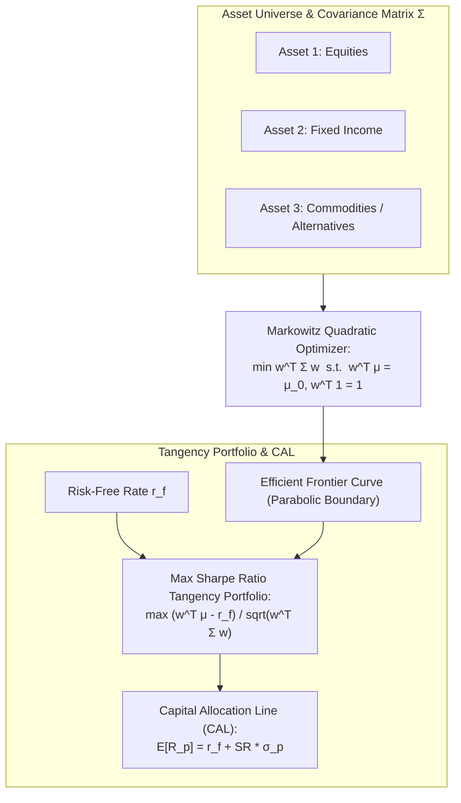
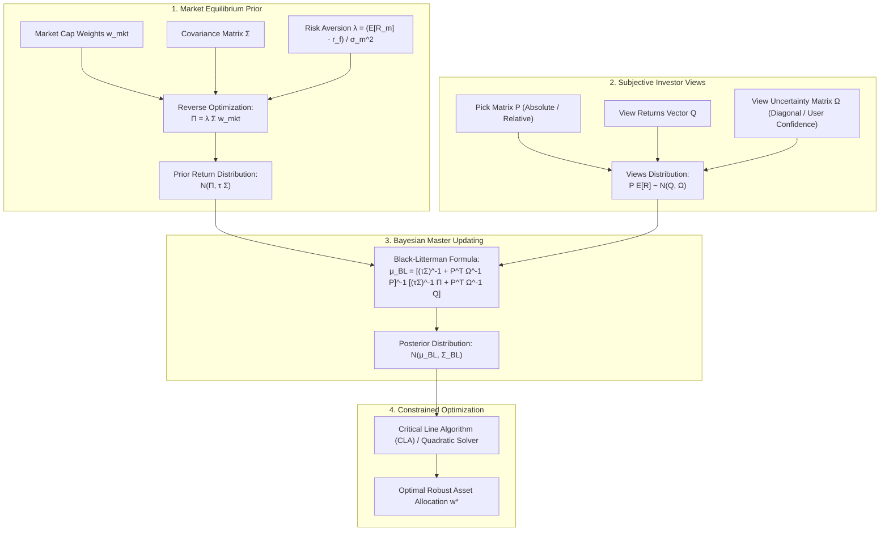
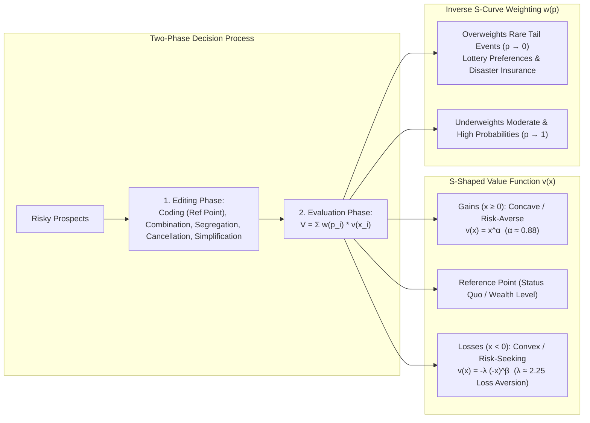
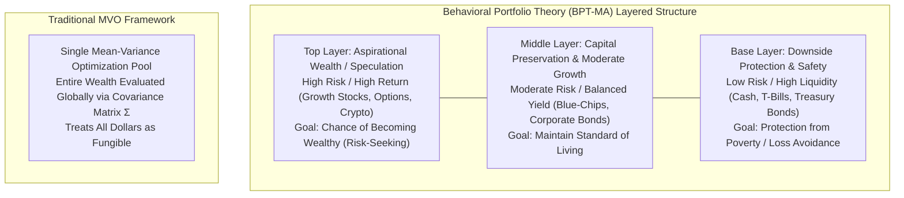
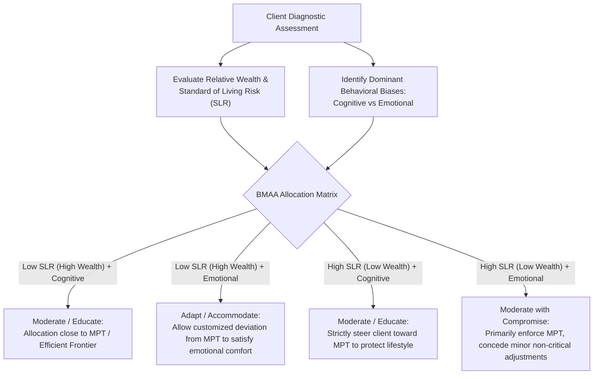
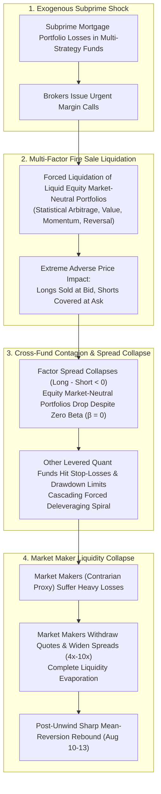
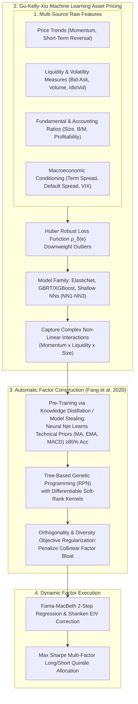

# Portfolio Management & Quantitative Risk (MScFE 640 / 652)

This directory contains lecture notes, readings, quantitative frameworks, empirical implementations, and research papers for **Portfolio Management & Quantitative Risk**. The curriculum spans classical normative portfolio theory (Markowitz Mean-Variance Optimization, CAPM, Factor Models, Black-Litterman Bayesian allocation, Critical Line Algorithm), modern descriptive behavioral finance (Kahneman-Tversky Prospect Theory, Behavioral Portfolio Theory, Behaviorally Modified Asset Allocation, investor profiling, and empirical market anomalies), capital growth and risk parity paradigms (Continuous Kelly Criterion, Fractional Kelly, Merton log utility, Equal Risk Contribution ERC, Conic Relaxed Risk Parity, Partitional Medoid Clustering & Performance Proportional Allocation), and cutting-edge machine learning factor engineering (Fama-MacBeth 2-step regressions, Smart Beta Crowding & 2007 Quant Meltdown Liquidity Spirals, Gu-Kelly-Xiu Comparative Machine Learning Asset Pricing, and Automatic Genetic Programming Factor Construction with Differentiable Kernels).

---

## 📚 Module Overview

- **Course Code**: MScFE 640 / 652
- **Primary Focus**: 
  - **Modules 1–3**: Modern Portfolio Theory (MPT), Capital Market Theory (CAPM, APT, Fama-French), Black-Litterman Bayesian asset allocation, exact constrained optimization (Critical Line Algorithm), and Probabilistic Scenario Optimization (PSO).
  - **Module 4**: Behavioral Finance (Bounded Rationality, Prospect Theory, Skewness Preference, Layered Mental Accounting, BMAA, Investor Typologies, and Market Bubbles/Crashes).
  - **Module 5**: Kelly Criterion & Risk Parity (Continuous-Time Merton log-utility, Fractional Kelly, Drawdown Mitigation, Equal Risk Contribution [ERC], Relaxed Risk Parity via Second-Order Conic Programming [SOCP], Partitional Medoid Clustering, Distance Matrices, and Genetic Performance Proportional Allocation [PPA]).
  - **Module 6**: Advances and Challenges in Factor Investing (Factor Zoo, $t \ge 3.0$ Snooping Hurdle, Fama-MacBeth 2-Step Regressions, Bayesianized P-Values & Odds, Smart Beta Herding, August 2007 Quant Meltdown & Liquidity Deleveraging Cascades, Gu-Kelly-Xiu Machine Learning Asset Pricing across Trees/Neural Networks, and Automatic Factor Construction via Pre-trained NNs and Differentiable Genetic Programming).
- **Key Tools & Methodologies**: Quadratic programming, Second-Order Conic Programming (SOCP), convex optimization solvers, Bayesian conjugate updating, Quasi-Monte Carlo (Sobol low-discrepancy sequences), non-linear value/probability weighting transformations, Partitional Clustering (PAM, k-medoids, CLARA), Fama-MacBeth cross-sectional econometric passes, Huber robust M-estimators, Shallow & Deep Neural Networks with non-linear feature interactions, and Tree-based Genetic Programming (Symbolic Regression with Soft-Rank Kernels).

---

> [!IMPORTANT]
> **🎓 Master Pedagogical Architecture & Key Takeaways**:
> Access the structured 4-tier quantitative breakdown with worked numerical calculations, notation breakdowns, and calculus derivations in **[`key-takeaway.md`](./key-takeaway.md)**:
> - 📐 **[Markowitz Matrix Inversion & Leverage Trap Math](./key-takeaway.md#toy-example-1-the-2-asset-correlation--leverage-trap)**
> - 📉 **[Compounding Volatility Drag & Asymmetric Recovery](./key-takeaway.md#toy-example-2-compounding-drag--asymmetric-loss-recovery)**
> - 🧠 **[Prospect Theory Value Function Calculus](./key-takeaway.md#3-kahneman-tversky-prospect-theory-value-function-calculus)**
> - 🎰 **[Kelly Growth Rate vs Over-Leverage Trap](./key-takeaway.md#toy-example-4-the-kelly-criterion-leverage-trap--half-kelly-optimality)**
> - 🌊 **[2007 Quant Meltdown & Crowded Deleveraging Spirals](./key-takeaway.md#toy-example-5-the-2007-quant-meltdown-crowded-trade--deleveraging-spiral)**
> - ⚖️ **[Equal Risk Contribution (ERC) & Log-Barrier Calculus](./key-takeaway.md#4-equal-risk-contribution-erc-risk-parity--log-barrier-calculus)**
> - 🧪 **[Fama-MacBeth 2-Step Regression & Shanken EIV Calculus](./key-takeaway.md#5-fama-macbeth-2-step-cross-sectional-regression--shanken-eiv-calculus)**
> - 🧬 **[Differentiable Soft-Rank Kernel in Automatic Factor Construction](./key-takeaway.md#6-differentiable-soft-rank-kernel-calculus-in-genetic-factor-construction)**
> - 📚 **[Comprehensive Variable & Notation Glossary](./key-takeaway.md#5-comprehensive-mathematical-notation--variable-glossary)**

---

## 🏷️ Master Quantitative Notation & Variable Glossary

| Variable / Notation | Mathematical / Financial Meaning | Context & Governing Formula |
| :--- | :--- | :--- |
| **$\mathbf{w}, w_i$** | Portfolio Allocation Weight Vector & Weight on Asset $i$ | Budget constraint: $\mathbf{w}^T\mathbf{1} = \sum_{i=1}^N w_i = 1$ |
| **$\boldsymbol{\mu}, \mu_i$** | Expected Return Vector & Asset $i$ Expected Return | Portfolio expected return: $\mathbb{E}[R_p] = \mathbf{w}^T\boldsymbol{\mu}$ |
| **$\mu_0$** | Target Portfolio Return Constraint | Mean-variance constraint: $\mathbf{w}^T\boldsymbol{\mu} = \mu_0$ |
| **$\mathbf{\Sigma}$** | Asset Covariance Matrix ($N \times N$) | $\sigma_p^2 = \mathbf{w}^T\mathbf{\Sigma}\mathbf{w}$; condition number $\kappa(\mathbf{\Sigma})$ dictates inversion stability |
| **$\sigma_p(\mathbf{w})$** | Total Portfolio Standard Deviation / Risk | Euler's homogeneity decomposition: $\sigma_p = \sum_{i=1}^N \text{RC}_i(\mathbf{w})$ |
| **$\text{MRC}_i$** | Marginal Risk Contribution of Asset $i$ | $\text{MRC}_i = \frac{\partial \sigma_p}{\partial w_i} = \frac{(\mathbf{\Sigma}\mathbf{w})_i}{\sigma_p}$ |
| **$\text{RC}_i$** | Total Risk Contribution of Asset $i$ | $\text{RC}_i = w_i \times \text{MRC}_i$; Risk Parity equalizes $\text{RC}_i = \sigma_p / N$ |
| **$\lambda_1, \lambda_2$** | Lagrange Multipliers for Return and Budget Constraints | Optimal analytical weights: $\mathbf{w}^\star = \mathbf{\Sigma}^{-1}(\lambda_1\boldsymbol{\mu} + \lambda_2\mathbf{1})$ |
| **$f, f^*$** | Portfolio Leverage Fraction & Full Kelly Optimum | Growth rate maximization: $f^* = \frac{\mu - r_f}{\sigma^2}$ |
| **$g(f)$** | Continuous Logarithmic Compounded Growth Rate | $g(f) = r_f + f(\mu - r_f) - \frac{1}{2}f^2\sigma^2$ |
| **$v(x)$** | Kahneman-Tversky Prospect Theory Value Function | $v(x) = x^\alpha$ (for $x \ge 0$) and $v(x) = -\lambda(-x)^\beta$ (for $x < 0$) |
| **$\lambda$** | Loss Aversion Multiplier | Psychological penalty factor ($\lambda \approx 2.25$) |
| **$\alpha, \beta$** | Prospect Theory Diminishing Sensitivity Exponents | Concave in gains ($\alpha \approx 0.88$), convex in losses ($\beta \approx 0.88$) |
| **$\rho_\delta(e), \psi_\delta(e)$** | Huber Robust Loss Function & Influence Derivative | Bounded M-estimator ($\delta \approx 1.345$) for robust factor regression |
| **$\hat{\boldsymbol{\beta}}_i, \hat{\mathbf{B}}$** | Factor Beta Loadings Vector & $N \times K$ Beta Matrix | First pass time-series regression estimators |
| **$\boldsymbol{\lambda}_t, \bar{\boldsymbol{\lambda}}$** | Cross-Sectional Factor Risk Premia Vector & Time-Series Mean | Second pass cross-sectional regression estimators |
| **$\text{AsyVar}(\bar{\boldsymbol{\lambda}})$** | Shanken (1992) Errors-in-Variables (EIV) Covariance Matrix | Corrects for first-pass beta estimation noise in factor premia |
| **$\widetilde{\text{rank}}_\tau(x_i)$** | Differentiable Soft-Rank Kernel with Temperature $\tau$ | $\widetilde{\text{rank}}_\tau(x_i) = 1 + \sum_{j \ne i} \frac{1}{1 + e^{-(x_i - x_j)/\tau}}$ |
| **$L$** | Gross Portfolio Leverage Multiplier | Gross market exposure relative to net investor equity |

---

## 📊 Visual Frameworks & Architecture

### 1. Markowitz Efficient Frontier & Capital Allocation Line (CAL) — [*Detailed Math & Calculations in key-takeaway.md*](./key-takeaway.md#1-markowitz-lagrangian-matrix-optimization-derivation)

### 2. Black-Litterman Bayesian Master Allocation Workflow

### 3. Kahneman-Tversky Prospect Theory: Value & Weighting Architecture

### 4. Behavioral Portfolio Theory (BPT) Layered Pyramid vs MVO

### 5. Behaviorally Modified Asset Allocation (BMAA) Decision Matrix

### 6. Growth vs. Risk Parity Allocation Paradigm (Module 5)

```mermaid
flowchart TD
    subgraph Growth_Kelly ["1. Kelly Optimal Growth Paradigm"]
        LogU["Log Utility Maximization:\nmax E[ln(1 + f^T R)]"] --> FullKelly["Continuous Full Kelly:\nf* = Σ^-1 (μ - r 1)"]
        FullKelly --> FracKelly["Fractional Kelly (Half-Kelly):\nf = c * f* (c = 0.5)\n75% Growth, 75% Variance Reduction"]
    end

    subgraph Risk_Parity ["2. Risk Parity & Equal Risk Contribution (ERC)"]
        Euler["Euler Variance Decomposition:\nσ_p = Σ w_i MRC_i"] --> ERC_Cond["Equal Risk Condition:\nRC_i = w_i (Σw)_i / σ_p = σ_p / N"]
        ERC_Cond --> Conic["Second-Order Conic Programming (SOCP):\nRelaxed Risk Parity (Gambeta & Kwon)"]
    end

    subgraph ML_Clustering ["3. Unsupervised Clustering Allocation"]
        DistMat["Distance Matrix D_ij = sqrt((1 - ρ_ij)/2)"] --> Medoid["Partitional k-Medoids / PAM Clustering"]
        Medoid --> PPA["Performance Proportional Allocation (PPA)\nRoulette Wheel Selection (Duarte & de Castro)"]
    end
```

### 7. The August 2007 Quant Meltdown Liquidity & Deleveraging Cascade (Module 6)

### 8. End-to-End Machine Learning & Automatic Factor Construction Architecture (Module 6)

---

## 📖 Sub-Module & Detailed File Breakdown

### [Module 1: Modern Portfolio Theory (MPT) & Markowitz Optimization](./M1)
- **Lessons & Lecture Slides**:
  - [`M1/L1.pdf`](./M1/L1.pdf): Expected returns vector $\boldsymbol{\mu}$, covariance matrix $\mathbf{\Sigma}$, portfolio variance $\sigma_p^2 = \mathbf{w}^T \mathbf{\Sigma} \mathbf{w}$, and the diversification effect across uncorrelated/negatively correlated assets.
  - [`M1/L2.pdf`](./M1/L2.pdf): Markowitz quadratic optimization formulation, Lagrangian multipliers, derivation of the analytical minimum-variance frontier, and the two-fund separation theorem:
    $$\min_{\mathbf{w}} \frac{1}{2} \mathbf{w}^T \mathbf{\Sigma} \mathbf{w} \quad \text{s.t.} \quad \mathbf{w}^T \boldsymbol{\mu} = \mu_0, \quad \mathbf{w}^T \mathbf{1} = 1$$
  - [`M1/L3.pdf`](./M1/L3.pdf): Risk-free borrowing/lending ($r_f$), Capital Allocation Line (CAL), and analytical derivation of the Tangency (Maximum Sharpe Ratio) portfolio:
    $$\max_{\mathbf{w}} \frac{\mathbf{w}^T \boldsymbol{\mu} - r_f}{\sqrt{\mathbf{w}^T \mathbf{\Sigma} \mathbf{w}}} \implies \mathbf{w}^{\star} \propto \mathbf{\Sigma}^{-1} (\boldsymbol{\mu} - r_f \mathbf{1})$$
  - [`M1/L4.pdf`](./M1/L4.pdf): Sensitivity of Markowitz weights to sample estimation error ("error maximization" of mean returns), introducing short-sale constraints ($\mathbf{w} \ge 0$), and shrinkage covariance estimation.

---

### [Module 2: Asset Pricing Models & Factor Investing](./M2)
- **Lessons & Research Papers**:
  - [`M2/L1.pdf`](./M2/L1.pdf): Capital Asset Pricing Model (CAPM) market equilibrium, Capital Market Line (CML), Security Market Line (SML), and market beta:
    $$\beta_i = \frac{\text{Cov}(R_i, R_m)}{\text{Var}(R_m)}, \quad E[R_i] = r_f + \beta_i \left(E[R_m] - r_f\right)$$
  - [`M2/L2.pdf`](./M2/L2.pdf): Total risk decomposition into systematic market risk and idiosyncratic (diversifiable) residual variance:
    $$\sigma_i^2 = \beta_i^2 \sigma_m^2 + \sigma_{\epsilon, i}^2, \quad \text{Jensen's Alpha: } \alpha_i = R_i - \left[r_f + \beta_i(R_m - r_f)\right]$$
  - [`M2/L3.pdf`](./M2/L3.pdf): Arbitrage Pricing Theory (APT), multi-factor linear pricing models, Fama-French 3-Factor (Market, SMB - Size, HML - Value), and 5-Factor extensions (+ RMW Profitability, + CMA Investment).
  - [`M2/L4.pdf`](./M2/L4.pdf) & [`M2/mathematics-09-01668-v2.pdf`](./M2/mathematics-09-01668-v2.pdf): Mathematical foundation of factor covariance matrix decomposition $\mathbf{\Sigma} = \mathbf{B} \mathbf{\Sigma}_F \mathbf{B}^T + \mathbf{D}$, matrix condition numbers, and noise filtering.

---

### [Module 3: The Black-Litterman Model & Probabilistic Scenarios Optimization](./M3)
- **Lessons, Notes & Required Readings**:
  - [`M3/L1.pdf`](./M3/L1.pdf) & [`M3/L1-note.pdf`](./M3/L1-note.pdf): **The Black-Litterman Model**. Reverse optimization from market capitalization weights $\mathbf{w}_{\text{mkt}}$, equilibrium risk aversion parameter $\lambda = \frac{E[R_m] - r_f}{\sigma_m^2}$, implied excess returns $\boldsymbol{\Pi} = \lambda \mathbf{\Sigma} \mathbf{w}_{\text{mkt}}$, investor view matrix $\mathbf{P} \mathbf{E}[R] = \mathbf{Q} + \boldsymbol{\epsilon}$ with uncertainty $\mathbf{\Omega}$, and the Master Bayesian equations:
    $$\bar{\boldsymbol{\mu}}_{BL} = \left[(\tau \mathbf{\Sigma})^{-1} + \mathbf{P}^T \mathbf{\Omega}^{-1} \mathbf{P}\right]^{-1} \left[(\tau \mathbf{\Sigma})^{-1} \boldsymbol{\Pi} + \mathbf{P}^T \mathbf{\Omega}^{-1} \mathbf{Q}\right]$$
    $$\bar{\mathbf{\Sigma}}_{BL} = \mathbf{\Sigma} + \left[(\tau \mathbf{\Sigma})^{-1} + \mathbf{P}^T \mathbf{\Omega}^{-1} \mathbf{P}\right]^{-1}$$
  - [`M3/L2-reading.pdf`](./M3/L2-reading.pdf) & [`M3/L2-note.pdf`](./M3/L2-note.pdf): **Critical Line Algorithm (CLA) & Corner Portfolios** (*Bailey & López de Prado, 2013*). Exact quadratic programming solver for inequality and box constraints ($\mathbf{w}_{\min} \le \mathbf{w} \le \mathbf{w}_{\max}$), tracking transitions across Karush-Kuhn-Tucker (KKT) turning points along the piecewise linear efficient frontier.
  - [`M3/L3.pdf`](./M3/L3.pdf) & [`M3/L3-note.pdf`](./M3/L3-note.pdf): **Uses and Misuses of the Black-Litterman Model** (*Chincarini & Kim, 2013*). Mathematical analysis of 3 critical implementation pitfalls: (1) omitting the equilibrium prior, (2) using historical sample returns as a prior (inducing circularity), and (3) miscalibrating view confidence $\tau$ and $\mathbf{\Omega}$, causing severe quadratic utility loss.
  - [`M3/L4-reading.pdf`](./M3/L4-reading.pdf) & [`M3/L4-note.pdf`](./M3/L4-note.pdf): **Probabilistic Scenario Optimization (PSO)** (*Shadabfar & Cheng, 2020*). Hybrid Monte Carlo simulation using low-discrepancy Quasi-Random numbers (Sobol sequences), lexicographical ordering, and liability-driven probabilistic portfolio constraints for institutional pension funds.

---

### [Module 4: Behavioral Finance & Applications to Portfolio Theory](./M4)
- **Lessons, Notes & Research Papers**:
  - [`M4/L1.pdf`](./M4/L1.pdf): **Foundations of Behavioral Finance**.
    - Transition from Traditional Finance (Rational Economic Man, perfect information, utility maximization) to Behavioral Finance (Bounded Rationality, Herbert Simon's "Satisficing").
    - Friedman-Savage double inflection utility function explaining simultaneous insurance buying (risk aversion) and lottery purchases (risk seeking).
    - Comprehensive taxonomy of behavioral biases:
      - *Cognitive Errors (Belief Perseverance)*: Conservatism, Confirmation, Representativeness, Illusion of Control, Hindsight bias.
      - *Cognitive Errors (Information Processing)*: Anchoring, Mental Accounting, Framing, Availability.
      - *Emotional Biases*: Loss Aversion, Overconfidence, Self-Control, Status Quo, Endowment, Regret Aversion.
  - [`M4/L2.pdf`](./M4/L2.pdf): **Prospect Theory & Behavioral Anomalies**.
    - Formal Prospect Theory (*Kahneman & Tversky, 1979/1992*): Two-stage decision architecture comprising the **Editing Phase** (Coding relative to reference point, Combination, Segregation, Cancellation, Simplification, Dominance detection) and the **Evaluation Phase**.
    - Asymmetric power value function:
      $$v(x) = \begin{cases} x^\alpha & \text{for } x \ge 0 \\ -\lambda (-x)^\beta & \text{for } x < 0 \end{cases} \quad (\alpha = \beta \approx 0.88, \; \lambda \approx 2.25)$$
    - Probability weighting function $w(p) = \frac{p^\gamma}{\left(p^\gamma + (1-p)^\gamma\right)^{1/\gamma}}$: Overweighting low-probability tail events and underweighting moderate/high probabilities.
    - Preference for positive skewness, **Bowman's Paradox** (negative empirical correlation between accounting risk and return in struggling firms), and the **Equity Premium Puzzle** resolved via **Myopic Loss Aversion** (*Benartzi & Thaler*).
  - [`M4/L3.pdf`](./M4/L3.pdf): **Behavioral Portfolio Theory (BPT) & Behaviorally Modified Asset Allocation (BMAA)**.
    - **Behavioral Portfolio Theory (BPT-MA)** (*Shefrin & Statman, 2000*): Portfolio construction as a multi-layered pyramid of mental accounts (safety vs aspirational wealth) without cross-layer covariance integration.
    - **Adaptive Market Hypothesis (AMH)** (*Andrew Lo*): Evolutionary market dynamics replacing strict EMH; market efficiency fluctuates based on ecological competition, behavioral adaptations, and institutional constraints.
    - **Behaviorally Modified Asset Allocation (BMAA)** (*Stephen Brunel, 2006*): 2-dimensional framework combining **Standard of Living Risk (SLR)** (relative wealth vs goals) with **Bias Type** (cognitive vs emotional) to determine whether an advisor should *Moderate/Educate* (steer toward MPT) or *Adapt/Accommodate* (deviate to satisfy emotional comfort and prevent panic selling).
  - [`M4/L4.pdf`](./M4/L4.pdf): **Investor Classification Typologies & Financial Market Anomalies**.
    - **Barnewall Model (1987)**: Active investors (entrepreneurs, risk-tolerant, need control) vs Passive investors (accumulators, inheritance, risk-averse).
    - **Bailard, Biehl, and Kaiser (BB&K 1986) Model**: 2-axis classification (Confidence [Confident vs Anxious] $\times$ Method of Action [Careful vs Impetuous]) yielding 5 personalities: **Individualist**, **Adventurer**, **Celebrity**, **Guardian**, and **Straight Arrow**.
    - **Pompian Behavioral Investor Types (BITs 2006)**: Passive Preserver, Friendly Follower, Independent Individualist, Active Accumulator.
    - Anatomy of market bubbles and crashes (Kindleberger/Minsky 5-stage cycle: Displacement $\to$ Boom $\to$ Euphoria $\to$ Profit-Taking $\to$ Panic) driven by herding, feedback loops, and narrative fallacies.
    - **Montier's "Seven Sins of Fund Management"** (*James Montier, 2005*): Forecasting illusion, illusion of control, closet indexing, management meetings confirmation bias, storytelling over numbers, overtrading, and myopia.
  - [`M4/GWP.pdf`](./M4/GWP.pdf): **Large-Scale Empirical Study: Prospect Theory for Online Financial Trading** (*Liu, Nacher, Ochiai, Martino, & Altshuler, PLoS ONE 2014*).
    - Massive empirical dataset: 28.5 million trades across 81.3k traders over 28 months from an online social trading platform.
    - First large-scale empirical verification of Prospect Theory's **Reflection Effect** and **Loss Aversion** ($\lambda \approx 2.0$) in live financial markets.
    - Demonstrates the **Disposition Effect**: Traders hold losing positions significantly longer than winning positions ($T_{\text{loss}} \gg T_{\text{win}}$) due to convex risk-seeking in the loss domain.
    - Formulates 3 behavioral metrics distinguishing winning from losing traders: Win rate ratio $R_p$, Holding duration ratio $R_d$, Payoff ratio $R_r$.

---

### [Module 5: Kelly and Risk Parity: Optimizing for Growth and Risk](./M5)
- **Lessons, Notes & Required Readings**:
  - [`M5/L1-note.pdf`](./M5/L1-note.pdf) & [`M5/L1-reading.pdf`](./M5/L1-reading.pdf) (*Chawla, 2020*): **The Kelly Criterion and the Optimal Growth Strategy**.
    - Foundations in Information Theory (*Kelly, 1956*): Maximizing expected logarithmic growth rate $G(f) = \mathbb{E}[\ln(1 + f R)]$ of capital over sequential betting periods.
    - Discrete Bernoulli formula: $f^* = \frac{b p - q}{b} = p - \frac{q}{b}$ where $p$ is win probability, $q = 1 - p$, and $b$ is odds payoff.
    - Continuous Gaussian diffusion approximation (*Merton, 1969* / *Breiman, 1961*):
      $$f^* = \frac{\mu - r}{\sigma^2}, \quad g(f) = r + f(\mu - r) - \frac{1}{2} f^2 \sigma^2$$
    - **Fractional Kelly**: Betting a scaled fraction $c \in (0, 1)$ (e.g., Half-Kelly $c = 0.5$). Retains $75\%$ of maximum growth while cutting portfolio variance by $75\%$ and eliminating severe asymptotic drawdown risk.
  - [`M5/L2-note.pdf`](./M5/L2-note.pdf) & [`M5/L2-reading.pdf`](./M5/L2-reading.pdf): **The Kelly Criterion Evolves** (*Carta & Conversano, 2020*; *Peterson, 2018*).
    - Multi-asset unconstrained Kelly formula: $\mathbf{f}^* = \mathbf{\Sigma}^{-1} (\boldsymbol{\mu} - r \mathbf{1})$.
    - Dynamic Portfolio Optimization with rolling lookback windows (e.g., 24-month moving averages for $\boldsymbol{\mu}$ and $\mathbf{\Sigma}$).
    - Monte Carlo strategy assessment metrics: median vs mean terminal wealth, probability of losing $>50\%$ of wealth ($P(W_T < 0.5 W_0)$), and ruin probability across trade horizons ($T = 100, 1000, 10000$).
    - Decoupled Kelly Optimization (*Peterson, 2018*): Introducing explicit downside risk constraints into Kelly growth, transforming the objective into a 4th-order non-linear polynomial in $N$ dimensions solved via Differential Evolution algorithms.
  - [`M5/L3-note.pdf`](./M5/L3-note.pdf) & [`M5/L3-reading.pdf`](./M5/L3-reading.pdf): **Introducing Risk Parity** (*Gambeta & Kwon, 2020*; *Pfrommer, 2021*; *Sato, 2019*).
    - Mathematical definition of Marginal Risk Contribution ($\text{MRC}_i$) and Total Risk Contribution ($\text{RC}_i$):
      $$\text{MRC}_i = \frac{\partial \sigma_p}{\partial w_i} = \frac{(\mathbf{\Sigma} \mathbf{w})_i}{\sigma_p}, \quad \text{RC}_i = w_i \times \text{MRC}_i = \frac{w_i (\mathbf{\Sigma} \mathbf{w})_i}{\sigma_p}$$
    - Euler's homogeneous decomposition condition: $\sum_{i=1}^N \text{RC}_i = \sigma_p$. Equal Risk Contribution (ERC) requires $\text{RC}_i = \text{RC}_j = \frac{\sigma_p}{N}$ for all $i, j$.
    - Bridgewater "All-Weather" rationale: Addressing the equity concentration trap of traditional 60/40 portfolios (where equities account for $>90\%$ of total portfolio risk).
    - **Relaxed Risk Parity (RRP)** (*Gambeta & Kwon, 2020*): Transforming 4th-order non-convex ERC polynomial constraints into **Second-Order Conic Programming (SOCP)** cone constraints with linear objectives, enabling controlled return-maximization tilts governed by relaxation parameter $\rho$.
  - [`M5/L4-note.pdf`](./M5/L4-note.pdf) & [`M5/L4-reading.pdf`](./M5/L4-reading.pdf): **Machine Learning Extensions of Risk Parity** (*Duarte & de Castro, 2020*; *Mario Castro, 2020*).
    - Partitional Clustering Asset Allocation: Partitioning Around Medoids (PAM), $k$-medoids, and CLARA algorithms replacing hierarchical trees to group collinear assets.
    - Covariance matrix condition number $\kappa(\mathbf{\Sigma}) = \frac{\sigma_{\max}}{\sigma_{\min}}$ and matrix inversion fragility.
    - Distance metric transformation: $D_{i,j} = \sqrt{\frac{1 - \rho_{i,j}}{2}}$ populating non-negative distance matrices with zero diagonals.
    - **Performance Proportional Allocation (PPA)**: Evolutionary roulette wheel selection (fitness proportionate selection) applied hierarchically at inter-cluster and intra-cluster levels.

---

### [Module 6: Advances and Challenges in Factor Investing](./M6)
- **Lessons, Notes & Required Readings**:
  - [`M6/L1-note.pdf`](./M6/L1-note.pdf) & [`M6/L1-reading.pdf`](./M6/L1-reading.pdf): **Factor Investing: Profitable Anomalies or Anomalous Profits** (*Abasi et al., 2020*; *Coqueret & Guida, 2022*; *Sheppard, 2020*).
    - Transition from CAPM single-index models to Arbitrage Pricing Theory (APT) and multi-factor models.
    - Classification of factor spaces: Macroeconomic (inflation, GDP growth), Fundamental (P/B, P/E, ROE, Momentum), and Statistical/Latent (PCA, Autoencoders).
    - Factor Anomaly Zoo and data-snooping / $p$-hacking: The need for higher statistical hurdles ($t \ge 3.0$, *Harvey, Liu, & Zhu, 2016*) and Bayesianized $p$-values with subjective odds ratios $\text{Odds} = \frac{p}{1-p}$.
    - **Fama-MacBeth 2-Step Cross-Sectional Regression**:
      - *Step 1 (Time-Series)*: Regress each asset $i$'s return on factor returns over time $T$ to estimate factor loadings $\hat{\boldsymbol{\beta}}_i$:
        $$R_{i,t} - R_{f,t} = \alpha_i + \sum_{k=1}^K \beta_{i,k} F_{k,t} + \epsilon_{i,t}$$
      - *Step 2 (Cross-Sectional)*: Regress asset returns across all $N$ assets at each time $t$ on estimated betas $\hat{\boldsymbol{\beta}}_i$ to estimate time-varying risk premia $\hat{\lambda}_{k,t}$:
        $$R_{i,t} - R_{f,t} = \gamma_{0,t} + \sum_{k=1}^K \lambda_{k,t} \hat{\beta}_{i,k} + \eta_{i,t}$$
      - Aggregating time-series averages $\bar{\lambda}_k = \frac{1}{T} \sum_{t=1}^T \hat{\lambda}_{k,t}$ with **Shanken (1992) Errors-in-Variables (EIV)** standard error corrections.
  - [`M6/L2-note.pdf`](./M6/L2-note.pdf) & [`M6/L2-reading.pdf`](./M6/L2-reading.pdf): **Smart Beta, Herding, and Not-So-Smart Beta** (*Krkoska & Schenk-Hoppé, 2019*; *Khandani & Lo, 2007/2011*).
    - Smart Beta indexation (Value, Momentum, Low Volatility, Quality, Size) and capacity constraints.
    - Publication bias and post-publication factor decay ("Why Most Published Research Findings Are False").
    - **The 2007 Quant Meltdown** (*Khandani & Lo, 2007/2011*):
      - Detailed forensic analysis of the August 6–10, 2007 quantitative hedge fund crisis.
      - Mechanism: Multi-strategy hedge funds suffered subprime mortgage losses $\to$ executed emergency liquidations of market-neutral long/short equity books $\to$ simultaneous crowded unwinding across common factors (Value, Momentum, Short-Term Reversal) $\to$ market makers suffered massive losses on contrarian inventory $\to$ bid-ask spreads blew out $\to$ cascading margin calls and forced deleveraging across unaffected quant funds with zero net market beta.
      - Contrarian / daily mean-reversion trading strategy as an empirical proxy for market maker liquidity provision.
  - [`M6/L3-note.pdf`](./M6/L3-note.pdf) & [`M6/L3-reading.pdf`](./M6/L3-reading.pdf): **Factor Models with Machine Learning** (*Gu, Kelly, & Xiu, 2020*; *Coqueret & Guida, 2022*; *Esposito, 2022*).
    - Landmark empirical comparison in asset pricing: OLS, Ridge, Lasso, Elastic Net, Principal Component Regression (PCR), Partial Least Squares (PLS), Generalized Additive Models (GAM), Regression Trees, Random Forests, Gradient Boosted Regression Trees (GBRT/XGBoost), and Deep Neural Networks (NN1 to NN5).
    - **Huber Robust Objective Loss Function**:
      $$\rho_\delta(e_i) = \begin{cases} \frac{1}{2} e_i^2 & \text{for } |e_i| \le \delta \\ \delta |e_i| - \frac{1}{2} \delta^2 & \text{for } |e_i| > \delta \end{cases}$$
      Hybridizing $L_2$ squared loss for small errors with $L_1$ absolute loss for extreme crisis outliers.
    - Empirical discoveries: Shallow Neural Networks (NN1–NN3) with early stopping and $L_1$ weight regularization outperform all linear and tree models; top predictive features are dominated by price trends (Momentum, Short-Term Reversal), Liquidity, Volatility, and their non-linear cross-sectional interactions with firm size and valuation ratios.
  - [`M6/L4-note.pdf`](./M6/L4-note.pdf) & [`M6/L4-reading.pdf`](./M6/L4-reading.pdf): **Advanced Automatic Factor Construction** (*Fang et al., 2020*).
    - Transitioning from manual factor selection to automated factor discovery via Evolutionary Algorithms and Genetic Programming (GP).
    - Tree-based GP syntax trees with primitive operators ($+, -, \times, \div$) and terminals represented in Reverse Polish Notation (RPN).
    - Langdon et al. evolutionary loop: stochastic initial population $\to$ fitness evaluation (Information Coefficient / Sharpe) $\to$ tournament selection $\to$ crossover & mutation.
    - Failure mode of traditional GP: Produces large populations of highly correlated, redundant factors ("factor bloat" / lack of diversity), recreating systemic crowded-trade risks.
    - **Neural Network-based Automatic Factor Construction (NNAFC)** (*Fang et al., 2020*):
      1. *Pre-Training Domain Knowledge*: Neural network pre-trained to imitate expert technical rules (MA, EMA, MACD) to $>85\%$ accuracy via knowledge distillation / model extraction.
      2. *Differentiable Kernel Operators*: Substituting discrete, non-differentiable operators (such as `rank()`) with smooth, differentiable kernel functions (temperature-scaled sigmoid kernels) to enable end-to-end backpropagation.
      3. *Factor Diversity Enforcement*: Explicit objective penalty for cross-factor correlation, guaranteeing discovery of novel, orthogonal alpha factors.

---

### [Group Work Project (GWP): Factor Models & Robust Regression](./GWP)
- **Code & Project Documentation**:
  - [`GWP/README.md`](./GWP/README.md) & [`GWP/key-takeaway.md`](./GWP/key-takeaway.md): Master technical summary of Group Work Project 1 (Set F).
  - [`GWP/MScFE642_PM_GWP_1_Group_16961_Code.ipynb`](./GWP/MScFE642_PM_GWP_1_Group_16961_Code.ipynb): Complete Python research notebook implementing rolling 3-factor and 5-factor Fama-French regressions, OLS vs Huber Robust RLM estimation, factor beta stability analysis, and out-of-sample backtesting.

---

## 🔑 Key Takeaways & Quantitative Insights

1. **Markowitz Optimization "Error Maximization"**: Unconstrained sample mean-variance optimization acts as an error amplifier, placing extreme long/short bets on assets with overestimated expected returns or underestimated covariances. Imposing long-only constraints ($\mathbf{w} \ge 0$), shrinkage covariance, or Black-Litterman priors is critical for stability.
2. **Bayesian Black-Litterman Superiority**: Black-Litterman solves the estimation error problem by anchoring portfolio weights around the global market capitalization equilibrium prior ($\boldsymbol{\Pi} = \lambda \mathbf{\Sigma} \mathbf{w}_{\text{mkt}}$), allowing explicit, confidence-weighted tilts only where an investor has unique views.
3. **Exact Constraint Handling via CLA**: When real-world box constraints ($\mathbf{w}_{\min} \le \mathbf{w} \le \mathbf{w}_{\max}$) are introduced, generic quadratic solvers can experience numerical instability. The Critical Line Algorithm (CLA) tracks exact turning points and piecewise linear corner portfolios along the efficient frontier.
4. **Prospect Theory Value & Loss Asymmetry**: Human investors do not maximize absolute terminal wealth under concave von Neumann-Morgenstern utility; they evaluate changes relative to a subjective reference point with an S-shaped value function displaying steep loss aversion ($\lambda \approx 2.25$) and nonlinear probability distortion (overweighting tails).
5. **Mental Accounting & Layered BPT Portfolios**: Rather than maintaining a globally diversified mean-variance portfolio, real-world investors mentally partition assets into distinct hierarchical layers (safety vs aspiration). BPT structures portfolios as goal-based pyramids.
6. **BMAA Dynamic Balancing**: Financial advisors must evaluate a client's Standard of Living Risk (SLR) against their bias type (Cognitive vs Emotional). Cognitive biases should be moderated through education, while emotional biases in wealthy clients should be adapted to in order to ensure long-term strategy adherence.
7. **Empirical Edge in Trading**: As proven in Liu et al. (2014), the primary separator between winning and losing market participants is the systematic elimination of the Disposition Effect—cutting losses immediately while letting profitable positions compound.
8. **Kelly Criterion Growth vs. Downside Volatility Drag**: The Kelly criterion maximizes logarithmic wealth growth ($f^* = \frac{\mu - r}{\sigma^2}$), but full Kelly betting produces extreme drawdown volatility ($>80\%$). Adopting a **Half-Kelly ($c = 0.5$)** allocation captures $75\%$ of maximum continuous growth while reducing portfolio variance by $75\%$, providing an optimal buffer against parameter estimation error.
9. **Risk Parity & Equal Risk Contribution (ERC)**: Traditional 60/40 portfolios concentrate $>90\%$ of total volatility risk in the equity sleeve. Risk parity equalizes each asset's marginal risk contribution ($\text{RC}_i = \frac{\sigma_p}{N}$), and can be enhanced via Second-Order Conic Programming (Relaxed Risk Parity) or Partitional Medoid Clustering (PAM/CLARA with PPA) to improve risk-adjusted yields without matrix inversion fragility.
10. **Two-Stage Cross-Sectional Pricing via Fama-MacBeth**: Identifying true factor risk premia requires separating time-series loadings from cross-sectional pricing. Applying the Shanken (1992) correction accounts for errors-in-variables (EIV) from estimated betas, ensuring robust statistical inference against the "factor zoo" snooping bias ($t \ge 3.0$).
11. **Quant Crowding & Endogenous Liquidity Cascades**: As demonstrated in the August 2007 Quant Meltdown (*Khandani & Lo*), market-neutral strategies sharing identical factor signals (Value, Momentum, Short-term Reversal) can suffer catastrophic drawdowns with zero market beta ($\beta = 0$) when exogenous liquidations trigger cascading deleveraging spirals and market maker liquidity evaporation.
12. **Non-Linear Interactions Dominate Factor Models**: In modern empirical asset pricing (*Gu, Kelly, & Xiu, 2020*), shallow neural networks and gradient boosted trees outperform linear models by capturing non-linear interactions between price trends (momentum/reversal), liquidity, and firm characteristics, especially when regularized with Huber robust loss functions.
13. **Automatic Factor Discovery with Differentiable Kernels**: Naive genetic programming generates redundant, collinear factor bloat. Neural Network-based Automatic Factor Construction (*Fang et al., 2020*) solves this by pre-training neural models on expert technical priors, replacing discrete operators with differentiable soft-rank kernels, and explicitly penalizing factor correlation.

---

## 🔗 Cross-Module Knowledge Linkages

- **$\to$ [01_financial_market](../01_financial_market/README.md)**: Asset class risk-return profiles, option payoff convexity, market maker mechanics, bid-ask spread dynamics, and structural credit risk feed asset universe constraints.
- **$\to$ [03_stochastic_modelling](../03_stochastic_modelling/README.md)**: Continuous-time jump-diffusion processes, Merton portfolio optimization, and HMM regime-switching models generate dynamic input parameters for tactical allocation.
- **$\to$ [04_financial_econometrics](../04_financial_econometrics/README.md)**: Multivariate GARCH (DCC-GARCH), VAR models, and Fama-MacBeth 2-step panel estimators supply dynamic, time-varying conditional covariance matrices $\mathbf{\Sigma}_t$ and factor risk premia to the Black-Litterman and MVO optimizers.
- **$\to$ [07_machine_learning](../07_machine_learning/README.md)**: Unsupervised clustering (k-medoids, PAM, Hierarchical Risk Parity), tree-based ensembles (Random Forests, XGBoost), and genetic programming algorithms drive non-parametric asset allocation and automated alpha factor construction.
- **$\to$ [08_deep_learning](../08_deep_learning/README.md)**: Deep Neural Networks (NN1–NN5), Knowledge Distillation / Model Stealing, differentiable ranking kernels, and Deep Reinforcement Learning (PPO, DDPG) optimize multi-period dynamic asset allocation subject to downside CVaR and drawdown constraints.
