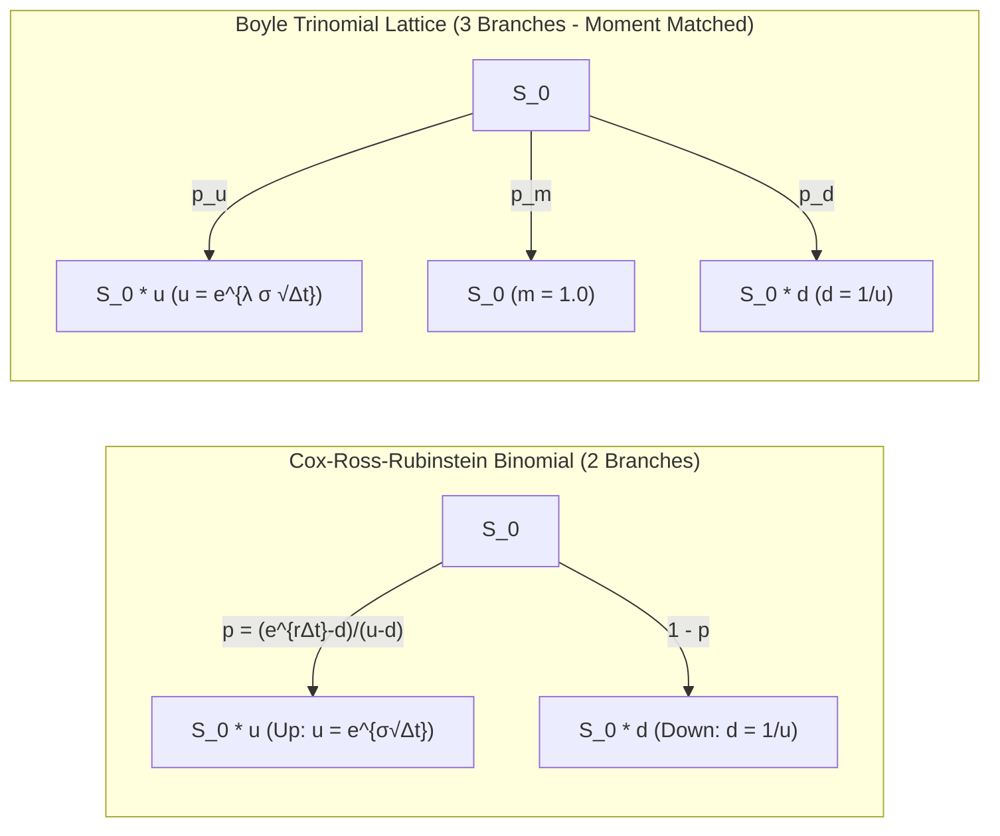
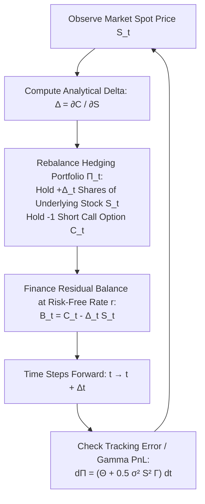
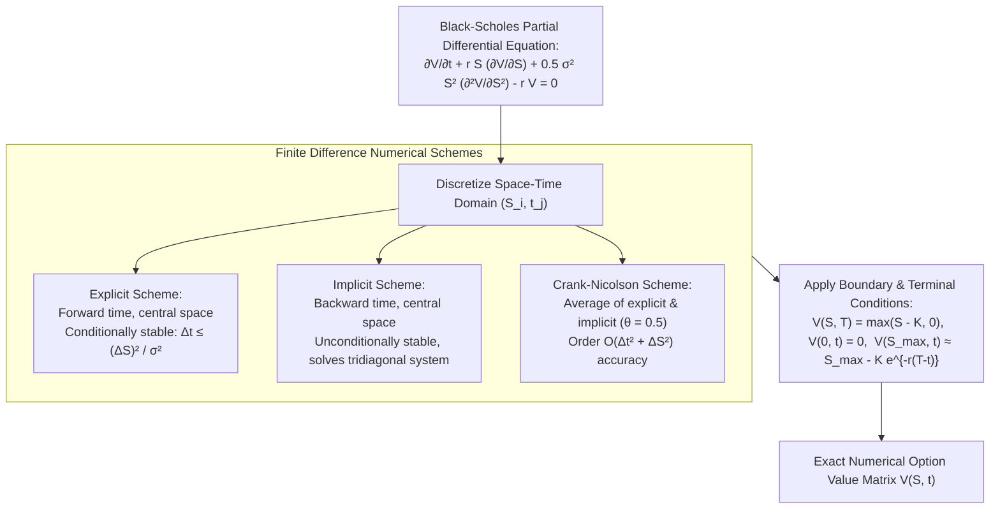
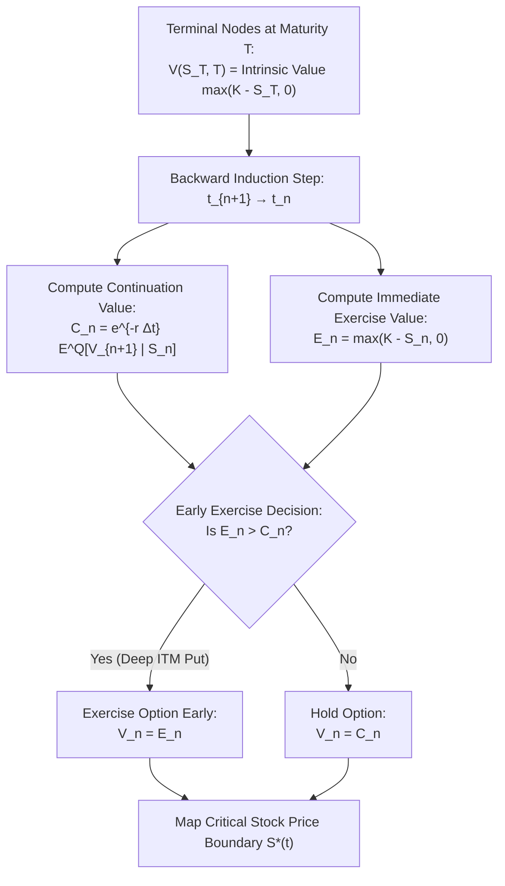

# Derivative Pricing (MScFE 610)

This directory contains Jupyter notebooks, Python source code, lecture materials, and Group Work Project (GWP) submissions for **Derivative Pricing**. The module covers analytical, numerical, and simulation techniques for pricing derivatives: forward/futures pricing, discrete lattice models (Cox-Ross-Rubinstein Binomial, Boyle Trinomial trees), Black-Scholes-Merton continuous partial differential equations (PDEs), the Greeks, exotic options pricing via Monte Carlo (Asian, Barrier, Longstaff-Schwartz Least-Squares for American options), implied volatility surfaces & Dupire local volatility, and Finite Difference Methods (Explicit, Implicit, Crank-Nicolson).

---

## 📚 Module Overview

- **Course Code**: MScFE 610
- **Primary Focus**: Arbitrage-free pricing, risk-neutral valuation ($\mathbb{Q}$-measure), discrete lattice moment-matching, Black-Scholes PDE analytical derivations and numerical solutions, dynamic delta hedging, exotic option path simulation, volatility surface calibration, and finite difference schemes.
- **Key Stack & Tools**: Python (`numpy`, `scipy`, `matplotlib`, `pandas`), Jupyter Notebooks, Newton-Raphson implied volatility solvers, Tridiagonal Matrix Algorithm (Thomas algorithm).

---

> [!IMPORTANT]
> **🎓 Master Pedagogical Architecture & Key Takeaways**:
> Access the structured 4-tier quantitative breakdown with worked numerical calculations and calculus derivations in **[`key-takeaway.md`](./key-takeaway.md)**:
> - 📐 **[Risk-Neutral Drift Independence & Call Option Math](./key-takeaway.md#toy-example-1-real-world-drift-vs-risk-neutral-pricing)**
> - ⏳ **[Gamma-Theta Convexity Trade-off Equilibrium](./key-takeaway.md#toy-example-2-black-scholes-gamma-theta-convexity-trade-off)**
> - 🧮 **[Black-Scholes PDE Dynamic Hedging Derivation](./key-takeaway.md#1-black-scholes-dynamic-hedging-pde-derivation)**
> - 🌊 **[Dupire Local Volatility Surface Derivations](./key-takeaway.md#4-dupire-local-volatility-partial-differential-derivation)**

---

## 📊 Visual Frameworks & Architecture

### 1. Lattice Branching Mechanics: CRR Binomial vs. Trinomial Tree — [*Detailed Math & Calculations in key-takeaway.md*](./key-takeaway.md#3-binomial-crr-vs-trinomial-boyle-lattice-calculus)

### 2. Dynamic Delta Hedging & Arbitrage-Free Replication Cycle

### 3. Black-Scholes PDE Boundary Value Problem & Finite Difference Grid

### 4. American Option Early Exercise Boundary & Backward Induction

---

## 📖 Sub-Module & Detailed File Breakdown

### [Module 2: Forward & Futures Contracts](./m2)
- **Lessons & Code**:
  - [`m2/L1-code.ipynb`](./m2/L1-code.ipynb): **Spot-Forward Parity & Cost of Carry**.
    - Arbitrage-free forward price on asset with continuous dividend yield $q$ and storage cost $c$:
      $$F_0 = S_0 e^{(r + c - q)T}$$
    - Cash-and-carry vs. reverse cash-and-carry arbitrage bounds.
  - [`m2/L2-code.ipynb`](./m2/L2-code.ipynb): **Forward Contract Valuation Over Time**.
    - Mark-to-market value of an existing forward contract with delivery price $K$ at time $t < T$:
      $$V_t = S_t e^{-q(T-t)} - K e^{-r(T-t)}$$
  - [`m2/L3-code.ipynb`](./m2/L3-code.ipynb): **Hedging with Futures & Optimal Hedge Ratio**.
    - Minimum variance hedge ratio: $h^* = \rho_{SF} \frac{\sigma_S}{\sigma_F}$.
    - Number of futures contracts: $N^* = h^* \frac{Q_A}{Q_F}$.

---

### [Module 3: Binomial & Trinomial Lattice Pricing](./m3)
- **Lessons & Code**:
  - [`m3/L1-code.ipynb`](./m3/L1-code.ipynb): **Cox-Ross-Rubinstein (CRR) Binomial Trees**.
    - Lattice parameters matching mean and variance of Geometric Brownian Motion:
      $$u = e^{\sigma \sqrt{\Delta t}}, \quad d = \frac{1}{u} = e^{-\sigma \sqrt{\Delta t}}, \quad p = \frac{e^{(r-q)\Delta t} - d}{u - d}$$
  - [`m3/L2-code.ipynb`](./m3/L2-code.ipynb): **Multi-Period Risk-Neutral Pricing**.
    - Option price via backward induction: $V_{i, j} = e^{-r\Delta t} [p V_{i+1, j+1} + (1-p) V_{i+1, j}]$.
  - [`m3/L3-code.ipynb`](./m3/L3-code.ipynb): **American Options & Early Exercise**.
    - Dynamic programming equation:
      $$V_{i, j} = \max\left(h(S_{i,j}), \; e^{-r\Delta t} \left[p V_{i+1, j+1} + (1-p) V_{i+1, j}\right]\right)$$
  - [`m3/L4-code.ipynb`](./m3/L4-code.ipynb): **Boyle Trinomial Lattice Pricing**.
    - Up, middle, and down jump multipliers: $u = e^{\lambda \sigma \sqrt{\Delta t}}$, $m = 1$, $d = 1/u$ (with standard $\lambda = \sqrt{3}$).
    - Transition probabilities:
      $$p_u = \frac{1}{2\lambda^2} + \frac{(r - q - \frac{1}{2}\sigma^2)\sqrt{\Delta t}}{2\lambda \sigma}, \quad p_d = \frac{1}{2\lambda^2} - \frac{(r - q - \frac{1}{2}\sigma^2)\sqrt{\Delta t}}{2\lambda \sigma}, \quad p_m = 1 - p_u - p_d$$

---

### [Module 4: Black-Scholes Model & The Greeks](./m4)
- **Lessons & Code**:
  - [`m4/L1-code.ipynb`](./m4/L1-code.ipynb): **Black-Scholes-Merton Analytical Formulation**.
    - European Call and Put formulas with continuous dividend $q$:
      $$C(S, t) = S e^{-q(T-t)} \Phi(d_1) - K e^{-r(T-t)} \Phi(d_2)$$
      $$P(S, t) = K e^{-r(T-t)} \Phi(-d_2) - S e^{-q(T-t)} \Phi(-d_1)$$
      $$d_1 = \frac{\ln(S/K) + (r - q + \frac{1}{2}\sigma^2)(T-t)}{\sigma \sqrt{T-t}}, \quad d_2 = d_1 - \sigma \sqrt{T-t}$$
  - [`m4/L2-code.ipynb`](./m4/L2-code.ipynb): **The Greeks (Sensitivity Measures)**.
    - **Delta**: $\Delta_C = e^{-q\tau} \Phi(d_1)$, $\Delta_P = -e^{-q\tau} \Phi(-d_1)$
    - **Gamma**: $\Gamma = \frac{e^{-q\tau} \phi(d_1)}{S \sigma \sqrt{\tau}}$
    - **Vega**: $\mathcal{V} = S e^{-q\tau} \phi(d_1) \sqrt{\tau}$
    - **Theta**: $\Theta_C = -\frac{S e^{-q\tau} \phi(d_1) \sigma}{2\sqrt{\tau}} + q S e^{-q\tau}\Phi(d_1) - r K e^{-r\tau}\Phi(d_2)$
    - **Rho**: $\rho_C = K \tau e^{-r\tau} \Phi(d_2)$, $\rho_P = -K \tau e^{-r\tau} \Phi(-d_2)$
  - [`m4/L3-code.ipynb`](./m4/L3-code.ipynb): **Implied Volatility (IV) Numerical Solvers**.
    - Newton-Raphson root-finding: $\sigma_{n+1} = \sigma_n - \frac{C_{\text{BS}}(\sigma_n) - C_{\text{market}}}{\mathcal{V}(\sigma_n)}$.
    - Bisection algorithm for robust fallback under low Vega.
  - [`m4/L4-code.ipynb`](./m4/L4-code.ipynb): **Delta-Neutral Portfolio Simulation**.
    - Dynamic delta hedging simulations under discrete rebalancing intervals $\Delta t$.

---

### [Module 5: Monte Carlo Methods & Exotic Options](./m5)
- **Lessons & Code**:
  - [`m5/L1-code.ipynb`](./m5/L1-code.ipynb): **Monte Carlo Asset Path Generation**.
    - Simulating Geometric Brownian Motion: $S_{t+\Delta t} = S_t \exp\left((r - q - \frac{1}{2}\sigma^2)\Delta t + \sigma \sqrt{\Delta t} Z\right)$.
  - [`m5/L2-code.ipynb`](./m5/L2-code.ipynb): **Asian Options (Path-Dependent)**.
    - Arithmetic average strike/price: $A_T = \frac{1}{M} \sum_{i=1}^M S_{t_i}$, Payoff $= \max(A_T - K, 0)$.
    - Analytical geometric average benchmark used as a control variate.
  - [`m5/L3-code.ipynb`](./m5/L3-code.ipynb): **Barrier Options**.
    - Up-and-Out, Down-and-In barrier monitoring with continuous monitoring corrections (*Broadie, Glasserman, & Kou*).
  - [`m5/L4-code.ipynb`](./m5/L4-code.ipynb): **Longstaff-Schwartz Least-Squares Monte Carlo (LSM)**.
    - Pricing American options via cross-sectional regression of continuation values onto orthogonal Laguerre/Hermite polynomials.

---

### [Module 6: Volatility Surfaces & Local Volatility](./m6)
- **Lecture Materials, Projects & Data**:
  - [`m6/DP_M6_L1.pdf`](./m6/DP_M6_L1.pdf) & [`m6/DP_M6_L2.pdf`](./m6/DP_M6_L2.pdf): **Empirical Volatility Smiles & Skews**.
    - Moneyness metrics ($K/S_0$, $\Delta$, $\ln(K/F_T)/\sqrt{T}$).
    - Volatility smile dynamics across equity (skew), FX (smile), and commodity markets.
  - [`m6/DP_M6_L3.pdf`](./m6/DP_M6_L3.pdf) & [`m6/DP_M6_L4.pdf`](./m6/DP_M6_L4.pdf): **Dupire's Local Volatility Equation**.
    - Exact non-parametric local volatility surface $\sigma_{\text{loc}}(K, T)$ extracted from European call surface $C(K, T)$:
      $$\sigma_{\text{loc}}^2(K, T) = \frac{\frac{\partial C}{\partial T} + q C + K(r - q) \frac{\partial C}{\partial K}}{\frac{1}{2} K^2 \frac{\partial^2 C}{\partial K^2}}$$
  - [`m6/Options_chain.xlsx`](./m6/Options_chain.xlsx): Real market option chain dataset across strikes and maturities.
  - [`m6/Project.ipynb`](./m6/Project.ipynb) & [`m6/Project (1).ipynb`](./m6/Project%20(1).ipynb): Practical volatility surface construction.
  - [`m6/graded_quiz.ipynb`](./m6/graded_quiz.ipynb): Assessment exercises.

---

### [Module 7: Finite Difference Methods & GWP2](./m7)
- **Lecture Materials, Projects & Group Work**:
  - [`m7/DP_M7_L1.pdf`](./m7/DP_M7_L1.pdf) & [`m7/DP_M7_L2.pdf`](./m7/DP_M7_L2.pdf): **Finite Difference Discretization**.
    - Explicit, Implicit, and Crank-Nicolson numerical schemes on PDE transformed grid ($x = \ln S, \tau = T - t$).
  - [`m7/DP_M7_L3.pdf`](./m7/DP_M7_L3.pdf) & [`m7/DP_M7_L4.pdf`](./m7/DP_M7_L4.pdf): **Boundary Conditions & Stability Analysis**.
    - Von Neumann stability analysis; Tridiagonal Matrix Algorithm (Thomas algorithm) for implicit steps.
  - [`m7/DP_GWP_2.ipynb`](./m7/DP_GWP_2.ipynb): Complete Group Work Project 2 implementation.
  - [`m7/L2_Project.ipynb`](./m7/L2_Project.ipynb) & [`m7/L4_Project.ipynb`](./m7/L4_Project.ipynb): Project notebooks implementing PDE solvers.
  - [`m7/graded_quiz.ipynb`](./m7/graded_quiz.ipynb): Numerical PDE assessment.

---

### [Group Work Project (GWP): Trinomial Option Valuation](./gwp)
- **Project Files**:
  - [`gwp/gwp_trinomial.ipynb`](./gwp/gwp_trinomial.ipynb): Complete implementation comparing Trinomial tree convergence against Black-Scholes and Monte Carlo benchmarks.
  - [`gwp/trinomial_option_analysis.png`](./gwp/trinomial_option_analysis.png): Visual analysis comparing step convergence rates and American early exercise curves.
  - [`gwp/GWP_Derivative_Pricing.pdf`](./gwp/GWP_Derivative_Pricing.pdf): Final technical report.

#### Embedded Visual Analysis:

*Figure 1: Numerical convergence and early exercise boundary of American options evaluated on a Trinomial Lattice.*

---

## 🔑 Key Takeaways & Quantitative Rules

1. **Risk-Neutral Valuation ($\mathbb{Q}$-Measure)**: Under no-arbitrage conditions, option payoffs are evaluated by discounting expected terminal payoffs at the risk-free rate $r$, entirely independent of the underlying asset's real-world expected drift $\mu$.
2. **Trinomial Tree Convergence Advantage**: By introducing a middle state ($m=1$) and matching higher moments, Boyle trinomial trees smooth out the parity oscillation errors typical of CRR binomial models, achieving faster convergence for American options.
3. **The Black-Scholes Gamma-Theta Trade-off**: For a delta-neutral hedged portfolio, the Theta decay is exactly offset by Gamma profits: $\Theta + \frac{1}{2} \sigma^2 S^2 \Gamma = r \Pi$. Options are essentially a long volatility/gamma bet funded by time decay.
4. **Dupire Local Volatility**: Implied volatility $\sigma_{\text{IV}}(K,T)$ is an aggregate market average; Dupire's local volatility $\sigma_{\text{loc}}(S,t)$ represents the unique state-dependent diffusion coefficient that recovers all European market prices.

---

## 🔗 Cross-Module Knowledge Linkages

- **$\to$ [03_stochastic_modelling](../03_stochastic_modelling/README.md)**: Continuous Ito calculus and SDEs provide the mathematical foundation for Black-Scholes PDE and Monte Carlo engines.
- **$\to$ [01_financial_market](../01_financial_market/README.md)**: Foundational option payoffs, Put-Call parity, and the Merton structural model feed directly into derivative pricing theory.
- **$\to$ [08_deep_learning](../08_deep_learning/README.md)**: Deep BSDE solvers and Physics-Informed Neural Networks (PINNs) solve high-dimensional non-linear pricing PDEs.