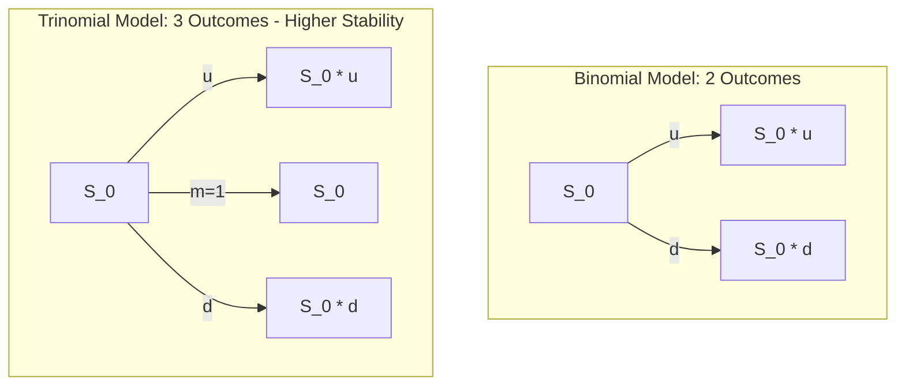
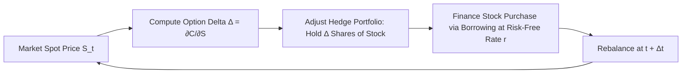
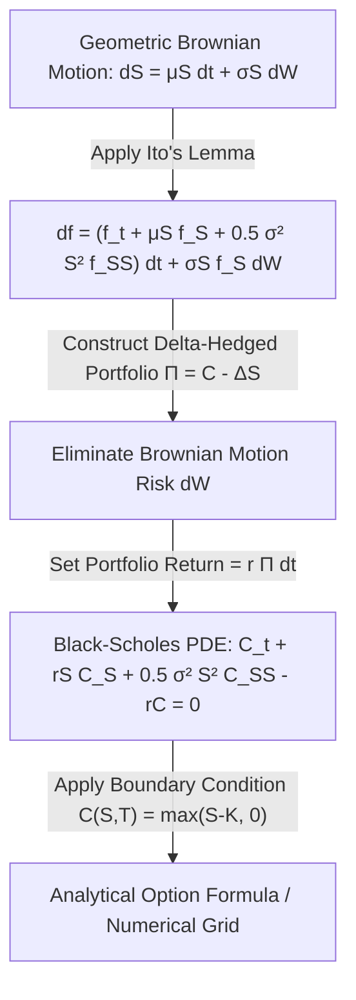
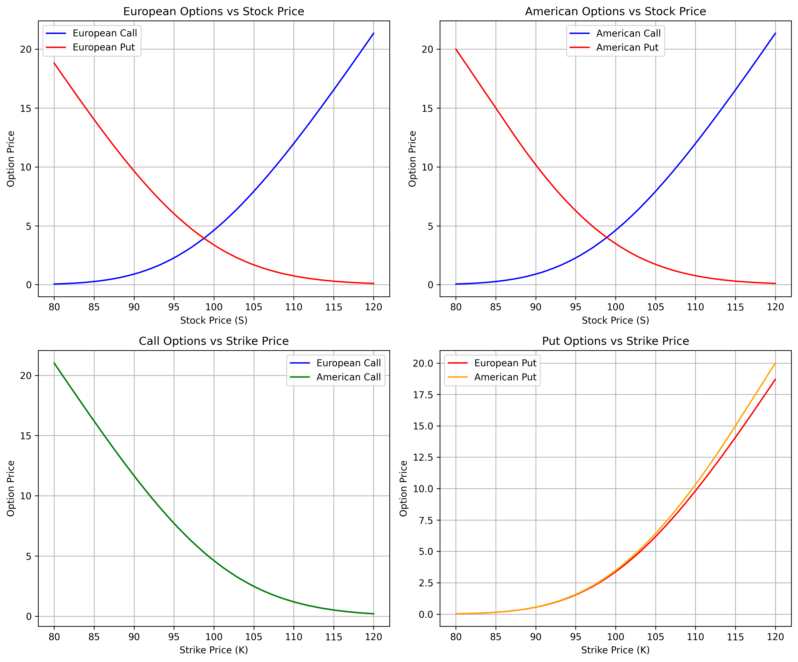

# Derivative Pricing (MScFE 610)

This directory contains Jupyter notebooks, Python source code, lecture materials, and Group Work Project (GWP) submissions for **Derivative Pricing**. The module covers option pricing mechanics, binomial/trinomial trees, the Black-Scholes PDE, Monte Carlo pricing, and dynamic hedging strategies.

---

## 📚 Module Overview

- **Course Code**: MScFE 610
- **Primary Focus**: Continuous-time option pricing models, numerical lattice methods, Greeks ($\Delta, \Gamma, \Theta, \ Vega, \rho$), risk-neutral valuation ($\mathbb{Q}$-measure), and volatility smile surface fitting.
- **Key Stack**: Python (`numpy`, `scipy`, `matplotlib`, `pandas`), Jupyter Notebooks.

---

## 📊 Visual Frameworks & Architecture

### 1. Lattice Branching Architecture (Binomial vs Trinomial Trees)

### 2. Dynamic Delta Hedging Execution Loop

### 3. Black-Scholes Partial Differential Equation (PDE) Derivation

---

## 📖 Sub-Module & Detailed File Breakdown

### [Module 2: Forward & Futures Contracts](./m2)
- **Lessons**:
  - [`m2/L1-code.ipynb`](./m2/L1-code.ipynb): Spot-Forward parity $F_0 = S_0 e^{(r+c-y)T}$, cost of carry.
  - [`m2/L2-code.ipynb`](./m2/L2-code.ipynb): Value of forward contract over time $V_t = S_t - K e^{-r(T-t)}$.
  - [`m2/L3-code.ipynb`](./m2/L3-code.ipynb): Hedging commodity & currency risks with futures.

---

### [Module 3: Binomial & Trinomial Lattice Pricing](./m3)
- **Lessons**:
  - [`m3/L1-code.ipynb`](./m3/L1-code.ipynb): One-period and multi-period Cox-Ross-Rubinstein (CRR) Binomial tree.
  - [`m3/L2-code.ipynb`](./m3/L2-code.ipynb): Risk-neutral probabilities $p = \frac{e^{r\Delta t} - d}{u - d}$.
  - [`m3/L3-code.ipynb`](./m3/L3-code.ipynb): American option pricing & early exercise boundary checking $V_n = \max(h(S_n), e^{-r\Delta t} \mathbb{E}^\mathbb{Q}[V_{n+1}])$.
  - [`m3/L4-code.ipynb`](./m3/L4-code.ipynb): Trinomial tree implementation with probability stability condition ($p_u, p_m, p_d > 0$).

---

### [Module 4: Black-Scholes Model & Greeks](./m4)
- **Lessons**:
  - [`m4/L1-code.ipynb`](./m4/L1-code.ipynb): Analytical Black-Scholes formula for Call ($C$) and Put ($P$).
  - [`m4/L2-code.ipynb`](./m4/L2-code.ipynb): Option Greeks computation ($\Delta, \Gamma, \Theta, \ Vega, \rho$).
  - [`m4/L3-code.ipynb`](./m4/L3-code.ipynb): Implied Volatility (IV) solver using Newton-Raphson & bisection algorithm.
  - [`m4/L4-code.ipynb`](./m4/L4-code.ipynb): Delta-neutral portfolio hedging simulations.

---

### [Module 5: Monte Carlo Methods & Exotic Options](./m5)
- **Lessons & Code**:
  - [`m5/README.md`](./m5/README.md): Detailed Module 5 summary.
  - [`m5/L1-code.ipynb`](./m5/L1-code.ipynb): Monte Carlo path generation under Geometric Brownian Motion (GBM).
  - [`m5/L2-code.ipynb`](./m5/L2-code.ipynb): Pricing Asian options (Arithmetic vs Geometric mean strike/price).
  - [`m5/L3-code.ipynb`](./m5/L3-code.ipynb): Barrier options (Up-and-Out, Down-and-In) pricing.
  - [`m5/L4-code.ipynb`](./m5/L4-code.ipynb): Longstaff-Schwartz Least-Squares Monte Carlo (LSM) for American options.

---

### [Group Work Project (GWP): Trinomial Option Valuation](./gwp)
- **Files**:
  - [`gwp/README.md`](./gwp/README.md): Group Work Project overview.
  - [`gwp/gwp_trinomial.ipynb`](./gwp/gwp_trinomial.ipynb): Complete Python code for American/European options using Trinomial trees.
  - [`gwp/trinomial_option_analysis.png`](./gwp/trinomial_option_analysis.png): Visual analysis plot comparing convergence rates and exercise boundaries.
  - [`gwp/GWP_Derivative_Pricing.pdf`](./gwp/GWP_Derivative_Pricing.pdf): Final technical report submission.

#### Embedded Visual Chart:

*Figure 1: Numerical convergence and early exercise boundary of American options on a Trinomial Tree.*

---

## 🔑 Key Takeaways & Quantitative Rules

1. **Risk-Neutral Pricing**: Options are priced by discounting expected payoffs under the risk-neutral measure $\mathbb{Q}$, independent of the real-world drift $\mu$.
2. **Trinomial Stability**: Trinomial trees add a middle branch ($m=1$), improving numerical stability and convergence speeds over standard CRR Binomial trees for barrier and American options.
3. **Delta Hedging Noise**: Discrete rebalancing introduces gamma risk ($\Gamma$). As rebalancing frequency $\Delta t \to 0$, hedge error approaches zero.
4. **Early Exercise of Puts**: American Puts may be exercised early when deep in-the-money if the time value lost is less than interest earned on the strike price $K$.

---

## 🔗 Cross-Module Knowledge Linkages

- **$\to$ [03_stochastic_modelling](../03_stochastic_modelling/README.md)**: Ito's Lemma and Geometric Brownian Motion form the SDE foundation for Black-Scholes.
- **$\to$ [01_financial_market](../01_financial_market/README.md)**: Options payoff mechanics and credit default options (Merton model).
- **$\to$ [08_deep_learning](../08_deep_learning/README.md)**: Deep BSDE solvers and neural networks for high-dimensional option pricing.