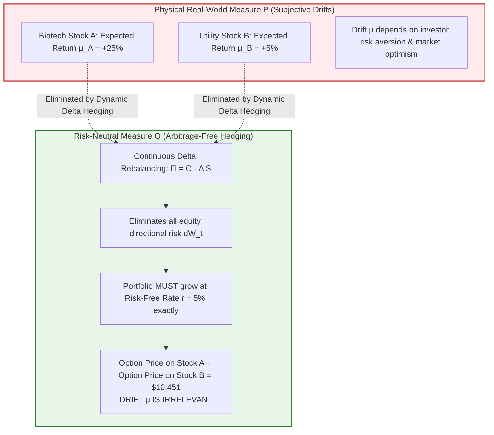
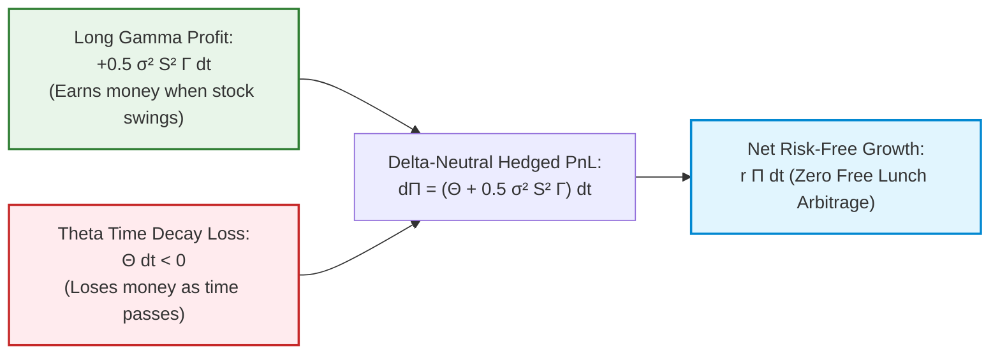
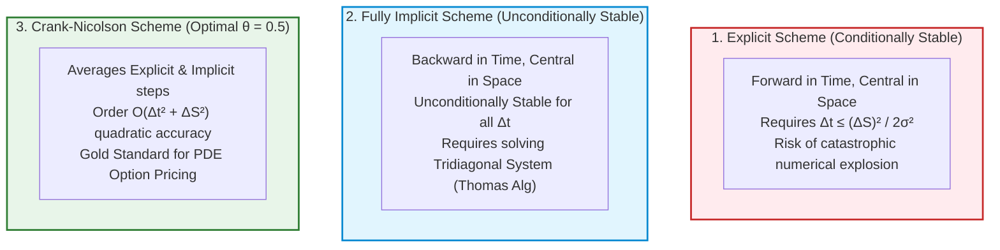

# Derivative Pricing — Key Pedagogical Takeaways
## MScFE 610 Master Quantitative Synthesis

[← Back to Main README.md](./README.md)

---

## 📖 Table of Contents & Quick Module Links
1. [Core Intuition & Mechanical Failure Modes](#1-core-intuition--mechanical-failure-modes)
   - [Toy Example 1: Real-World Drift vs Risk-Neutral Pricing](#toy-example-1-real-world-drift-vs-risk-neutral-pricing)
   - [Toy Example 2: Black-Scholes Gamma-Theta Convexity Trade-off](#toy-example-2-black-scholes-gamma-theta-convexity-trade-off)
   - [Toy Example 3: American Early Exercise Boundary Dynamics](#toy-example-3-american-early-exercise-boundary-dynamics)
2. [Core Mathematical Formulations & Calculus Derivations](#2-core-mathematical-formulations--calculus-derivations)
   - [1. Black-Scholes Dynamic Hedging PDE Derivation](#1-black-scholes-dynamic-hedging-pde-derivation)
   - [2. Black-Scholes Closed-Form Analytical Solution & Greeks](#2-black-scholes-closed-form-analytical-solution--greeks)
   - [3. Binomial CRR vs Trinomial Boyle Lattice Calculus](#3-binomial-crr-vs-trinomial-boyle-lattice-calculus)
   - [4. Dupire Local Volatility Partial Differential Derivation](#4-dupire-local-volatility-partial-differential-derivation)
3. [Practical Engineering & Finite Difference Numerical Stability](#3-practical-engineering--finite-difference-numerical-stability)
4. [Comparative Synthesis Cheat Sheet](#4-comparative-synthesis-cheat-sheet)
5. [Comprehensive Mathematical Notation & Variable Glossary](#5-comprehensive-mathematical-notation--variable-glossary)

---

<a id="1-core-intuition--mechanical-failure-modes"></a>
## 1. Core Intuition & Mechanical Failure Modes

<a id="toy-example-1-real-world-drift-vs-risk-neutral-pricing"></a>
### Toy Example 1: Real-World Drift vs Risk-Neutral Pricing

#### 💡 The Intuitive Metaphor (Easiest to Understand)
Imagine betting on a horse race where you can dynamically buy and sell insurance on the horses during the race. Because the insurance company can continuously rebalance its portfolio to cancel out all risk, the price of the insurance option depends **only on the interest rate of holding money**, not on how fast the horse can run! 
In Black-Scholes, stock expected return $\mu$ is completely eliminated by dynamic delta hedging.

#### 🏷️ Notation Breakdown:
- $S_0, S_t$: **Underlying Stock Spot Price** at $t=0$ and time $t$.
- $K$: **Option Strike Price** (Pre-agreed exercise price at maturity $T$).
- $T, \tau$: **Maturity Horizon & Time to Expiration** ($\tau = T - t$, in years).
- $r$: **Continuously Compounded Risk-Free Interest Rate** ($0.05 = 5\%$).
- $\sigma$: **Underlying Asset Volatility** (Annualized standard deviation of returns).
- $\mu$: **Real-World Physical Drift Rate** (Irrelevant under risk-neutral $\mathbb{Q}$-measure).
- $d_1, d_2$: **Standardized Black-Scholes Moneyness Metrics**.
- $\Phi(x)$: **Standard Normal Cumulative Distribution Function (CDF)**.
- $C$: **European Call Option Theoretical Price**.

#### 🔢 Step-by-Step Numerical Calculation
- Underlying Price: $S_0 = \$100$
- Strike Price: $K = \$100$
- Maturity: $T = 1.0\text{ year}$
- Risk-free Rate: $r = 5\%$ ($0.05$)
- Volatility: $\sigma = 20\%$ ($0.20$)
- Real-world expected return: $\mu_A = 25\%$ (Biotech stock) vs $\mu_B = 5\%$ (Utility stock).

**Step 1: Compute $d_1$ and $d_2$**:

$$d_1 = \frac{\ln(100/100) + (0.05 + 0.5 \times 0.20^2) \times 1}{0.20 \times 1} = \frac{0 + 0.07}{0.20} = 0.35$$

$$d_2 = d_1 - \sigma \sqrt{T} = 0.35 - 0.20 = 0.15$$

**Step 2: Lookup $\Phi(d)$**:
- $\Phi(d_1) = \Phi(0.35) \approx 0.63683$
- $\Phi(d_2) = \Phi(0.15) \approx 0.55962$

**Step 3: Compute Call Price $C$**:

$$C = S_0 \Phi(d_1) - K e^{-rT} \Phi(d_2) = 100 \times 0.63683 - 100 \times e^{-0.05} \times 0.55962$$

$$C = 63.683 - 100 \times 0.95123 \times 0.55962 = 63.683 - 53.232 = \$10.451$$

Notice that $\mu_A = 25\%$ and $\mu_B = 5\%$ **do not appear anywhere** in this equation! Both options cost exactly $\$10.451$.

#### 📊 Visual Risk-Neutral Replication Paradigm:



---

<a id="toy-example-2-black-scholes-gamma-theta-convexity-trade-off"></a>
### Toy Example 2: Black-Scholes Gamma-Theta Convexity Trade-off

#### 💡 The Intuitive Metaphor (Easiest to Understand)
Buying an option is like buying a ticket to a high-stakes raffle that burns away in your hand every passing second ($\Theta < 0$). You only make money if the raffle prize moves enough to cover the cost of your burning ticket!

#### 🏷️ Notation Breakdown:
- $\Delta$: **Option Delta** ($\frac{\partial C}{\partial S}$, hedge ratio).
- $\Gamma$: **Option Gamma** ($\frac{\partial^2 C}{\partial S^2}$, curvature / convexity).
- $\Theta$: **Option Theta** ($\frac{\partial C}{\partial t}$, time decay per unit time).
- $\Pi$: **Delta-Neutral Portfolio** ($\Pi = C - \Delta S$).
- $\Theta + \frac{1}{2}\sigma^2 S^2 \Gamma = r\Pi$: **Fundamental PDE Equilibrium Trade-off**.

#### 🔢 Step-by-Step Calculation
For the option above ($S_0 = 100, K = 100, \sigma = 0.20, r = 0.05$):
- **Gamma $\Gamma$**:

$$\Gamma = \frac{\phi(d_1)}{S_0 \sigma \sqrt{T}} = \frac{0.37524}{100 \times 0.20 \times 1} = 0.01876$$

- **Theta $\Theta$**:

$$\Theta = -\frac{S_0 \phi(d_1) \sigma}{2\sqrt{T}} - r K e^{-rT} \Phi(d_2) = -\frac{100 \times 0.37524 \times 0.20}{2} - 0.05 \times 100 \times 0.95123 \times 0.55962 = -3.7524 - 2.6616 = -6.414 \text{ / year} \quad (-0.01756 \text{ / day})$$

Checking PDE equilibrium for Delta-neutral portfolio:

$$\Theta + \frac{1}{2}\sigma^2 S^2 \Gamma = -6.414 + 0.5 \times (0.04) \times (10000) \times (0.01876) = -6.414 + 3.752 = -2.662 \approx r \Pi$$

#### 📊 Visual Gamma-Theta Balance:



---

<a id="toy-example-3-american-early-exercise-boundary-dynamics"></a>
### Toy Example 3: American Early Exercise Boundary Dynamics

#### 💡 The Intuitive Metaphor (Easiest to Understand)
Holding a deep in-the-money American put option when the company goes bankrupt ($S = 0$) is like holding a check for $100 that you refuse to cash until next year. Cashing it today lets you earn bank interest on $100 right now!

#### 🏷️ Notation Breakdown:
- $S^\star(t)$: **Critical Early Exercise Price Boundary** (Optimal exercise threshold).
- $h(S)$: **Intrinsic Exercise Value** ($\max(K - S, 0)$ for Put).
- $C(S, t)$: **Continuation Value** ($e^{-r\Delta t}\mathbb{E}^{\mathbb{Q}}[V_{t+\Delta t} \mid S_t]$).

#### 📊 Visual American Put Early Exercise Free Boundary:

```
        American Put Optimal Early Exercise Decision Map
 Stock Price S
    ^
  K |------------------------------------------ (Strike Price K = $100)
    |                     /
    |                    /   CONTINUATION REGION
    |                   /   Hold Option: V(S, t) = Continuation Value
    |                  /
S*(t)| - - - - - - - -/ 
    |               / 
    |              /   EARLY EXERCISE REGION
    |             /   Exercise Now: V(S, t) = K - S
  0 +------------+------------------------------> Time t
    0 (Today)                                 T (Maturity)
                 <--- Backward Induction Steps
```

---

<a id="2-core-mathematical-formulations--calculus-derivations"></a>
## 2. Core Mathematical Formulations & Calculus Derivations

<a id="1-black-scholes-dynamic-hedging-pde-derivation"></a>
### 1. Black-Scholes Dynamic Hedging PDE Derivation
Construct riskless portfolio $\Pi = V - \Delta S$. Applying Ito's Lemma to $dV$:

$$dV = \left( \frac{\partial V}{\partial t} + \mu S \frac{\partial V}{\partial S} + \frac{1}{2}\sigma^2 S^2 \frac{\partial^2 V}{\partial S^2} \right) dt + \sigma S \frac{\partial V}{\partial S} dW$$

Choosing $\Delta = \frac{\partial V}{\partial S}$ eliminates $dW$:

$$d\Pi = \left( \frac{\partial V}{\partial t} + \frac{1}{2}\sigma^2 S^2 \frac{\partial^2 V}{\partial S^2} \right) dt$$

Setting $d\Pi = r \Pi dt = r(V - \frac{\partial V}{\partial S} S) dt$ yields the Black-Scholes PDE:

$$\frac{\partial V}{\partial t} + r S \frac{\partial V}{\partial S} + \frac{1}{2}\sigma^2 S^2 \frac{\partial^2 V}{\partial S^2} - r V = 0$$

---

<a id="2-black-scholes-closed-form-analytical-solution--greeks"></a>
### 2. Black-Scholes Closed-Form Analytical Solution & Greeks

$$\Delta_C = \frac{\partial C}{\partial S} = e^{-q\tau} \Phi(d_1), \quad \Gamma = \frac{\partial^2 C}{\partial S^2} = \frac{e^{-q\tau}\phi(d_1)}{S\sigma\sqrt{\tau}}, \quad \mathcal{V} = \frac{\partial C}{\partial \sigma} = S e^{-q\tau} \phi(d_1) \sqrt{\tau}$$

---

<a id="3-binomial-crr-vs-trinomial-boyle-lattice-calculus"></a>
### 3. Binomial CRR vs Trinomial Boyle Lattice Calculus

$$\text{CRR Parameters:} \quad u = e^{\sigma\sqrt{\Delta t}}, \quad d = e^{-\sigma\sqrt{\Delta t}}, \quad p = \frac{e^{(r-q)\Delta t} - d}{u - d}$$

---

<a id="4-dupire-local-volatility-partial-differential-derivation"></a>
### 4. Dupire Local Volatility Partial Differential Derivation

$$\sigma_{\text{loc}}^2(K, T) = \frac{\frac{\partial C}{\partial T} + q C + K(r - q) \frac{\partial C}{\partial K}}{\frac{1}{2} K^2 \frac{\partial^2 C}{\partial K^2}}$$

---

<a id="3-practical-engineering--finite-difference-numerical-stability"></a>
## 3. Practical Engineering & Finite Difference Numerical Stability

### Explicit Scheme Stability Limit
Explicit Finite Difference stability requires mesh ratio $\lambda = \frac{\Delta t}{(\Delta S)^2} \le \frac{1}{2 \sigma^2}$. If violated, numerical errors blow up exponentially. **Crank-Nicolson ($\theta=0.5$)** is unconditionally stable.

#### 📊 Visual Finite Difference Space-Time Discretization Stencils:



---

<a id="4-comparative-synthesis-cheat-sheet"></a>
## 4. Comparative Synthesis Cheat Sheet

| Scheme / Model | PDE / Lattice Formulation | Convergence Rate | Primary Advantage | Mechanical Failure Mode |
| :--- | :--- | :--- | :--- | :--- |
| **Black-Scholes Closed-Form** | Exact analytical integral | Instantaneous | Exact benchmark valuation | Constant volatility assumption |
| **CRR Binomial Tree** | 2-branch lattice | $\mathcal{O}(\Delta t)$ | American early exercise support | Node parity strike oscillation |
| **Boyle Trinomial Tree** | 3-branch lattice | $\mathcal{O}(\Delta t)$ smooth | Higher stability | Memory footprint $O(N^2)$ |
| **Crank-Nicolson FD** | Tridiagonal matrix solver | $\mathcal{O}(\Delta t^2 + \Delta S^2)$ | Unconditionally stable | Requires matrix solver $A x = b$ |
| **Longstaff-Schwartz LSM** | Monte Carlo + OLS basis | $\mathcal{O}(1/\sqrt{M})$ | High-dimensional American exotics | Basis polynomial mis-specification |

---

<a id="5-comprehensive-mathematical-notation--variable-glossary"></a>
## 5. Comprehensive Mathematical Notation & Variable Glossary

### 📐 Master Variable Reference Table

| Symbol | Mathematical / Financial Meaning | Typical Range / Units | Context & Core Formula |
| :--- | :--- | :--- | :--- |
| **$S_0, S_t$** | Underlying Asset Spot Price today and at time $t$ | USD per share | Black-Scholes PDE: $S \in (0, \infty)$ |
| **$K$** | Option Strike Price (Exercise price) | USD per share | Payoffs: $\max(S_T - K, 0)$ (Call), $\max(K - S_T, 0)$ (Put) |
| **$T, \tau$** | Maturity Horizon & Time Remaining to Expiration | Years ($\tau = T - t$) | Option pricing time decay |
| **$r$** | Continuous Annualized Risk-Free Rate | Percentage ($0.05 = 5\%$) | Discount factor $e^{-r\tau}$ under $\mathbb{Q}$-measure |
| **$q$** | Continuous Dividend / Foreign Yield | Percentage ($0.02 = 2\%$) | Cost of carry drift $(r - q)$ |
| **$\sigma$** | Volatility of Underlying Asset Returns | Annualized percentage ($0.20 = 20\%$) | Black-Scholes diffusion coefficient |
| **$C, P$** | European Call and Put Option Theoretical Prices | USD per contract | Put-Call Parity: $C - P = S e^{-q\tau} - K e^{-r\tau}$ |
| **$d_1, d_2$** | Standardized Black-Scholes Moneyness Metrics | Real numbers ($\mathbb{R}$) | $d_1 = \frac{\ln(S/K) + (r - q + \frac{1}{2}\sigma^2)\tau}{\sigma\sqrt{\tau}}, \ d_2 = d_1 - \sigma\sqrt{\tau}$ |
| **$\Phi(\cdot), \phi(\cdot)$** | Standard Normal CDF and PDF | Probability $[0, 1]$ / Density | $\Phi(d_1) = \text{Delta (undiscounted)}, \Phi(d_2) = \mathbb{Q}(S_T \ge K)$ |
| **$\Delta$** | **Delta**: Rate of change of option price w.r.t. spot | Call $[0, 1]$, Put $[-1, 0]$ | $\Delta_C = e^{-q\tau}\Phi(d_1), \ \Delta_P = -e^{-q\tau}\Phi(-d_1)$ |
| **$\Gamma$** | **Gamma**: Second spatial derivative (Convexity) | Positive Real ($\Gamma > 0$) | $\Gamma = \frac{e^{-q\tau}\phi(d_1)}{S\sigma\sqrt{\tau}}$ |
| **$\mathcal{V} \text{ (Vega)}$** | **Vega**: Sensitivity of option price to volatility | Positive Real ($\mathcal{V} > 0$) | $\mathcal{V} = S e^{-q\tau}\phi(d_1)\sqrt{\tau}$ |
| **$\Theta$** | **Theta**: Time decay rate of option price per year/day | Negative for long positions | $\Theta_C = -\frac{S e^{-q\tau}\phi(d_1)\sigma}{2\sqrt{\tau}} - r K e^{-r\tau}\Phi(d_2)$ |
| **$\rho$** | **Rho**: Sensitivity of option price to interest rates | $\partial C / \partial r$ | $\rho_C = K\tau e^{-r\tau}\Phi(d_2)$ |
| **$u, d, m$** | Up, Down, and Middle Multipliers in Discrete Trees | Multipliers ($u > 1, d < 1$) | CRR: $u = e^{\sigma\sqrt{\Delta t}}, d = 1/u$ |
| **$p, p_u, p_d, p_m$** | Risk-Neutral Lattice Transition Probabilities | Probability $[0, 1]$ | $p = \frac{e^{(r-q)\Delta t} - d}{u - d}$ |
| **$\sigma_{\text{loc}}(K, T)$** | Dupire Local Volatility Surface | Percentage volatility | $\sigma_{\text{loc}}^2 = \frac{\partial C/\partial T + qC + K(r-q)\partial C/\partial K}{\frac{1}{2}K^2 \partial^2 C/\partial K^2}$ |
| **$\Pi$** | Hedged Delta-Neutral Portfolio | USD | $\Pi = V - \Delta S$; PDE equilibrium: $\Theta + \frac{1}{2}\sigma^2 S^2 \Gamma = r\Pi$ |
| **$h^\star$** | Minimum-Variance Optimal Futures Hedge Ratio | Ratio | $h^\star = \rho_{SF}\frac{\sigma_S}{\sigma_F}$ |
| **$F_0$** | Forward / Futures Price | USD | $F_0 = S_0 e^{(r + c - q)T}$ |
