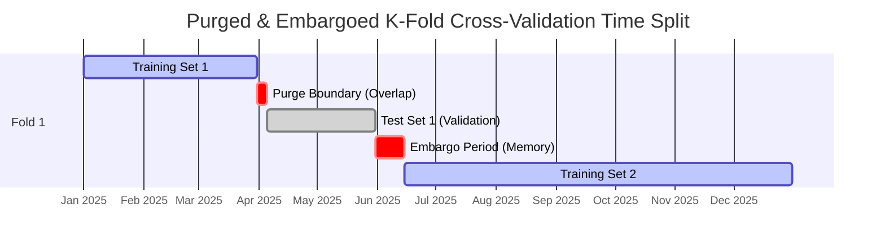
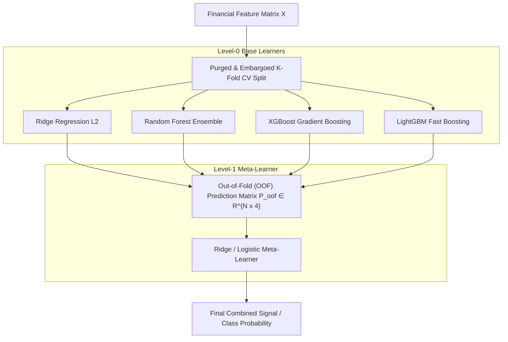
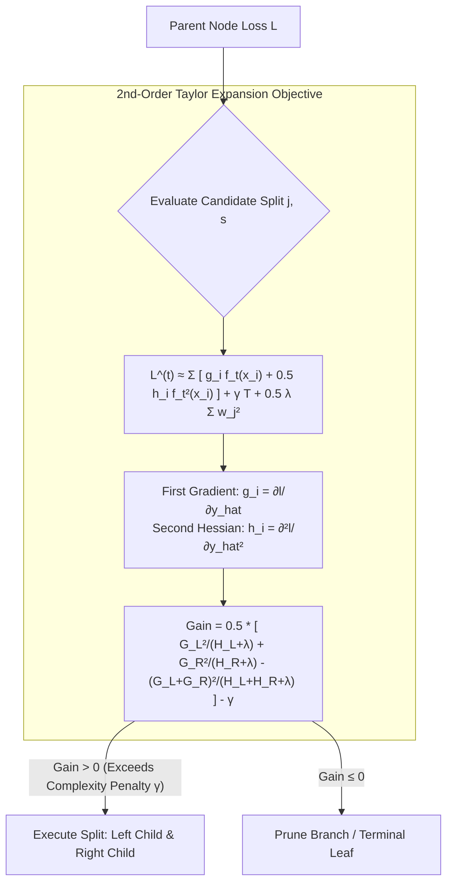
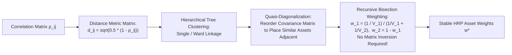

# Machine Learning in Finance (MScFE 650)

This directory contains Jupyter notebooks, Python scripts, lecture notes, datasets, and complete Group Work Projects (GWP1 & GWP2) for **Machine Learning in Finance**. This module covers the application of statistical learning and machine learning algorithms to financial data: supervised linear/regularized regression (OLS, Ridge, Lasso, ElasticNet), classification models (Logistic, SVM, Decision Trees), unsupervised factor discovery & clustering (PCA, K-Means, Hierarchical Clustering, Hierarchical Risk Parity), ensemble methods (Random Forests, AdaBoost, XGBoost, LightGBM), financial cross-validation (Lopez de Prado's Purged & Embargoed K-Fold CV), credit scoring (WoE/IV scorecards, SHAP interpretability), and multi-model Stacking Ensembles.

---

## 📚 Module Overview

- **Course Code**: MScFE 650
- **Primary Focus**: Financial machine learning, data leakage prevention in non-i.i.d. serial time series, regularized loss functions, tree ensembles, feature importance & Shapley attribution, credit risk scoring, and meta-learning ensemble architectures.
- **Key Stack & Tools**: Python (`scikit-learn`, `xgboost`, `lightgbm`, `shap`, `pandas`, `numpy`, `scipy`, `matplotlib`), GWP stacking scripts (`run_ensemble.py`, `gwp2_tuning.py`, `reproduce_cv.py`, `run_bv.py`).

---

> [!IMPORTANT]
> **🎓 Master Pedagogical Architecture & Key Takeaways**:
> Access the structured 4-tier quantitative breakdown with worked numerical calculations and calculus derivations in **[`key-takeaway.md`](./key-takeaway.md)**:
> - ⚠️ **[Purged & Embargoed K-Fold CV Data Leakage Prevention](./key-takeaway.md#toy-example-1-standard-k-fold-cv-data-leakage-illusion)**
> - 🧮 **[Ridge Matrix Derivative & Lasso L1 Soft Thresholding](./key-takeaway.md#1-ridge-and-lasso-loss-function-matrix-derivatives)**
> - ⚡ **[XGBoost 2nd-Order Taylor Expansion Gradients](./key-takeaway.md#2-xgboost-2nd-order-taylor-objective-gradient-derivation)**
> - 🌲 **[Hierarchical Risk Parity (HRP) Allocation Math](./key-takeaway.md#toy-example-3-markowitz-covariance-inversion-vs-hierarchical-risk-parity)**

---

## 📊 Visual Frameworks & Architecture

### 1. Marcos Lopez de Prado's Purged & Embargoed K-Fold CV (Module 5) — [*Detailed Math & Calculations in key-takeaway.md*](./key-takeaway.md#toy-example-1-standard-k-fold-cv-data-leakage-illusion)

### 2. Multi-Model Stacking Ensemble Architecture (GWP2)

### 3. Tree Splitting & XGBoost 2nd-Order Optimization Mechanics

### 4. Hierarchical Risk Parity (HRP) Portfolio Architecture

---

## 📖 Sub-Module & Detailed File Breakdown

### [Module 1: Supervised Regression & Regularization](./M1)
- **Lessons & Code**:
  - [`M1/L1.ipynb`](./M1/L1.ipynb): **Ordinary Least Squares (OLS)**.
    - Matrix formulation: $\hat{\boldsymbol{\beta}} = (\mathbf{X}^T \mathbf{X})^{-1} \mathbf{X}^T \mathbf{y}$.
    - Gauss-Markov assumptions, multicollinearity diagnostics (Variance Inflation Factor $\text{VIF} > 5$).
  - [`M1/L2.ipynb`](./M1/L2.ipynb): **Polynomial Regression & Feature Scaling**.
    - Non-linear feature maps, standardization $Z = (X - \mu)/\sigma$, RobustScaler for fat-tailed financial distributions.
  - [`M1/L3.ipynb`](./M1/L3.ipynb): **Bias-Variance Decomposition**.
    - Expected Mean Squared Error:
      $$\mathbb{E}[(y - \hat{f}(x))^2] = \text{Bias}[\hat{f}(x)]^2 + \text{Var}[\hat{f}(x)] + \sigma_{\epsilon}^2$$
  - [`M1/L4.ipynb`](./M1/L4.ipynb): **Regularized Regression (Ridge, Lasso, ElasticNet)**.
    - **Ridge ($L_2$)**: $\min_{\boldsymbol{\beta}} \|\mathbf{y} - \mathbf{X}\boldsymbol{\beta}\|_2^2 + \lambda \|\boldsymbol{\beta}\|_2^2 \implies \hat{\boldsymbol{\beta}}_{\text{Ridge}} = (\mathbf{X}^T \mathbf{X} + \lambda \mathbf{I})^{-1}\mathbf{X}^T \mathbf{y}$.
    - **Lasso ($L_1$)**: $\min_{\boldsymbol{\beta}} \|\mathbf{y} - \mathbf{X}\boldsymbol{\beta}\|_2^2 + \lambda \|\boldsymbol{\beta}\|_1$ (drives non-informative feature weights to exactly zero).
    - **ElasticNet**: $\min_{\boldsymbol{\beta}} \|\mathbf{y} - \mathbf{X}\boldsymbol{\beta}\|_2^2 + \lambda_1 \|\boldsymbol{\beta}\|_1 + \lambda_2 \|\boldsymbol{\beta}\|_2^2$.
- **Dataset**: [`M1/bank.csv`](./M1/bank.csv).

---

### [Module 2: Classification Models & Risk Metrics](./M2)
- **Lessons & Lecture Readings**:
  - [`M2/L1.ipynb`](./M2/L1.ipynb) & [`M2/L1.pdf`](./M2/L1.pdf): **Logistic Regression & Log-Loss**.
    - Sigmoid link function: $P(y=1 \mid \mathbf{x}) = \sigma(\mathbf{w}^T \mathbf{x} + b) = \frac{1}{1 + e^{-(\mathbf{w}^T \mathbf{x} + b)}}$.
    - Binary cross-entropy loss: $\mathcal{L} = -\frac{1}{N} \sum_{i=1}^N [y_i \ln p_i + (1 - y_i)\ln(1 - p_i)]$.
  - [`M2/L2.ipynb`](./M2/L2.ipynb) & [`M2/L2.pdf`](./M2/L2.pdf): **Decision Trees & Splitting Criteria**.
    - Gini Impurity: $G = 1 - \sum_{k=1}^K p_k^2$; Shannon Entropy: $H = -\sum_{k=1}^K p_k \log_2 p_k$.
    - Information Gain: $\text{IG}(T, a) = H(T) - H(T \mid a)$.
  - [`M2/L3.ipynb`](./M2/L3.ipynb) & [`M2/L3.pdf`](./M2/L3.pdf): **Support Vector Machines (SVM)**.
    - Maximum margin hyperplane: $\min_{\mathbf{w}, b} \frac{1}{2}\|\mathbf{w}\|^2 + C \sum \xi_i$.
    - Dual formulation with Radial Basis Function (RBF) Mercer kernel $K(\mathbf{x}, \mathbf{x}') = \exp(-\gamma \|\mathbf{x} - \mathbf{x}'\|^2)$.
  - [`M2/L4.ipynb`](./M2/L4.ipynb) & [`M2/L4.pdf`](./M2/L4.pdf): **Classification Metrics & Imbalanced Classes**.
    - Confusion matrix, Precision, Recall, $F_1$-score $= 2 \frac{P \cdot R}{P + R}$, Receiver Operating Characteristic (ROC-AUC), Precision-Recall AUC (PR-AUC).

---

### [Module 3: Unsupervised Learning & Dimensionality Reduction](./M3)
- **Lessons, Readings & Data**:
  - [`M3/L1.pdf`](./M3/L1.pdf) & [`M3/L1-ln.pdf`](./M3/L1-ln.pdf): **Principal Component Analysis (PCA)**.
    - Eigendecomposition of sample covariance matrix: $\mathbf{\Sigma} = \mathbf{V} \mathbf{\Lambda} \mathbf{V}^T$.
    - Orthogonal projection: $\mathbf{Z} = \mathbf{X}\mathbf{V}_k$, explained variance ratio $\frac{\lambda_i}{\sum \lambda_j}$.
  - [`M3/L2.ipynb`](./M3/L2.ipynb) & [`M3/L2.pdf`](./M3/L2.pdf): **Macro Risk Factor Extraction**.
    - Extracting statistical macro risk factors from cross-sectional asset universes using [`M3/mlfac_dat.csv`](./M3/mlfac_dat.csv).
  - [`M3/L3.pdf`](./M3/L3.pdf) & [`M3/L3-ln.pdf`](./M3/L3-ln.pdf): **K-Means Clustering**.
    - Minimizing within-cluster sum of squares (inertia): $\min_{\mathbf{S}} \sum_{i=1}^k \sum_{\mathbf{x} \in S_i} \|\mathbf{x} - \boldsymbol{\mu}_i\|^2$.
    - Silhouette analysis for optimal cluster count $k^*$.
  - [`M3/L4.ipynb`](./M3/L4.ipynb): **Hierarchical Agglomerative Clustering & Dendrograms**.
    - Linkage criteria (Ward, Single, Complete, Average).
    - Foundation for Marcos Lopez de Prado's Hierarchical Risk Parity (HRP) portfolio construction.

---

### [Module 4: Ensemble Methods & Boosting](./M4)
- **Lessons & Readings**:
  - [`M4/L1.ipynb`](./M4/L1.ipynb) & [`M4/l1.pdf`](./M4/l1.pdf): **Bootstrap Aggregating (Bagging) & Random Forests**.
    - Bootstrap sample aggregation with random feature subspace selection ($\sqrt{p}$ features per split) to decorrelate individual trees.
    - Out-of-Bag (OOB) error estimation.
  - [`M4/L2.ipynb`](./M4/L2.ipynb) & [`M4/L2.pdf`](./M4/L2.pdf): **Adaptive Boosting (AdaBoost)**.
    - Sequential re-weighting of misclassified observations: $w_i^{(m+1)} = w_i^{(m)} \exp(\alpha_m \mathbb{I}_{\{y_i \neq G_m(x_i)\}})$.
  - [`M4/L3.ipynb`](./M4/L3.ipynb) & [`M4/L3.pdf`](./M4/L3.pdf): **Gradient Boosting (XGBoost & LightGBM)**.
    - Gradient descent in functional space, second-order Taylor expansion on arbitrary differentiable loss functions.
  - [`M4/L4.ipynb`](./M4/L4.ipynb) & [`M4/L4.pdf`](./M4/L4.pdf): **Hyperparameter Optimization Pipelines**.
    - Randomized search, Bayesian optimization (`optuna`), and nested cross-validation.

---

### [Module 5: Financial Cross-Validation & Purged K-Fold](./M5)
- **Lessons, Readings & Data**:
  - [`M5/L1.ipynb`](./M5/L1.ipynb) & [`M5/L1.pdf`](./M5/L1.pdf): **Information Leakage in Financial Time Series**.
    - Why standard random $K$-Fold CV fails in finance: Serial correlation and overlapping label event horizons lead to massive information leakage and overfitted backtests.
  - [`M5/L2.ipynb`](./M5/L2.ipynb) & [`M5/L2.pdf`](./M5/L2.pdf): **Purging & Embargoing Algorithms**.
    - **Purging**: Dropping training labels whose historical event windows overlap with the testing evaluation set.
    - **Embargoing**: Discarding training observations immediately following the testing set to eliminate autoregressive memory leakage.
  - [`M5/L4.ipynb`](./M5/L4.ipynb): **Feature Engineering & Leakage-Free Validation**.
- **Dataset**: [`M5/MScFE 650 MLF GWP Data.csv`](./M5/MScFE%20650%20MLF%20GWP%20Data.csv).

---

### [Module 6: Credit Risk Scoring & Model Interpretability](./M6)
- **Lessons, Readings & Data**:
  - [`M6/L1.ipynb`](./M6/L1.ipynb) & [`M6/L1.pdf`](./M6/L1.pdf): **Default Probability Modeling**.
    - Probability of Default (PD), Loss Given Default (LGD), Exposure at Default (EAD).
  - [`M6/L2.ipynb`](./M6/L2.ipynb) & [`M6/L2.pdf`](./M6/L2.pdf): **Weight of Evidence (WoE) & Information Value (IV)**.
    - Coarse binning and monotonic transformations:
      $$\text{WoE}_i = \ln\left(\frac{\% \text{Good}_i}{\% \text{Bad}_i}\right), \quad \text{IV} = \sum_{i=1}^B (\% \text{Good}_i - \% \text{Bad}_i) \cdot \text{WoE}_i$$
  - [`M6/L3.ipynb`](./M6/L3.ipynb) & [`M6/L3.pdf`](./M6/L3.pdf): **Credit Scorecard Engineering**.
    - Scaling log-odds to commercial credit score points: $\text{Score} = \text{Offset} + \text{Factor} \cdot \ln(\text{Odds})$.
  - [`M6/L4.ipynb`](./M6/L4.ipynb) & [`M6/L4.pdf`](./M6/L4.pdf): **SHAP & LIME Interpretability**.
    - Shapley values based on cooperative game theory:
      $$\phi_i = \sum_{S \subseteq F \setminus \{i\}} \frac{|S|!(|F| - |S| - 1)!}{|F|!} [f(S \cup \{i\}) - f(S)]$$
- **Dataset**: [`M6/credit_sample.csv`](./M6/credit_sample.csv).

---

### [Module 7: Advanced Learning Paradigms & Synthesis](./M7)
- **Lessons & Code**:
  - [`M7/L1.ipynb`](./M7/L1.ipynb) & [`M7/L1.pdf`](./M7/L1.pdf): **Online Learning & Concept Drift**.
    - Incremental learning on streaming market data (`SGDClassifier`, adaptive learning rates).
  - [`M7/L2.ipynb`](./M7/L2.ipynb) & [`M7/L2.pdf`](./M7/L2.pdf): **Semi-Supervised Learning in Finance**.
    - Pseudo-labeling and self-training for sparse financial labeling.
  - [`M7/L3.ipynb`](./M7/L3.ipynb) & [`M7/L3.pdf`](./M7/L3.pdf): **Meta-Learning & Stacking Architecture**.
    - Blending diverse model hypotheses via Level-1 meta-regressors.
  - [`M7/L4.ipynb`](./M7/L4.ipynb) & [`M7/L4.pdf`](./M7/L4.pdf): **Multi-Task & Transfer Learning**.
    - Transferring learned cross-asset representations to illiquid target assets.

---

### [Group Work Projects (GWP1 & GWP2)](./GWP)

#### GWP1: Machine Learning Technical Implementation & Asset Modeling
- **Directory**: [`GWP/GWP1`](./GWP/GWP1)
- **Master Notebook**: [`GWP/GWP1/14126_ML_GWP_Technical_Implementation.ipynb`](./GWP/GWP1/14126_ML_GWP_Technical_Implementation.ipynb)
- **Report**: [`GWP/GWP1/G14126_Machine_Learning_in_Finance_Group_Work_Project .pdf`](./GWP/GWP1/G14126_Machine_Learning_in_Finance_Group_Work_Project%20.pdf)
- **Datasets**: [`GWP/GWP1/market_data_raw.csv`](./GWP/GWP1/market_data_raw.csv), [`GWP/GWP1/market_data_raw.parquet`](./GWP/GWP1/market_data_raw.parquet)

---

#### GWP2: Advanced Multi-Model Stacking Ensemble
- **Directory**: [`GWP/GWP2`](./GWP/GWP2)
- **Master Notebook**: [`GWP/GWP2/G14126_Machine_Learning_in_Finance_GWP2.ipynb`](./GWP/GWP2/G14126_Machine_Learning_in_Finance_GWP2.ipynb)
- **Production Pipeline Scripts**:
  - [`GWP/GWP2/gwp2_tuning.py`](./GWP/GWP2/gwp2_tuning.py): Hyperparameter search for base estimators.
  - [`GWP/GWP2/run_ensemble.py`](./GWP/GWP2/run_ensemble.py): Out-of-fold matrix generation and Meta-Learner fitting.
  - [`GWP/GWP2/reproduce_cv.py`](./GWP/GWP2/reproduce_cv.py): Purged & Embargoed Cross-Validation.
  - [`GWP/GWP2/run_bv.py`](./GWP/GWP2/run_bv.py): Empirical Bias-Variance decomposition analysis.
- **Technical Report**: [`GWP/GWP2/Technical_Implementation_PDF.pdf`](./GWP/GWP2/Technical_Implementation_PDF.pdf).

---

## 🔑 Key Takeaways & ML Engineering Rules

1. **Standard K-Fold Causes Catastrophic Leakage**: Standard random $K$-Fold CV violates the temporal ordering of time series and leaks future information. Purged and Embargoed $K$-Fold cross-validation is mandatory for evaluating any financial model.
2. **Lasso Zeroes Out Financial Noise**: Financial datasets are characterized by extremely low signal-to-noise ratios. Lasso ($L_1$) regularization acts as an automatic feature selection mechanism by shrinking noisy coefficients to zero.
3. **Tree Ensembles Beat Single Estimators**: Gradient boosting machines (XGBoost/LightGBM) construct non-linear decision boundaries and model complex interaction terms while resisting overfitting via shrinkage ($\eta$) and sub-sampling.
4. **Stacking Ensemble Diversity**: Combining linear models (Ridge) with non-linear tree ensembles (Random Forest, XGBoost) via a Meta-Learner produces robust, lower-variance predictions across market regimes.

---

## 🔗 Cross-Module Knowledge Linkages

- **$\to$ [08_deep_learning](../08_deep_learning/README.md)**: Purged CV schemes and tabular feature engineering directly translate into deep neural networks (MLPs, LSTMs, Transformers).
- **$\to$ [04_financial_econometrics](../04_financial_econometrics/README.md)**: Stationary return transformations and fractional differencing ($d$) provide the necessary statistical foundation for ML feature inputs.
- **$\to$ [05_portfolio_management](../05_portfolio_management/README.md)**: Unsupervised hierarchical clustering powers Hierarchical Risk Parity (HRP) allocation.
- **$\to$ [02_financial_data](../02_financial_data/README.md)**: NLP sentiment scores and technical indicators generated in Module 2 serve as the primary feature matrix $\mathbf{X}$.
