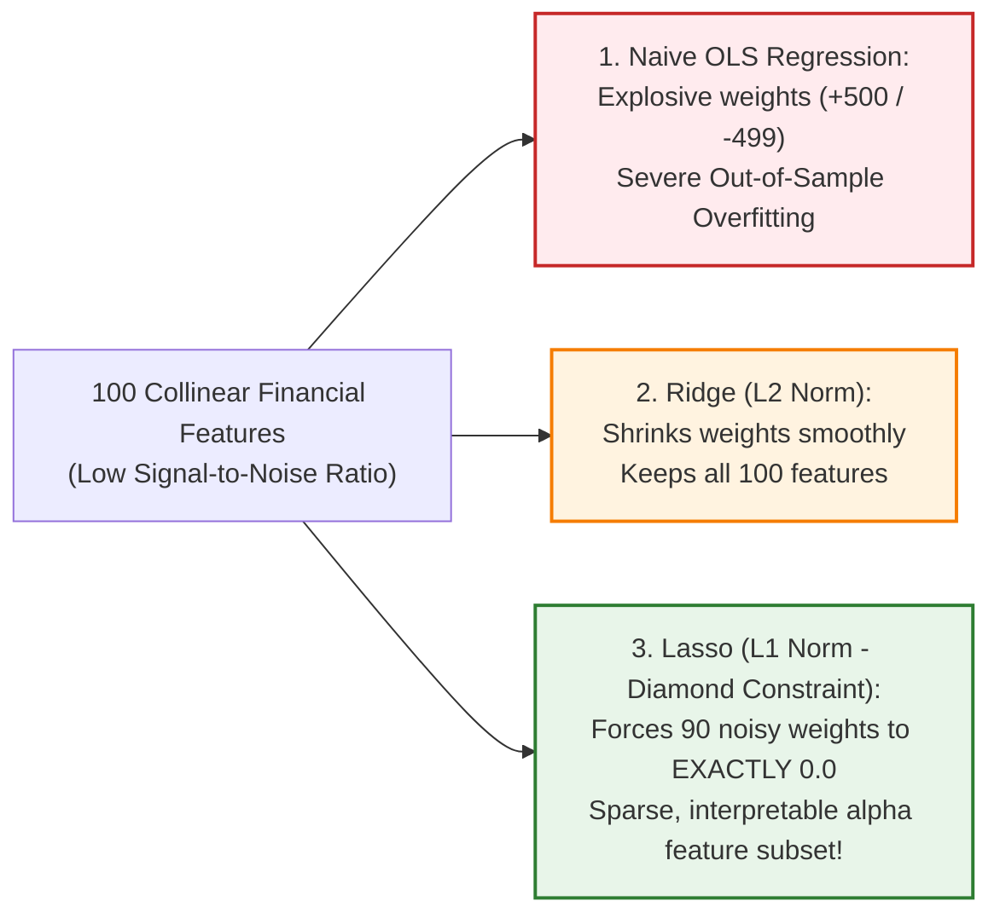
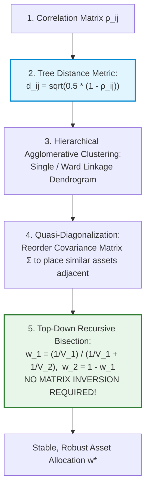

# Machine Learning in Finance — Key Pedagogical Takeaways
## MScFE 650 Master Quantitative Synthesis

[← Back to Main README.md](./README.md)

---

## 📖 Table of Contents & Quick Module Links
1. [Core Intuition & Mechanical Failure Modes](#1-core-intuition--mechanical-failure-modes)
   - [Toy Example 1: Standard K-Fold CV Data Leakage Illusion](#toy-example-1-standard-k-fold-cv-data-leakage-illusion)
   - [Toy Example 2: OLS Multicollinearity vs Lasso L1 Noise Zeroing](#toy-example-2-ols-multicollinearity-vs-lasso-l1-noise-zeroing)
   - [Toy Example 3: Markowitz Covariance Inversion vs Hierarchical Risk Parity](#toy-example-3-markowitz-covariance-inversion-vs-hierarchical-risk-parity)
2. [Core Mathematical Formulations & Calculus Derivations](#2-core-mathematical-formulations--calculus-derivations)
   - [1. Ridge and Lasso Loss Function Matrix Derivatives](#1-ridge-and-lasso-loss-function-matrix-derivatives)
   - [2. XGBoost 2nd-Order Taylor Objective Gradient Derivation](#2-xgboost-2nd-order-taylor-objective-gradient-derivation)
   - [3. Credit Scoring Weight of Evidence & Information Value Calculus](#3-credit-scoring-weight-of-evidence--information-value-calculus)
   - [4. SHAP Shapley Marginal Attribution Derivatives](#4-shap-shapley-marginal-attribution-derivatives)
3. [Practical Engineering & Stacking Ensemble Architecture](#3-practical-engineering--stacking-ensemble-architecture)
4. [Comparative Synthesis Cheat Sheet](#4-comparative-synthesis-cheat-sheet)
5. [Comprehensive Mathematical Notation & Variable Glossary](#5-comprehensive-mathematical-notation--variable-glossary)

---

## 1. Core Intuition & Mechanical Failure Modes

### Toy Example 1: Standard K-Fold CV Data Leakage Illusion

#### 💡 The Intuitive Metaphor (Easiest to Understand)
Imagine giving a student today's newspaper exam, but you shuffle the pages so Tuesday's test set contains Friday's stock market solution on the reverse page. The student gets $100\%$ on the test, but when they trade live on Monday without the future newspaper, they lose everything! 
**Purged & Embargoed K-Fold CV** removes overlapping label windows between training and testing folds to prevent future leakage.

#### 🏷️ Notation Breakdown:
- $T$: **Time Horizon** ($t = 1, \dots, T$ trading days).
- $H$: **Forward Target Label Event Horizon** ($H = 5\text{ days}$, span of predicted return $y_t$).
- $E$: **Embargo Duration Buffer** ($E = 5\text{ days}$, post-test cooldown to kill serial correlation).
- $[t_{\text{test, start}}, t_{\text{test, end}}]$: **Test Evaluation Window**.
- $y_t$: **Forward Return Label** ($y_t = \frac{P_{t+H} - P_t}{P_t}$).

#### 🔢 Step-by-Step Calculation (Purging & Embargoing Window Indexing)
- Time Series: $T = 1, \dots, 100$ daily observations.
- Forward Target Label Horizon: $H = 5\text{ days}$ ($y_t = \frac{P_{t+5} - P_t}{P_t}$).
- Test Fold Selection: Days $t \in [40, 50]$ (Predicting future returns up to day $50 + 5 = 55$).

**Step 1: Apply Purging to Training Fold**:
Any training sample $t_{\text{train}}$ whose label interval $[t_{\text{train}}, t_{\text{train}} + 5]$ overlaps with test interval $[40, 55]$ must be purged:
- Purged Training Samples: $t \in [35, 54]$.

**Step 2: Apply Embargoing**:
Add an embargo buffer of $E = 5\text{ days}$ immediately after test set to eliminate serial memory leakage:
- Embargoed Training Samples: $t \in [55, 60]$.

**Final Valid Training Set**: $t \in [1, 34] \cup [61, 100]$.

#### 📊 Visual Financial Cross-Validation: Purged & Embargoed Split

```mermaid
gantt
    title Purged & Embargoed K-Fold Validation Timeline (Preventing Data Leakage)
    dateFormat  X
    axisFormat  Day %d
    
    section Folds
    Training Set 1          :active, t1, 1, 35
    Purged Overlap Buffer   :crit, p1, 35, 40
    Testing Evaluation Set  :done, test1, 40, 50
    Embargo Memory Cooldown :crit, e1, 50, 60
    Training Set 2          :active, t2, 60, 100
```

---

### Toy Example 2: OLS Multicollinearity vs Lasso L1 Noise Zeroing

#### 💡 The Intuitive Metaphor (Easiest to Understand)
If 10 technical indicators all measure the exact same price move, OLS gets confused and assigns $+500$ weight to one and $-499$ weight to another (explosive noise). **Lasso ($L_1$)** acts as a strict editor, setting 9 redundant weights to **exactly zero** and keeping only 1 clear indicator.

#### 🏷️ Notation Breakdown:
- $\text{WoE}_i$: **Weight of Evidence** for applicant bin $i$ ($\ln(\%\text{Good}_i / \%\text{Bad}_i)$).
- $\text{IV}$: **Information Value** of feature ($\sum (\%\text{Good}_i - \%\text{Bad}_i) \times \text{WoE}_i$).
- $\%\text{Good}_i, \%\text{Bad}_i$: **Proportion of Non-Defaults and Defaults** in bin $i$.

#### 🔢 Step-by-Step Calculation (Credit Scoring Weight of Evidence)
Feature Bin $i$: 10,000 Total Applicants.
- Binned Applicants: 1,000 ($10\%$).
- Good Applicants (Non-Default): $800$ out of $8,000$ total goods $\implies \%\text{Good}_i = \frac{800}{8000} = 0.10$.
- Bad Applicants (Default): $200$ out of $2,000$ total bads $\implies \%\text{Bad}_i = \frac{200}{2000} = 0.10$.

$$\text{WoE}_i = \ln\left( \frac{\%\text{Good}_i}{\%\text{Bad}_i} \right) = \ln\left( \frac{0.10}{0.10} \right) = \ln(1.0) = 0.0$$

$$\text{Information Value Contribution} = (0.10 - 0.10) \times 0.0 = 0.0 \quad (\text{No discriminative power!})$$

#### 📊 Visual Regularization Comparison: OLS vs Ridge vs Lasso

---

### Toy Example 3: Markowitz Covariance Inversion vs Hierarchical Risk Parity

#### 💡 The Intuitive Metaphor (Easiest to Understand)
Standard Markowitz optimization inverts a large covariance matrix, which blows up if any assets are correlated. **Hierarchical Risk Parity (HRP)** builds a family tree of assets by clustering, then allocates capital top-down without ever calculating a matrix inverse!

#### 🏷️ Notation Breakdown:
- $\rho_{ij}$: **Pearson Correlation** between assets $i$ and $j$.
- $d_{ij}$: **Tree Distance Metric** ($d_{ij} = \sqrt{\frac{1}{2}(1 - \rho_{ij})} \in [0, 1]$).
- $V_1, V_2$: **Cluster Variances** in recursive bisection ($V = \mathbf{w}^T \mathbf{\Sigma} \mathbf{w}$).
- $w_1, w_2$: **Split Weights** ($w_1 = \frac{1/V_1}{1/V_1 + 1/V_2}, w_2 = 1 - w_1$).

#### 📊 Visual Hierarchical Risk Parity Architecture:

---

## 2. Core Mathematical Formulations & Calculus Derivations

### 1. Ridge and Lasso Loss Function Matrix Derivatives

$$\text{Ridge Objective:} \quad \mathcal{L}_{\text{Ridge}}(\boldsymbol{\beta}) = \|\mathbf{y} - \mathbf{X}\boldsymbol{\beta}\|_2^2 + \lambda \|\boldsymbol{\beta}\|_2^2 = (\mathbf{y} - \mathbf{X}\boldsymbol{\beta})^T (\mathbf{y} - \mathbf{X}\boldsymbol{\beta}) + \lambda \boldsymbol{\beta}^T \boldsymbol{\beta}$$

Taking matrix derivative with respect to $\boldsymbol{\beta}$ and setting to $\mathbf{0}$:

$$\nabla_{\boldsymbol{\beta}} \mathcal{L}_{\text{Ridge}} = -2 \mathbf{X}^T \mathbf{y} + 2 \mathbf{X}^T \mathbf{X} \boldsymbol{\beta} + 2 \lambda \boldsymbol{\beta} = \mathbf{0}$$

$$(\mathbf{X}^T \mathbf{X} + \lambda \mathbf{I}) \boldsymbol{\beta} = \mathbf{X}^T \mathbf{y} \implies \hat{\boldsymbol{\beta}}_{\text{Ridge}} = (\mathbf{X}^T \mathbf{X} + \lambda \mathbf{I})^{-1} \mathbf{X}^T \mathbf{y}$$

---

### 2. XGBoost 2nd-Order Taylor Objective Gradient Derivation
Taylor expansion of loss $\mathcal{L}^{(t)}$ around prior prediction $\hat{y}^{(t-1)}$:

$$\mathcal{L}^{(t)} \approx \sum_{i=1}^N \left[ l(y_i, \hat{y}^{(t-1)}) + g_i f_t(\mathbf{x}_i) + \frac{1}{2} h_i f_t^2(\mathbf{x}_i) \right] + \gamma T + \frac{1}{2}\lambda \sum_{j=1}^T w_j^2$$

$$g_i = \frac{\partial l(y_i, \hat{y}^{(t-1)})}{\partial \hat{y}^{(t-1)}}, \quad h_i = \frac{\partial^2 l(y_i, \hat{y}^{(t-1)})}{\partial (\hat{y}^{(t-1)})^2}$$

Differentiating leaf weight $w_j$ gives optimal solution $w_j^{\star} = -\frac{\sum g_i}{\sum h_i + \lambda}$.

---

### 3. Credit Scoring Weight of Evidence & Information Value Calculus

$$\text{IV} = \sum_{i=1}^B (\%\text{Good}_i - \%\text{Bad}_i) \cdot \ln\left( \frac{\%\text{Good}_i}{\%\text{Bad}_i} \right) \ge 0$$

---

### 4. SHAP Shapley Marginal Attribution Derivatives

$$\phi_i(x) = \sum_{S \subseteq F \setminus \{i\}} \frac{|S|! (|F| - |S| - 1)!}{|F|!} \left[ f(S \cup \{i\}) - f(S) \right]$$

---

## 3. Practical Engineering & Stacking Ensemble Architecture

Out-Of-Fold (OOF) prediction generation ensures Level-1 meta-learners do not overfit to Level-0 training predictions.

---

## 4. Comparative Synthesis Cheat Sheet

| ML Algorithm | Optimization Objective | Primary Strength | Key Constraint / Penalty | Primary Failure Mode |
| :--- | :--- | :--- | :--- | :--- |
| **Ridge Regression** | MSE $+ \lambda \|\boldsymbol{\beta}\|_2^2$ | Handles collinear features | $L_2$ norm penalty | Keeps non-informative features |
| **Lasso Regression** | MSE $+ \lambda \|\boldsymbol{\beta}\|_1$ | Sparse feature selection | $L_1$ norm penalty | Arbitrary selection among correlated inputs |
| **XGBoost** | 2nd-Order Taylor Loss $+ \gamma T$ | State-of-the-art tabular accuracy | Leaf weight penalty $\lambda \sum w_j^2$ | Hyperparameter sensitivity |
| **Hierarchical Risk Parity** | Tree clustering + Recursive bisection | Matrix-free allocation | Distance metric choice | Cluster linkage sensitivity |

---

## 5. Comprehensive Mathematical Notation & Variable Glossary

### 📐 Master Variable Reference Table

| Symbol | Mathematical / Economic Meaning | Typical Range / Units | Context & Core Formula |
| :--- | :--- | :--- | :--- |
| **$\mathbf{X}$** | Feature Matrix ($N \times P$) | Real matrix ($\mathbb{R}^{N \times P}$) | ML input dataset ($N$ samples, $P$ features) |
| **$\mathbf{y}$** | Target Label Vector ($N \times 1$) | Continuous returns / Binary $\{0, 1\}$ | Supervised learning prediction target |
| **$\boldsymbol{\beta}, \hat{\boldsymbol{\beta}}$** | Regression Coefficients & Optimal Estimator | Vector ($\mathbb{R}^P$) | OLS: $\hat{\boldsymbol{\beta}} = (\mathbf{X}^T\mathbf{X})^{-1}\mathbf{X}^T\mathbf{y}$ |
| **$\lambda, \lambda_1, \lambda_2$** | Regularization Penalty Hyperparameters | Positive scalars ($\lambda > 0$) | Ridge ($\lambda\|\boldsymbol{\beta}\|_2^2$), Lasso ($\lambda\|\boldsymbol{\beta}\|_1$) |
| **$H$** | Forward Label Event Horizon | Time steps / days ($H=5$) | Return window $y_t = (P_{t+H} - P_t)/P_t$ |
| **$E$** | Embargo Cooldown Buffer | Time steps / days ($E=5$) | Purged K-Fold: Discards post-test samples |
| **$g_i, h_i$** | First and Second Loss Derivatives (Gradient & Hessian) | Real numbers | XGBoost: $g_i = \partial l / \partial \hat{y}, h_i = \partial^2 l / \partial \hat{y}^2$ |
| **$w_j, w_j^\star$** | XGBoost Tree Leaf Weights & Optimal Closed-Form Weight | Real scalar | $w_j^\star = -\frac{\sum_{i \in I_j} g_i}{\sum_{i \in I_j} h_i + \lambda}$ |
| **$\gamma$** | XGBoost Tree Split Complexity Penalty | Scalar threshold ($\gamma \ge 0$) | Split executed only if $\text{Gain} > \gamma$ |
| **$\text{WoE}_i$** | Weight of Evidence in Feature Bin $i$ | Real scalar | $\text{WoE}_i = \ln(\%\text{Good}_i / \%\text{Bad}_i)$ |
| **$\text{IV}$** | Information Value of a Predictive Feature | Non-negative scalar ($\text{IV} \ge 0$) | $\text{IV} = \sum_{i=1}^B (\%\text{Good}_i - \%\text{Bad}_i) \cdot \text{WoE}_i$ |
| **$\phi_i(x)$** | SHAP Shapley Feature Marginal Attribution | Feature attribution value | Cooperative game-theoretic fair credit allocation |
| **$\rho_{ij}, d_{ij}$** | Correlation & Tree Distance Metric | $\rho \in [-1, 1], d \in [0, 1]$ | HRP: $d_{ij} = \sqrt{\frac{1}{2}(1 - \rho_{ij})}$ |
| **$\text{OOF}$** | Out-of-Fold Prediction Matrix | $N \times M$ matrix | Prevents Level-1 meta-learner leakage in stacking |
| **$\text{VIF}$** | Variance Inflation Factor | Ratio ($\text{VIF} > 5$ warning) | $\text{VIF}_j = \frac{1}{1 - R_j^2}$ (Multicollinearity check) |
| **$\text{AUC}$** | Area Under the ROC Curve | Probability $[0.5, 1.0]$ | Binary classifier ranking performance metric |
