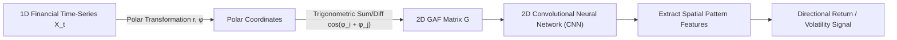
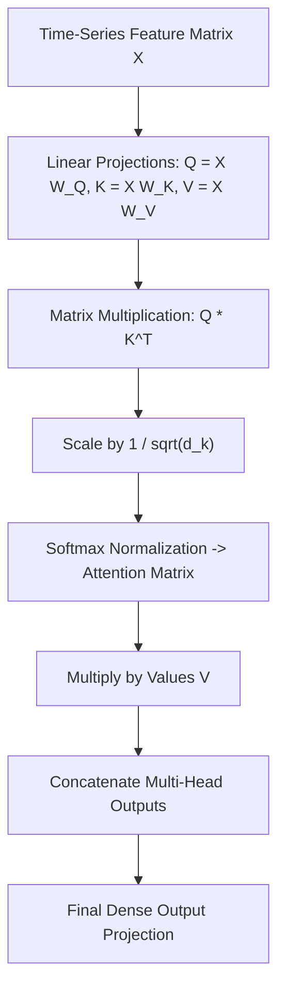

# Deep Learning in Finance (MScFE 690)

This directory contains analytical notebooks, model scripts, lecture notes, visual artifacts, and Group Work Project (GWP1 & GWP2) implementations for **Deep Learning in Finance**. This advanced module covers Deep Neural Networks (MLP, CNN, LSTM/GRU, Transformers), Gramian Angular Fields (GAF) for time-series encoding, Deep Reinforcement Learning (DRL), and generative model applications in quantitative finance.

---

## 📚 Module Overview

- **Course Code**: MScFE 690
- **Primary Focus**: Non-linear financial time-series forecasting, 2D spatial transformation of market data, multi-head self-attention mechanisms, and deep reinforcement learning portfolio optimization.
- **Key Stack**: Python (`PyTorch`, `TensorFlow/Keras`, `pyts`, `scikit-learn`, `pandas`, `numpy`, `matplotlib`), PyTorch Lightning, GWP submission frameworks.

---

## 📊 Visual Frameworks & Architecture

### 1. 2D Gramian Angular Field (GAF) Image Encoding Pipeline (Module 3)

### 2. Transformer Multi-Head Attention Mechanism (Module 4)

---

## 📖 Sub-Module & Detailed File Breakdown

### [Module 1: Deep Learning Foundations & MLPs](./M1)
- **Lessons & Code**:
  - [`M1/L1.ipynb`](./M1/L1.ipynb) & [`M1/L1-reading.pdf`](./M1/L1-reading.pdf): Neural network architecture, forward propagation, activation functions (ReLU, Sigmoid, Tanh, GELU).
  - [`M1/L2.ipynb`](./M1/L2.ipynb) & [`M1/L2-reading.pdf`](./M1/L2-reading.pdf): Backpropagation algorithm, automatic differentiation, chain rule derivation.
  - [`M1/L3.ipynb`](./M1/L3.ipynb) & [`M1/L3-reading.pdf`](./M1/L3-reading.pdf): Optimization algorithms (SGD with Momentum, RMSprop, Adam, AdamW).
  - [`M1/L4.ipynb`](./M1/L4.ipynb) & [`M1/L4-reading.pdf`](./M1/L4-reading.pdf): Regularization techniques (Dropout, Weight Decay $L_2$, Batch Normalization, Layer Normalization).

---

### [Module 2: Recurrent Neural Networks (RNN, LSTM, GRU)](./M2)
- **Lessons & Code**:
  - [`M2/L1.ipynb`](./M2/L1.ipynb) & [`M2/L1-reading.pdf`](./M2/L1-reading.pdf): Sequential data modeling, vanishing/exploding gradient problems in standard RNNs.
  - [`M2/L2.ipynb`](./M2/L2.ipynb) & [`M2/L2-reading.pdf`](./M2/L2-reading.pdf): Long Short-Term Memory (LSTM) gating mechanism (Forget gate $f_t$, Input gate $i_t$, Output gate $o_t$, Cell state $C_t$).
  - [`M2/L3.ipynb`](./M2/L3.ipynb) & [`M2/L3-reading.pdf`](./M2/L3-reading.pdf): Gated Recurrent Unit (GRU) simplified architecture (Reset gate $r_t$, Update gate $z_t$).
  - [`M2/L4.ipynb`](./M2/L4.ipynb) & [`M2/L4-reading.pdf`](./M2/L4-reading.pdf): Sequence-to-sequence forecasting for multi-step asset returns.

---

### [Module 3: Convolutional Neural Networks & GAF Image Encoding](./M3)
- **Lessons & Code**:
  - [`M3/L1.ipynb`](./M3/L1.ipynb) & [`M3/L1-reading.pdf`](./M3/L1-reading.pdf): 1D CNNs for financial time-series feature extraction.
  - [`M3/L2.ipynb`](./M3/L2.ipynb) & [`M3/L2-reading.pdf`](./M3/L2-reading.pdf): 2D CNN filters, pooling layers, and receptive fields.
  - [`M3/L3.ipynb`](./M3/L3.ipynb) & [`M3/L3-reading.pdf`](./M3/L3-reading.pdf): Transforming 1D price series into 2D Gramian Angular Summation/Difference Fields (GASF/GADF) and Markov Transition Fields (MTF).
  - [`M3/L4.ipynb`](./M3/L4.ipynb) & [`M3/L4-reading.pdf`](./M3/L4-reading.pdf): Computer vision models (ResNet, VGG) applied to financial chart pattern recognition.

---

### [Module 4: Attention Mechanisms & Financial Transformers](./M4)
- **Lessons & Code**:
  - [`M4/L1.ipynb`](./M4/L1.ipynb) & [`M4/L1-reading.pdf`](./M4/L1-reading.pdf): Self-attention mechanism formulation ($\text{Attention}(Q,K,V) = \text{softmax}\left(\frac{QK^T}{\sqrt{d_k}}\right)V$).
  - [`M4/L2.ipynb`](./M4/L2.ipynb) & [`M4/L2-reading.pdf`](./M4/L4-reading.pdf): Multi-head attention architectures and positional encoding.
  - [`M4/L3.ipynb`](./M4/L3.ipynb): Temporal Fusion Transformers (TFT) for multi-horizon financial forecasting.
  - [`M4/L4.ipynb`](./M4/L4.ipynb): Pretrained Transformer models for financial text sentiment extraction (FinBERT).

---

### [Module 5: Deep Reinforcement Learning (DRL) in Finance](./M5)
- **Lessons & Code**:
  - [`M5/L1.ipynb`](./M5/L1.ipynb) & [`M5/L1-reading.pdf`](./M5/L1-reading.pdf): Markov Decision Processes (MDP) in trading: State $S_t$, Action $A_t$, Reward $R_t$, Discount $\gamma$.
  - [`M5/L2.ipynb`](./M5/L2.ipynb) & [`M5/L2-reading.pdf`](./M5/L2-reading.pdf): Deep Q-Networks (DQN) with experience replay and target networks.
  - [`M5/L3.ipynb`](./M5/L3.ipynb) & [`M5/L3-reading.pdf`](./M5/L3-reading.pdf): Policy Gradient methods: Advantage Actor-Critic (A2C) and Proximal Policy Optimization (PPO).
  - [`M5/L4.ipynb`](./M5/L4.ipynb): DRL portfolio rebalancing under transaction costs and market friction.

---

### [Group Work Projects (GWP1 & GWP2)](./GWP)

#### GWP1: Comparative Analysis of LSTM, GRU, CNN-GAF & Transformer Models
- **Master Directory**: [`GWP/Assignment_1`](./GWP/Assignment_1)
- **Executable Notebook**: [`GWP/Assignment_1/Group_Assignment_1_Submission.ipynb`](./GWP/Assignment_1/Group_Assignment_1_Submission.ipynb)
- **Final Report**: [`GWP/Assignment_1/DL_MScFE_690_Group_Assignment_1.pdf`](./GWP/Assignment_1/DL_MScFE_690_Group_Assignment_1.pdf)
- **Embedded Performance Visuals**:
  
  
  
  *Figure 1 & 2: Cumulative returns backtest and training loss convergence for GWP1 deep models.*

---

#### GWP2: Walk-Forward Validation & Equity Curve Optimization
- **Master Directory**: [`GWP/assignment2`](./GWP/assignment2)
- **Executable Notebook**: [`GWP/assignment2/Group_Assignment_2_Submission.ipynb`](./GWP/assignment2/Group_Assignment_2_Submission.ipynb)
- **Final Report**: [`GWP/assignment2/MScFE_690_Deep_Learning_in_Finance_Group_Assignment_2.pdf`](./GWP/assignment2/MScFE_690_Deep_Learning_in_Finance_Group_Assignment_2.pdf)
- **Embedded Performance Visuals**:
  
  
  
  *Figure 3 & 4: Out-of-sample walk-forward equity curves and rolling Sharpe ratio dynamics.*

---

## 🔑 Key Takeaways & Deep Learning Rules

1. **2D Time-Series Encoding via GAF**: Converting 1D stock return series into 2D Gramian Angular Fields preserves temporal correlations while enabling computer vision CNN architectures to detect complex market structures.
2. **Attention Beats Recurrence**: Transformers capture long-range temporal dependencies without the vanishing gradient problems inherent in sequential LSTMs/GRUs.
3. **Reward Function Design in DRL**: Optimizing pure cumulative return leads to over-leveraged drawdowns. Differential Sharpe Ratio (DSR) or Downside Risk Penalty rewards produce robust trading agents.
4. **Walk-Forward Over-Fitting Prevention**: Deep neural networks easily overfit financial noise. Strict walk-forward out-of-sample validation is essential to verify true alpha.

---

## 🔗 Cross-Module Knowledge Linkages

- **$\to$ [07_machine_learning](../07_machine_learning/README.md)**: Deep Learning builds upon classical ML concepts; Purged CV algorithms apply directly to deep sequence validation.
- **$\to$ [06_derivative_pricing](../06_derivative_pricing/README.md)**: Neural networks (Deep BSDEs) solve high-dimensional partial differential equations and option pricing surfaces.
- **$\to$ [05_portfolio_management](../05_portfolio_management/README.md)**: Deep Reinforcement Learning agents directly optimize portfolio allocation matrices $\mathbf{w}_t$ under transaction cost constraints.
- **$\to$ [02_financial_data](../02_financial_data/README.md)**: Natural language sentiment features and resampled intraday bars supply training input tensors.
