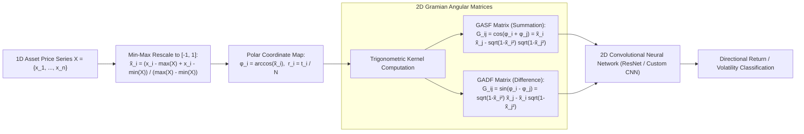
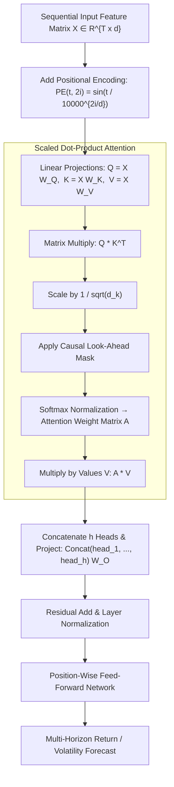
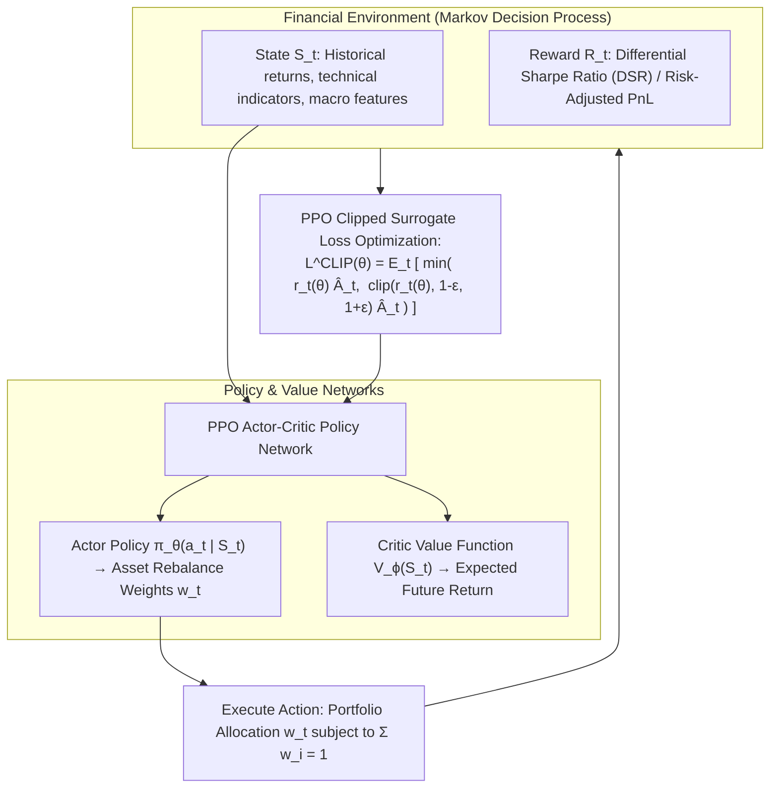
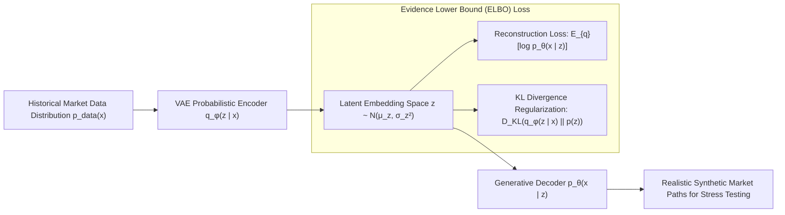

# Deep Learning in Finance (MScFE 690)

This directory contains analytical notebooks, model scripts, lecture notes, visual artifacts, and complete Group Work Projects (GWP1 & GWP2) for **Deep Learning in Finance**. This advanced module covers state-of-the-art neural architectures applied to quantitative finance: Multi-Layer Perceptrons (MLPs), Recurrent Neural Networks (RNN, LSTM, GRU), Convolutional Neural Networks (1D/2D CNNs), Gramian Angular Fields (GASF/GADF) for 2D visual time-series encoding, Multi-Head Self-Attention Transformers (Temporal Fusion Transformers, FinBERT), Deep Reinforcement Learning (DRL - DQN, A2C, PPO) for dynamic portfolio allocation, Generative Models (Variational Autoencoders - VAEs, TimeGAN) for synthetic scenario generation, and Graph Neural Networks (GNNs).

---

## 📚 Module Overview

- **Course Code**: MScFE 690
- **Primary Focus**: Non-linear financial time-series forecasting, 2D computer vision spatial encoding of market data, multi-head self-attention mechanisms, deep reinforcement learning trading agents, generative synthetic market simulation, and walk-forward out-of-sample optimization.
- **Key Stack & Tools**: Python (`PyTorch`, `TensorFlow/Keras`, `pyts`, `scikit-learn`, `pandas`, `numpy`, `matplotlib`), PyTorch Lightning, GWP evaluation pipelines.

---

## 📊 Visual Frameworks & Architecture

### 1. 2D Gramian Angular Field (GAF) Image Encoding Pipeline (Module 3)

### 2. Transformer Multi-Head Self-Attention Architecture (Module 4)

### 3. Deep Reinforcement Learning (DRL) Dynamic Portfolio Agent (Module 5)

### 4. Generative VAE & TimeGAN Synthetic Scenario Engine (Module 6)

---

## 📖 Sub-Module & Detailed File Breakdown

### [Module 1: Deep Learning Foundations & MLPs](./M1)
- **Lessons & Lecture Readings**:
  - [`M1/L1.ipynb`](./M1/L1.ipynb) & [`M1/L1-reading.pdf`](./M1/L1-reading.pdf): **Multi-Layer Perceptron (MLP) Architecture**.
    - Forward propagation: $\mathbf{a}^{(l)} = \sigma(\mathbf{W}^{(l)} \mathbf{a}^{(l-1)} + \mathbf{b}^{(l)})$.
    - Non-linear activations: $\text{ReLU}(z) = \max(0, z)$, $\text{GELU}(z) = z \Phi(z)$, $\text{LeakyReLU}$, $\text{Swish}$.
  - [`M1/L2.ipynb`](./M1/L2.ipynb) & [`M1/L2-reading.pdf`](./M1/L2-reading.pdf): **Backpropagation & Automatic Differentiation**.
    - Computational graphs, reverse-mode automatic differentiation, chain rule gradient flow:
      $$\delta^{(l)} = (\mathbf{W}^{(l+1)T} \delta^{(l+1)}) \odot \sigma'(\mathbf{z}^{(l)}), \quad \frac{\partial \mathcal{L}}{\partial \mathbf{W}^{(l)}} = \delta^{(l)} (\mathbf{a}^{(l-1)})^T$$
  - [`M1/L3.ipynb`](./M1/L3.ipynb) & [`M1/L3-reading.pdf`](./M1/L3-reading.pdf): **Optimization Dynamics**.
    - Stochastic Gradient Descent (SGD) with Nesterov momentum.
    - Adaptive optimizers: RMSprop, Adam, and AdamW (decoupled weight decay):
      $$m_t = \beta_1 m_{t-1} + (1-\beta_1) g_t, \quad v_t = \beta_2 v_{t-1} + (1-\beta_2) g_t^2, \quad \theta_t = \theta_{t-1} - \frac{\eta}{\sqrt{\hat{v}_t} + \epsilon}\hat{m}_t - \eta \lambda \theta_{t-1}$$
  - [`M1/L4.ipynb`](./M1/L4.ipynb) & [`M1/L4-reading.pdf`](./M1/L4-reading.pdf): **Regularization & Generalization**.
    - Dropout as approximate Bayesian inference, Batch Normalization vs. Layer Normalization, early stopping.

---

### [Module 2: Recurrent Neural Networks (RNN, LSTM, GRU)](./M2)
- **Lessons & Lecture Readings**:
  - [`M2/L1.ipynb`](./M2/L1.ipynb) & [`M2/L1-reading.pdf`](./M2/L1-reading.pdf): **Sequential Modeling & Exploding/Vanishing Gradients**.
    - Standard RNN formulation: $\mathbf{h}_t = \tanh(\mathbf{W}_{hh} \mathbf{h}_{t-1} + \mathbf{W}_{xh} \mathbf{x}_t + \mathbf{b})$.
    - Vanishing gradients during Backpropagation Through Time (BPTT): $\frac{\partial \mathbf{h}_T}{\partial \mathbf{h}_t} = \prod_{k=t+1}^T \mathbf{W}_{hh}^T \text{diag}(1 - \mathbf{h}_k^2)$.
  - [`M2/L2.ipynb`](./M2/L2.ipynb) & [`M2/L2-reading.pdf`](./M2/L2-reading.pdf): **Long Short-Term Memory (LSTM)**.
    - Complete gating equations preserving constant error carousel:
      $$f_t = \sigma(\mathbf{W}_f \mathbf{x}_t + \mathbf{U}_f \mathbf{h}_{t-1} + \mathbf{b}_f) \quad \text{[Forget Gate]}$$
      $$i_t = \sigma(\mathbf{W}_i \mathbf{x}_t + \mathbf{U}_i \mathbf{h}_{t-1} + \mathbf{b}_i) \quad \text{[Input Gate]}$$
      $$\tilde{C}_t = \tanh(\mathbf{W}_c \mathbf{x}_t + \mathbf{U}_c \mathbf{h}_{t-1} + \mathbf{b}_c) \quad \text{[Candidate State]}$$
      $$C_t = f_t \odot C_{t-1} + i_t \odot \tilde{C}_t \quad \text{[Cell State Update]}$$
      $$o_t = \sigma(\mathbf{W}_o \mathbf{x}_t + \mathbf{U}_o \mathbf{h}_{t-1} + \mathbf{b}_o), \quad \mathbf{h}_t = o_t \odot \tanh(C_t) \quad \text{[Output Gate]}$$
  - [`M2/L3.ipynb`](./M2/L3.ipynb) & [`M2/L3-reading.pdf`](./M2/L3-reading.pdf): **Gated Recurrent Units (GRU)**.
    - Reset gate $r_t$ and update gate $z_t$ eliminating the separate cell state.
  - [`M2/L4.ipynb`](./M2/L4.ipynb) & [`M2/L4-reading.pdf`](./M2/L4-reading.pdf): **Seq2Seq Multi-Step Return Forecasting**.
    - Encoder-Decoder architectures for predicting multi-period return trajectories.

---

### [Module 3: Convolutional Neural Networks & GAF Image Encoding](./M3)
- **Lessons & Lecture Readings**:
  - [`M3/L1.ipynb`](./M3/L1.ipynb) & [`M3/L1-reading.pdf`](./M3/L1-reading.pdf): **1D Temporal Convolutions (TCN)**.
    - Causal dilated convolutions expanding receptive field without parameter explosion.
  - [`M3/L2.ipynb`](./M3/L2.ipynb) & [`M3/L2-reading.pdf`](./M3/L2-reading.pdf): **2D Spatial Feature Convolutions**.
    - Convolutional kernels, stride, zero-padding, max/average pooling, feature map spatial hierarchies.
  - [`M3/L3.ipynb`](./M3/L3.ipynb) & [`M3/L3-reading.pdf`](./M3/L3-reading.pdf): **Gramian Angular Fields (GAF) & Markov Transition Fields (MTF)**.
    - Polar transformations: $\phi_i = \arccos(\tilde{x}_i)$.
    - Gramian Angular Summation Field: $\text{GASF}_{i,j} = \cos(\phi_i + \phi_j) = \tilde{x}_i \tilde{x}_j - \sqrt{1 - \tilde{x}_i^2}\sqrt{1 - \tilde{x}_j^2}$.
    - Gramian Angular Difference Field: $\text{GADF}_{i,j} = \sin(\phi_i - \phi_j) = \sqrt{1 - \tilde{x}_i^2}\tilde{x}_j - \tilde{x}_i\sqrt{1 - \tilde{x}_j^2}$.
  - [`M3/L4.ipynb`](./M3/L4.ipynb) & [`M3/L4-reading.pdf`](./M3/L4-reading.pdf): **Computer Vision ResNets on Financial Images**.
    - Using deep residual blocks ($F(\mathbf{x}) + \mathbf{x}$) to classify market patterns directly from 2D GAF images.

---

### [Module 4: Attention Mechanisms & Financial Transformers](./M4)
- **Lessons & Lecture Readings**:
  - [`M4/L1.ipynb`](./M4/L1.ipynb) & [`M4/L1-reading.pdf`](./M4/L1-reading.pdf): **Scaled Dot-Product Attention**.
    - Mathematical formulation:
      $$\text{Attention}(\mathbf{Q}, \mathbf{K}, \mathbf{V}) = \text{softmax}\left(\frac{\mathbf{Q} \mathbf{K}^T}{\sqrt{d_k}}\right) \mathbf{V}$$
  - [`M4/L2.ipynb`](./M4/L2.ipynb) & [`M4/L2-reading.pdf`](./M4/L4-reading.pdf): **Multi-Head Self-Attention (MHA)**.
    - Multi-head projections allowing the model to jointly attend to information from different representation subspaces.
  - [`M4/L3.ipynb`](./M4/L3.ipynb): **Temporal Fusion Transformers (TFT)**.
    - Specialized architecture combining static metadata, observed time series, and known future inputs for interpretable multi-horizon quantile forecasting.
  - [`M4/L4.ipynb`](./M4/L4.ipynb): **Pretrained Financial Language Models (FinBERT)**.
    - Transfer learning on corporate filings and news for financial sentiment classification.

---

### [Module 5: Deep Reinforcement Learning (DRL) in Trading](./M5)
- **Lessons & Lecture Readings**:
  - [`M5/L1.ipynb`](./M5/L1.ipynb) & [`M5/L1-reading.pdf`](./M5/L1-reading.pdf): **Markov Decision Processes (MDP) in Finance**.
    - State space $\mathcal{S}$, Action space $\mathcal{A}$, Reward function $\mathcal{R}$, Transition probability $\mathcal{P}$, Discount factor $\gamma$.
  - [`M5/L2.ipynb`](./M5/L2.ipynb) & [`M5/L2-reading.pdf`](./M5/L2-reading.pdf): **Deep Q-Networks (DQN)**.
    - Q-learning with neural function approximation, experience replay buffer $\mathcal{D}$, and target networks $\hat{Q}$ to stabilize training:
      $$\mathcal{L}(\theta) = \mathbb{E}_{(s,a,r,s') \sim \mathcal{D}} \left[\left(r + \gamma \max_{a'} \hat{Q}(s', a'; \theta^-) - Q(s, a; \theta)\right)^2\right]$$
  - [`M5/L3.ipynb`](./M5/L3.ipynb) & [`M5/L3-reading.pdf`](./M5/L3-reading.pdf): **Policy Gradient Methods: A2C & PPO**.
    - Generalized Advantage Estimation (GAE), Proximal Policy Optimization (PPO) clipped surrogate loss.
  - [`M5/L4.ipynb`](./M5/L4.ipynb): **DRL Portfolio Rebalancing under Market Frictions**.
    - Continuous action spaces producing portfolio allocation weight vectors $\mathbf{w}_t \in \Delta^N$ subject to transaction cost penalties.

---

### [Module 6: Generative Models & Synthetic Financial Data](./M6)
- **Lecture Materials, Projects & Data**:
  - [`M6/L1.pdf`](./M6/L1.pdf) & [`M6/PPT Slides - Module 6 Lesson 1.pdf`](./M6/PPT%20Slides%20-%20Module%206%20Lesson%201.pdf): **Variational Autoencoders (VAEs)**.
    - Evidence Lower Bound (ELBO) loss:
      $$\mathcal{L}_{\text{VAE}}(\theta, \phi; \mathbf{x}) = \mathbb{E}_{q_\phi(\mathbf{z}|\mathbf{x})}[\ln p_\theta(\mathbf{x}|\mathbf{z})] - D_{\text{KL}}(q_\phi(\mathbf{z}|\mathbf{x}) \,\|\, p(\mathbf{z}))$$
    - Reparameterization trick: $\mathbf{z} = \boldsymbol{\mu} + \boldsymbol{\sigma} \odot \boldsymbol{\epsilon}$, where $\boldsymbol{\epsilon} \sim \mathcal{N}(\mathbf{0}, \mathbf{I})$.
  - [`M6/PPT Slides - Module 6 Lesson 2.pdf`](./M6/PPT%20Slides%20-%20Module%206%20Lesson%202.pdf) & [`M6/L3.pdf`](./M6/L3.pdf): **Generative Adversarial Networks (GANs) & TimeGAN**.
    - Minimax two-player game: $\min_G \max_D V(D, G) = \mathbb{E}[\ln D(x)] + \mathbb{E}[\ln(1 - D(G(z)))]$.
    - TimeGAN architecture: Jointly optimizing unsupervised adversarial loss with supervised stepwise next-step prediction loss to preserve temporal dynamics.
  - [`M6/L4.pdf`](./M6/L4.pdf) & [`M6/PPT Slides - Module 6 Lesson 4.pdf`](./M6/PPT%20Slides%20-%20Module%206%20Lesson%204.pdf): **Synthetic Market Simulation & Stress Testing**.
    - Generating non-historical crisis scenarios to validate quantitative portfolio resilience.
  - [`M6/Project.ipynb`](./M6/Project.ipynb) & [`M6/Project (1).ipynb`](./M6/Project%20(1).ipynb): Practical implementation of generative models on adjusted asset prices ([`M6/adjusted_prices.csv`](./M6/adjusted_prices.csv)).

---

### [Module 7: Advanced Architectures & Frontier Topics](./M7)
- **Lecture Materials**:
  - [`M7/L1.pdf`](./M7/L1.pdf): **Graph Neural Networks (GNNs) in Financial Networks**.
    - Graph Convolutional Networks (GCN): $\mathbf{H}^{(l+1)} = \sigma(\mathbf{\tilde{D}}^{-\frac{1}{2}} \mathbf{\tilde{A}} \mathbf{\tilde{D}}^{-\frac{1}{2}} \mathbf{H}^{(l)} \mathbf{W}^{(l)})$.
    - Modeling inter-firm supply chain risks and systemic financial contagion.
  - [`M7/L3.pdf`](./M7/L3.pdf): **High-Frequency Limit Order Book (LOB) Modeling**.
    - Spatial-temporal convolutions over Level-2/Level-3 market depth for microstructure alpha.
  - [`M7/L4.pdf`](./M7/L4.pdf): **Physics-Informed Neural Networks (PINNs) & Deep BSDEs**.
    - Solving high-dimensional non-linear Black-Scholes PDEs and stochastic control problems.

---

### [Group Work Projects (GWP1 & GWP2)](./GWP)

#### GWP1: Comparative Deep Architecture Benchmark (LSTM vs. GRU vs. CNN-GAF vs. Transformer)
- **Directory**: [`GWP/Assignment_1`](./GWP/Assignment_1)
- **Master Notebook**: [`GWP/Assignment_1/Group_Assignment_1_Submission.ipynb`](./GWP/Assignment_1/Group_Assignment_1_Submission.ipynb)
- **Final Report**: [`GWP/Assignment_1/DL_MScFE_690_Group_Assignment_1.pdf`](./GWP/Assignment_1/DL_MScFE_690_Group_Assignment_1.pdf)
- **Comparative Visualizations**:
  
  | Cumulative Backtest Performance | Training Loss Convergence |
  | :---: | :---: |
  |  |  |

---

#### GWP2: Walk-Forward Validation & Dynamic Equity Optimization
- **Directory**: [`GWP/assignment2`](./GWP/assignment2)
- **Master Notebook**: [`GWP/assignment2/Group_Assignment_2_Submission.ipynb`](./GWP/assignment2/Group_Assignment_2_Submission.ipynb)
- **Final Report**: [`GWP/assignment2/MScFE_690_Deep_Learning_in_Finance_Group_Assignment_2.pdf`](./GWP/assignment2/MScFE_690_Deep_Learning_in_Finance_Group_Assignment_2.pdf)
- **Out-of-Sample Performance Visuals**:
  
  | Out-of-Sample Equity Curves | Rolling Sharpe Ratio Dynamics |
  | :---: | :---: |
  |  |  |

---

## 🔑 Key Takeaways & Deep Learning Rules

1. **2D Time-Series Encoding via GAF**: Transforming 1D financial return series into 2D Gramian Angular Fields preserves temporal ordering while exposing quasi-periodic chart patterns to standard 2D computer vision CNNs.
2. **Self-Attention Solves Long-Range Dependency**: Unlike recurrent architectures (LSTM/GRU) which suffer from information bottlenecking across long histories, Transformers process the entire sequence simultaneously via scaled dot-product self-attention.
3. **Reward Shaping in DRL**: Optimizing raw cumulative return causes DRL agents to take destructive tail leverage. Using risk-adjusted reward metrics (Differential Sharpe Ratio, Sortino penalty) forces the policy to control maximum drawdown.
4. **Walk-Forward Validation is Mandatory**: Due to extreme non-stationarity and structural regime shifts in financial markets, deep networks must be evaluated via strict walk-forward expanding-window validation.

---

## 🔗 Cross-Module Knowledge Linkages

- **$\to$ [07_machine_learning](../07_machine_learning/README.md)**: Purged cross-validation and feature engineering frameworks underpin deep learning validation pipelines.
- **$\to$ [06_derivative_pricing](../06_derivative_pricing/README.md)**: Deep BSDE solvers and PINNs solve high-dimensional partial differential equations for exotic options.
- **$\to$ [03_stochastic_modelling](../03_stochastic_modelling/README.md)**: Graph topologies and Eisenberg-Noe network matrices feed directly into Graph Neural Networks (GNNs).
- **$\to$ [05_portfolio_management](../05_portfolio_management/README.md)**: Deep Reinforcement Learning agents optimize multi-asset allocation matrices $\mathbf{w}_t$ under real-world transaction cost constraints.
