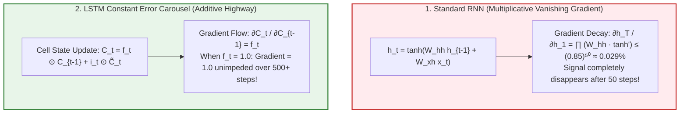
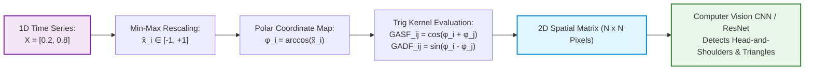
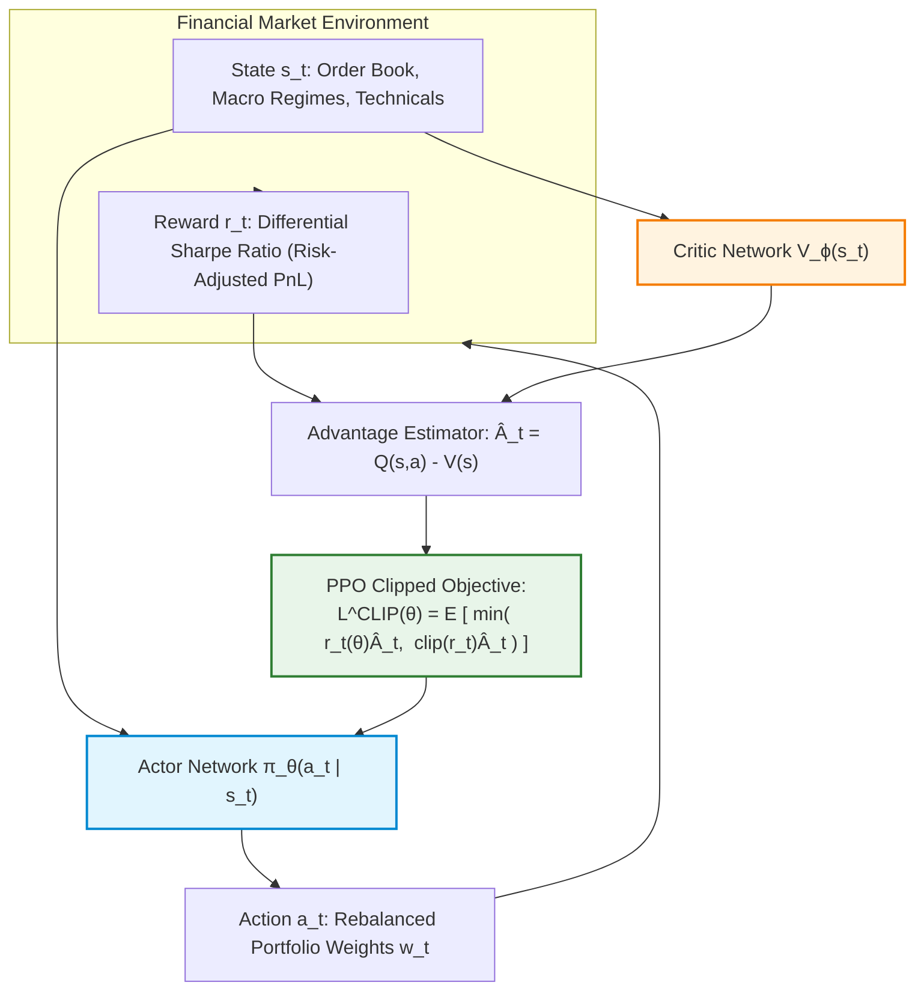
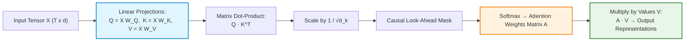

# Deep Learning in Finance — Key Pedagogical Takeaways
## MScFE 690 Master Quantitative Synthesis

[← Back to Main README.md](./README.md)

---

## 📖 Table of Contents & Quick Module Links
1. [Core Intuition & Mechanical Failure Modes](#1-core-intuition--mechanical-failure-modes)
   - [Toy Example 1: Vanishing Gradients in RNNs vs LSTM Constant Error Carousel](#toy-example-1-vanishing-gradients-in-rnns-vs-lstm-constant-error-carousel)
   - [Toy Example 2: Gramian Angular Fields (GAF) 2D Spatial Vision Encoding](#toy-example-2-gramian-angular-fields-gaf-2d-spatial-vision-encoding)
   - [Toy Example 3: Deep Reinforcement Learning (DRL) Reward Shaping](#toy-example-3-deep-reinforcement-learning-drl-reward-shaping)
2. [Core Mathematical Formulations & Calculus Derivations](#2-core-mathematical-formulations--calculus-derivations)
   - [1. Complete LSTM Gate System & Additive Cell Calculus](#1-complete-lstm-gate-system--additive-cell-calculus)
   - [2. Transformer Multi-Head Self-Attention Derivation](#2-transformer-multi-head-self-attention-derivation)
   - [3. DRL PPO Clipped Surrogate Loss Calculus](#3-drl-ppo-clipped-surrogate-loss-calculus)
   - [4. VAE Reparameterization Trick & ELBO Derivation](#4-vae-reparameterization-trick--elbo-derivation)
3. [Practical Engineering & Synthetic TimeGAN Generation](#3-practical-engineering--synthetic-timegan-generation)
4. [Comparative Synthesis Cheat Sheet](#4-comparative-synthesis-cheat-sheet)
5. [Comprehensive Mathematical Notation & Variable Glossary](#5-comprehensive-mathematical-notation--variable-glossary)

---

## 1. Core Intuition & Mechanical Failure Modes

### Toy Example 1: Vanishing Gradients in RNNs vs LSTM Constant Error Carousel

#### 💡 The Intuitive Metaphor (Easiest to Understand)
Standard Recurrent Neural Networks (RNNs) are like playing a game of telephone across 100 people. By the time the message reaches Person 100, the original message is completely distorted or forgotten. **LSTM Cell States** are like a secure conveyor belt running alongside the line of people: messages are dropped onto the belt additively without being distorted by intermediate whisperers.

#### 🏷️ Notation Breakdown:
- $\mathbf{h}_t$: **Hidden State Vector** at time $t$ (Short-term working memory).
- $C_t$: **LSTM Cell State Vector** (Long-term persistent memory conveyor belt).
- $f_t$: **Forget Gate Activation** ($\in [0, 1]$, controls memory retention).
- $i_t$: **Input Gate Activation** ($\in [0, 1]$, controls candidate update write-in).
- $W_{hh}$: **Recurrent Hidden-to-Hidden Weight Matrix**.
- $\odot$: **Hadamard (Element-Wise) Product**.

#### 🔢 Step-by-Step Calculation (BPTT Gradient Decay)
Over $T = 50$ time steps, hidden state weight matrix $W_{hh} = 0.85$.
Derivative of activation $\tanh'(x) = 1 - \tanh^2(x) \le 1.0$.

$$\text{Gradient Decay Factor} = \prod_{k=1}^{50} (W_{hh} \cdot \tanh'(x_k)) \le (0.85)^{50} \approx 0.000295$$

After 50 steps, the backpropagated error signal vanishes to less than **$0.03\%$** of its original magnitude, making standard RNNs completely blind to long-term macroeconomic regimes.

#### 📐 Calculus & Constant Error Carousel Proof
LSTM Cell update equation: $C_t = f_t \odot C_{t-1} + i_t \odot \tilde{C}_t$.
Taking partial derivative of cell state $C_t$ with respect to previous state $C_{t-1}$:

$$\frac{\partial C_t}{\partial C_{t-1}} = f_t$$

If forget gate $f_t = 1.0$, $\frac{\partial C_t}{\partial C_{t-1}} = 1.0$. Unrolling backwards across 50 steps:

$$\frac{\partial C_T}{\partial C_1} = \prod_{k=2}^T f_k = 1.0 \times 1.0 \times \dots = 1.0$$

The gradient flows unimpeded across arbitrary time horizons without exponential decay (**Constant Error Carousel**).

#### 📊 Visual Constant Error Carousel vs Vanishing RNN Gradients:

---

### Toy Example 2: Gramian Angular Fields (GAF) 2D Spatial Vision Encoding

#### 💡 The Intuitive Metaphor (Easiest to Understand)
Taking a 1D line chart of stock prices and feeding it to a computer vision ResNet model is like taking a song's audio track and feeding it to a camera. **Gramian Angular Fields (GAF)** convert 1D soundwaves into a 2D color image matrix, mapping visual chart patterns (head-and-shoulders, double bottoms) into spatial pixels.

#### 🏷️ Notation Breakdown:
- $X, \tilde{X}$: **Original & Rescaled Time Series** ($\tilde{x}_i \in [-1, 1]$).
- $\phi_i$: **Polar Angle Coordinate** ($\phi_i = \arccos(\tilde{x}_i) \in [0, \pi]$).
- $\text{GASF}$: **Gramian Angular Summation Field** ($\text{GASF}_{i,j} = \cos(\phi_i + \phi_j)$).
- $\text{GADF}$: **Gramian Angular Difference Field** ($\text{GADF}_{i,j} = \sin(\phi_i - \phi_j)$).

#### 🔢 Step-by-Step Calculation (GAF Encoding)
Time series values $X = [0.2, 0.8]$.
Normalized to $\tilde{X} \in [-1, 1] \implies \tilde{X} = [0.2, 0.8]$.

**Step 1: Convert to Polar Angles $\phi_i = \arccos(\tilde{x}_i)$**:
- $\phi_1 = \arccos(0.2) \approx 1.3694 \text{ rad} \quad (78.46^\circ)$
- $\phi_2 = \arccos(0.8) \approx 0.6435 \text{ rad} \quad (36.87^\circ)$

**Step 2: Compute Gramian Angular Sum Matrix (GASF)**:

$$\text{GASF}_{1,1} = \cos(\phi_1 + \phi_1) = \cos(2 \times 1.3694) = \cos(2.7388) \approx -0.920$$

$$\text{GASF}_{1,2} = \cos(\phi_1 + \phi_2) = \cos(1.3694 + 0.6435) = \cos(2.0129) \approx -0.428$$

$$\text{GASF}_{2,2} = \cos(\phi_2 + \phi_2) = \cos(2 \times 0.6435) = \cos(1.2870) \approx +0.280$$

$$\text{GASF Matrix} = \begin{bmatrix} -0.920 & -0.428 \\ -0.428 & +0.280 \end{bmatrix}$$

#### 📊 Visual GAF 2D Image Transformation Pipeline:

---

### Toy Example 3: Deep Reinforcement Learning (DRL) Reward Shaping

#### 💡 The Intuitive Metaphor (Easiest to Understand)
Training a trading AI on raw PnL is like rewarding a race car driver based only on top speed—the driver will remove the brakes to go faster, eventually crashing into a wall. Rewarding the AI on **Differential Sharpe Ratio** forces it to install heavy brakes (risk management) while driving fast.

#### 🏷️ Notation Breakdown:
- $s_t, a_t, r_t$: **State, Action (Portfolio Weights), and Reward** at time $t$.
- $\pi_\theta(a_t \mid s_t)$: **Actor Policy Network** parameterized by $\theta$.
- $V_\phi(s_t)$: **Critic Value Network** parameterized by $\phi$.
- $\hat{A}_t$: **Generalized Advantage Estimator** (Quantifies action quality relative to expected baseline).
- $\text{DSR}_t$: **Differential Sharpe Ratio** (Online risk-adjusted step reward).

#### 📊 Visual DRL Actor-Critic Optimization Loop:

---

## 2. Core Mathematical Formulations & Calculus Derivations

### 1. Complete LSTM Gate System & Additive Cell Calculus

$$\text{Forget Gate:} \quad f_t = \sigma(\mathbf{W}_f \mathbf{x}_t + \mathbf{U}_f \mathbf{h}_{t-1} + \mathbf{b}_f)$$

$$\text{Input Gate:} \quad i_t = \sigma(\mathbf{W}_i \mathbf{x}_t + \mathbf{U}_i \mathbf{h}_{t-1} + \mathbf{b}_i)$$

$$\text{Candidate Cell State:} \quad \tilde{C}_t = \tanh(\mathbf{W}_c \mathbf{x}_t + \mathbf{U}_c \mathbf{h}_{t-1} + \mathbf{b}_c)$$

$$\text{Cell Update:} \quad C_t = f_t \odot C_{t-1} + i_t \odot \tilde{C}_t$$

$$\text{Output Gate:} \quad o_t = \sigma(\mathbf{W}_o \mathbf{x}_t + \mathbf{U}_o \mathbf{h}_{t-1} + \mathbf{b}_o), \quad \mathbf{h}_t = o_t \odot \tanh(C_t)$$

---

### 2. Transformer Multi-Head Self-Attention Derivation

$$\text{Attention}(\mathbf{Q}, \mathbf{K}, \mathbf{V}) = \text{softmax}\left( \frac{\mathbf{Q} \mathbf{K}^T}{\sqrt{d_k}} \right) \mathbf{V}$$

#### 📊 Visual Transformer Self-Attention Matrix Mechanism:

---

### 3. DRL PPO Clipped Surrogate Loss Calculus

$$\mathcal{L}^{\text{CLIP}}(\theta) = \hat{\mathbb{E}}_t \left[ \min\left( r_t(\theta) \hat{A}_t, \; \text{clip}(r_t(\theta), 1-\epsilon, 1+\epsilon) \hat{A}_t \right) \right]$$

---

### 4. VAE Reparameterization Trick & ELBO Derivation

$$\text{Reparameterization Trick:} \quad \mathbf{z} = \boldsymbol{\mu}_\phi(\mathbf{x}) + \boldsymbol{\sigma}_\phi(\mathbf{x}) \odot \boldsymbol{\epsilon}, \quad \boldsymbol{\epsilon} \sim \mathcal{N}(\mathbf{0}, \mathbf{I})$$

This formulation allows backpropagation gradients to pass directly through stochastic latent sampling layers:

$$\frac{\partial \mathbf{z}}{\partial \boldsymbol{\mu}_\phi} = \mathbf{I}, \quad \frac{\partial \mathbf{z}}{\partial \boldsymbol{\sigma}_\phi} = \text{diag}(\boldsymbol{\epsilon})$$

---

## 3. Practical Engineering & Synthetic TimeGAN Generation

Expanding walk-forward windows ensure deep temporal architectures never evaluate on static shuffled data.

---

## 4. Comparative Synthesis Cheat Sheet

| Architecture | Core Computational Mechanism | Primary Financial Advantage | Key Vulnerability |
| :--- | :--- | :--- | :--- |
| **LSTM / GRU** | Additive Cell Highway $C_t$ | Solves vanishing gradient in time series | Bottlenecks over very long sequences |
| **CNN-GAF (2D Vision)** | Polar $\arccos(\tilde{x})$ matrix | Captures visual chart pattern structures | Destroys original absolute price scale |
| **Transformer (Attention)** | Scaled Dot-Product Attention | Captures non-local temporal relationships | Requires large data to prevent overfitting |
| **PPO DRL Agent** | Actor-Critic Clipped Policy | Dynamic portfolio execution under friction | Reward function exploitation |
| **VAE / TimeGAN** | Latent ELBO optimization | Synthetic stress-test scenario generation | Mode collapse in latent space |

---

## 5. Comprehensive Mathematical Notation & Variable Glossary

### 📐 Master Variable Reference Table

| Symbol | Mathematical / Economic Meaning | Typical Range / Units | Context & Core Formula |
| :--- | :--- | :--- | :--- |
| **$\mathbf{x}_t, \mathbf{h}_t$** | Input Feature Vector & Hidden State Vector | Real vectors ($\mathbb{R}^d, \mathbb{R}^h$) | Recurrent temporal state representations |
| **$C_t, \tilde{C}_t$** | LSTM Cell State & Candidate Cell State | Real vectors ($\mathbb{R}^h$) | Constant Error Carousel: $C_t = f_t \odot C_{t-1} + i_t \odot \tilde{C}_t$ |
| **$f_t, i_t, o_t$** | Forget, Input, and Output Gate Activations | Sigmoid range $[0, 1]$ | Gates controlling memory flow in LSTM cells |
| **$\mathbf{W}, \mathbf{U}, \mathbf{b}$** | Feedforward Weights, Recurrent Weights, Biases | Parameter matrices | Network learnable parameters updated via SGD/Adam |
| **$\mathbf{Q}, \mathbf{K}, \mathbf{V}$** | Query, Key, and Value Tensor Projections | Real matrices | Transformer: $\mathbf{Q} = \mathbf{X}\mathbf{W}_Q, \mathbf{K} = \mathbf{X}\mathbf{W}_K, \mathbf{V} = \mathbf{X}\mathbf{W}_V$ |
| **$d_k$** | Dimensionality of Key/Query Projections | Scalar integer ($64, 512$) | Attention scaling factor $1 / \sqrt{d_k}$ |
| **$\text{GASF}, \text{GADF}$** | Gramian Angular Summation / Difference Field | $N \times N$ matrix $[-1, 1]$ | $\text{GASF}_{i,j} = \cos(\phi_i + \phi_j), \text{GADF}_{i,j} = \sin(\phi_i - \phi_j)$ |
| **$\phi_i$** | Polar Angle Mapping of Normalized Price $\tilde{x}_i$ | Angle in radians $[0, \pi]$ | $\phi_i = \arccos(\tilde{x}_i)$ where $\tilde{x}_i \in [-1, 1]$ |
| **$s_t, a_t, r_t$** | MDP State, Action (Asset Weights), and Reward | Environmental signals | Deep Reinforcement Learning trading interaction |
| **$\pi_\theta(a \mid s)$** | Actor Policy Probability Distribution | Probability simplex | Parameterized trading strategy policy |
| **$V_\phi(s), Q(s, a)$** | State-Value & Action-Value Critic Functions | Expected discounted returns | Evaluates expected long-term profitability |
| **$\hat{A}_t$** | Generalized Advantage Estimation (GAE) | Real scalar | Quantifies outperformance of action $a_t$ over average $V(s_t)$ |
| **$r_t(\theta)$** | PPO Probability Importance Ratio | Real ratio ($r_t \approx 1.0$) | $r_t(\theta) = \frac{\pi_\theta(a_t \mid s_t)}{\pi_{\theta_{\text{old}}}(a_t \mid s_t)}$ |
| **$\epsilon$** | PPO Policy Clipping Threshold | Hyperparameter ($\epsilon \approx 0.2$) | Bounds policy updates to $[1-\epsilon, 1+\epsilon]$ |
| **$\mathbf{z}$** | Latent Stochastic Embedding Vector | Gaussian distribution | VAE latent representation $\mathbf{z} \sim \mathcal{N}(\boldsymbol{\mu}, \boldsymbol{\sigma}^2)$ |
| **$D_{\text{KL}}$** | Kullback-Leibler Divergence (Relative Entropy) | Non-negative ($D_{\text{KL}} \ge 0$) | Regularizes latent distribution toward standard normal prior |
