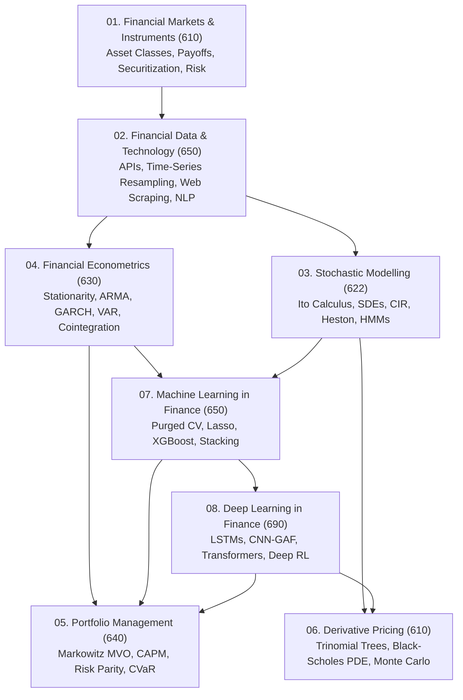

# WorldQuant University (WQU) - MScFE Repository Knowledge Map

Welcome to the comprehensive quantitative finance repository for the **WorldQuant University (WQU) Master of Science in Financial Engineering (MScFE)** program.

This repository organizes code implementations, Jupyter notebooks, theoretical lecture notes, empirical datasets, and Group Work Projects (GWPs) across all core disciplines of financial engineering, structured in chronological course sequence (Modules 01 through 08).

---

## 🗺️ Master Curriculum & Knowledge Architecture



---

## 📚 Chronological Curriculum Sequence & Direct Links

Below is the complete WQU MScFE module index organized in official course sequence. Click on any module title to access its dedicated, fully-detailed `README.md` containing lesson breakdowns, mathematical equations, visual diagrams, embedded charts, key takeaways, and cross-module linkages.

| Module Directory | WQU Course Code | Primary Topics & Visual Highlights |
| :--- | :--- | :--- |
| **[01_financial_market](./01_financial_market/README.md)** | MScFE 610 | Market structures, option payoffs, Merton structural model diagram, securitization cash flow waterfall, 2008 crisis. |
| **[02_financial_data](./02_financial_data/README.md)** | MScFE 650 / 610 | Financial REST APIs, OHLCV tick resampling diagram, SEC 10-K web scraping, alternative text sentiment NLP (Reddit, Twitter), SQL ETL pipeline. |
| **[03_stochastic_modelling](./03_stochastic_modelling/README.md)** | MScFE 622 | Brownian Motion, Ito Calculus, CIR, Heston/Bates option charts, HMM 3-state regime transition diagram & TAA backtest charts, Financial Networks. |
| **[04_financial_econometrics](./04_financial_econometrics/README.md)** | MScFE 630 | Stationarity (ADF), Box-Jenkins ARIMA workflow diagram, GARCH volatility, VAR, Johansen Cointegration VECM pairs trading pipeline. |
| **[05_portfolio_management](./05_portfolio_management/README.md)** | MScFE 640 | Markowitz Efficient Frontier & CAL diagram, CAPM, Fama-French 3/5 factor models, Risk Parity vs 60/40 diagram, VaR & CVaR coherence. |
| **[06_derivative_pricing](./06_derivative_pricing/README.md)** | MScFE 610 | Lattice branching diagram (Binomial vs Trinomial), Dynamic Delta Hedging loop, Black-Scholes PDE derivation, embedded Trinomial GWP analysis chart. |
| **[07_machine_learning](./07_machine_learning/README.md)** | MScFE 650 | Purged & Embargoed K-Fold CV Gantt chart, Regularization (Lasso/Ridge), XGBoost, Credit Scoring (WoE/IV/SHAP), Multi-Model Stacking Ensemble diagram (GWP2). |
| **[08_deep_learning](./08_deep_learning/README.md)** | MScFE 690 | MLPs, LSTMs/GRUs, 2D CNN-GAF visual image pipeline diagram, Transformer Multi-Head Attention diagram, DRL (DQN/PPO), embedded GWP equity curve charts. |

---

## 🖼️ Repository Visual Artifact Gallery

| Module | Visual Artifact / Chart | Description |
| :---: | :---: | :--- |
| **03_stochastic_modelling** |  | 3-State Gaussian HMM volatility regimes fitted on VIX data. |
| **03_stochastic_modelling** |  | Backtest cumulative return of HMM Tactical Asset Allocation vs Benchmark. |
| **06_derivative_pricing** |  | Convergence, early exercise boundary, and parameter sensitivity of American Trinomial options. |
| **08_deep_learning** |  | Out-of-sample performance comparison across deep sequence architectures. |
| **08_deep_learning** |  | Walk-forward validation equity curves for deep learning models. |

---

## 🔑 Synthesis of Core Quantitative Methodologies

### 1. Continuous Calculus & Derivative Valuation
- **Ito's Lemma**: Expands functions of continuous stochastic processes $df(t, S_t) = \left(\frac{\partial f}{\partial t} + \mu S \frac{\partial f}{\partial S} + \frac{1}{2} \sigma^2 S^2 \frac{\partial^2 f}{\partial S^2}\right)dt + \sigma S \frac{\partial f}{\partial S} dW_t$.
- **Black-Scholes PDE**: Under risk-neutral measure $\mathbb{Q}$, delta-hedged derivative prices satisfy $\frac{\partial C}{\partial t} + r S \frac{\partial C}{\partial S} + \frac{1}{2} \sigma^2 S^2 \frac{\partial^2 C}{\partial S^2} - r C = 0$.
- **Heston Stochastic Volatility**: Relaxes constant volatility: $dv_t = \kappa(\theta - v_t)dt + \xi \sqrt{v_t} dW_t^v$.

### 2. Time-Series Econometrics & Cointegration
- **Stationarity**: Raw asset prices $P_t \sim I(1)$ contain unit roots; log returns $r_t = \ln(P_t/P_{t-1}) \sim I(0)$ are stationary for statistical inference.
- **GARCH(1,1)**: Captures empirical volatility clustering: $\sigma_t^2 = \omega + \alpha_1 \epsilon_{t-1}^2 + \beta_1 \sigma_{t-1}^2$.
- **Cointegration & VECM**: Stationary spread $e_t = Y_t - \beta X_t \sim I(0)$ powers mean-reverting statistical arbitrage pairs trading.

### 3. Machine Learning & Deep Learning Validation
- **Purged Cross-Validation**: Standard $K$-Fold leaks future time-series information. Purging label overlaps and embargoing adjacent training samples is required to evaluate financial ML models.
- **Hierarchical Risk Parity (HRP)**: Uses tree clustering on return correlation distances to allocate portfolio risk without matrix inversion.
- **Sequential Attention**: Transformer multi-head self-attention $\text{softmax}\left(\frac{QK^T}{\sqrt{d_k}}\right)V$ captures long-range temporal dependencies in market data.

---

## 🛠️ Repository Directory Hierarchy

```
wqu/
├── 01_financial_market/        # MScFE 610: Asset Classes, Option Payoffs, Securitization, Crises
├── 02_financial_data/          # MScFE 650/610: Ingestion, Resampling, Web Scraping, Social NLP
├── 03_stochastic_modelling/    # MScFE 622: Ito Calculus, SDEs, CIR, Heston, HMM Regimes (GWP2)
├── 04_financial_econometrics/  # MScFE 630: Stationarity, ARIMA, GARCH, VAR, Cointegration, VECM
├── 05_portfolio_management/    # MScFE 640: Mean-Variance, CAPM, Factor Models, Risk Parity, VaR/CVaR
├── 06_derivative_pricing/      # MScFE 610: Binomial/Trinomial Trees, Black-Scholes, Monte Carlo
├── 07_machine_learning/        # MScFE 650: Supervised ML, Tree Ensembles, Purged CV, Stacking (GWP2)
├── 08_deep_learning/           # MScFE 690: Deep Neural Networks, CNN-GAF, Transformers, Deep RL
└── unsorted/                   # Miscellaneous notebooks and legacy code
```

---

## 🎯 Getting Started & Usage

Each directory contains standalone Jupyter notebooks (`.ipynb`), Python module scripts (`.py`), lecture documents (`.pdf`), and data files (`.csv`, `.json`). Navigate to any module folder listed above to explore specific code implementations, visual diagrams, and theoretical notes.
