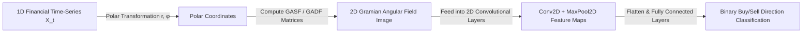

# Deep Learning in Finance (MScFE 690)

This directory contains Jupyter notebooks, Python scripts, lecture materials, and Group Work Projects (GWP) for **Deep Learning in Finance**. The module spans feedforward neural networks, recurrent sequence architectures (LSTM/GRU), time-series image encodings (CNN-GAF), Transformers, Autoencoders for yield curve modeling, Deep Reinforcement Learning (DRL) for algorithmic trading, and Generative Adversarial Networks (GANs).

---

## 📚 Module Overview

- **Course Code**: MScFE 690
- **Primary Focus**: Deep neural networks applied to quantitative finance, sequence forecasting, spatial time-series encoding (Gramian Angular Fields), self-attention Transformers, Deep RL execution policy learning, and synthetic scenario generation.
- **Key Stack**: Python (`PyTorch`, `TensorFlow`/`Keras`, `scikit-learn`, `numpy`, `matplotlib`).

---

## 📊 Visual Frameworks & Architecture

### 1. 2D CNN-GAF Time-Series Image Pipeline (Module 3)



### 2. Transformer Multi-Head Attention Mechanism (Module 4)

```mermaid
flowchart TD
    Input[Time-Series Feature Matrix X] --> QKV[Linear Projections: Q = X W_Q, K = X W_K, V = X W_V]
    QKV --> MatMul[Matrix Multiplication: Q * K^T]
    MatMul --> Scale[Scale by 1 / sqrt(d_k)]
    Scale --> Softmax[Softmax Normalization -> Attention Matrix]
    Softmax --> WeightedV[Multiply by Values V]
    WeightedV --> Concat[Concatenate Multi-Head Outputs]
    Concat --> Dense[Final Dense Output Projection]
```

---

## 📖 Sub-Module & Detailed File Breakdown

### [Module 1: Neural Network Foundations & Optimization](./M1)
- **Lessons & Code**:
  - [`M1/L1.ipynb`](./M1/L1.ipynb) & [`M1/L1.pdf`](./M1/L1.pdf): Multi-Layer Perceptron (MLP) dense architecture $z = \mathbf{W}\mathbf{x} + \mathbf{b}$, activation functions (ReLU, GELU, Sigmoid).
  - [`M1/L2.ipynb`](./M1/L2.ipynb) & [`M1/L2.pdf`](./M1/L2.pdf): Forward pass computation, loss functions (MSE, Binary Cross-Entropy).
  - [`M1/L3.ipynb`](./M1/L3.ipynb) & [`M1/L3.pdf`](./M1/L3.pdf): Backpropagation algorithm, chain rule gradient updates.
  - [`M1/L4.ipynb`](./M1/L4.ipynb) & [`M1/L4.pdf`](./M1/L4.pdf): Optimizers (SGD, Adam), learning rate scheduling, Dropout, $L_2$ weight decay.

---

### [Module 2: Recurrent Neural Networks (RNN, LSTM, GRU)](./M2)
- **Lessons & Code**:
  - [`M2/L1.ipynb`](./M2/L1.ipynb) & [`M2/L1.pdf`](./M2/L1.pdf): Unrolled Vanilla RNN hidden state updates.
  - [`M2/L2.ipynb`](./M2/L2.ipynb) & [`M2/L2.pdf`](./M2/L2.pdf): Vanishing and exploding gradient analysis in sequence modeling.
  - [`M2/L3.ipynb`](./M2/L3.ipynb) & [`M2/L3.pdf`](./M2/L3.pdf): Long Short-Term Memory (LSTM) cell architecture (Forget, Input, Output gates, Cell state $C_t$).
  - [`M2/L4.ipynb`](./M2/L4.ipynb) & [`M2/L4.pdf`](./M2/L4.pdf): Gated Recurrent Units (GRU) sequence prediction.

---

### [Module 3: 1D-CNNs & Gramian Angular Fields (GAF)](./M3)
- **Lessons & Code**:
  - [`M3/L1.ipynb`](./M3/L1.ipynb) & [`M3/L1.pdf`](./M3/L1.pdf): 1D Convolutional Neural Networks for local feature extraction.
  - [`M3/L2.ipynb`](./M3/L2.ipynb) & [`M3/L2.pdf`](./M3/L2.pdf): Gramian Angular Summation Field (GASF) & Difference Field (GADF) math.
  - [`M3/L3.ipynb`](./M3/L3.ipynb) & [`M3/L3.pdf`](./M3/L3.pdf): Markov Transition Fields (MTF) time-series visual encoding.
  - [`M3/L4.ipynb`](./M3/L4.ipynb) & [`M3/L4.pdf`](./M3/L4.pdf): 2D-CNN image classification architectures on GAF inputs.

---

### [Module 4: Attention Mechanisms & Transformers](./M4)
- **Lessons & Code**:
  - [`M4/L1.ipynb`](./M4/L1.ipynb) & [`M4/L1.pdf`](./M4/L1.pdf): Scaled Dot-Product Self-Attention $\text{Attention}(Q, K, V) = \text{softmax}\left(\frac{QK^T}{\sqrt{d_k}}\right) V$.
  - [`M4/L2.ipynb`](./M4/L2.ipynb) & [`M4/L2.pdf`](./M4/L2.pdf): Multi-Head Attention parallel projections.
  - [`M4/L3.ipynb`](./M4/L3.ipynb) & [`M4/L3.pdf`](./M4/L3.pdf): Sinusoidal positional encodings.
  - [`M4/L4.ipynb`](./M4/L4.ipynb) & [`M4/L4.pdf`](./M4/L4.pdf): Temporal Fusion Transformers (TFT) for time-series forecasting.

---

### [Module 5: Autoencoders & Dimensionality Reduction](./M5)
- **Lessons & Code**:
  - [`M5/L1.ipynb`](./M5/L1.ipynb) & [`M5/L1.pdf`](./M5/L1.pdf): Standard bottleneck Autoencoder encoder/decoder networks.
  - [`M5/L2.ipynb`](./M5/L2.ipynb) & [`M5/L2.pdf`](./M5/L2.pdf): Denoising Autoencoders for financial noise reduction.
  - [`M5/L3.ipynb`](./M5/L3.ipynb) & [`M5/L3.pdf`](./M5/L3.pdf): Variational Autoencoders (VAE) & KL-divergence loss.
  - [`M5/L4.ipynb`](./M5/L4.ipynb) & [`M5/L4.pdf`](./M5/L4.pdf): Yield curve latent representation and anomaly detection.

---

### [Module 6: Deep Reinforcement Learning (DRL)](./M6)
- **Lessons & Code**:
  - [`M6/L1.ipynb`](./M6/L1.ipynb) & [`M6/L1.pdf`](./M6/L1.pdf): Markov Decision Process (MDP) state-action-reward formulation.
  - [`M6/L2.ipynb`](./M6/L2.ipynb) & [`M6/L2.pdf`](./M6/L2.pdf): Deep Q-Networks (DQN) with experience replay buffers.
  - [`M6/L3.ipynb`](./M6/L3.ipynb) & [`M6/L3.pdf`](./M6/L3.pdf): Policy Gradient methods & Proximal Policy Optimization (PPO).
  - [`M6/L4.ipynb`](./M6/L4.ipynb) & [`M6/L4.pdf`](./M6/L4.pdf): Deep Deterministic Policy Gradient (DDPG) continuous portfolio management.

---

### [Module 7 & GWPs: Advanced Deep Learning & Group Projects](./M7) & [GWP](./GWP)
- **Lessons & Code**:
  - [`M7/L1.ipynb`](./M7/L1.ipynb) through [`M7/L4.ipynb`](./M7/L4.ipynb) & lecture PDFs: Generative Adversarial Networks (GANs) and TimeGAN.
- **Group Work Projects**:
  - **GWP 1**: [`GWP/Assignment_1/DL_GWP_1_Final.ipynb`](./GWP/Assignment_1/DL_GWP_1_Final.ipynb) & [`GWP/Assignment_1/README.md`](./GWP/Assignment_1/README.md).
    
    
    *Figure 1: Deep Learning GWP1 model backtest cumulative return comparison.*

  - **GWP 2**: [`GWP/assignment2/G14126_Submission_GWP2/G14126_Deep_Learning_GWP2.ipynb`](./GWP/assignment2/G14126_Submission_GWP2/G14126_Deep_Learning_GWP2.ipynb) & [`GWP/assignment2/README.md`](./GWP/assignment2/README.md).
    
    
    *Figure 2: Out-of-sample walk-forward equity curves for GWP2 deep learning models.*

---

## 🔑 Key Takeaways & Deep Learning Rules

1. **Avoid Overfitting via Regularization**: Deep neural networks easily overfit financial market noise. Strict early stopping, dropout ($p \in [0.2, 0.5]$), weight decay, and purged walk-forward validation are critical.
2. **LSTM Cell State Preserves Long-Memory**: The additive linear update of the LSTM cell state $C_t$ prevents vanishing gradients, enabling the model to learn long-term financial dependencies across hundreds of time steps.
3. **GAF Preserves Temporal Correlations**: Transforming 1D time-series into 2D Gramian Angular Fields preserves temporal correlations in quasi-Gramian matrices, allowing computer vision 2D-CNNs to detect geometric chart patterns.
4. **Attention Scales Beyond Recurrence**: Transformers eliminate sequential recurrent bottlenecks by computing parallel self-attention across all time steps simultaneously, scaling effectively to massive market datasets.

---

## 🔗 Cross-Module Knowledge Linkages

- **$\to$ [Machine Learning](../machine_learning/README.md)**: Deep Learning builds upon foundational ML concepts (bias-variance, loss functions, purged cross-validation).
- **$\to$ [Financial Data](../financial_data/README.md)**: Intraday resampled OHLCV bars and scraped alternative text feed directly into LSTMs, CNNs, and Transformers.
- **$\to$ [Portfolio Management](../portfolio_management/README.md)**: Deep Reinforcement Learning (DDPG, PPO) continuously solves dynamic multi-asset allocation and risk budgeting problems.
- **$\to$ [Stochastic Modelling](../stochastic_modelling/README.md)**: Generative Adversarial Networks (TimeGAN) complement traditional SDE path generation (Heston/Bates) for synthetic stress testing.
