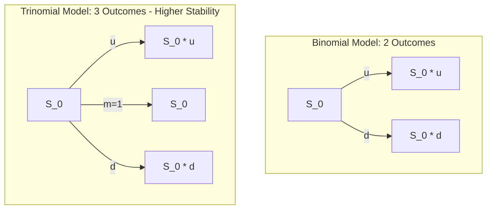

# Derivative Pricing & Financial Derivatives (MScFE 610)

This repository contains lecture materials, Jupyter notebooks, Python scripts, and Group Work Projects (GWP) for **Derivative Pricing**. The module progresses from discrete-time lattice models (Binomial & Trinomial trees) to continuous-time stochastic differential equations (Black-Scholes PDE, Ito's Lemma) and interest rate modeling.

---

## 📚 Module Overview

- **Course Code**: MScFE 610
- **Primary Focus**: Pricing and hedging derivative securities, risk-neutral valuation, discrete binomial/trinomial trees, continuous stochastic calculus, Monte Carlo option pricing, Vasicek interest rate model.
- **Key Tools**: Python (`numpy`, `scipy`, `matplotlib`), object-oriented trinomial tree option pricing framework.

---

## 📊 Visual Frameworks & Architecture

### 1. Lattice Branching Architecture (Binomial vs. Trinomial)



### 2. Dynamic Delta Hedging Execution Loop


### 3. Continuous Calculus Derivation Pipeline

```mermaid
flowchart TD
    GBM[Geometric Brownian Motion: dS = μS dt + σS dW] -->|Apply Ito's Lemma| Ito[df = (f_t + μS f_S + 0.5 σ² S² f_SS) dt + σS f_S dW]
    Ito -->|Construct Delta-Hedged Portfolio Π = C - ΔS| Hedge[Eliminate Brownian Motion Risk dW]
    Hedge -->|Set Portfolio Return = r Π dt| BSpde[Black-Scholes PDE: C_t + rS C_S + 0.5 σ² S² C_SS - rC = 0]
    BSpde -->|Apply Boundary Condition C(S,T) = max(S-K, 0)| Solution[Analytical Option Formula / Numerical Grid]
```

---

## 📖 Sub-Module & Detailed File Breakdown

### [Module 2: Binomial Models & Monte Carlo Simulation](./m2)
- **Lesson 1 & 2: Dynamic Delta Hedging**:
  - **Notebook**: [`m2/Lesson 2: Dynamic Delta Hedging.ipynb`](./m2/Lesson%202:%20Dynamic%20Delta%20Hedging.ipynb)
  - **Concepts**: Option delta $\Delta = \frac{\partial C}{\partial S}$, constructing a self-financing risk-free portfolio $\Pi = C - \Delta S$, tracking hedge error under discrete rebalancing.
- **Lesson 3: American Options & Early Exercise**:
  - **Notebook**: [`m2/intro_to_american_options.ipynb`](./m2/intro_to_american_options.ipynb)
  - **Concepts**: Cox-Ross-Rubinstein (CRR) lattice framework ($u = e^{\sigma \sqrt{\Delta t}}$, $d = 1/u$), risk-neutral probability $p = \frac{e^{r \Delta t} - d}{u - d}$. Backward induction evaluating early exercise condition $\max(h(S_t), V_{t}^{\text{hold}})$.
- **Lesson 4: Monte Carlo Simulation**:
  - **Notebook**: [`m2/Lesson 4: Intro to Monte Carlo Methods.ipynb`](./m2/Lesson%204:%20Intro%20to%20Monte%20Carlo%20Methods.ipynb)
  - **Concepts**: Simulating stock trajectories under risk-neutral measure $\mathbb{Q}$, discounting expected payoff $C_0 = e^{-rT} \mathbb{E}^{\mathbb{Q}}[\max(S_T - K, 0)]$, standard error convergence $\mathcal{O}(1/\sqrt{N})$.
- **Assessment**: [`m2/m2_graded_quiz.ipynb`](./m2/m2_graded_quiz.ipynb)

---

### [Module 3: Trinomial Lattice Models](./m3)
- **Lesson 1: The Trinomial Model**:
  - **Notebook**: [`m3/Lesson 1: The Trinomial Model.ipynb`](./m3/Lesson%201:%20The%20Trinomial%20Model.ipynb)
  - **Concepts**: Three price movement factors ($u, m=1, d$), matching log-return variance and drift over step $\Delta t$.
- **Lesson 2: Mathematical Foundations & Probabilities**:
  - **Reading**: [`m3/DP_M3_L2.pdf`](./m3/DP_M3_L2.pdf)
  - **Concepts**: Deriving node probabilities $p_u = \frac{1}{2\lambda^2} + \frac{\nu \sqrt{\Delta t}}{2\lambda \sigma}$, $p_d = \frac{1}{2\lambda^2} - \frac{\nu \sqrt{\Delta t}}{2\lambda \sigma}$, $p_m = 1 - \frac{1}{\lambda^2}$.
- **Lesson 3: Object-Oriented Implementation**:
  - **Notebook**: [`m3/OBJECT-ORIENTED_PROGRAMMING_IN_THE_TRINOMIAL_TREE.ipynb`](./m3/OBJECT-ORIENTED_PROGRAMMING_IN_THE_TRINOMIAL_TREE.ipynb)
  - **Concepts**: Implementing scalable tree classes, encapsulating payoff functions, vectorizing backward propagation.
- **Lesson 4: Pricing Examples & Diagnostics**:
  - **Notebook**: [`m3/PRICING_EXAMPLE_IN_THE_TRINOMIAL_MODEL.ipynb`](./m3/PRICING_EXAMPLE_IN_THE_TRINOMIAL_MODEL.ipynb)
  - **Assessment**: [`m3/m3_graded_quiz.ipynb`](./m3/m3_graded_quiz.ipynb)

---

### [Module 4: Continuous Calculus & Black-Scholes](./m4)
- **Lesson 1: Markov Property & Geometric Brownian Motion**:
  - **Notebook**: [`m4/Lesson 1: Markov's property and GBM.ipynb`](./m4/Lesson%201:%20Markov's%20property%20and%20GBM.ipynb)
  - **Data**: [`m4/TSLA_wqu_data.csv`](./m4/TSLA_wqu_data.csv)
  - **Concepts**: Memoryless property, drift ($\mu$) and volatility ($\sigma$) estimation from Tesla historical equity data.
- **Lesson 2: Ito's Lemma & Black-Scholes PDE**:
  - **Notebook**: [`m4/Lesson 2: Ito's Lemma and Black-Scholes model.ipynb`](./m4/Lesson%202:%20Ito's%20Lemma%20and%20Black-Scholes%20model.ipynb)
  - **Concepts**: Multi-variable Ito chain rule, non-linear diffusion terms, partial differential equation derivation.
- **Lesson 3: Closed-Form Solutions & Monte Carlo Variance Reduction**:
  - **Notebook**: [`m4/Lesson 3: Black-Scholes and Monte Carlo Methods.ipynb`](./m4/Lesson%203:%20Black-Scholes%20and%20Monte%20Carlo%20Methods.ipynb)
  - **Concepts**: Black-Scholes formula $C = S N(d_1) - K e^{-rT} N(d_2)$, antithetic variates for variance reduction.
- **Lesson 4: Vasicek Interest Rate Model**:
  - **Notebook**: [`m4/Lesson 4: Simulating Interest Rates: Vasicek Model.ipynb`](./m4/Lesson%204:%20Simulating%20Interest%20Rates:%20Vasicek%20Model.ipynb)
  - **Concepts**: Mean-reverting interest rate SDE $dr_t = a(b - r_t)dt + \sigma dW_t$, zero-coupon bond pricing.

---

### [Module 5: Empirical Financial Analysis](./m5)
- **Lecture Reading**: [`m5/DP_M5_L3.pdf`](./m5/DP_M5_L3.pdf), [`m5/Transcript Module 5_Lesson 3.pdf`](./m5/Transcript%20Module%205_Lesson%203.pdf)
- **Quizzes**: [`m5/graded_quiz.ipynb`](./m5/graded_quiz.ipynb), [`m5/optimized_quiz.ipynb`](./m5/optimized_quiz.ipynb)

---

### [Module 7 & Projects: Advanced Options](./m7)
- **Notebooks**: [`m7/Project.ipynb`](./m7/Project.ipynb), [`m7/L1_Project.ipynb`](./m7/L1_Project.ipynb), [`m7/L2_Project.ipynb`](./m7/L2_Project.ipynb), [`m7/L4_Project.ipynb`](./m7/L4_Project.ipynb), [`m7/DP_GWP_2.ipynb`](./m7/DP_GWP_2.ipynb)

---

### [GWP: Complete Trinomial Option Pricing System](./gwp)

The Group Work Project implements a complete Python framework for pricing European and American options using trinomial trees.

#### System File Manifest:
- **`gwp/american_trinomial.py`**: Pricing engine for American Call/Put options with early exercise backward induction.
- **`gwp/european_trinomial.py`**: Pricing engine for European options.
- **`gwp/trinomial_analysis.py`**: Grid convergence testing, error benchmarking against Black-Scholes.
- **`gwp/trinomial_options_complete.ipynb`**: Complete executable notebook detailing mathematical derivations and execution.
- **`gwp/README.md`**: Project specific documentation.

#### Key Result Chart:

*Figure 1: Numerical convergence, early exercise boundaries, and parameter sensitivity analysis generated by `gwp/trinomial_analysis.py`.*

---

## 🔑 Key Takeaways & Pricing Principles

1. **Risk-Neutral Valuation**: Options are priced under measure $\mathbb{Q}$ where expected asset return equals risk-free rate $r$.
2. **Trinomial Stability**: Trinomial trees eliminate node-odd/even oscillations present in standard binomial trees, converging faster to analytical Black-Scholes values.
3. **American Early Exercise Boundary**: American Puts carry an early exercise premium when intrinsic value $K - S_t$ exceeds the discounted continuation value.

---

## 🔗 Cross-Module Knowledge Linkages

- **$\to$ [Stochastic Modelling](../stochastic_modelling/README.md)**: Continuous Ito calculus and Vasicek rates connect to CIR and Heston stochastic volatility models.
- **$\to$ [Financial Markets](../financial_market/README.md)**: Option payoff mechanics form the foundational contracts priced in this directory.
- **$\to$ [Deep Learning](../deep_learning/README.md)**: Deep Hedging models optimize option portfolios under market frictions where Black-Scholes assumptions break down.