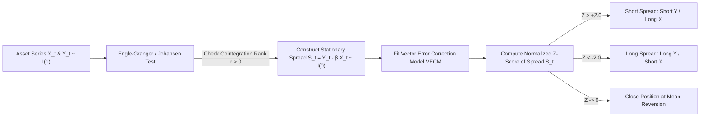

# Financial Econometrics & Time Series Analysis (MScFE 630)

This directory contains analytical code, datasets, and lecture notes for **Financial Econometrics**. This module focuses on statistical time-series modeling, stationarity, autoregressive integrated moving average (ARIMA) models, conditional heteroskedasticity (GARCH family), multivariate VAR/VECM models, and cointegration for statistical arbitrage.

---

## 📚 Module Overview

- **Course Code**: MScFE 630
- **Primary Focus**: Time series properties of asset returns, stationary vs non-stationary dynamics, volatility modeling, multivariate econometric systems, and cointegration.
- **Key Tools**: Python (`statsmodels`, `arch`, `scipy`, `pandas`), R (in M3), Augmented Dickey-Fuller (ADF) test, Johansen test, GARCH implementations.

---

## 📊 Visual Frameworks & Architecture

### 1. Box-Jenkins ARIMA Model Identification Workflow (Module 2)

```mermaid
flowchart TD
    Raw["Raw Asset Prices P_t"] --> Test["Stationarity Test: ADF / KPSS"]
    Test -->|Non-Stationary I(1)| Diff["Difference Series d Times: r_t = (1-B)^d P_t"]
    Test -->|Stationary I(0)| ACF["Compute ACF & PACF Plots"]
    Diff --> ACF
    
    ACF --> Identify["Identify AR(p) & MA(q) Cuts/Decays"]
    Identify --> Estimate["Estimate ARIMA(p,d,q) Coefficients via Maximum Likelihood"]
    Estimate --> Diag["Residual Diagnostics: Ljung-Box White Noise Test"]
    
    Diag -->|Residuals are White Noise| Forecast["Generate Out-of-Sample Forecasts"]
    Diag -->|Residual Heteroskedasticity| GARCH["Pass Residuals to GARCH Volatility Model"]
```

### 2. Cointegration & VECM Pairs Trading Pipeline (Module 5)



---

## 📖 Sub-Module & Detailed File Breakdown

### [Module 1: Foundations of Financial Time Series](./M1)
- **Notebooks & Materials**:
  - [`M1/financial_econometrics_module_1_lesson_1.ipynb`](./M1/financial_econometrics_module_1_lesson_1.ipynb) & [`M1/L1-reading.pdf`](./M1/L1-reading.pdf): Log returns $r_t = \ln(P_t / P_{t-1})$, heavy tails (kurtosis $> 3$), skewness.
  - [`M1/financial_econometrics_module_1_lesson_2.ipynb`](./M1/financial_econometrics_module_1_lesson_2.ipynb) & [`M1/L2.pdf`](./M1/L2.pdf): Strict vs covariance (weak) stationarity conditions.
  - [`M1/financial_econometrics_module_1_lesson_3.ipynb`](./M1/financial_econometrics_module_1_lesson_3.ipynb) & [`M1/L3-reading.pdf`](./M1/L3-reading.pdf): Autocorrelation Function (ACF), Partial Autocorrelation (PACF), Ljung-Box test.
  - [`M1/financial_econometrics_module_1_lesson_4.ipynb`](./M1/financial_econometrics_module_1_lesson_4.ipynb) & [`M1/L4-reading.pdf`](./M1/L4-reading.pdf): Augmented Dickey-Fuller (ADF) test, KPSS unit root testing.

---

### [Module 2: Univariate Time Series Models (ARMA / ARIMA)](./M2)
- **Notebooks & Materials**:
  - [`M2/financial_econometrics_module_2_lesson_1.ipynb`](./M2/financial_econometrics_module_2_lesson_1.ipynb) & [`M2/L1-reading.pdf`](./M2/L1-reading.pdf): Autoregressive models AR(p), characteristic roots inside unit circle.
  - [`M2/financial_econometrics_module_2_lesson_2.ipynb`](./M2/financial_econometrics_module_2_lesson_2.ipynb) & [`M2/L2-reading.pdf`](./M2/L2-reading.pdf): Moving Average models MA(q) and invertibility conditions.
  - [`M2/financial_econometrics_module_2_lesson_3.ipynb`](./M2/financial_econometrics_module_2_lesson_3.ipynb) & [`M2/L3-reading.pdf`](./M2/L3-reading.pdf): ARMA(p,q) & ARIMA(p,d,q) Box-Jenkins model identification.
  - [`M2/financial_econometrics_module_2_lesson_4.ipynb`](./M2/financial_econometrics_module_2_lesson_4.ipynb): Information criteria (AIC, BIC), out-of-sample evaluation.
- **Dataset**: [`M2/M2. module_2_data.csv`](./M2/M2.%20module_2_data.csv).

---

### [Module 3: Conditional Heteroskedasticity & Volatility (ARCH / GARCH)](./M3)
- **Notebooks & Materials**:
  - [`M3/financial_econometrics_module_3_lesson_1.ipynb`](./M3/financial_econometrics_module_3_lesson_1.ipynb) & [`M3/L1-reading.pdf`](./M3/L1-reading.pdf): Stylized facts of volatility (clustering, fat tails).
  - [`M3/financial_econometrics_module_3_lesson_2.ipynb`](./M3/financial_econometrics_module_3_lesson_2.ipynb) & [`M3/Module 3 Lesson 2 R code.R`](./M3/Module%203%20Lesson%202%20R%20code.R): ARCH(q) model derivation.
  - [`M3/financial_econometrics_module_3_lesson_3.ipynb`](./M3/financial_econometrics_module_3_lesson_3.ipynb) & [`M3/L3-reading.pdf`](./M3/L3-reading.pdf): GARCH(p,q) model ($\sigma_t^2 = \omega + \alpha \epsilon_{t-1}^2 + \beta \sigma_{t-1}^2$), persistence parameter $\alpha + \beta < 1$.
  - [`M3/financial_econometrics_module_3_lesson_4.ipynb`](./M3/financial_econometrics_module_3_lesson_4.ipynb) & [`M3/L4-reading.pdf`](./M3/L4-reading.pdf): Asymmetric leverage effect, EGARCH and GJR-GARCH / TGARCH models.
- **Dataset**: [`M3/M3. bond_and_stock_data.csv`](./M3/M3.%20bond_and_stock_data.csv).

---

### [Module 4: Multivariate Time Series Analysis (VAR)](./M4)
- **Notebooks & Materials**:
  - [`M4/financial_econometrics_module_4_lesson_1.ipynb`](./M4/financial_econometrics_module_4_lesson_1.ipynb) & [`M4/L1-reading.pdf`](./M4/L1-reading.pdf): Vector Autoregression VAR(p) systems.
  - [`M4/financial_econometrics_module_4_lesson_2.ipynb`](./M4/financial_econometrics_module_4_lesson_2.ipynb): Granger Causality tests.
  - [`M4/financial_econometrics_module_4_lesson_3.ipynb`](./M4/financial_econometrics_module_4_lesson_3.ipynb) & [`M4/L3-reading.pdf`](./M4/L3-reading.pdf): Impulse Response Functions (IRF).
  - [`M4/financial_econometrics_module_4_lesson_4.ipynb`](./M4/financial_econometrics_module_4_lesson_4.ipynb) & [`M4/L4-reading.pdf`](./M4/L4-reading.pdf): Forecast Error Variance Decomposition (FEVD).
- **Datasets**: [`M4/M4. dxy_r_data.csv`](./M4/M4.%20dxy_r_data.csv), [`M4/M4. goog_eur_10.csv`](./M4/M4.%20goog_eur_10.csv).

---

### [Module 5: Cointegration & Pairs Trading (VECM)](./M5)
- **Notebooks & Materials**:
  - [`M5/financial_econometrics_module_5_lesson_1.ipynb`](./M5/financial_econometrics_module_5_lesson_1.ipynb) & [`M5/L1-reading.pdf`](./M5/L1-reading.pdf): Spurious regression between non-stationary series.
  - [`M5/financial_econometrics_module_5_lesson_2.ipynb`](./M5/financial_econometrics_module_5_lesson_2.ipynb): Engle-Granger two-step cointegration method.
  - [`M5/financial_econometrics_module_5_lesson_3.ipynb`](./M5/financial_econometrics_module_5_lesson_3.ipynb) & [`M5/L3-reading.pdf`](./M5/L3-reading.pdf): Johansen cointegration test & Vector Error Correction Models (VECM).

---

### [Module 6: Advanced Econometric Topics](./M6)
- **Notebooks & Materials**:
  - [`M6/financial_econometrics_module_6_lesson_1.ipynb`](./M6/financial_econometrics_module_6_lesson_1.ipynb): Long Memory processes & ARFIMA fractional integration parameter $d \in (0, 0.5)$.
  - [`M6/financial_econometrics_module_6_lesson_2.ipynb`](./M6/financial_econometrics_module_6_lesson_2.ipynb) & [`M6/L2-reading.pdf`](./M6/L2-reading.pdf): Structural breaks (Chow test, QLR test).
  - [`M6/financial_econometrics_module_6_lesson_3.ipynb`](./M6/financial_econometrics_module_6_lesson_3.ipynb) & [`M6/L3-reading.pdf`](./M6/L3-reading.pdf): High-frequency realized volatility estimators.
- **Datasets**: [`M6/M6. forex_1.csv`](./M6/M6.%20forex_1.csv), [`M6/M6. goog_eur_10.csv`](./M6/M6.%20goog_eur_10.csv).

---

## 🔑 Key Takeaways & Econometric Insights

1. **Non-Stationarity of Prices vs Stationarity of Returns**: Raw asset prices $P_t$ exhibit unit roots $I(1)$. Log returns $r_t \sim I(0)$ are stationary, enabling valid statistical inference.
2. **GARCH Volatility Persistence**: In GARCH(1,1), $\alpha_1 + \beta_1$ measures volatility persistence. If $\alpha_1 + \beta_1 \approx 1$, shocks decay extremely slowly (IGARCH).
3. **Cointegration vs Correlation**: Cointegration guarantees that a linear combination of non-stationary series is stationary $I(0)$, providing mean-reverting properties essential for pairs trading.
4. **Asymmetric Leverage Effect**: Negative return shocks increase financial leverage, triggering higher future volatility than positive shocks of equal magnitude.

---

## 🔗 Cross-Module Knowledge Linkages

- **$\to$ [Stochastic Modelling](../stochastic_modelling/README.md)**: GARCH volatility models connect to continuous-time stochastic volatility models (Heston SDE).
- **$\to$ [Machine Learning](../machine_learning/README.md)**: Econometric ARIMA/VAR models provide baseline benchmarks for time-series forecasting.
- **$\to$ [Portfolio Management](../portfolio_management/README.md)**: Multivariate GARCH models supply dynamic conditional covariance matrices $\mathbf{\Sigma}_t$ for portfolio optimization.
