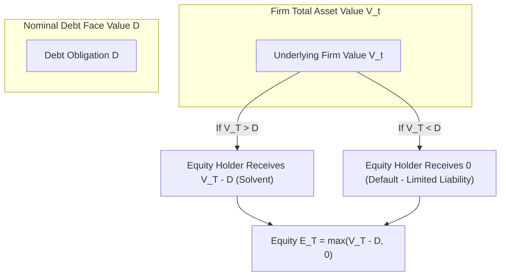
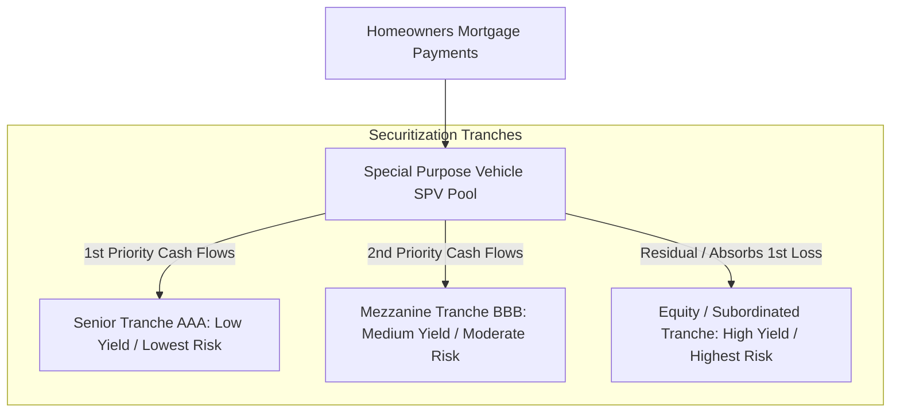

# Financial Markets & Instruments (MScFE 610)

This directory contains learning materials, lecture notes, and quantitative frameworks for **Financial Markets & Instruments**. This module provides the structural, institutional, and mathematical foundation of modern financial systems, market participants, asset classes, and risk mechanisms.

---

## 📚 Module Overview

- **Course Code**: MScFE 610
- **Primary Focus**: Financial market architecture, asset classes (Equities, Fixed Income, Derivatives, Crypto), credit risk, securitization, options mechanics, and financial crises.
- **Key Tools**: Mathematical modeling of returns, asset valuation under friction, option payoff analysis, portfolio variance calculation.

---

## 📊 Visual Frameworks & Architecture

### 1. Merton Structural Default Model (Equity as a Call Option)

### 2. Securitization Cash Flow Waterfall Structure (Module 5)

---

## 📖 Sub-Module & Detailed File Breakdown

### [Module 1: Foundations of Financial Systems](./M1)
- **Lesson PDF Materials**:
  - [`M1/Lesson 1: Saving & Borrowing.pdf`](./M1/Lesson%201:%20Saving%20&%20Borrowing.pdf): Time value of money, interest rate structures, intertemporal consumption.
  - [`M1/Lesson 2: Counterparties and credit risk.pdf`](./M1/Lesson%202:%20Counterparties%20and%20credit%20risk.pdf): Counterparty exposure, credit risk mitigation, collateral netting.
  - [`M1/Lesson 3: Buying and Selling Short.pdf`](./M1/Lesson%203:%20Buying%20and%20Selling%20Short.pdf): Margin accounts, short squeezes, borrow fees, location mechanisms.
  - [`M1/Lesson 4: Surveying the Financial Industry.pdf`](./M1/Lesson%204:%20Surveying%20the%20Financial%20Industry.pdf): Institutional landscape (investment banks, asset managers, central banks).

---

### [Module 2: Stocks & Cryptocurrencies](./M2)
- **Lesson PDF Materials**:
  - [`M2/Lesson 1: Introducing Stocks and Cryptocurrencies.pdf`](./M2/Lesson%201:%20Introducing%20Stocks%20and%20Cryptocurrencies.pdf): Order books, centralized vs decentralized exchanges, blockchain ledgers.
  - [`M2/Lesson 2: Types of Stocks and Cryptocurrencies.pdf`](./M2/Lesson%202:%20Types%20of%20Stocks%20and%20Cryptocurrencies.pdf): Common vs preferred stock, voting rights, utility vs security tokens.
  - [`M2/Lesson 3: Measuring the Performance of Stocks and Cryptocurrencies.pdf`](./M2/Lesson%203:%20Measuring%20the%20Performance%20of%20Stocks%20and%20Cryptocurrencies.pdf): Simple vs log returns, CAGR, annualized volatility ($\sigma = \sigma_{\text{daily}}\sqrt{252}$), Sharpe ratio.
  - [`M2/Lesson 4: Modeling the Performance of Stocks and Cryptocurrencies.pdf`](./M2/Lesson%204:%20Modeling%20the%20Performance%20of%20Stocks%20and%20Cryptocurrencies.pdf): Log-normal stock price distributions and random walks.

---

### [Module 3: Portfolio Fundamentals & ETFs](./M3)
- **Lesson PDF Materials**:
  - [`M3/Lesson 1: Portfolio Returns and Standard Deviations.pdf`](./M3/Lesson%201:%20Portfolio%20Returns%20and%20Standard%20Deviations.pdf): Portfolio return $R_p = \sum w_i R_i$, portfolio variance $\sigma_p^2 = w^T \Sigma w$.
  - [`M3/Lesson 2: Correlation.pdf`](./M3/Lesson%202:%20Correlation.pdf): Covariance $\sigma_{ij}$, correlation matrix properties ($\rho \in [-1,1]$), diversification benefits.
  - [`M3/Lesson 3: Exchange-Traded Funds.pdf`](./M3/Lesson%203:%20Exchange-Traded%20Funds.pdf): Creation/redemption via Authorized Participants (APs), NAV tracking error.
  - [`M3/Lesson 4: Volatility and Correlations.pdf`](./M3/Lesson%204:%20Volatility%20and%20Correlations.pdf): Dynamic risk-return trade-offs.

---

### [Module 4: Derivatives & Option Strategies](./M4)
- **Lesson PDF Materials**:
  - [`M4/Lesson 1: Derivatives, with an Emphasis on Options.pdf`](./M4/Lesson%201:%20Derivatives,%20with%20an%20Emphasis%20on%20Options.pdf): Calls, Puts, strike $K$, expiry $T$, intrinsic vs time value.
  - [`M4/Lesson 2: Leverage and Non-Linearity.pdf`](./M4/Lesson%202:%20Leverage%20and%20Non-Linearity.pdf): Non-linear option payoff diagrams and return convexity.
  - [`M4/Lesson 3: Home Equity as an Option.pdf`](./M4/Lesson%203:%20Home%20Equity%20as%20an%20Option.pdf): Merton structural model: Home equity as a Call option on housing value.
  - [`M4/Lesson 4: Option Strategies and Scenarios.pdf`](./M4/Lesson%204:%20Option%20Strategies%20and%20Scenarios.pdf): Bull/Bear spreads, Straddles, Strangles, Protective Puts, Covered Calls.

---

### [Module 5: Securitization, Liquidity & Crises](./M5)
- **Lesson PDF Materials**:
  - [`M5/Lesson 1: Securitization.pdf`](./M5/Lesson%201:%20Securitization.pdf): ABS, MBS, Special Purpose Vehicles (SPVs), cash flow waterfall structures.
  - [`M5/Lesson 2: Valuation Challenges: Market Frictions and Model Risk.pdf`](./M5/Lesson%202:%20Valuation%20Challenges:%20Market%20Frictions%20and%20Model%20Risk.pdf): Illiquidity discounts, bid-ask spreads, Gaussian copula model risk.
  - [`M5/Lesson 3: Liquidity and the Credit Market.pdf`](./M5/Lesson%203:%20Liquidity%20and%20the%20Credit%20Market.pdf): Market vs funding liquidity, repo markets, liquidity freeze mechanisms.
  - [`M5/Lesson 4: Leverage and Crisis.pdf`](./M5/Lesson%204:%20Leverage%20and%20Crisis.pdf): 2008 Global Financial Crisis, subprime mortgage defaults, systemic contagion.

---

### [Module 6: Corporate Finance & Stock Selection](./M6)
- **Lesson PDF Materials**:
  - [`M6/Lesson 1: The Balance Sheet: Leverage and Default.pdf`](./M6/Lesson%201:%20The%20Balance%20Sheet:%20Leverage%20and%20Default.pdf): Debt-to-Equity ratios and default thresholds.
  - [`M6/Lesson 2: Debt and Equity Financing: Housing Development Example.pdf`](./M6/Lesson%202:%20Debt%20and%20Equity%20Financing:%20Housing%20Development%20Example.pdf): Modigliani-Miller, WACC, capital structure theory.
  - [`M6/Lesson 3: The Housing Finance Problem and Its Solutions.pdf`](./M6/Lesson%203:%20The%20Housing%20Finance%20Problem%20and%20Its%20Solutions.pdf): Fixed-rate vs Adjustable-rate mortgages (ARM), prepayment risk.
  - [`M6/Lesson 4: More Than One Way to Pick a Stock.pdf`](./M6/Lesson%204:%20More%20Than%20One%20Way%20to%20Pick%20a%20Stock.pdf): DCF valuation, multiples, factor-based stock selection.

---

### [Module 7: Market Stress & Financial Ethics](./M7)
- **Lesson PDF Materials**:
  - [`M7/Lesson 1: Valuation in Normal and Stressed Markets.pdf`](./M7/Lesson%201:%20Valuation%20in%20Normal%20and%20Stressed%20Markets.pdf): Mark-to-market vs mark-to-model pricing.
  - [`M7/Lesson 2: Key Concepts in Financial Markets.pdf`](./M7/Lesson%202:%20Key%20Concepts%20in%20Financial%20Markets.pdf): Efficient Market Hypothesis (EMH forms).
  - [`M7/Lesson 3: Magnifying and Frictional Factors.pdf`](./M7/Lesson%203:%20Magnifying%20and%20Frictional%20Factors.pdf): Forced liquidations, margin call feedback loops.
  - [`M7/Lesson 4: Financial Ethics.pdf`](./M7/Lesson%204:%20Financial%20Ethics.pdf): Insider trading, market manipulation, fiduciary duty.

---

## 🔑 Key Takeaways & Quantitative Insights

1. **Non-Linear Payoff & Asymmetry**: Derivatives introduce non-linear payoffs, altering return distributions from Gaussian bell curves to skewed profiles.
2. **Diversification & Covariance**: Portfolio variance depends on pairwise covariances ($\sigma_{ij}$). As $N \to \infty$, idiosyncratic risk is diversified away, leaving market risk.
3. **Merton Structural View of Equity**: Corporate equity is a European Call Option on underlying firm asset value $V$ with strike equal to debt $D$.
4. **Liquidity Risk vs Solvency Risk**: Funding illiquidity can trigger instantaneous insolvency during market stress when repo funding dries up.

---

## 🔗 Cross-Module Knowledge Linkages

- **$\to$ [Derivative Pricing](../derivative_pricing/README.md)**: Option fundamentals feed directly into binomial/trinomial trees and Black-Scholes PDE derivative engines.
- **$\to$ [Portfolio Management](../portfolio_management/README.md)**: Portfolio variance math ($\sigma_p^2 = w^T \Sigma w$) forms the foundation of Markowitz MVO and CAPM.
- **$\to$ [Stochastic Modelling](../stochastic_modelling/README.md)**: Merton's structural default model relies on Geometric Brownian Motion and jump processes.
