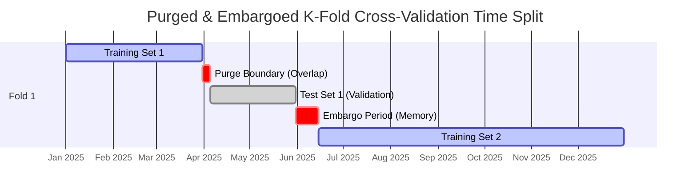

# Machine Learning in Finance (MScFE 650)

This directory contains Jupyter notebooks, Python scripts, lecture slides, datasets, and Group Work Projects (GWP1 & GWP2) for **Machine Learning in Finance**. The module covers supervised regression/classification, unsupervised learning (PCA, Clustering), tree ensembles (Random Forest, XGBoost), financial cross-validation (Purged & Embargoed K-Fold), credit risk scoring, and multi-model Stacking Ensembles.

---

## 📚 Module Overview

- **Course Code**: MScFE 650
- **Primary Focus**: Financial machine learning, avoiding data leakage in non-i.i.d. time series, regularized regression, gradient boosting, feature importance, credit scoring, and meta-learning ensemble architectures.
- **Key Stack**: Python (`scikit-learn`, `xgboost`, `lightgbm`, `shap`, `pandas`, `numpy`), GWP2 stacking pipeline scripts (`run_ensemble.py`, `gwp2_tuning.py`, `run_bv.py`).

---

## 📊 Visual Frameworks & Architecture

### 1. Marcos Lopez de Prado's Purged & Embargoed K-Fold CV (Module 5)



### 2. Multi-Model Stacking Ensemble Architecture (GWP2)

```mermaid
flowchart TD
    Data[Financial Feature Matrix X] --> CV[Purged K-Fold CV Split]
    
    subgraph Level0 [Level-0 Base Learners]
        CV --> Ridge[Ridge Regression L2]
        CV --> RF[Random Forest Ensemble]
        CV --> XGB[XGBoost Gradient Boosting]
        CV --> LGBM[LightGBM Fast Boosting]
    end
    
    Level0 --> OOF[Out-of-Fold (OOF) Prediction Matrix P_oof]
    
    subgraph Level1 [Level-1 Meta-Learner]
        OOF --> Meta[Ridge / Logistic Meta-Learner]
    end
    
    Meta --> Final[Final Combined Class Prediction / Signal]
```

---

## 📖 Sub-Module & Detailed File Breakdown

### [Module 1: Supervised Regression & Regularization](./M1)
- **Lessons & Code**:
  - [`M1/L1.ipynb`](./M1/L1.ipynb): Ordinary Least Squares (OLS) regression assumptions, residual analysis.
  - [`M1/L2.ipynb`](./M1/L2.ipynb): Polynomial regression and feature scaling.
  - [`M1/L3.ipynb`](./M1/L3.ipynb): Decomposing expected prediction error into $\text{Bias}^2 + \text{Variance} + \sigma^2$.
  - [`M1/L4.ipynb`](./M1/L4.ipynb): Regularized regression: Ridge ($L_2$), Lasso ($L_1$), and ElasticNet.
- **Dataset**: [`M1/bank.csv`](./M1/bank.csv) (Banking features dataset).

---

### [Module 2: Classification Models & Risk Metrics](./M2)
- **Lessons & Code**:
  - [`M2/L1.ipynb`](./M2/L1.ipynb) & [`M2/L1.pdf`](./M2/L1.pdf): Logistic regression, sigmoid transformation, log-loss optimization.
  - [`M2/L2.ipynb`](./M2/L2.ipynb) & [`M2/L2.pdf`](./M2/L2.pdf): Decision Trees, Gini Impurity, Information Gain, entropy splitting.
  - [`M2/L3.ipynb`](./M2/L3.ipynb) & [`M2/L3.pdf`](./M2/L3.pdf): Support Vector Machines (SVM), kernel trick (RBF, Polynomial).
  - [`M2/L4.ipynb`](./M2/L4.ipynb) & [`M2/L4.pdf`](./M2/L4.pdf): ROC-AUC curves, Precision-Recall trade-off, confusion matrix evaluation.

---

### [Module 3: Unsupervised Learning & Dimensionality Reduction](./M3)
- **Lessons & Code**:
  - [`M3/L1.pdf`](./M3/L1.pdf) & [`M3/L1-ln.pdf`](./M3/L1-ln.pdf): Principal Component Analysis (PCA) eigendecomposition $\mathbf{\Sigma} = \mathbf{V}\mathbf{\Lambda}\mathbf{V}^T$.
  - [`M3/L2.ipynb`](./M3/L2.ipynb) & [`M3/L2.pdf`](./M3/L2.pdf): Extracting macro risk factors from cross-sectional financial assets (`M3/mlfac_dat.csv`).
  - [`M3/L3.pdf`](./M3/L3.pdf) & [`M3/L3-ln.pdf`](./M3/L3-ln.pdf): K-Means clustering, inertia optimization, silhouette scores.
  - [`M3/L4.ipynb`](./M3/L4.ipynb): Hierarchical agglomerative clustering and dendrogram visualization.
- **Dataset**: [`M3/mlfac_dat.csv`](./M3/mlfac_dat.csv).

---

### [Module 4: Ensemble Methods & Boosting](./M4)
- **Lessons & Code**:
  - [`M4/L1.ipynb`](./M4/L1.ipynb) & [`M4/l1.pdf`](./M4/l1.pdf): Bagging & Random Forest feature subspace randomization.
  - [`M4/L2.ipynb`](./M4/L2.ipynb) & [`M4/L2.pdf`](./M4/L2.pdf): AdaBoost sample re-weighting mechanics.
  - [`M4/L3.ipynb`](./M4/L3.ipynb) & [`M4/L3.pdf`](./M4/L3.pdf): Gradient Boosting Machines (XGBoost / LightGBM) second-order loss expansion.
  - [`M4/L4.ipynb`](./M4/L4.ipynb) & [`M4/L4.pdf`](./M4/L4.pdf): Hyperparameter tuning via `GridSearchCV` and `RandomizedSearchCV`.

---

### [Module 5: Financial Cross-Validation & Purged K-Fold](./M5)
- **Lessons & Code**:
  - [`M5/L1.ipynb`](./M5/L1.ipynb) & [`M5/L1.pdf`](./M5/L1.pdf): Serial correlation and label overlap causing data leakage in standard CV.
  - [`M5/L2.ipynb`](./M5/L2.ipynb) & [`M5/L2.pdf`](./M5/L2.pdf): Marcos Lopez de Prado's Purging and Embargoing cross-validation algorithms.
  - [`M5/L4.ipynb`](./M5/L4.ipynb): Feature processing and pipeline validation.
- **Dataset**: [`M5/MScFE 650 MLF GWP Data.csv`](./M5/MScFE%20650%20MLF%20GWP%20Data.csv).

---

### [Module 6: Credit Risk Scoring & Interpretability](./M6)
- **Lessons & Code**:
  - [`M6/L1.ipynb`](./M6/L1.ipynb) & [`M6/L1.pdf`](./M6/L1.pdf): Default probability modeling on credit borrower samples.
  - [`M6/L2.ipynb`](./M6/L2.ipynb) & [`M6/L2.pdf`](./M6/L2.pdf): Weight of Evidence (WoE) and Information Value (IV) feature selection.
  - [`M6/L3.ipynb`](./M6/L3.ipynb) & [`M6/L3.pdf`](./M6/L3.pdf): Building credit scoring cards from logistic regressions.
  - [`M6/L4.ipynb`](./M6/L4.ipynb) & [`M6/L4.pdf`](./M6/L4.pdf): Model interpretability using SHAP values (Shapley Additive exPlanations) and LIME.
- **Dataset**: [`M6/credit_sample.csv`](./M6/credit_sample.csv).

---

### [Module 7 & GWP2: Advanced Stacking Ensembles](./M7) & [GWP2](./GWP/GWP2)

GWP2 implements a production Stacking Ensemble combining Ridge, Random Forest, XGBoost, and LightGBM base models with a Meta-Learner, validated using Purged Cross-Validation and Bias-Variance Decomposition.

#### System Scripts & Manifest:
- **`GWP/GWP2/gwp2_tuning.py`**: Base model hyperparameter tuning routines.
- **`GWP/GWP2/run_ensemble.py`**: Stacking Ensemble model training and out-of-fold matrix generation.
- **`GWP/GWP2/reproduce_cv.py`**: Purged & Embargoed Cross-Validation splits.
- **`GWP/GWP2/run_bv.py`**: Empirical Bias-Variance decomposition analysis.
- **`GWP/GWP2/Submission/G14126_Submission_GWP2/G14126_Machine_Learning_in_Finance_GWP2.ipynb`**: Executable master notebook.
- **`GWP/GWP2/Submission/G14126_Report_Machine_Learning_in_Finance_Group_Work_Project_2.pdf`**: Final PDF technical report.
- **`GWP/GWP2/market_data_raw.csv`**: Raw financial market dataset.

---

## 🔑 Key Takeaways & ML Engineering Rules

1. **Standard K-Fold Kills Financial Backtests**: Standard random $K$-Fold cross-validation leaks future information to past folds due to overlapping temporal target labels. Purged and Embargoed $K$-Fold CV is mandatory.
2. **Feature Sparsity via Lasso**: Financial datasets suffer from low signal-to-noise ratios. Lasso ($L_1$) regularization effectively zeroes out noisy features.
3. **Hierarchical Risk Parity (HRP)**: Tree clustering (Module 3) can build stable asset portfolios by grouping correlated assets without requiring matrix inversion.
4. **Stacking Ensemble Strength**: Blending linear models (Ridge) with non-linear tree ensembles (XGBoost, LightGBM) via a Meta-Learner significantly reduces prediction variance.

---

## 🔗 Cross-Module Knowledge Linkages

- **$\to$ [Deep Learning](../deep_learning/README.md)**: Tabular feature engineering and purged CV methodologies feed directly into deep neural network architectures (MLPs, LSTMs, Transformers).
- **$\to$ [Financial Econometrics](../financial_econometrics/README.md)**: Linear OLS and Lasso regression connect to ARMA/VAR econometrics; stationary return transformations are required before feeding features into ML models.
- **$\to$ [Portfolio Management](../portfolio_management/README.md)**: Hierarchical clustering algorithms in Module 3 power Hierarchical Risk Parity (HRP) portfolio optimization.
- **$\to$ [Financial Data](../financial_data/README.md)**: Preprocessed sentiment scores, technical indicators, and OHLCV features serve as the primary raw inputs ($X$) for all ML models.
