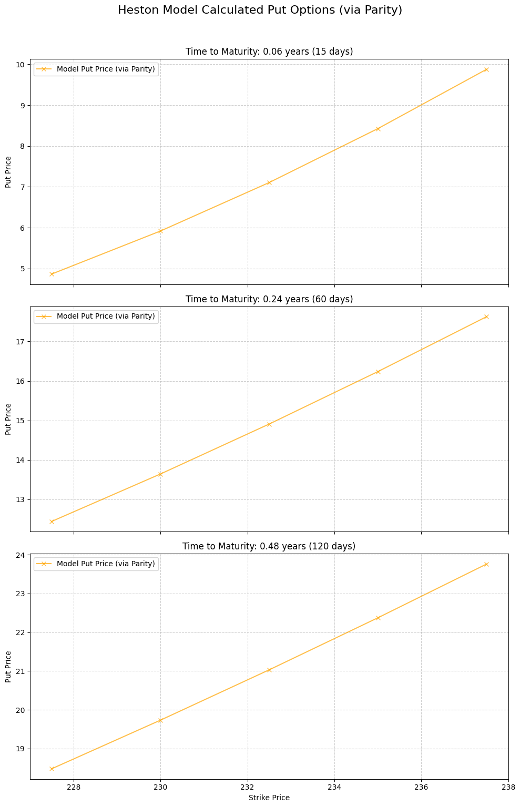

# Stochastic Modelling in Finance (MScFE 622)

This directory contains Jupyter notebooks, Python source code, lecture notes, datasets, and Group Work Projects (GWP1 & GWP2) for **Stochastic Modelling in Finance**. The module provides continuous-time probability theory, stochastic calculus (Ito's Lemma), advanced SDE models (CIR, Heston, Bates), Hidden Markov Model (HMM) regime-switching strategies, and Network Graph financial contagion models.

---

## 📚 Module Overview

- **Course Code**: MScFE 622
- **Primary Focus**: Continuous-time stochastic processes, SDE numerical discretization (Euler-Maruyama, Milstein), stochastic volatility, jump diffusions, regime-switching HMMs, and network graph theory.
- **Key Stack**: Python (`scipy`, `numpy`, `hmmlearn`, `networkx`, `matplotlib`), GWP data pipelines.

---

## 📊 Visual Frameworks & Architecture

### 1. Gaussian HMM 3-State Regime Transitions (GWP2 Strategy)

```mermaid
stateDiagram-v2
    [*] --> Regime1_Bull
    
    state "Regime 1: Low Volatility (Bull Market)" as Regime1_Bull {
        Regime1_Bull : Low VIX / High Risk-Asset Returns
        Regime1_Bull : TAA Allocation: 100% Equities (SPY)
    }
    
    state "Regime 2: Medium Volatility (Neutral)" as Regime2_Neutral {
        Regime2_Neutral : Moderate VIX / Balanced Returns
        Regime2_Neutral : TAA Allocation: 50% SPY / 50% Bonds (TLT)
    }
    
    state "Regime 3: High Volatility (Bear/Panic)" as Regime3_Bear {
        Regime3_Bear : Spiking VIX / Negative Equity Returns
        Regime3_Bear : TAA Allocation: 100% Safe Haven (TLT / Cash)
    }
    
    Regime1_Bull --> Regime2_Neutral: Increasing VIX Variance
    Regime2_Neutral --> Regime3_Bear: Market Stress / Shock
    Regime3_Bear --> Regime2_Neutral: VIX Mean Reversion
    Regime2_Neutral --> Regime1_Bull: Market Stabilization
    Regime1_Bull --> Regime3_Bear: Extreme Flash Crash
```

---

## 📖 Sub-Module & Detailed File Breakdown

### [Module 1: Probability Foundations & Discrete Stochastic Processes](./M1)
- **Lessons**:
  - [`M1/L1.ipynb`](./M1/L1.ipynb): Probability spaces $(\Omega, \mathcal{F}, \mathbb{P})$, random variables, conditional expectations.
  - [`M1/L2.ipynb`](./M1/L2.ipynb): Discrete Markov chains, transition probability matrices $P_{ij}$, stationarity.
  - [`M1/L3.ipynb`](./M1/L3.ipynb): Poisson processes, jump arrival dynamics, random walk simulations.
  - [`M1/L4.ipynb`](./M1/L4.ipynb): Continuous-time Markov chains, generator matrices.
  - [`M1/graded_quiz.ipynb`](./M1/graded_quiz.ipynb): Assessment notebook.
- **Reading**: [`M1/ssrn-282110.pdf`](./M1/ssrn-282110.pdf) (Foundational reading on stochastic models).

---

### [Module 2: Brownian Motion & Ito Calculus](./M2)
- **Lessons**:
  - [`M2/L1-code.ipynb`](./M2/L1-code.ipynb) & [`M2/L1-reading.pdf`](./M2/L1-reading.pdf): Standard Brownian Motion properties ($W_t - W_s \sim \mathcal{N}(0, t-s)$).
  - [`M2/L2--code.ipynb`](./M2/L2--code.ipynb) & [`M2/L2-reading.pdf`](./M2/L2-reading.pdf): Ito Integral $\int_0^T X_t dW_t$ construction, Ito Isometry.
  - [`M2/L3-code.ipynb`](./M2/L3-code.ipynb) & [`M2/L3-reading.pdf`](./M2/L3-reading.pdf): Multi-dimensional Ito's Lemma derivations.
  - [`M2/L4-code.ipynb`](./M2/L4-code.ipynb): Geometric Brownian Motion $dS_t = \mu S_t dt + \sigma S_t dW_t$ exact paths.

---

### [Module 3: Interest Rate SDE Models & Discretization](./M3)
- **Lessons**:
  - [`M3/L1-code.ipynb`](./M3/L1-code.ipynb): Vasicek short-rate model $dr_t = a(b - r_t)dt + \sigma dW_t$.
  - [`M3/L2-code.ipynb`](./M3/L2-code.ipynb): Cox-Ingersoll-Ross (CIR) model $dr_t = a(b - r_t)dt + \sigma \sqrt{r_t} dW_t$ and Feller condition ($2ab > \sigma^2$).
  - [`M3/L3-code.ipynb`](./M3/L3-code.ipynb): Euler-Maruyama discretization ($\mathcal{O}(\sqrt{\Delta t})$ strong convergence).
  - [`M3/L4-code.ipynb`](./M3/L4-code.ipynb): Milstein discretization adding $0.5 \sigma \sigma' (Z^2-1) \Delta t$ term ($\mathcal{O}(\Delta t)$ convergence).

---

### [Module 4 & GWP1: Stochastic Volatility & Jump Diffusion](./M4)
- **Lessons**:
  - [`M4/L1.ipynb`](./M4/L1.ipynb) & [`M4/L1-reading.pdf`](./M4/L1-reading.pdf): Introduction to stochastic volatility.
  - [`M4/L2.ipynb`](./M4/L2.ipynb): Heston stochastic volatility model formulation.
  - [`M4/L3-code.ipynb`](./M4/L3-code.ipynb): Merton jump diffusion model.
  - [`M4/L4.ipynb`](./M4/L4.ipynb): Calibrating SDE models to empirical option chains.
- **Option Valuation Visualization**:
  
  
  
  *Figure 1 & 2: Call and Put option density distributions under continuous SDEs.*

- **GWP1 Project Workflows**:
  - **Code**: [`M4/GWP-final/Section1_Heston_Model.ipynb`](./M4/GWP-final/Section1_Heston_Model.ipynb), [`M4/GWP-final/Section2_Bates_Model.ipynb`](./M4/GWP-final/Section2_Bates_Model.ipynb), [`M4/GWP-final/Section3_CIR_Model.ipynb`](./M4/GWP-final/Section3_CIR_Model.ipynb), [`M4/GWP-final/GWP_WQU_Assignment_1_Final.ipynb`](./M4/GWP-final/GWP_WQU_Assignment_1_Final.ipynb).
  - **Reports**: [`M4/GWP-final/GWP_Report.md`](./M4/GWP-final/GWP_Report.md), [`M4/GWP-final-v2/Report_Stochastic_Modeling_Group_Work_Project_Group_13278.pdf`](./M4/GWP-final-v2/Report_Stochastic_Modeling_Group_Work_Project_Group_13278.pdf).
  - **Dataset**: [`M4/GWP/MScFE 622_Stochastic Modeling_GWP1_Option data.xlsx - 1.csv`](./M4/GWP/MScFE%20622_Stochastic%20Modeling_GWP1_Option%20data.xlsx%20-%201.csv).

---

### [Module 5: Monte Carlo Simulation & Variance Reduction](./M5)
- **Lessons**:
  - [`M5/L1-code.ipynb`](./M5/L1-code.ipynb) & [`M5/L1-reading.pdf`](./M5/L1-reading.pdf): Multi-asset correlated paths via Cholesky factor $\mathbf{L}$.
  - [`M5/L2-code.ipynb`](./M5/L2-code.ipynb): Antithetic variates variance reduction.
  - [`M5/L3-code.ipynb`](./M5/L3-code.ipynb) & [`M5/L3-reading.pdf`](./M5/L3-reading.pdf): Control variates methodology.
  - [`M5/L4-code.ipynb`](./M5/L4-code.ipynb) & [`M5/L4-reading.pdf`](./M5/L4-reading.pdf): Importance sampling for tail risks.

---

### [Module 6 & GWP2: Regime Switching (HMM) & Tactical Asset Allocation](./M6)

GWP2 implements a complete quantitative strategy that classifies market volatility regimes using Gaussian Hidden Markov Models (HMM) on VIX data and dynamically rebalances asset allocation between equities (SPY), bonds (TLT), and cash.

#### Executable Pipeline Notebooks:
1. [`M6/GWP/Step1_Data_Preparation.ipynb`](./M6/GWP/Step1_Data_Preparation.ipynb): Data cleaning, VIX delta calculations, ETF log-returns.
2. [`M6/GWP/Step2_VIX_Regime_Modeling.ipynb`](./M6/GWP/Step2_VIX_Regime_Modeling.ipynb): Fitting 2-state and 3-state Gaussian HMMs (`hmmlearn`).
3. [`M6/GWP/Step3_Model_Selection.ipynb`](./M6/GWP/Step3_Model_Selection.ipynb): Comparing AIC/BIC criteria for state selection.
4. [`M6/GWP/Step4_Strategy_Design.ipynb`](./M6/GWP/Step4_Strategy_Design.ipynb): Defining TAA dynamic allocation rules.
5. [`M6/GWP/Step5_Backtesting.ipynb`](./M6/GWP/Step5_Backtesting.ipynb): Walk-forward backtest, Sharpe ratio, drawdown evaluation.
6. **Master Notebook**: [`M6/GWP-final/WQU_Group_Project_13278_code/WQU_Group_Project_2.ipynb`](./M6/GWP-final/WQU_Group_Project_13278_code/WQU_Group_Project_2.ipynb).
7. **Final PDF Report**: [`M6/GWP-final/Stochastic_Modeling_Group_Work_Project_Group_13278.pdf`](./M6/GWP-final/Stochastic_Modeling_Group_Work_Project_Group_13278.pdf).

#### Visual Results & Diagnostic Charts:

| VIX & Delta VIX Series | HMM 2-State Regimes |
| :---: | :---: |
|  |  |

| HMM 3-State Volatility Regimes | ETF State Return Distributions |
| :---: | :---: |
|  |  |

#### Strategy Cumulative Performance:

*Figure 3: Cumulative return backtest of HMM Tactical Asset Allocation vs. Benchmark.*

---

### [Module 7: Network Graph Theory & Contagion](./M7)
- **Lessons**:
  - [`M7/L1.ipynb`](./M7/L1.ipynb): Graph theory fundamentals using `networkx`. Graph files: [`M7/lesson1_graph.edgelist`](./M7/lesson1_graph.edgelist), [`M7/lesson1_graph.graphml`](./M7/lesson1_graph.graphml).
  - [`M7/L2.ipynb`](./M7/L2.ipynb): Network centrality metrics (Eigenvector, PageRank, Betweenness).
  - [`M7/L3.ipynb`](./M7/L3.ipynb): Eisenberg-Noe financial contagion cascade model.
  - [`M7/L4.ipynb`](./M7/L4.ipynb): Minimum Spanning Trees (MST) built from stock returns (`M7/returns_2005_2015.csv`).

---

## 🔑 Key Takeaways & Stochastic Insights

1. **Why Stochastic Volatility Matters**: Constant volatility in GBM produces flat implied volatility surfaces. Heston stochastic volatility and Bates jumps reproduce empirical smiles and skews observed in market option chains.
2. **Feller Condition in CIR / Heston**: $2\kappa\theta > \xi^2$ guarantees variance stays strictly positive $v_t > 0$.
3. **Milstein Scheme vs Euler-Maruyama**: Milstein scheme includes a second-order term $0.5 \sigma \sigma' (Z^2-1)\Delta t$ improving strong convergence from $\mathcal{O}(\sqrt{\Delta t})$ to $\mathcal{O}(\Delta t)$.
4. **HMM Regime Switching**: Rebalancing portfolio exposure based on HMM state posterior probabilities avoids catastrophic market drawdowns during high-volatility panic regimes.

---

## 🔗 Cross-Module Knowledge Linkages

- **$\to$ [Derivative Pricing](../derivative_pricing/README.md)**: Stochastic calculus (Ito's Lemma, GBM) underpins Black-Scholes PDE and trinomial option pricing.
- **$\to$ [Financial Econometrics](../financial_econometrics/README.md)**: SDEs represent continuous limits of discrete-time GARCH and ARMA processes.
- **$\to$ [Machine Learning](../machine_learning/README.md)**: Unsupervised HMM state clustering connects to GMM and K-Means clustering algorithms.
- **$\to$ [Portfolio Management](../portfolio_management/README.md)**: HMM regime state probabilities feed dynamic risk budgeting and tactical asset allocation models.
